# Sprawozdanie 5

## Kubernetes
Kubernetes to open source'owy system zarządzania kontenerami, który umożliwia automatyzację wdrażania, skalowania i zarządzania aplikacjami zbudowanymi w kontenerach.
Używa się go do orkiestracji kontenerów - zarządzanie cyklem życia, wdrażaniem, load balancing. Automatyzacja wdrożeń na podstawie konfiguracji. Działa na wielu platformach chmurowych oraz w środowiskach lokalnych.

# Instalacja klastra Kubernetes

Pobrałem implementację minikube zgodnie z dokumentacją


Następnie odpaliłem minikube


oraz zaopatrzyłem się w kubectl


Następnie pobrałem obraz nginx oraz odpaliłem kontener na minikube


oraz uruchomiłem minikube dashboard, gdzie widać działający pod


**Zapoznaj się z koncepcjami funkcji wyprowadzanych przez Kubernetesa (pod, deployment itp)**

- Pod: Jest najmniejszą jednostką w kubernetesie. którą można utworzyć lub zarządzać. Reprezentuje jedną instancję działającego kontenera lub zestawu kontenerów. Każdy ma własne IP w klastrze. Kontenery w jednym podzie mają wspólne środowisko sieciowe oraz wspólną przestrzeń pamięci
- Deployment: Zapewnia aktualizacje aplikacji w klastrze. Definiuje stan aplikacji i pozwala na zarządzanie replikami podów. Gdy potrzebne są zmiany, takie jak aktualizacja wersji aplikacji, zmiane te są wdrażane automatycznie minimalizując czas niedostępności aplikacji
- Service: Definiuje sposób udostępniania podów innym aplikacjom w klastrze, lub poza nim
- Volume: Reprezentuje dane dostępne dla kontenerów w podzie
- Namespace: Przestrzeń nazw, służąca do grupowania zasobów klastra. Pozwala na segmentację środowiska klastra na logiczne jednostki, co ułatwia zarządzanie i izolację zasobów
- ConfigMap: Przechowuje konfigurację w postaci słownika - par klucz:wartość - używane do udostępniania danych konfiguracyjnych aplikacjom w klastrze
- Secret: Przechowuje poufne dane, takie jak hasła czy tokeny autoryzacyjne. Są szyfrowane w stanie spoczynku i podczas przesyłania

Następne zajęcia acząłem od uruchomienia pliku wdrożenia z 10 replikami

```yaml
apiVersion: apps/v1
kind: Deployment
metadata:
  name: nginx-deployment
  labels:
    app: nginx
spec:
  replicas: 10
  selector:
    matchLabels:
      app: nginx
  template:
    metadata:
      labels:
        app: nginx
    spec:
      containers:
      - name: nginx
        image: nginx:latest
        ports:
        - containerPort: 80
          protocol: TCP
```

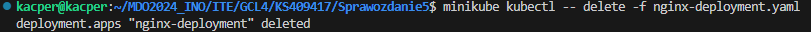

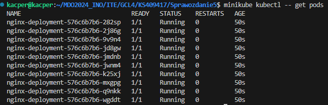

następnie zbadaliśmy status za pomocą *kubectl rollout status*

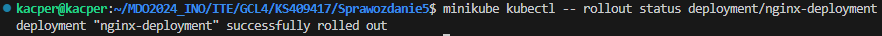

kolejnym krokiem była budowa nowego obrazu (użyłem gotowca nginx, do którego dopisałem krótki kod html z ciekawostką)
i drugiego, który ma zwracać błąd

```dockerfile
FROM nginx:latest

RUN echo '<h1> Kiedy obserwujemy gwiazdy, obraz, który widzimy, tak naprawdę pochodzi sprzed wielu lat: tylu, o ile lat świetlnych oddalona jest od nas dana gwiazda. Jeśli gwiazda oddalona jest od ziemi o 50 lat świetlnych, to oznacza, że światło potrzebuje 50 lat by do nas dotrzeć: czyli, oglądamy jej obraz sprzed 50 lat. W rzeczywistości gwiazda może wyglądać zupełnie inaczej, lub nawet nie istnieć. Działa to oczywiście również w drugą stronę. Z niektórych miejsc w kosmosie widać ziemię sprzed wielu lat. Oznacza to, że z miejsca w kosmosie oddalonego od ziemi o 604 lata świetlne, można na żywo obejrzeć Bitwę pod Grunwaldem.</h1>' > /usr/share/nginx/html/index.html

EXPOSE 80
```

```dockerfile
FROM nginx:latest

CMD ["false"]
```

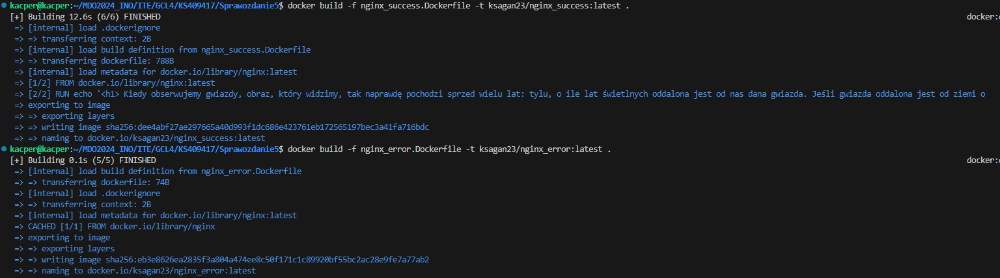

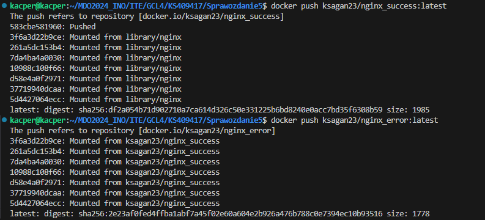

Przeszedłem do lekkich zmian w deploymencie:

8 podów:
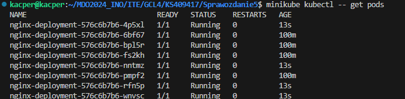

1 pod:
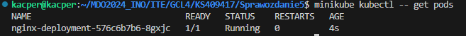

0 podów:
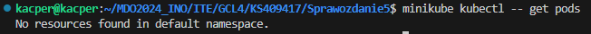

Nowa wersja obrazu:

```yaml
spec:
      containers:
      - name: nginx
        image: ksagan23/nginx_success:latest
        ports:
        - containerPort: 80
          protocol: TCP
```

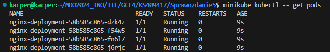

Błędny obraz:

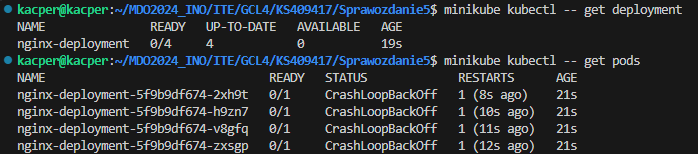

Jak widać wszystkie kontenery zgłaszają status CrashLoopBackOff i kubernetes restartuje je, próbując sprawić by działały. 

Następnie, przywróciłem poprzednią wersję wdrożenia za pomocą *kubectl rollout undo*

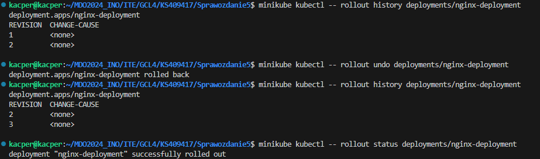

Następnie naszym zadaniem było napisać skrypt, który sprawdzi czy wdrożenie wdroży się w 60 sekund

```bash
#!/bin/bash

# Nazwa wdrożenia
DEPLOYMENT_NAME="nginx-deployment"
NAMESPACE="default"  # Możesz zmienić namespace, jeśli nie jest default

# Czas oczekiwania w sekundach
TIMEOUT=60
INTERVAL=5

# Funkcja sprawdzająca status wdrożenia
check_deployment_status() {
  kubectl rollout status deployment/$DEPLOYMENT_NAME -n $NAMESPACE
}

# Główna logika skryptu
echo "Sprawdzanie statusu wdrożenia $DEPLOYMENT_NAME"

start_time=$(date +%s)
end_time=$((start_time + TIMEOUT))

while true; do
  current_time=$(date +%s)
  
  if check_deployment_status; then
    echo "Wdrożenie $DEPLOYMENT_NAME zakończone powodzeniem"
    exit 0
  fi
  
  if [ $current_time -ge $end_time ]; then
    echo "Czas oczekiwania na wdrożenie $DEPLOYMENT_NAME upłynął"
    exit 1
  fi
  
  echo "Wdrożenie $DEPLOYMENT_NAME w toku, oczekiwanie..."
  sleep $INTERVAL
done
```

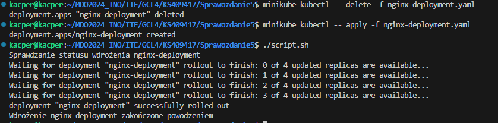

## Strategie

Strategia **recreate** wymaga zatrzymania wszystkich istniejących replik i utworzenia nowych na ich miejsce. Jest to strategia, którą stosowałem do tej pory.

Kolejną strategią jest **Rolling Update** - umożliwia stopniową aktualizację replik do nowej wersji bez przerywania i działania aplikacji. Przy użyciu parametrów można kontrolować, ile replik może być niedostępnych w trakcie aktualizacji i ile nowych replik może zostać utworzonych jednocześnie

```yaml
apiVersion: apps/v1
kind: Deployment
metadata:
  name: nginx-rolling-update-deployment
  labels:
    app: nginx
spec:
  replicas: 4
  selector:
    matchLabels:
      app: nginx
  strategy:
    type: RollingUpdate
    rollingUpdate:
      maxUnavailable: 2
      maxSurge: 20%
  template:
    metadata:
      labels:
        app: nginx
    spec:
      containers:
      - name: nginx
        image: ksagan23/nginx_success:latest
        ports:
        - containerPort: 80
          protocol: TCP
```


**Canary Deployment** - polega na wdrożeniu nowej wersji aplikacji do niewielkiego podzbioru użytkowników, by przetestować jej stabilność przed wdrożeniem na cały zbiór 

```yaml
apiVersion: apps/v1
kind: Deployment
metadata:
  name: nginx-canary-deployment
  labels:
    app: nginx
spec:
  replicas: 3
  selector:
    matchLabels:
      app: nginx
      version: canary
  template:
    metadata:
      labels:
        app: nginx
        version: canary
    spec:
      containers:
      - name: nginx
        image: ksagan23/nginx_success:latest
        ports:
        - containerPort: 80
          protocol: TCP
---
apiVersion: v1
kind: Service
metadata:
  name: nginx-canary-service
spec:
  selector:
    app: nginx
    version: canary
  ports:
  - protocol: TCP
    port: 80
    targetPort: 80
```

Główne różnice:
- Recreate Deployment: Wymaga zatrzymania wszystkich istniejących replik przed utworzeniem nowych, co może prowadzić do czasowej niedostępności aplikacji.
- Rolling Update Deployment: Zapewnia płynną aktualizację aplikacji, kontrolując jednocześnie liczbę niedostępnych i nowych replik podczas wdrożenia.
- Canary Deployment: Pozwala na przetestowanie nowej wersji aplikacji na małej części użytkowników przed jej wdrożeniem na całość, co pomaga w identyfikacji potencjalnych problemów przed wprowadzeniem zmian dla wszystkich użytkowników.
