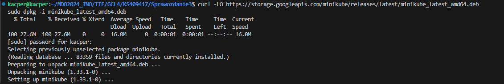
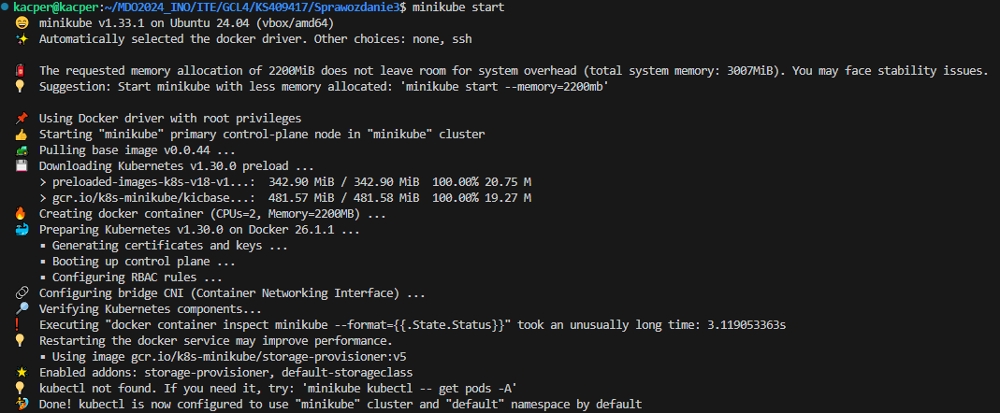
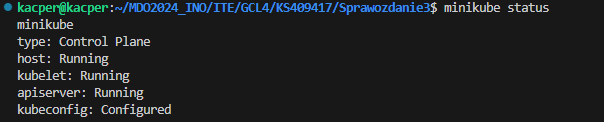
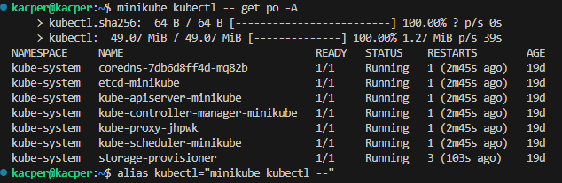
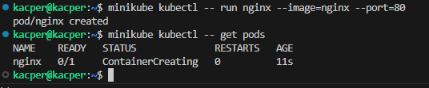
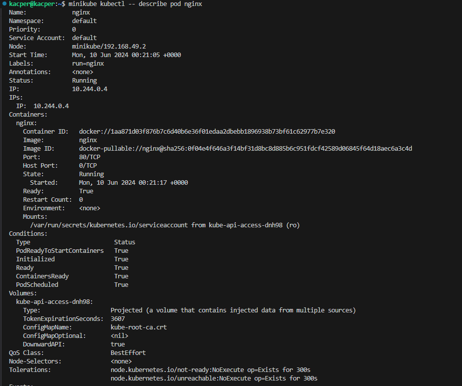
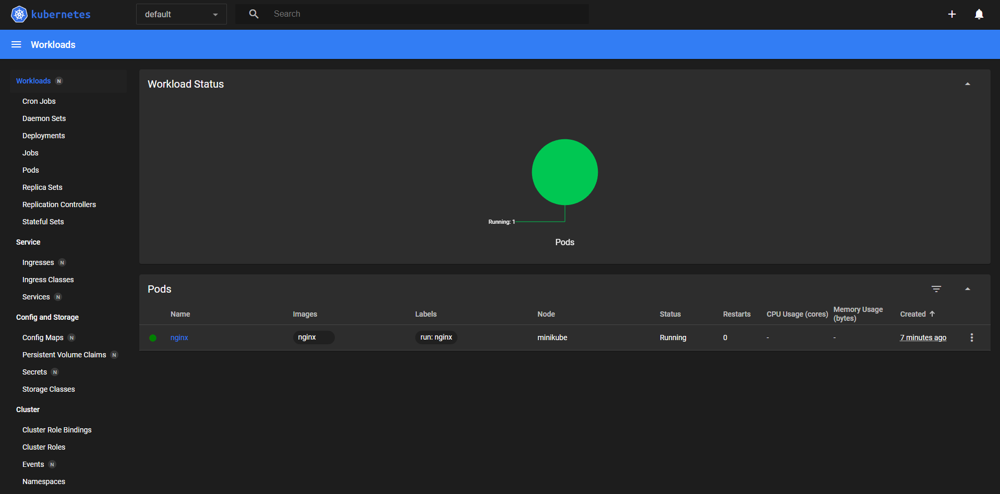

# Sprawozdanie 5

## Kubernetes
Kubernetes to open source'owy system zarządzania kontenerami, który umożliwia automatyzację wdrażania, skalowania i zarządzania aplikacjami zbudowanymi w kontenerach.
Używa się go do orkiestracji kontenerów - zarządzanie cyklem życia, wdrażaniem, load balancing. Automatyzacja wdrożeń na podstawie konfiguracji. Działa na wielu platformach chmurowych oraz w środowiskach lokalnych.

# Instalacja klastra Kubernetes

Pobrałem implementację minikube zgodnie z dokumentacją

Następnie odpaliłem minikube

oraz zaopatrzyłem się w kubectl

Następnie pobrałem obraz nginx oraz odpaliłem kontener na minikube

oraz uruchomiłem minikube dashboard, gdzie widać działający pod

**Zapoznaj się z koncepcjami funkcji wyprowadzanych przez Kubernetesa (pod, deployment itp)**

- Pod: Jest najmniejszą jednostką w kubernetesie. którą można utworzyć lub zarządzać. Reprezentuje jedną instancję działającego kontenera lub zestawu kontenerów. Każdy ma własne IP w klastrze. Kontenery w jednym podzie mają wspólne środowisko sieciowe oraz wspólną przestrzeń pamięci
- Deployment: Zapewnia aktualizacje aplikacji w klastrze. Definiuje stan aplikacji i pozwala na zarządzanie replikami podów. Gdy potrzebne są zmiany, takie jak aktualizacja wersji aplikacji, zmiane te są wdrażane automatycznie minimalizując czas niedostępności aplikacji
- Service: Definiuje sposób udostępniania podów innym aplikacjom w klastrze, lub poza nim
- Volume: Reprezentuje dane dostępne dla kontenerów w podzie
- Namespace: Przestrzeń nazw, służąca do grupowania zasobów klastra. Pozwala na segmentację środowiska klastra na logiczne jednostki, co ułatwia zarządzanie i izolację zasobów
- ConfigMap: Przechowuje konfigurację w postaci słownika - par klucz:wartość - używane do udostępniania danych konfiguracyjnych aplikacjom w klastrze
- Secret: Przechowuje poufne dane, takie jak hasła czy tokeny autoryzacyjne. Są szyfrowane w stanie spoczynku i podczas przesyłania
