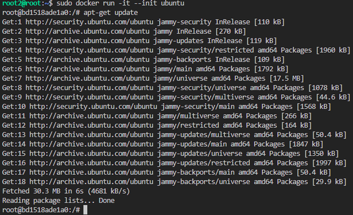
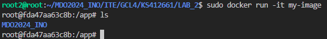

# Sprawozdanie - Kamil Salamończyk

## Lab 1

Celem pierwszych zajęć było zaznajomienie się z systemem kontroli wersji Git oraz platformą Github.

### Instalacja klienta git i obsługa kluczy SSH

Wybrałem system operacyjny Ubuntu, zgodnie z sugestią prowadzącego. Do zwirtualizowania systemu użyłem programu VirtualBox. Do systemu przypisałem 8Gb ramu oraz 25Gb przestrzeni dyskowej.

Przy użyciu polecenia install zainstalowałem klienta Git:

```
sudo apt install git
```

Konieczne było także użycie polecenia sudo, aby wykonać operację z uprawnieniami administratora. 

W celu obsługi kluczy SSH zainstalowałem openssh:

```
sudo apt install openssh
```


### Klonowanie repozytorium przedmiotowego

W celu skolowania repozytorium, generujemy parę kluczy ssh przy użyciu poniższego polecenia (klucz publiczny powinien znaleźć się w folderze ./ssh):

```
ssh-keygen -t ed25519 -C "kamilsal@student.agh.edu.pl" -N 'password'
```

Wygenerowany klucz dodajemy do naszego konta Github:


Następnie klonujemy repozytorium przy użyciu SSH:

```
git clone git@github.com:InzynieriaOprogramowaniaAGH/MDO2024_INO.git
```

### Przełączenie się na gałąź swojej grupy

Na samym początku musimy znależć się na gałęzi `main`:

```
git checkout main
```

Potem z gałęzi main, możemy przełączyć się na gałąź grupową (w tym przypadku GCL4):

```
git checkout GCL4
```

### Tworzenie nowej gałęzi

Gdy znajdziemy się już na gałęzi grupowej, możemy odbić się od niej tworząc własną gałąź (`git checkout` przeniesie nas na wybraną gałąź, a flaga `-b` zapewni nam utworzenie tej gałęzi):

```
git checkout -b KS412661
```

### Rozpoczęcie pracy na nowej gałęzi

W katalogu właściwym dla mojej grupy, utworzyłem katalog o nazwie takiej samej jak nowo utworzona gałąź:


Kolejnym krokiem było napisanie git hooka, który będzie weryfikować nazwy commitów, tak aby zawsze zaczynały się od moich inicjałów i numeru albumu:

```
#!/bin/bash

commit_msg=$(cat $1)

if [[ ! $commit_msg =~ ^KS412661.*$ ]]; then
    echo "Commit message must start with 'KS412661'."  
    echo "Commit blocked! "  
    exit 1  
fi
echo "Correct commit"
```

Po stworzeniu hook'a, kolejnym krokiem była zmiana jego nazwy na commit-msg za pomocą polecenia:

```
mv commit-msg.sample commit-msg
```

Nadajemy uprawnienia dla naszego pliku, aby mógł zostać wykonany:

```
sudo chmod +x commit-msg
```

Ostatnim krokiem było przeniesienie hook'a do naszego głównego folderu.

### Wystawienie Pull Request'a

Aby wystawić Pull Requesta z naszymi zmianami, na początku należy upewnić się, że wszystkie pliki są wersjonowane:

```
git add .
```

Następnie, możemy utworzyć commit do naszej gałęzi:

```
git commit -m "KS412661:
```

Ostatnim krokiem jest wypchnięcie naszych lokalnych zmian do zdalnego repozytorium:

```
git push --set-upstream origin KS412661
```

Następnie przechodzimy na stronę naszego repozytorium Github i klikamy przycisk `New Pull Request`. Wybieramy naszą gałąź:


Możemy dodać opis, nazwę a następnie wszystko zatwierdzić.

## Lab 2

Głównym celem drugich zajęć było zaznajomienie się z narzędziem Docker oraz procesem tworzenia plików Dockerfile.

### Instalacja dokera

Przed instalacją należy upewnić się, że mamy wszystkie pakiety wymagane przez Dockera:

```
sudo apt install apt-transport-https ca-certificates curl
```

Instalacja Dockera:

```
sudo apt install docker-ce
```

### Rejestracja w Docker Hub

Rejestracja na stronie Docker Hub nie jest skomplikowana. Dostęp do Docker Hub umożliwi nam pobieranie obrazów wymaganych na zajęciach.


### Pobranie obrazów

Kolejnym krokiem jest pobranie wymienionych w poleceniu obrazów (`hello-world`, `busybox`, `ubuntu`) za pomocą komendy:

```
sudo docker pull <nazwa_obrazu>.
```

### Uruchomienie kontenerów

Uruchamiamy kontener za pomocą komendy (flaga `-it` sprawia że kontener jest uruchamiany w trybie interaktywnym):

```
docker run -it <nazwa_obrazu>
```


Kolejnym kontenerem był kontener z obrazem `ubuntu`. Tutaj dodatkowo zaktualizowaliśmy pakiety przy użyciu komendy:

```
apt-get update
```



### Tworzenie pliku Dockerfile

W tym kroku należało stworzyć, zbudować i uruchomić prosty plik `Dockerfile`.

Mój plik Dockerfile wygląda następująco:

```
FROM ubuntu:20.04

RUN apt-get update && apt-get install -y \
    git \
    && rm -rf /var/lib/apt/lists/*

WORKDIR /app

RUN git clone https://github.com/InzynieriaOprogramowaniaAGH/MDO2024_INO.git

CMD ["bash"]
```

Jak widać klonujemy w nim nasze repozytorium laboratoryjne oraz upewniamy się że git jest zainstalowany.

Budujemy obraz:


Kolejnym krokiem jest uruchomienie kontenera w trybie interaktywnym oraz sprawdzenie czy repozytorium jest ściągniete (jak widać folder jest na swoim miejscu):



Sprawdzamy uruchomione kontenery:


Po zakończonych zajęciach, czyścimy obrazy:


Na samym końcu wystawiamy Pull Request.