# Sprawozdanie - Kamil Salamończyk

## Lab 3

Celem trzecich zajęć było automatyzowanie procesu budowy i testowania oprogramowania za pomocą Dockerfile'ów.

### Wybór oprogramowania na zajęcia

Do wykonania instrukcji, wybrałem proste repozytorium node-js-dummy-test. Repozytorium posiada możliwość budowania oraz przeprowadzania testów.

- Node-js-dummy-test: https://github.com/devenes/node-js-dummy-test


Na początek zajmiemy się repozytorium dummy-test:

Klonowanie: ``` git clone https://github.com/devenes/node-js-dummy-test ```

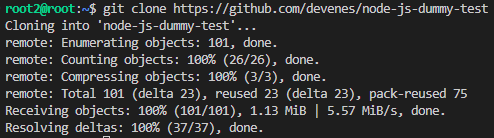

Instalowanie zależności: ```npm install```

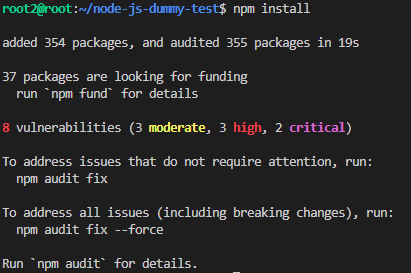

Przeprowadzenie testów: ```npm run test```

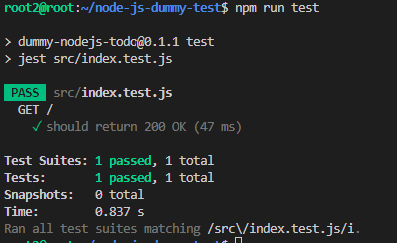


### Przeprowadzenie buildu w kontenerze
W celu przeprowadzenia buildu w kontenerze, należało najpierw pobrać obraz node, który jest wymagany dla naszego repozytorium.

```sudo docker pull node```

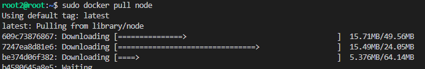

Kolejnym krokiem będzie wejście w tryb interaktywny: ```sudo docker run -it node bash```

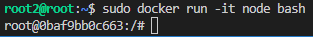

Klonowanie: ``` git clone https://github.com/devenes/node-js-dummy-test ```

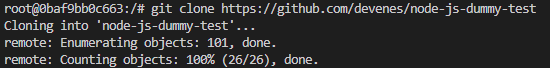

Instalowanie zależności: ```npm install```

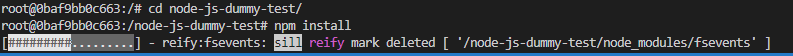

Przeprowadzenie testów: ```npm run test```

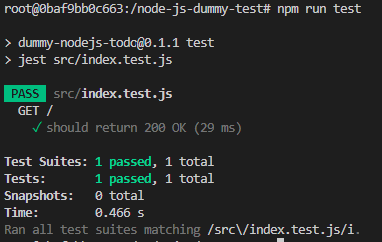


Następnie utworzyłem dwa pliki Dockerfile: Jeden do budowy, a drugi do przeprowadzenia testów bazując na pierwszym kontenerze.

Dockerfile służący do budowy. `FROM` - bazowy obraz, `RUN` - uruchomienie polecenia, `WORKDIR` - ustawienie katalogu roboczego:

```Docker
FROM node

RUN git clone https://github.com/devenes/node-js-dummy-test
WORKDIR /node-js-dummy-test

RUN npm install
```

Dockerfile służący do przeprowadzenia testów. Tym razem `FROM` jest ustawione na obraz build, który stworzyliśmy wcześniej:

```Docker
FROM build
RUN npm test
```

Uruchomienie budowy obrazu `build.Dockerfile`:

```
sudo docker build -t build -f build.Dockerfile .
```

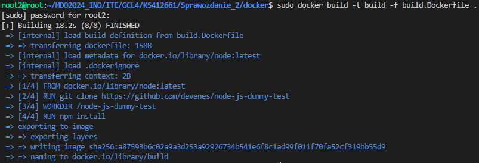


Uruchomienie budowy obrazu `test.Dockerfile`:

```
sudo docker build -t test -f test.Dockerfile .
```

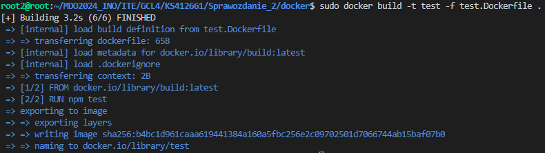

Na końcu uruchamiamy kontener za pomocą polecenia: 

```
sudo docker run build
sudo docker run test
```

Wynik uruchomienia można sprawdzić poprzez `echo $?`. Jeżeli wynik wynosi 0, wszystko jest okej.


## Lab 4

Celem czwartych zajęć było zdobycie wiedzy na temat dodatkowych koncepcji w konteneryzacji, takich jak woluminy i sieci. Na koniec zainstalujemy narzędzie Jenkins.

### Zachowywanie stanu

Pierwszym krokiem było przygotowanie dwóch woluminów: `wejściowego` i `wyjściowego`:

```
sudo docker volume create v_in
sudo docker volume create v_out
```

Kolejnym krokiem będzie podpięcie woluminów do kontenera pomocniczego:

```
sudo docker run -it --name temp --mount source=v_in,target=/app --mount source=v_out,target=/app/out -it node bash
```

W tym momencie jesteśmy w trybie interaktywnym i możemy sklonować repozytorium dummy-test:

Klonowanie: ``` git clone https://github.com/devenes/node-js-dummy-test ```

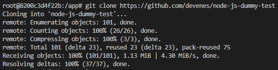

Instalowanie zależności: ```npm install```

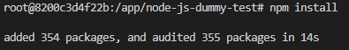

Po pomyślnym uruchomieniu, przekopiowałem folder z aplikacją na wolumin wyjściowy `/out/`:

```
cp -r /app/node-js-dummy-test/ /app/out/
```

### Eksponowanie portu

Aby wyeksponować port, użyjemy serwera iperf3, który umożliwi komunikację między urządzeniami.

Pobranie obrazu:

```
sudo docker pull networkstatic/iperf3
```

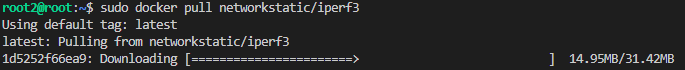

Uruchomienie kontenera z iperf3. Wyeksponujemy port 5201. Flaga `-V` oznacza tryb Verbose (więcej informacji wyświetlanych przez programy):

```
sudo docker run -p 5201:5201 networkstatic/iperf3 -s -V
```

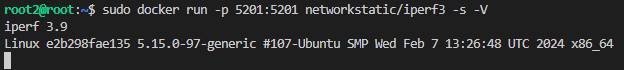


Uruchomienie kontenera po stronie klienta:

```
sudo docker run -p 5202:5201 networkstatic/iperf3 -c 172.17.0.2
```

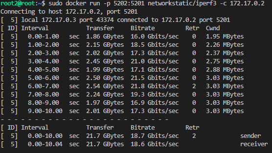

Widok po stronie serwera:

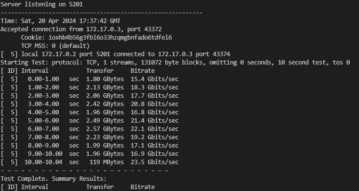


Kolejnym krokiem będzie utworzenie sieci dockerowej. Dzięki temu nasze kontenery będą w stanie się ze sobą porozumieć. W tym przypadku użyjemy Bridge. 

Tworzymy sieć:

```
sudo docker network create mynet
```

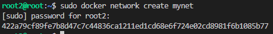


Uruchomienie kontenera serwerowego na mojej własnej sieci mostkowej:

```
sudo docker run -it --rm --network mynet --name server networkstatic/iperf3 -s -V
```

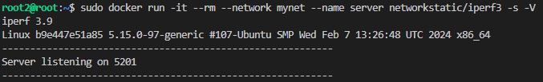

Uruchomienie kontenera klienta na sieci mostkowej:

```
sudo docker run -it --rm --network mynet --name client networkstatic/iperf3 -c  172.18.0.2
```

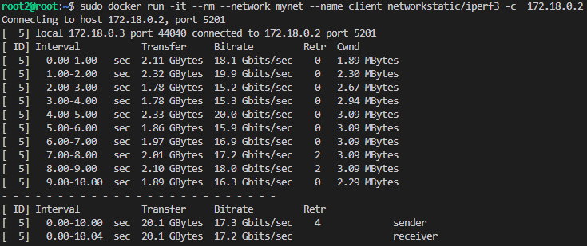

Widok po stronie serwera:

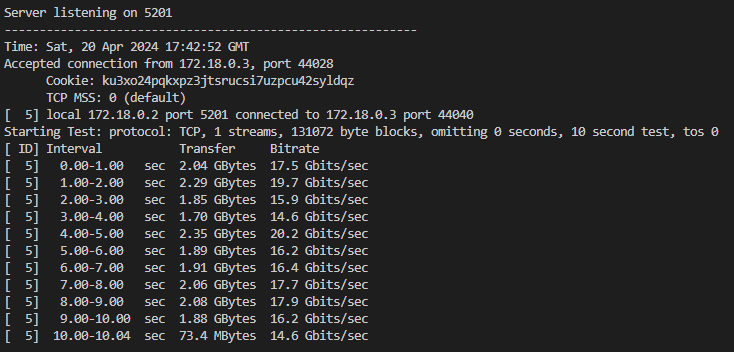


Teraz przyszła kolej na testowanie połączenia spoza kontenera.

Instalacja iperf3:

```
sudo apt install iperf3
```

Łączenie:

```
sudo iperf3 -c 172.18.0.2 -p 5201
```

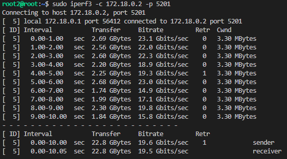


### Instancja Jenkins

Kolejnym krokiem było zainstalowanie Jeniknsa - narzędzia umożliwiającego wprowadzenie ciągłej integracji i dostarczania.

Tworzymy sieć dla Jenkinsa:

```
sudo docker network create jenkins
```

Następnie za pomocą długiego polecenia, instalujemy obraz Jenkinsa:

```
sudo docker run \
 --name jenkins-docker \
 --rm \
 --detach \
 --privileged \
 --network jenkins \
 --network-alias docker \
 --env DOCKER_TLS_CERTDIR=/certs \
 --volume jenkins-docker-certs:/certs/client \
 --volume jenkins-data:/var/jenkins_home \
 --publish 2376:2376 \
 docker:dind \
 --storage-driver overlay2
 ```

Na podstawie dokumentacji, tworzymy plik Dockerfile, który umożliwi nam uruchomienie Jenkinsa:

```Docker
FROM jenkins/jenkins:2.440.2-jdk17
USER root
RUN apt-get update && apt-get install -y lsb-release
RUN curl -fsSLo /usr/share/keyrings/docker-archive-keyring.asc \
  https://download.docker.com/linux/debian/gpg
RUN echo "deb [arch=$(dpkg --print-architecture) \
  signed-by=/usr/share/keyrings/docker-archive-keyring.asc] \
  https://download.docker.com/linux/debian \
  $(lsb_release -cs) stable" > /etc/apt/sources.list.d/docker.list
RUN apt-get update && apt-get install -y docker-ce-cli
USER jenkins
RUN jenkins-plugin-cli --plugins "blueocean docker-workflow"
```

Budujemy obraz:

```
sudo docker build -t myjenkins-blueocean:2.440.2-1 -f jenkins.Dockerfile .
```

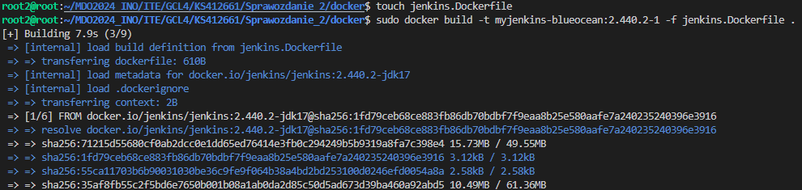

Uruchamiamy kontener:

```Docker
docker run \
 --name jenkins-blueocean \
 --restart=on-failure \
 --detach \
 --network jenkins \
 --env DOCKER_HOST=tcp://docker:2376 \
 --env DOCKER_CERT_PATH=/certs/client \
 --env DOCKER_TLS_VERIFY=1 \
 --publish 8080:8080 \
 --publish 50000:50000 \
 --volume jenkins-data:/var/jenkins_home \
 --volume jenkins-docker-certs:/certs/client:ro \
 myjenkins-blueocean:2.440.2-1
 ```


Podgląd uruchomionych kontenerów:

```
sudo docker ps
```

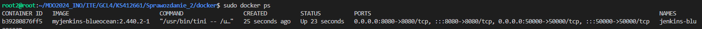

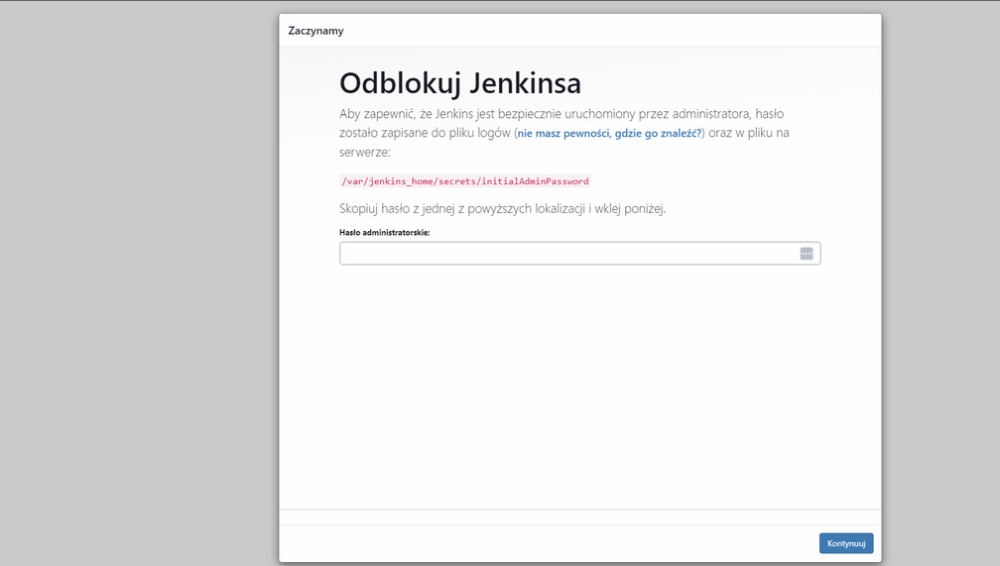