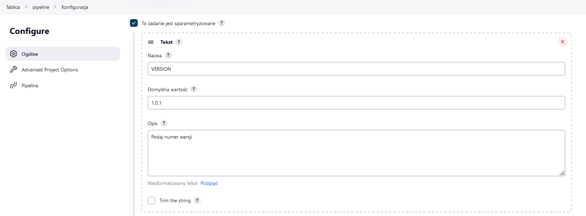
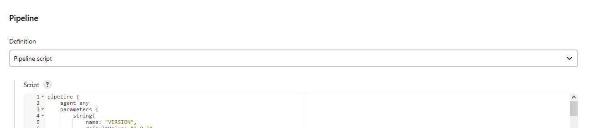
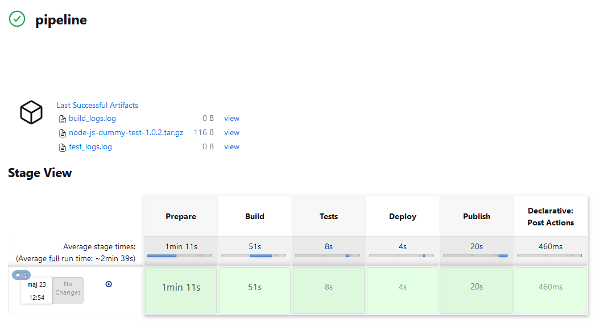
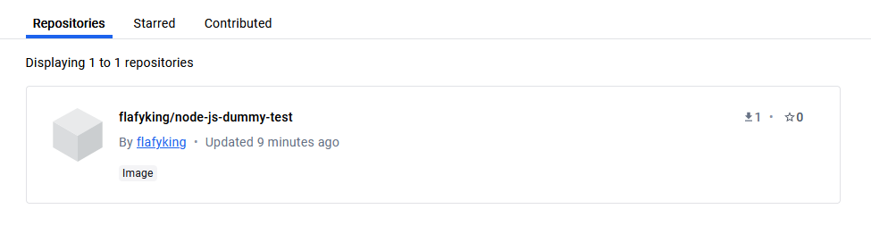

# Sprawozdanie - Kamil Salamończyk

## Lab 5

Celem piątych zajęć było zautomatyzowanie procesu budowania, testowania i wdrażania aplikacji przy użyciu Jenkinsa.

### Przygotowanie

Na początku upewniłem się że działają kontenery budujące i testujące stworzone na poprzednich zajęciach.

W kolejnym kroku zalogowałem się na Jenkinsa przy użyciu wcześniej skonfigurowanego konta.

### Uruchomienie

W tym kroku mamy za zadanie utworzyć dwa nowe projekty:
- Projekt, który wyświetla uname.
- Projekt, który zwraca błąd gdy godzina jest nieparzysta.

W oknie tworzenia projektu wybieramy `Ogólny Projekt`:


Po kliknięciu przycisku OK, pojawia się konfiguracja projektu. Zjeżdżamy na zakłądkę - `Kroki budowania` i wybieramy `Uruchom powłokę`. W polu wystarczy wpisać polecenie *uname*. 


Po zapisaniu zmian, możemy kliknąć przycisk `Uruchom`. Gdy Jenkins zakończy prace, możemy przejść do wyświetlenia logów. Jak widać nazwa hosta została wypisana:


Analogicznie, tworzymy drugi projekt a w zakładce `Uruchom powłokę` wpisujemy poniższy skrypt:

```
#!/bin/bash

hour=$(date +%H)

if [ $((hour % 2)) -eq 1 ]; then
    echo "Błąd: Godzina jest nieparzysta."
    exit 1
else
    echo "Godzina jest parzysta."
    exit 0
fi
```

Zadanie wykonywałem o 12, dlatego pozwoliłem sobie zamienić warunki programu, aby przetestował zwracanie błędu:


### "Prawdziwy" projekt

Tym razem tworzymy kolejny projekt, ale jest on bardziej zaawansowany:
- klonujemy nasze repozytorium
- przechodzimy na osobistą gałąź
- budujemy obrazy z Dockerfile 

Na wstępie, przekopiowałem obrazy z poprzedniego sprawozdania do nowego folderu i wystawiłem zmiany do repozytorium.

Utworzyłem Nowy Projekt i dodałem dwie intrukcje: jedną do budowania i drugą do testów. Dodatkowo wskazałem naszę repozytorium:


Po skonfigurowaniu projektu, uruchomiłem go:


### Pipeline

Docker-in-Docker to technika, gdzie Docker jest uruchomiony wewnątrz kontenera Docker. Jest to przydatne w scenariuszach wymagających izolowanego środowiska do budowy i testowania. Na minus może być złożoność i potencjalne problemy z bezpieczeństwem. Należy pamiętać że dodajemy dodatkową warstwę abstrakcji.

Budowanie na kontenerze CI to proces, w którym kontener CI ma dostęp do gniazda Docker hosta, co umożliwia mu budowanie i zarządzanie obrazami na hoście. Na plus prostota działania. Na minus potencjalne ryzyko bezpieczeństwa, ponieważ kontener ma dostęp do gniazda Docker hosta, co może prowadzić do eskalacji uprawnień.

        
Diagram aktywności


Pipeline:

```
pipeline {
    agent any
    parameters {
        string(
            name: "VERSION",
            defaultValue: "1.0.1",
            description: "Podaj numer wersji"
        )
        string(
            name: "PASSWORD",
            defaultValue: "123",
            description: "Podaj hasło"
        )
    }
    stages { 
        stage('Prepare') {
            steps {
                echo 'Prepare stage'
                sh "rm -rf MDO2024_INO"
                sh "docker system prune --all --force"
                sh "git clone https://github.com/InzynieriaOprogramowaniaAGH/MDO2024_INO"
                sh "pwd"
                sh "ls -la"
                dir('MDO2024_INO'){
                    sh "git checkout KS412661"
                }
                
                sh 'touch build_logs.log'
                sh 'touch test_logs.log'
            }
        }
        stage('Build') {
            steps {
                echo 'Build stage'
                dir('MDO2024_INO'){
                    sh 'ls -a'
                    sh 'docker build -t build:latest -f ./ITE/GCL4/KS412661/Sprawozdanie_3/docker/build.Dockerfile .| tee build_logs.log'
                    sh 'docker run --name build build:latest'
                }
            }
        }
        stage('Tests') {
            steps {
                echo 'Test stage'
                dir('MDO2024_INO'){
                    sh 'ls -la'
                    sh 'docker build -t test:latest -f ./ITE/GCL4/KS412661/Sprawozdanie_3/docker/test.Dockerfile . | tee test_logs.log'
                    sh 'docker run --name test test:latest'
                }
            }
        }
        stage('Deploy') {
            steps {
                echo 'Deployment stage'
                dir('MDO2024_INO'){
                    sh 'ls -la'
                    sh 'docker rm build'
                    sh 'docker rm test'
                    archiveArtifacts artifacts: "build_logs.log"
                    archiveArtifacts artifacts: "test_logs.log"
                }
                script {
                    sh "mkdir ${params.VERSION}"
                    sh "cd ${params.VERSION}"
                    sh 'docker run --name test test:latest'
                }
            }
        }

        stage('Publish') {
            steps {
                echo 'Publish stage'
                script {
                    sh 'echo "Pushing image to DockerHub"'
                    
                    sh "echo '${params.PASSWORD}' | docker login -u flafyking --password-stdin"
                    
                    sh "docker tag test:latest flafyking/node-js-dummy-test:${params.VERSION}"
                    
                    sh "docker push flafyking/node-js-dummy-test:${params.VERSION}"
                    
                    sh 'docker rm test'
                    
                    sh "tar -czvf node-js-dummy-test-${params.VERSION}.tar.gz ${params.VERSION}/"
                    echo 'Creating artifact...'
                    archiveArtifacts artifacts: "node-js-dummy-test-${params.VERSION}.tar.gz"
                }
            }
        }
    }

    post {
        always {
            sh 'docker logout'
        }
    }
}
```

W pipelinie dodałem dwa parametry: numer wersji oraz hasło do Docker Hub aby nie składować go w pliku. W celu optymalizacji, świadomie wybieram wersje node:16 alpine. Artefakt ma format tar.gz, ponieważ jest kompaktowy oraz ułatwia to wystawienie go na Docker Hub. 

Tworzymy pipeline:



Wklejamy skrypt:



Uruchamiamy pipeline. Jak widać, wszystkie etapy przechodzą:



Dodatkowo node-js-dummy-test zostaje opublikowany na Docker Hub:



