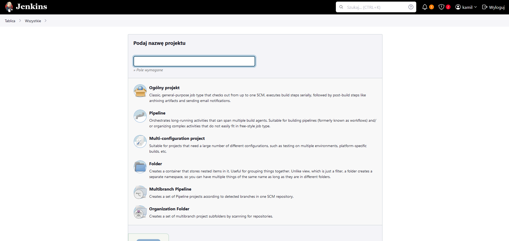
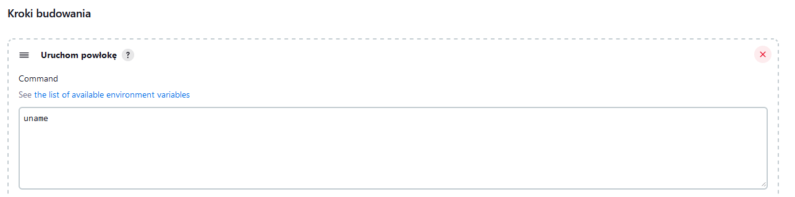
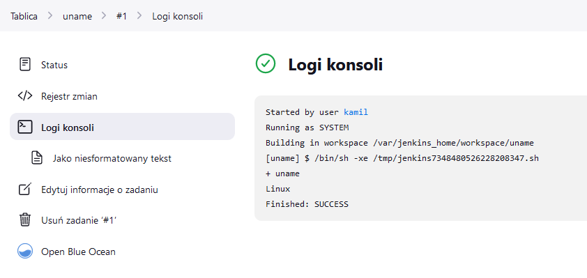
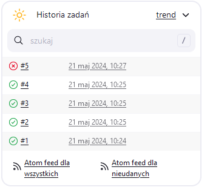
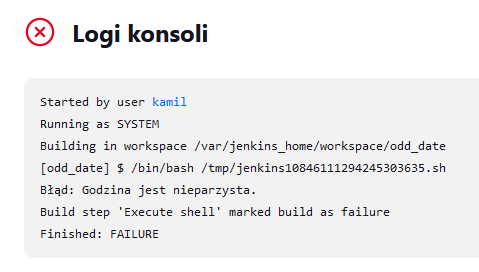
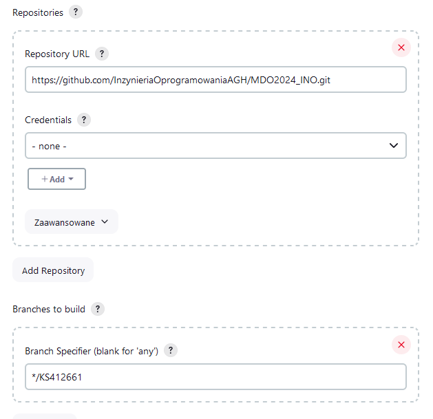
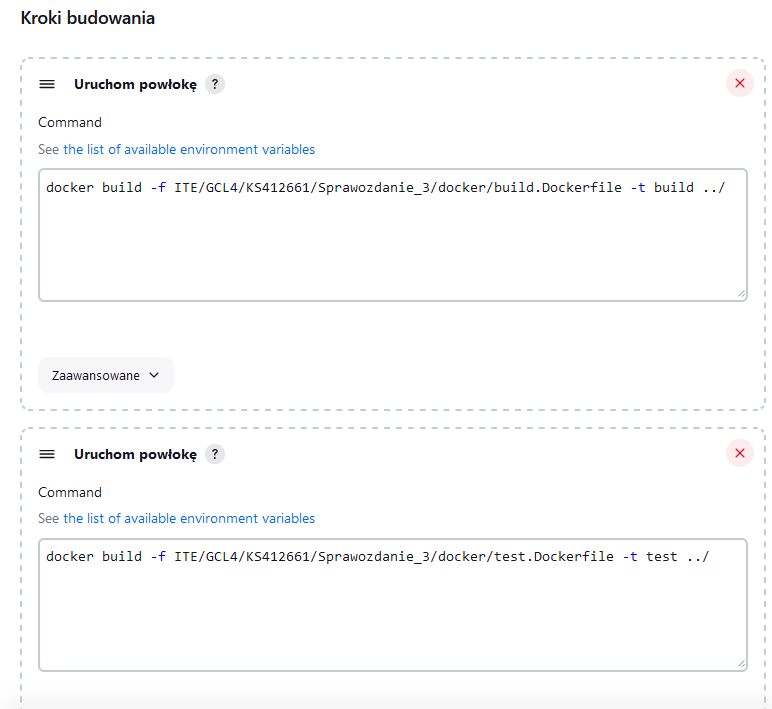
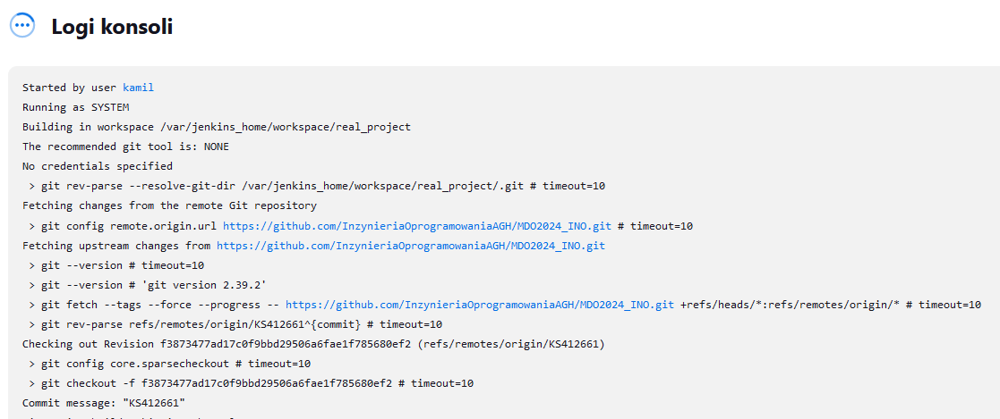
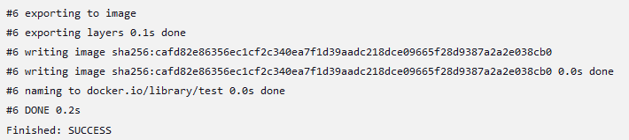
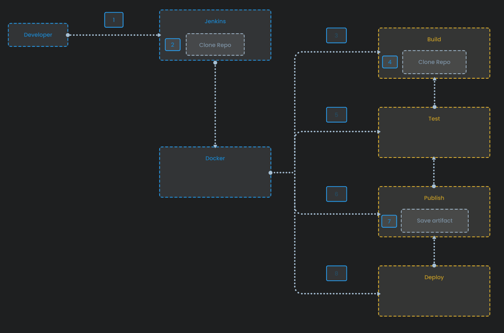

# Sprawozdanie - Kamil Salamończyk

## Lab 5

Celem piątych zajęć było zautomatyzowanie procesu budowania, testowania i wdrażania aplikacji przy użyciu Jenkinsa.

### Przygotowanie

Na początku upewniłem się że działają kontenery budujące i testujące stworzone na poprzednich zajęciach.

W kolejnym kroku zalogowałem się na Jenkinsa przy użyciu wcześniej skonfigurowanego konta.

### Uruchomienie

W tym kroku mamy za zadanie utworzyć dwa nowe projekty:
- Projekt, który wyświetla uname.
- Projekt, który zwraca błąd gdy godzina jest nieparzysta.

W oknie tworzenia projektu wybieramy `Ogólny Projekt`:



Po kliknięciu przycisku OK, pojawia się konfiguracja projektu. Zjeżdżamy na zakłądkę - `Kroki budowania` i wybieramy `Uruchom powłokę`. W polu wystarczy wpisać polecenie *uname*. 



Po zapisaniu zmian, możemy kliknąć przycisk `Uruchom`. Gdy Jenkins zakończy prace, możemy przejść do wyświetlenia logów. Jak widać nazwa hosta została wypisana:



Analogicznie, tworzymy drugi projekt a w zakładce `Uruchom powłokę` wpisujemy poniższy skrypt:

```
#!/bin/bash

hour=$(date +%H)

if [ $((hour % 2)) -eq 1 ]; then
    echo "Błąd: Godzina jest nieparzysta."
    exit 1
else
    echo "Godzina jest parzysta."
    exit 0
fi
```

Zadanie wykonywałem o 12, dlatego pozwoliłem sobie zamienić warunki programu, aby przetestował zwracanie błędu:





### "Prawdziwy" projekt

Tym razem tworzymy kolejny projekt, ale jest on bardziej zaawansowany:
- klonujemy nasze repozytorium
- przechodzimy na osobistą gałąź
- budujemy obrazy z Dockerfile 

Na wstępie, przekopiowałem obrazy z poprzedniego sprawozdania do nowego folderu i wystawiłem zmiany do repozytorium.

Utworzyłem Nowy Projekt i dodałem dwie intrukcje: jedną do budowania i drugą do testów. Dodatkowo wskazałem naszę repozytorium:





Po skonfigurowaniu projektu, uruchomiłem go:






### Pipeline

Diagram aktywności

