# Sprawozdanie - Kamil Salamończyk

## Lab 8

Celem ósmych zajęć było przygotowanie zarządcy Ansible, zdalne wywoływanie procedór oraz zarządzanie kontenerem.

### Przygotowanie

Utworzyłem drugą maszynę wirtualną o jak najmniejszym zbiorze zainstalowanego oprogramowania. W tym celu zastosowałem system Ubuntu Server. Podczas konfiguracji systemu, zainstalowałem program tar oraz serwer OpenSSH. Nadałem maszynie hostname `ansible-target` oraz utworzyłem użytkownika ansible. Ostatnim krokiem było zrobienie migawki.

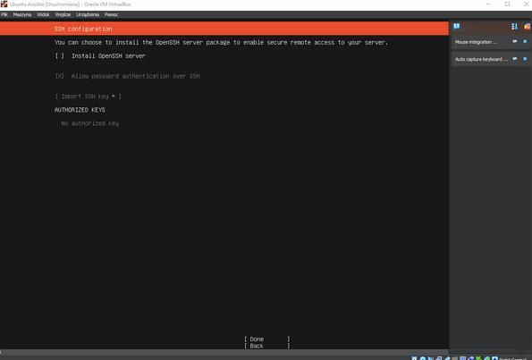

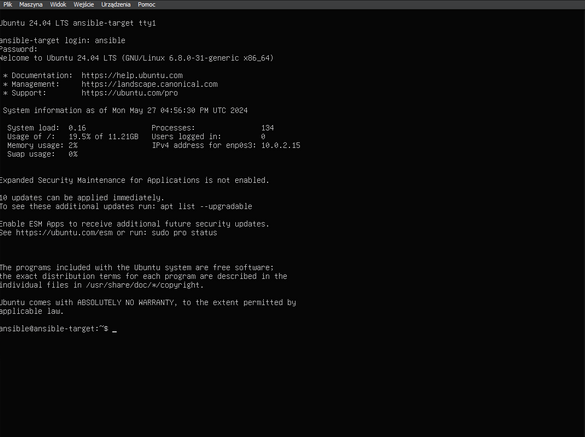

Teraz przenosimy się na naszą główną maszynę wirtualną i instalujemy Ansible przy użyciu tych komend:

```
sudo apt update
sudo apt install software-properties-common
sudo add-apt-repository --yes --update ppa:ansible/ansible
sudo apt install ansible
```

Następnie wymieniłem klucze SSH między użytkownikiem w głównej maszynie wirtualnej, a użytkownikiem ansible z nowej tak, by logowanie ssh ansible@ansible-target nie wymagało podania hasła.

Wygenerowałem klucze przy użyciu komendy `ssh-keygen -t rsa`. Pozostawiłem passphrase puste. 

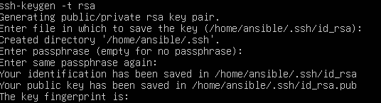

Kolejnym krokiem będzie przekopiowanie kluczy na serwer główny (`ssh-copy-id nazwa@ip`):

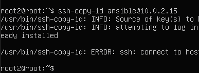

### Inwentaryzacja i zdalne wywoływanie procedur

Kolejnym krokiem było dodanie pliku inwentaryzacji, który definiuje hosty zarządzane przez Ansible.

Plik `inventory.ini`:

```
[Orchestrators]
root ansible_user=root2

[Endpoints]
ansible-target ansible_user=ansible
```

Plik jest podzielony na sekcje oznaczone nawiasami kwadratowymi. Każda sekcja definiuje grupę hostów.

Orchestrators to maszyny nadzorujące, a Endpoints to węzły końcowe. 

Aby nie używać adresów IP, zmodyfikowałem plik `resolved.conf` i odkomentowałem DNS oraz dodałem adres 8.8.8.8. 

Następnie dodałem nazwy hostów wraz z adresami IP do pliku `/etc/hosts` - zarówno dla maszyny głównej jak i ansible target.


Teraz ożemy uruchomić ping za pomocą komendy: `ansible -i inventory.ini all -m ping`:

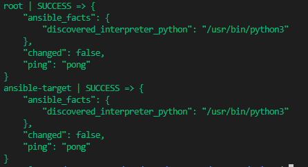

Kolejnym krokiem będzie stworzenie Playbook'a, który wyśle żądanie ping do wszystkich maszyn. Playbook w przeciwieństwie do inwentarza, musi być w formacie `.yaml`:

```
- name: Ping
  hosts: all
  tasks:
    - name: Ping
      ping:
```

Wywołujemy Playbook za pomocą komendy: `ansible-playbook -i inventory.ini ping.yaml`:

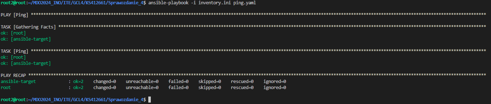

Drugi Playbook który stworzymy ma za zadanie skopiowanie inwentarza na maszynę określoną w `Endpoint` i wykonaniu tam polecenia Ping:

```
- name: Copy and ping 
  hosts: Endpoints
  remote_user: ansible

  tasks:
    - name: Copy
      copy:
        src: /home/root2/MDO2024_INO/ITE/GCL4/KS412661/Sprawozdanie_4/inventory.ini
        dest: /home/ansible/

    - name: Ping
      ansible.builtin.ping:
```

Wynik podczas pierwszego wykonania:

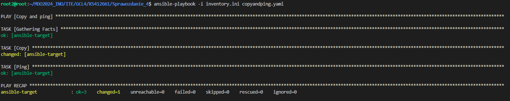

Wynik podczas drugiego wykonania:

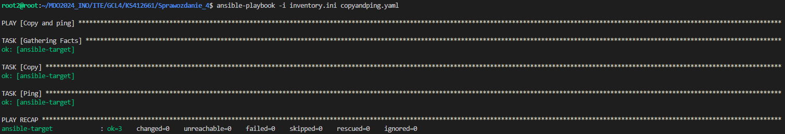

Na pierwszy rzut oka widać, że flaga changed została zmieniona oraz Task Copy nie jest oznaczony prefixem `changed`. Wynika to z faktu, że plik inwentaryzacji został przeniesiony za pierwszym razem, a za drugim krok ten został pominięty. 

Kolejny Playbook służy do aktualizowania pakietów w systemie:

```
- name: Update
  hosts: Endpoints
  tasks:
    - name: Upgrade
      ansible.builtin.apt:
        upgrade: dist
      become: true
```

Tutaj dodatkowo dodajemy flagę `--ask-become-pass` aby wykonać akcję za pomocą sudo. 

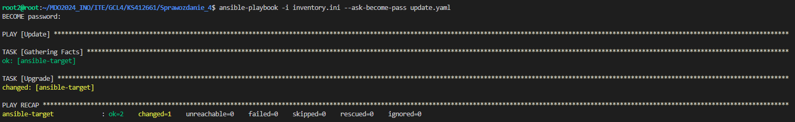

Kolejny Playbook dotyczy restartu serwisów `sshd` i `rngd`:

```
- name: Restart
  hosts: Endpoints
  become: yes
  tasks:
    - name: Restart
      ansible.builtin.service:
        daemon_reload: yes
        name: sshd
        state: restarted

    - name: Restart
      ansible.builtin.service:
        name: rng-tools-debian
        state: restarted
```

Początkowo przy próbie restartu pokazywał się błąd:

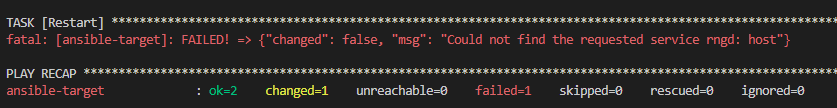

Wystarczyło zainstalować paczkę rng-tools-debian:

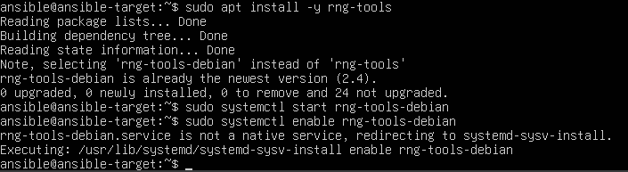

Teraz odłączam kartę sieciową:

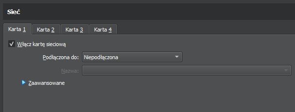

Po ponownym puszczeniu Playbook'a, pojawia się błąd:

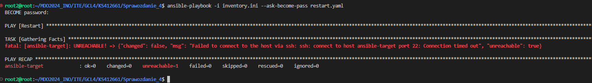

Otrzymujemy ten sam wynik dla wyłączenia usługi SSH za pomocą komendy `systemctl stop sshd`.

### Zarządzanie kontenerem

Zainstalowałem Dockera za pomocą: `sudo apt install -y docker.io`

Początkowo miałem problem z permisjami:

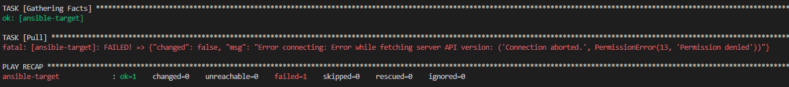

Natomiast rozwiązaniem okazało się włączenie usługi dockera po stronie ansible-target: `systemctl start docker`.

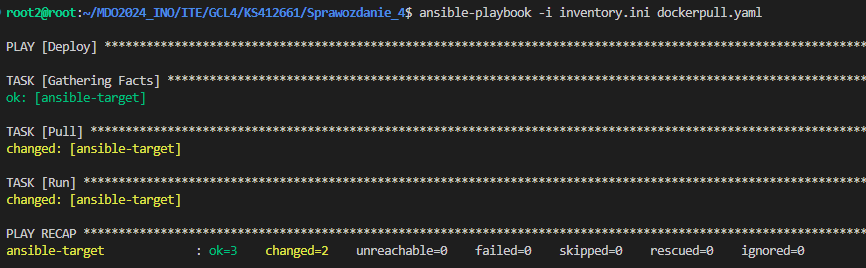

Kolejnym krokiem było stworzenie `roli`, aby nasz Playbook mógł być wykorzystywany jako moduł w bardziej skomplikowanych Playbookach.

Tworzymy role (`ansible-galaxy init dummy`).

W folderze `tasks` znajduje się plik `main.yml`, który zmodyfikowałem:

```
- name: Pull
  docker_image:
    name: "flafyking/node-js-dummy-test:{{ VERSION }}"
    source: pull

- name: Run
  docker_container:
    name: dummy-test
    image: "flafyking/node-js-dummy-test:{{ VERSION }}"
    state: started
    tty: yes
    interactive: yes
```

Nowy Playbook, który uruchomi powyższy kod: 

```
- name: Deploy
  hosts: Endpoints
  roles:
    - /home/root2/MDO2024_INO/ITE/GCL4/KS412661/Sprawozdanie_4/dummy
```

Wynik uruchomienia Playbooka:

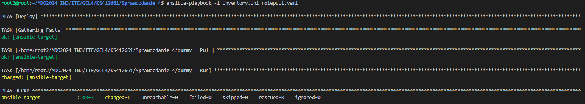


### Instalacje nienadzorowane

Pierwszym krokiem było pobranie Fedory z podanego na zajęciach linku. Wybrałem wersje 39. Należało pamiętać aby pobrać wersję netinst. 

Po pobraniu, utworzyłem nową maszynę wirtualną i ją skonfigurowałem.

Następnie należało utworzyć użytkownika root'a. 

Fedora instaluje się:

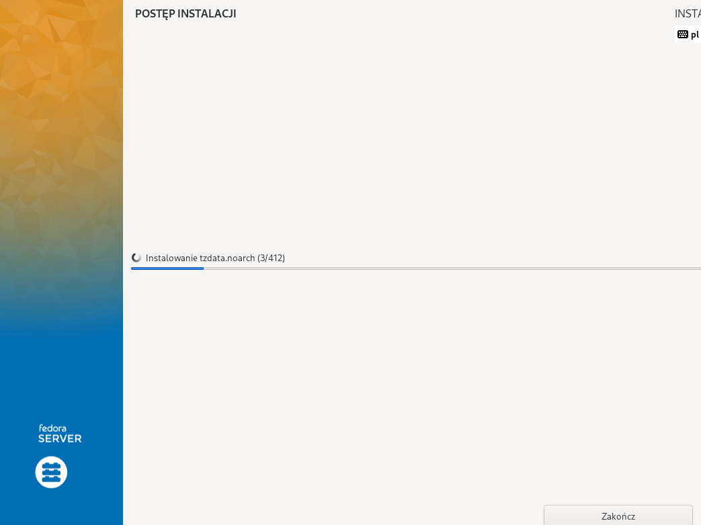

Po pomyślnym zainstalowaniu, możemy dostać się do pliku `anaconda-ks.cfg` i dodać następujący kod:

```
url --mirrorlist=http://mirrors.fedoraproject.org/mirrorlist?repo=fedora-39&arch=x86_64
repo --name=update --mirrorlist=http://mirrors.fedoraproject.org/mirrorlist?repo=updates-released-f39&arch=x86_64
```

Zapisałem plik anaconda-ks.cfg w repozytorium przedmiotowym. Dzięki temu będziemy mogli odnieść się do niego w kolejnej instalacji.

Utworzyłem drugą maszynę w ten sam sposób lecz w menu GRUB, kliknąłem przycisk `e`. Otworzyło to edytor w którym sprecyzujemy adres pliku `anaconda-ks.cfg`:

```
init.ks=https://raw.githubusercontent.com/InzynieriaOprogramowaniaAGH/MDO2024_INO/KS412661/ITE/GCL4/KS412661/Sprawozdanie_4/anaconda-ks.cfg
```

Fedora instaluje się kolejny raz. 

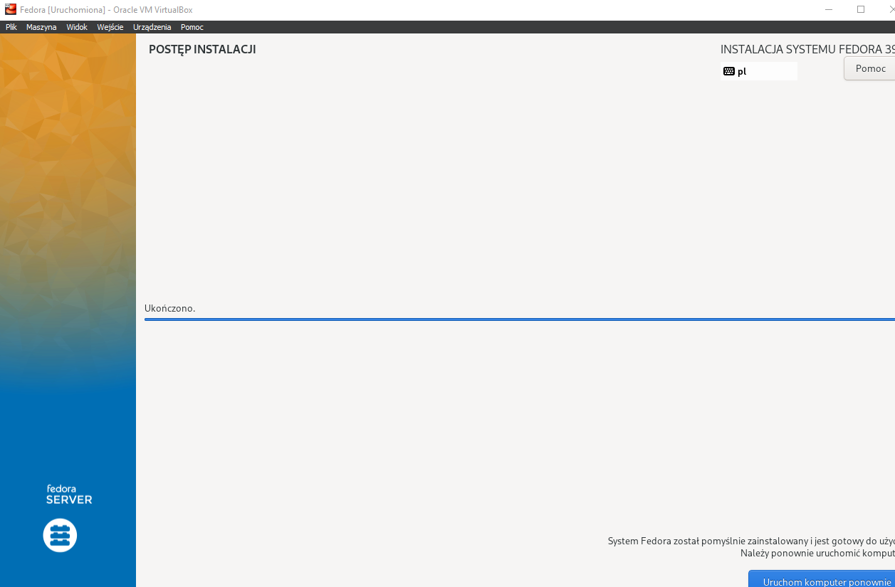

Po pomyślnej instalacji, możemy dodać dodatkowe instruckję do `anaconda-ks.cfg`:


```
%packages
@^production-server
moby-engine

%end

```

`Moby Engine` umożliwi nam uruchomienie obrazu z Docker Hub.

Następnie dodajemy sekcję `%post`, która wykonuje polecenia po instalacji.


```
%post --erroronfail --log=/root/ks-post.log
```

W tej sekcji, zapewniamy obsługę błędów i precyzujemy ścieżkę do zapisywania logów.


```
[Unit]
Description=Download docker and run
Requires=docker.service
After=docker.service
```

W tej sekcji precyzujemy metadane dla usługi. 

```
[Service]
Type=oneshot
RemainAfterExit=yes
ExecStart=/usr/bin/docker pull flafyking/node-js-dummy-test:1.0.2
ExecStart=/usr/bin/docker run -t --name node-dummy -e TERM=xterm flafyking/node-js-dummy-test:1.0.2
```

W tej sekcji precyzujemy jakie usługi mają zostać wykonane. 

```
[Install]
WantedBy=multi-user.target
EOF
```

Tutaj precyzujemy gdzie usługa zostanie zainstalowana w systemie.


Kolejnym krokiem będzie odpalenie systemu w trybie `rescue` oraz wybranie opcji `Boot First Drive`:

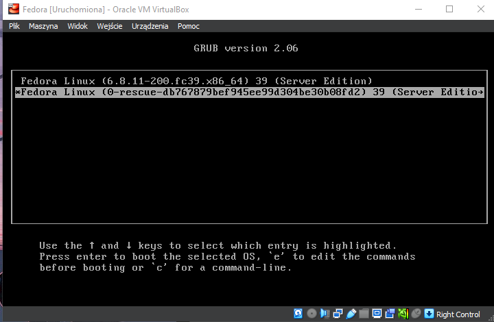

Ostanim krokiem będzie sprawdzenie statusu usługi aby upewnić się że wszystko działa:

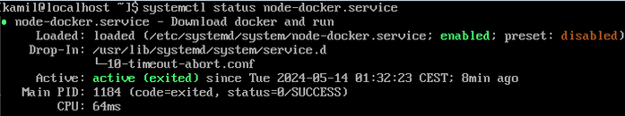