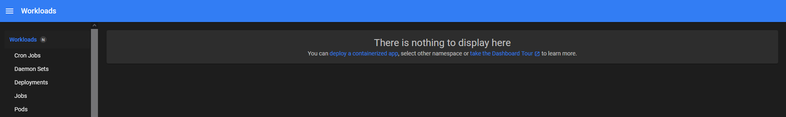
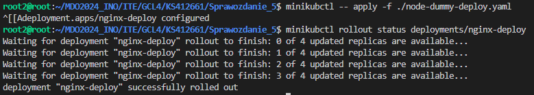

# Sprawozdanie - Kamil Salamończyk

## Lab 10

Celem dziesiątych zajęć było wdrożenie kontenera zarządzalnego przy użyciu `Kubernetes`.

### Instalacja klastra Kubernetes

Zgodnie z poleceniem, pobieramy `minicube` przy użyciu curl:

```
curl -LO https://storage.googleapis.com/minikube/releases/latest/minikube_latest_amd64.deb
```

Teraz instalacja, zgodnie z dokumentacją:

```
sudo dpkg -i minikube_latest_amd64.deb
```


Próbowałem odaplić minikube przy użyciu:

```
minikube start
```

Lecz otrzymałem błąd:


Naprawiłem go, dodając użytkownika do grupy `docker`:

```
sudo usermod -aG docker $USER
newgrp docker
```

Teraz wszystko działa: 


Uruchamiamy dashboard `minikube dashboard`:



Zapoznanie się z pojęciami:

`Pod` jest najmniejszą jednostką w Kubernetes. Może zawierać jeden lub więcej kontenerów, które współdzielać będą przestrzeń, adres IP, zasoby i cykl życia.

`Deployment` zarządza wdrożeniem aplikacji w Kubernetes. Definiuje on pożądany stan wdrożenia aplikacji i zarządza aktualizacjami aplikacji.

Pobieranie `kubectl` (`minikube kubectl -- get po -A`):


Dodanie aliasu robimy za pomocą komendy: `alias minikubctl="minikube kubectl"`

Uruchamiam kontener poprzez polecenie: `minikubctl -- run node-dummy --image=flafyking/node-js-dummy-test:1.0.2 --port=8080 --labels app=node-dummy`.

Rezultat:


Komunikacja:


### Konwersja wdrożenia ręcznego na wdrożenie deklaratywne YAML

Tworzymy plik `.yaml` do wdrożenia deklaratywnego:

```
apiVersion: apps/v1
kind: Deployment
metadata:
  name: node-dummy-deploy
  labels:
    app: node-dummy
spec:
  replicas: 4
  selector:
    matchLabels:
      app: node-dummy
  template:
    metadata:
      labels:
        app: node-dummy
    spec:
      containers:
      - name: node-dummy
        image: flafyking/node-dummy-js-test:1.0.2
        ports:
        - containerPort: 80
```

Rozpoczynamy wdrożenie przy użyciu komendy `minikubctl -- apply -f ./node-dummy-deploy.yaml`.

Niestety w tym momencie pojawiały się problemy które okazały się trudne do zdabugowania, zatem zmieniłem repozytorium na nginx z customową stroną.

Zainstalowałem nginx `sudo apt install nginx`, a następnie skopiowałem index.html do mojego folderu: `cp /usr/share/nginx/html/index.html .`.

Zmodyfikowałem plik tak aby był podpisany przezemnie.

Stworzyłem nowy Dockerfile który uruchomie `nginx`:

```
FROM nginx

COPY index.html /usr/share/nginx/html/index.html
```

Zbudowałem kontener:

```
docker build -f nginx.Dockerfile -t my-nginx-app .
```

Uruchomiełem kontener:

```
docker run -d -p 5000:80 --name my-nginx-container my-nginx-app
```

Wynik:


Następnie zalogowałem się do DockerHub, otagowałem wcześniej utworzony build oraz wypchnąłem:

```
docker login
docker tag my-nginx-app flafyking/my-nginx-app:1.0.1
docker push flafyking/my-nginx-app:1.0.1
```

Zmodyfikowałem plik `.yaml`:

```
apiVersion: apps/v1
kind: Deployment
metadata:
  name: nginx-deploy
  labels:
    app: nginx-app
spec:
  replicas: 4
  selector:
    matchLabels:
      app: nginx-app
  template:
    metadata:
      labels:
        app: nginx-app
    spec:
      containers:
      - name: nginx-app
        image: flafyking/my-nginx-app:1.0.1
        ports:
        - containerPort: 80
```

Sprawdziłem status przy użyciu komendy `rollout`:


### Przygotowanie nowego obrazu

Nowy obraz nie różnił się prawie niczym od pierwszego, poza zmianą treści html. 

Wypchnąłem nowy obraz na DockerHub w identyczny sposób jak za ostatnim razem.


Następnie należało również dodać obraz, który zakończy swoje działanie błędem. Najprostszym sposobem będzie zwrócenie `false`. Wystarczy dodać tą komendę w Dockerfile.

Wypchnąłem kolejny obraz na DockerHub w identyczny sposób jak za ostatnim razem.


### Zmiany w deploymencie

Pierwszą zmianą będzie zwiększenie ilości replik do 8:

```
spec:
  replicas: 8
  selector:
    matchLabels:
      app: nginx-app
```

Po uruchomieniu Deployment'u, widać że utworzyło się 8 podów:


Drugą zmianą będzie zmniejszenie ilości replik do 1:

```
spec:
  replicas: 1
  selector:
    matchLabels:
      app: nginx-app
```

Po uruchomieniu, ładnie widać pody które są w tej chwili niszczone. Kolejne wywołanie pokazało już tylko jeden pod:


Trzecią zmianą będzie zmniejszenie ilości replik do 1:

```
spec:
  replicas: 0
  selector:
    matchLabels:
      app: nginx-app
```

Bez większych zaskoczeń, nie pojawiają się żadne pody. Taki zabieg może być przydatny przy np wyłączeniu aplikacji bez usuwania konfiguracji:


Kolejna zmiana to aktualizacja obrazu do nowszej wersji `1.0.2`. Dodatkowo zmieniłem ilość replik na 4:

```
spec:
      containers:
      - name: nginx-app
        image: flafyking/my-nginx-app:1.0.2
        ports:
        - containerPort: 80
```



Kolejna zmiana to downgrade obrazu do wersji `1.0.1`:

```
spec:
      containers:
      - name: nginx-app
        image: flafyking/my-nginx-app:1.0.1
        ports:
        - containerPort: 80
```


Przy użyciu komendy `minikubctl rollout history deployment/nginx-deploy`, możemy zobaczyć historie deploymentów:


Za pomocą komendy `minikubctl rollout undo deployment/nginx-deploy`, przywróciłem 


Przetestowałem jeszcze wersję obrazu, który kończy się błędem:


### Kontrola Wdrożenia

Napisałem skrypt weryfikujący czy wdrożenie zdążyło się wdrożyć w 60 sekund. Podajemy nazwę deploymentu, czas trwania oraz interwał. Na tej podstawie sprawdzamy co interwał status deploymentu. Jeśli nie zakończył się sukcesem, zwiększamy czas który upłynął i sprawdzamy czy przekroczył 60 sekund. 

```
#!/bin/bash

DEPLOYMENT_NAME="nginx-deploy"

CHECK_DURATION=60
INTERVAL=1

start_time=$(date +%s)

echo "Checking deployment $DEPLOYMENT_NAME for $CHECK_DURATION seconds..."

while true; do
  minikube kubectl -- rollout status deployment/$DEPLOYMENT_NAME --timeout=${INTERVAL}s
  if [ $? -eq 0 ]; then
    echo "Deployment $DEPLOYMENT_NAME completed successfully."
    exit 0
  fi

  current_time=$(date +%s)
  elapsed_time=$((current_time - start_time))

  if [ $elapsed_time -ge $CHECK_DURATION ]; then
    echo "Deployment $DEPLOYMENT_NAME did not complete within $CHECK_DURATION seconds."
    exit 1
  fi

  sleep $INTERVAL
done
```


### Strategie wdrożenia

Strategia `Recreate` to strategia stosowana przy deploymencie, która polega na usunięciu wszystkich podów przed uruchomieniem nowych, co powoduje krótką przerwę w dostępności aplikacji. 

Tutaj przykładem jest mój standardowy plik deploymentu, który pojawiał się już wcześniej.

Strategia `Rolling Update` stopniowo zastępuje stare pody nowymi, umożliwiając ciągłe działanie aplikacji z minimalnymi przerwami w dostępności, ponieważ nowe pody są uruchamiane zanim stare zostaną usunięte.

```
apiVersion: apps/v1
kind: Deployment
metadata:
  name:  nginx-deploy
  labels:
    app: nginx-app
spec:
  replicas: 4
  strategy: 
    type: RollingUpdate
    rollingUpdate:
      maxUnavailable: 2
      maxSurge: 25%
  selector:
    matchLabels:
      app: nginx-app
  template:
    metadata:
      labels:
        app: nginx-app
    spec:
      containers:
      - name: nginx-app
        image: flafyking/my-nginx-app:1.0.1
        ports:
        - containerPort: 80
```

Jak widać na poniższym zrzucie ekranu, część podów jest zatrzymywana, a część jest tworzona. Nowe pody zawierają nową wersję. Zwiększyłem ilość replik do 8 w celu lepszego zobrazowania:


Strategia `Canary Deployment` polega na wdrożeniu nowej wersji aplikacji na niewielki podzbiór ruchu produkcyjnego, aby przetestować jej stabilność i wydajność przed pełnym wdrożeniem.

Mamy tutaj podział na wersję stabilną oraz testową. W moim przypadku wersja `1.0.2` i `1.0.1`. 

```
apiVersion: apps/v1
kind: Deployment
metadata:
  name: nginx-deploy-canary
  labels:
    app: nginx-app
    track: canary
spec:
  replicas: 1
  selector:
    matchLabels:
      app: nginx-app
      track: canary
  template:
    metadata:
      labels:
        app: nginx-app
        track: canary
    spec:
      containers:
      - name: nginx-app
        image: flafyking/my-nginx-app:1.0.2
        ports:
        - containerPort: 8000
---
apiVersion: apps/v1
kind: Deployment
metadata:
  name: nginx-app-stable
  labels:
    app: nginx-app
    track: stable
spec:
  replicas: 2
  selector:
    matchLabels:
      app: nginx-app
      track: stable
  template:
    metadata:
      labels:
        app: nginx-app
        track: stable
    spec:
      containers:
      - name: nginx-app
        image: flafyking/my-nginx-app:1.0.1
        ports:
        - containerPort: 8000
```

Jak widać, mamy dwie repliki stabilne oraz jedną testową: 

