# Sprawozdanie 1
## Łukasz Oprych nr albumu 410687 Informatyka Techniczna

## Lab1
Celem pierwszych zajęć było zapoznanie się z system kontroli wersji **Git** oraz platformą **Github**.

Ćwiczenie wykonano na maszynie wirtualnej Fedora wersja 39 przy użyciu wirtualizacji Hyper-V, komunikowano się z nią przy użyciu SSH oraz Visual Studio Code z zainstalowaną wtyczką Remote - SSH. 

### 1. Zainstaluj klienta Git oraz obsługę kluczy ssh
Pierwszym krokiem, który należy wykonać jest zainstalowanie klienta git.

Aktualizacja menadżera pakietów
```
sudo dnf update
```
Instalacja git-a przy użyciu komendy `sudo dnf install git`,
następnie w  celu weryfikacji instalacji gita można sprawdzić następującą komendą 
```
git --version
```
Następnie instalujemy obsługę kluczy ssh używając komendę `sudo dnf install openssh-server`
Następnie uruchamiamy usługę ssh komendami
`sudo systemctl enable sshd` i `sudo systemctl start sshd`
### 2. Sklonuj repozytorium przedmiotowe za pomocą HTTPS i personal access token
Po wykonaniu powyższych instrukcji, aby bezpiecznie sklonować repozytorium przedmiotowe trzeba wykonać następujące kroki: 

Należy utworzyć [**personal access token**](https://github.com/settings/tokens) w serwisie github, w zakładce **scopes** wybieramy opcję **repo** dodatkowo wybieramy pożądaną **expiration date**. Nie należy go nigdzie udostępniać, lecz zachować w bezpiecznym, prywatnym miejscu.

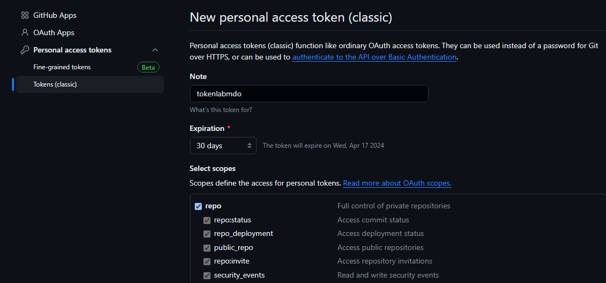

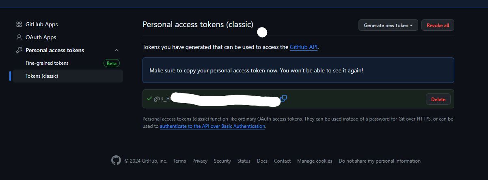

Kolejnym krokiem będzie sklonowanie repozytorium przy użyciu **HTTPS**:
```
 git clone https://loprych:<token>@github.com/InzynieriaOprogramowaniaAGH/MDO2024_INO.git 
```

Następnie generujemy parę kluczy ssh przy użyciu poniższego polecenia, 
```
ssh-keygen -t ed25519 -C "loprych@student.agh.edu.pl" -N 'password'
```
gdzie `-t` oznacza rodzaj wygenerowanego klucza, w naszym przypadku klucz typu ed25519 oraz `-C` komentarz służący identyfikacji klucza i `-N` hasło do klucza prywatnego.

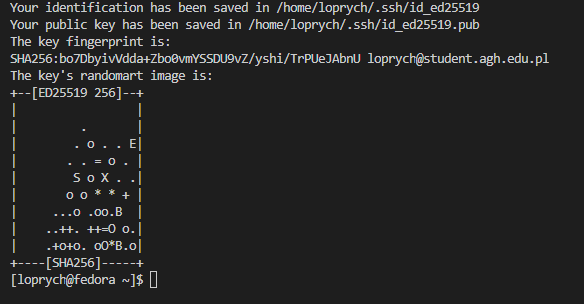

Następnie po wygenerowaniu, klucz publiczny zamieszczony w `/home/<username>/.ssh` kopiujemy i zamieszczamy na githubie w ustawieniach w sekcji `SSH and GPG keys`

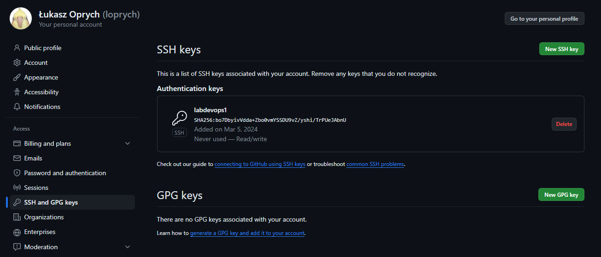

Na koniec możemy sklonować repozytorium przy użyciu SSH:

```
git clone git@github.com:InzynieriaOprogramowaniaAGH/MDO2024_INO.git
```
Następnie możemy przełączyć się na katalog, w którym znajduje się nasze repozytorium komendą `cd <nazwa_katalogu>`.
### 4. Przełącz się na gałąź `main`, a potem na gałąź swojej grupy

Po wykonaniu powyższych poleceń możemy przełączyć się do gałęzi main przy użyciu komendy `git checkout main`, sprawdzić poprawność wykonania możemy po wpisaniu komendy `git branch`, dzięki której sprawdzamy na jakiej gałęzi się znajdujemy, następnie przy użyciu komendy `git checkout -b <nazwa_gałęzi_grupowej>` przełączamy się na gałąź grupy laboratoryjnej. Dzięki gałęziom w uporządkowany sposób możemy dokonywać zmian w naszym repozytorium.

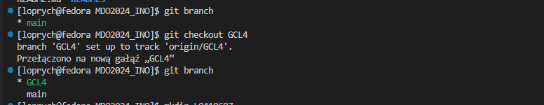

### 5. Utwórz gałąź o nazwie "inicjały & nr indeksu" np. **LO410687**. Miej na uwadze, że odgałęziasz się od brancha grupy!

Następnie przełaczamy się na osobistą gałąź ponownie przy użyciu `git checkout -b <inicjały_i_nr_albumu>`.

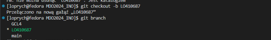

### 6. Rozpocznij pracę na nowej gałęzi


W celu utworzenia miejsca do pracy nad ćwiczeniem tworzymy katalog właściwy dla grupy laboratoryjnej oraz katalog o naszych inicjałach i numerze albumu. 
Możemy to zrobić za pomocą komendy `mkdir -p <kierunek>/<grupa_laboratoryjna>/<inicjały_i_nr_albumu>`

Dodatkowo na potrzeby dalszych kroków ćwiczenia, dodałem również katalog na sprawozdanie i utworzyłem plik **markdown** i wstawiłem do niego przykładową zawartość za pomocą komendy `echo`

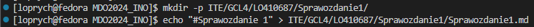

#### Napisz Git hooka - skrypt weryfikujący, że każdy Twój "commit message" zaczyna się od "twoje inicjały & nr indexu".

Następnie, aby wprowadzić nasze zmiany do repozytorium przy użyciu komendy `git commit` zgodnie z poleceniem tworzymy hook'a. Jest to skrypt, który jest wywoływany przy dokonywaniu przez nas commita.

W tym celu przenosimy się do katalogu `.git/hooks` i edytujemy plik `commit-msg.sample`.

Treść skryptu jest następująca

```bash
#!/bin/bash

commit_msg=$(cat $1)

if [[ ! $commit_msg =~ ^LO410687.*$ ]]; then
    echo "Commit message must start with 'LO410687'."  
    echo "Commit blocked! "  
    exit 1  
fi
echo "Correct commit"
```
Owy **hook** pozwala weryfikować za pomocą warunku czy **commit** rozpoczyna się od inicjałów i numeru albumu. Jeżeli warunek nie jest spełniony zwraca komunikat m.in., że wiadomość commita musi rozpoczynać się od inicjałów i numeru albumu, w przeciwnym wypadku commit przechodzi i otrzymujemy wiadomość zwrotną **"Correct commit"**

Po stworzeniu hook'a zmieniamy jego nazwę na commit-msg za pomocą polecenia
`mv commit-msg.sample commit-msg`.

Następnie za pomocą polecenia `sudo chmod +x commit-msg` nadajemy uprawnienia do wykonywania (execute), aby hook mógł zostać poprawnie wykonanie.

Następnie kopiujemy go do naszego indywidualnego katalogu stworzonego pod laboratoria za pomocą komendy `cp ../../MDO2024_INO/ITE/GCL4/LO410687`.

Następnie przenosimy się do katalogu `MDO2024_INO` i dodajemy wszystkie nasze zmiany do repozytorium lokalnego za pomocą polecenia `git add .`, w celu sprawdzenia zmian w repozytorium możemy użyć komendy `git status`.

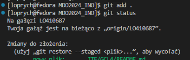

Wykonujemy commita przy użyciu komendy `git commit -m "LO410687"`, przy okazji możemy zauważyć prawidłowe zadziałanie naszego **git hook'a**

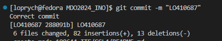

Załączam również dodatkowo przypadek wykonania commit'a niezgodnie z hook'iem

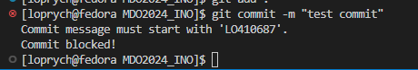

Aby dodać nasze zmiany na zdalne repozytorium używamy polecenia `git push`, lecz w celu ustalenia, który branch ze zdalnego repozytorium ma być śledzony przez gałąź lokalną, polecenie uzupełniono: `git push --set-upstream origin LO410687` Po użyciu tej flagi, Git zapamięta, że lokalna gałąź LO410687 jest powiązana z gałęzią zdalną o tej samej nazwie na serwerze origin.

#### Spróbuj wciągnąć swoją gałąź do gałęzi grupowej

W celu wciągnięcia gałęzi do gałęzi grupowej przełączamy się na gałąź grupową używając polecenia `git checkout GCL4` i wciągamy zmiany poleceniem `git merge LO410687`

#### Zaktualizuj sprawozdanie i zrzuty o ten krok i wyślij aktualizację do zdalnego źródła (na swojej gałęzi)

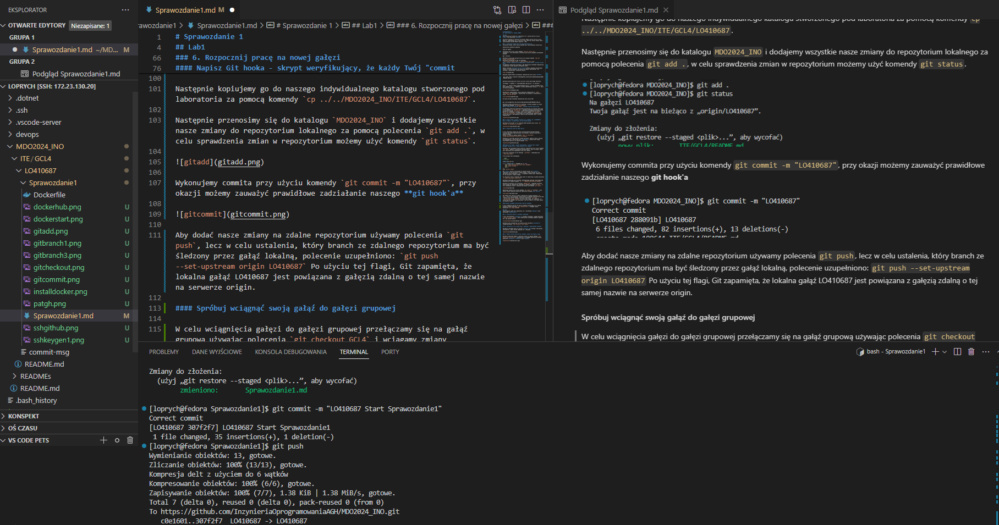

### Wystaw Pull Request do gałęzi grupowej jako zgłoszenie wykonanego zadania.

Po dokonaniu **commit'a** oraz **push'a** należy przejść do naszego zdalnego laboratoryjnego repozytorium znajdującym się na platformie Github. Przechodzimy w nim do zakładki **Pull requests**, a następnie rozpoczynamy pull requesta przyciskiem **New pull request**.

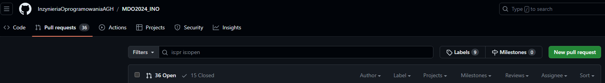

Następnie przy opcji **Comparing changes** wybieramy jako base GCL4, czyli naszą gałąź laboratoryjną, jako compare naszą gałąź w moim przypadku LO410687

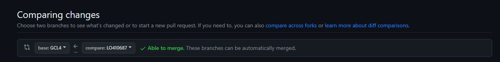

Pull request wygląda w sposób następujący, możemy go skomentować, zamknąć opcją *close pull request* i możemy czekać na review :) :

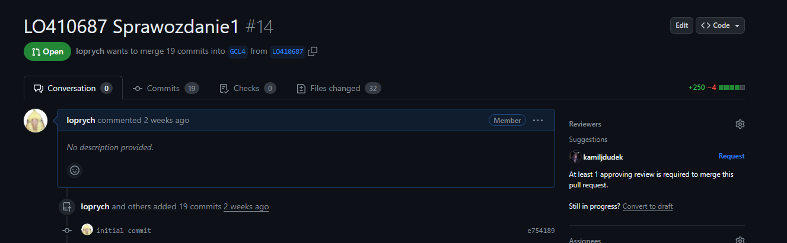


## Lab2 
Celem drugich zajęć było zapoznanie się z narzędziem **Docker** oraz tworzeniem **Dockerfile**.

### Zainstaluj Docker w systemie linuksowym

W celu zainstalowania **Dockera** w systemie linuxowym, używamy polecenia `sudo dnf install docker`, który wykorzystuje systemowy menadżer pakietów dnf, aby pobrać Dockera.

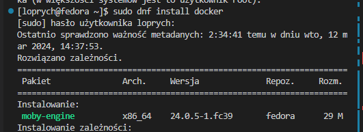

Następnie aby uruchomić go na serwerze przez narzędzie **systemctl** używamy polecenia `sudo systemctl start docker`

### Zarejestruj się w Docker Hub i zapoznaj z sugerowanymi obrazami

Następnie zakładamy konto na portalu [**Docker Hub**](https://hub.docker.com/explore), gdzie możemy zapoznać się z obrazami, których między innymi będzie używać w ćwiczeniu


### Pobierz obrazy hello-world, busybox, ubuntu lub fedora, mysql

Następnie pobieramy podane w poleceniu obrazu za pomocą komendy `sudo docker pull hello-world`, analogicznie w przypadku pozostałych obrazów, pobieramy **busybox**, **fedora** oraz **mysql**, aby uruchomić dany obraz dokonujemy to za pomocą polecenia `sudo docker run <nazwa_obrazu>`.

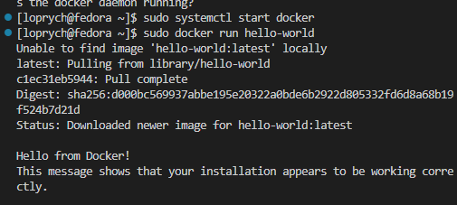

Jak widać na powyższym screenshot'cie uzyłem polecenia `sudo docker run hello-world`, gdy jeszcze nie pobrałem obrazu **hello-world** jak widać system nie mógł go znaleźć, więc sam pobrał obraz z rejestru domyslnych obrazów w Docker Hub.

Pobrane obrazy można zobaczyć dzięki poleceniu `sudo docker images`

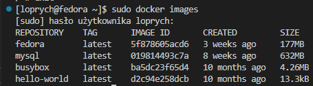

### Uruchom kontener z obrazu `busybox`

Następnie zgodnie z poleceniem uruchomiono obraz busybox za pomocą komendy `sudo docker run busybox` i podłączono się interaktywnie do kontenera za pomocą polecenia `sudo docker run -it --rm busybox`, gdzie -it mówi o podłączeniu się interaktywnym oraz --rm znaczy, że kontener zostanie usunięty automatycznie po zakończeniu działania. Za pomocą polecenia `busybox | head -1` wywołano numer wersji **BusyBoxa**.

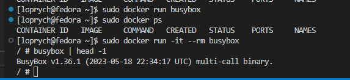

### Uruchom "system w kontenerze".
Następnie zgodnie z poleceniem uruchomiono "system Fedora w kontenerze" za pomocą polecenia `sudo docker run -it --rm fedora`

Następnie w celu zaprezentowania PID1 w kontenerze, możemy użyć polecenia ps, lecz w obrazie Fedory nie ma domyślnie preinstalowanej usługi ps, więc za pomocą polecenia `dnf install procps -y` doinstalujemy sobie ową usługę, -y odpowiada za automatyczne potwierdzanie kolejnych kroków instalacji bez odpowiadania ręcznego na pytanie **y/N?**.

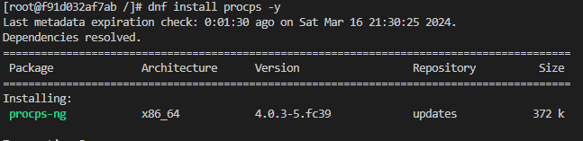

Prezentacja PID1 kontenerze za pomocą komendy `ps`, oraz procesy dockera na hoście za pomocą `ps auxft`

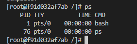

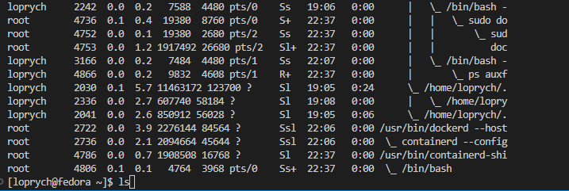

Następnie zgodnie z poleceniem aktualizujemy pakiety poleceniem `dnf update` i wychodzimy z kontenera poleceniem `exit`. 

*Niezgodność numerów hostów poniżej wynika z wykonania ponownie tych samych kroków ćwiczenia w różnych odstępach czasowych*

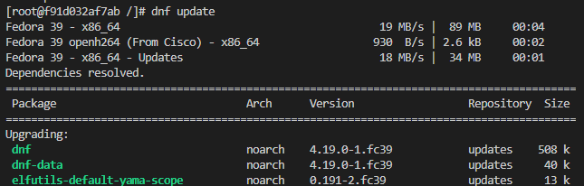

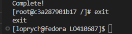

### Stwórz własnoręcznie, zbuduj i uruchom prosty plik Dockerfile bazujący na wybranym systemie i sklonuj nasze repo.

Następnym poleceniem było zbudowanie własnoręcznie pliku **Dockerfile**, który w tym przypadku będzie bazował na systemie Fedora z powodu chęci zaznajomienia się z daną dystrybucją w trakcie zajęć. 

Należy również zadbać o posiadanie przez utworzony obraz git'a oraz ma zostać na nim ściągnięte repozytorium zajęciowe. 

Dodatkowo ustawiłem katalog roboczy za pomocą `WORKDIR` na `/workspace` oraz początkowe polecenie dla kontenera po stworzeniu obrazu `CMD [bash]`.

Plik utworzyć można (lecz nie trzeba) w naszym prywatnym katalogu, w moim przypadku to katalog GCL4/LO410687/Sprawozdanie1, w innym wypadku po stworzeniu Dockerfile'a powinniśmy skopiować plik do katalogu ze sprawozdaniem, możemy to dokonać poleceniem `cp lokalizacja_pliku lokalizacja docelowa`

```Dockerfile
FROM fedora:latest

RUN dnf -y update && \
    dnf -y install git

WORKDIR /workspace

RUN git clone https://github.com/InzynieriaOprogramowaniaAGH/MDO2024_INO.git

CMD ["bash"]
```

Następnie budujemy obraz za pomocą polecenia `sudo docker build -t <nazwa_obrazu> .`, gdzie `.` oznacza lokalizacje Dockerfile'a oraz `-t` flagę służącą do nadania nazwy obrazowi.

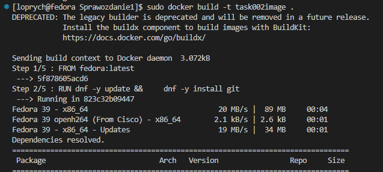

Następnie poleceniem `sudo docker run -it --rm <nazwa_obrazu` uruchamiamy w trybie interaktywnym kontener. Następnie wywołujemy polecenie `ls` aby sprawdzić czy repozytorium laboratoryjne zostało sklonowane.

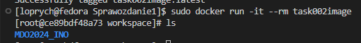

### Pokaż uruchomione ( != "działające" ) kontenery, wyczyść je.
Następnie przy pomocy  polecenia `sudo docker ps -a` na hoście pokazujemy uruchomione kontenery.

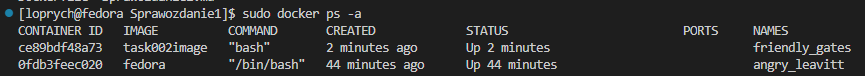

Zgodnie z poleceniem czyścimy kontenery komendą `sudo docker rm -f <id_kontenera>`

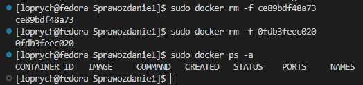

### Wyczyść obrazy

Kolejnym poleceniem jest wyczyszczenie obrazów, robimy to za pomocą komendy `sudo docker image prune -a`, gdzie -a powoduje usunięcie wszystkich nieużywanych obrazów z systemu.

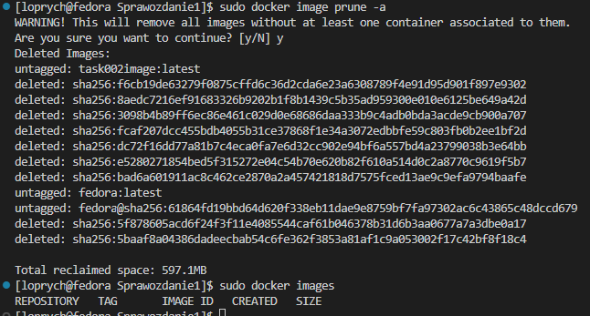

