# Sprawozdanie 2
## Łukasz Oprych 410687 Informatyka Techniczna

## Lab 3

Celem następujących zajęć było zbudowanie i uruchomienie testów w repozytorium dwóch aplikacji dysponujących otwartą licencją, które posiadają narzędzia na kształt `make build` oraz `make test` (**meson**, **ninja** dla [**irssi**](https://github.com/irssi/irssi) **npm** dla [**todo web app**](https://github.com/devenes/node-js-dummy-test)).

#### 1. Wykonaj kroki build i test wewnątrz wybranego kontenera bazowego.

Na początek zaczniemy od aplikacji **irssi**, uruchomimy kontener, sklonujemy repozytorium i doinstalujemy wymagane zależności. 

Naszą pracę rozpoczniemy od uruchomienia kontenera interaktywnie z fedorą, który w prosty sposób umożliwi nam pracę na tym repozytorium, ponieważ kod aplikacji głównie jest stworzony w języku C.


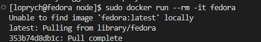

Następnie w celu sklonowania repozytorium oraz kompilacji programu, musimy doinstalować kompilator **gcc**, buildery **meson, ninja** oraz **git'a**

Aby je zainstalować użyjemy poniższego polecenia:

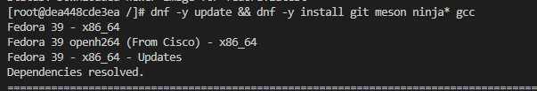


Następnie sklonujemy repozytorium następującym poleceniem:

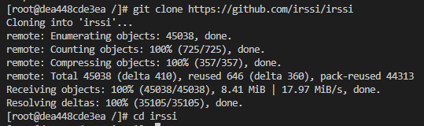

Po wykonaniu powyższych kroków, można przejść do katalogu z pobranego repozytorium 

```
cd irssi
```
i zbudujemy aplikację poleceniem 
```
meson build
```

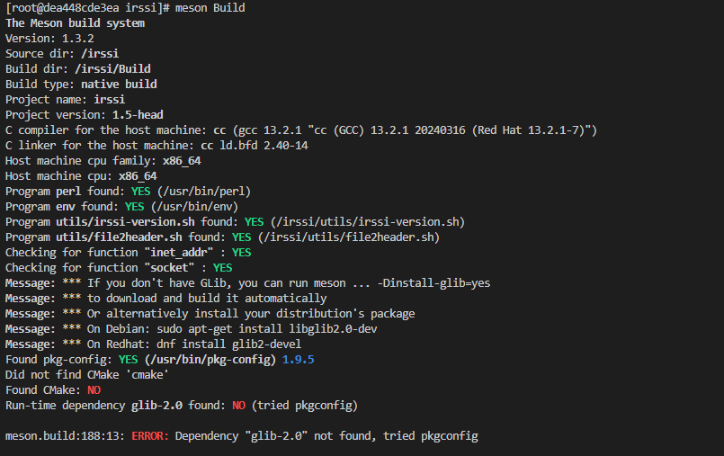

Aby skompilować poprawnie program, [**dokumentacja**](https://github.com/irssi/irssi/blob/master/INSTALL) w repozytorium informuje nas, że należy doinstalować między innymi niniejsze narzędzia

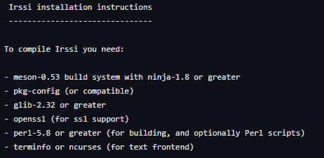

Doinstalujmy je:

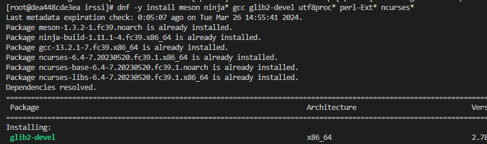

Po doinstalowaniu ponownie zbudujemy poleceniem `meson build`

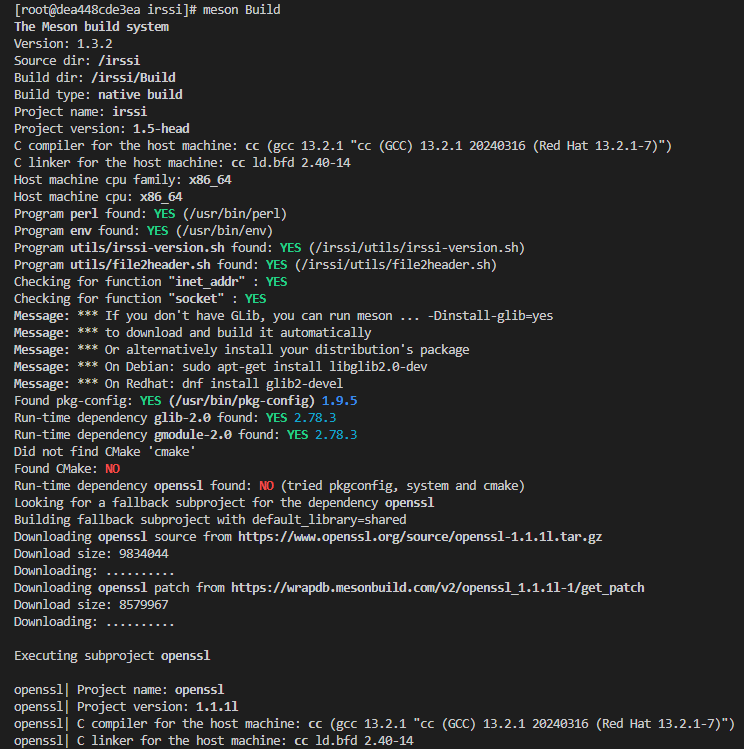

następnie w celu zbudowania aplikacji używamy polecenia 

```
ninja -C irssi/Build
```

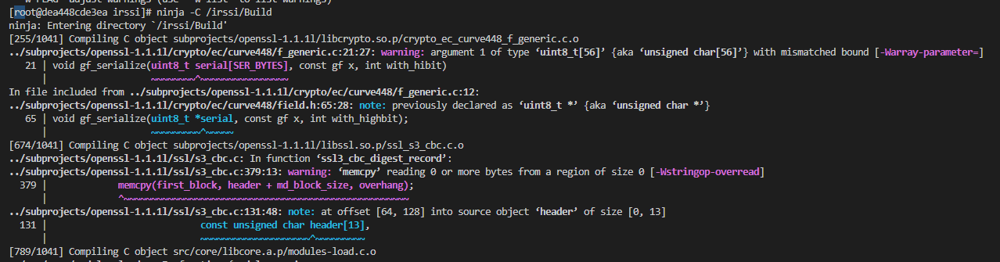

Po zbudowaniu aplikacji uruchomimy testy ze sklonowanego repozytorium poleceniem 

```
ninja test
```

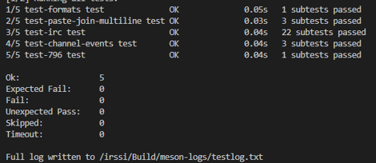

Jak widać wszystkie testy przeszły pozytywnie.

Kolejnym przykładem aplikacji będzie **To do web app**, które będzie wymagać mniejszej ilości działań w celu udanej konfiguracji aplikacji.

Uruchomimy interaktywnie kontener node'owy, który usunie się po zamknięciu poleceniem:
```
sudo docker run --rm -it node /bin/bash
```

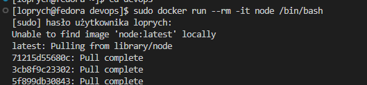

Owy obraz wybrano ponieważ, aplikacja została napisana przy użyciu Node.js.

Następnie aktualizujemy menadżer paczek, instalujemy gita 
```
apt-get update
apt-get install git
```

Podobnie jak na wcześniejszym przykładzie klonujemy repo poleceniem `git clone <https://github.com/<repo>>`.

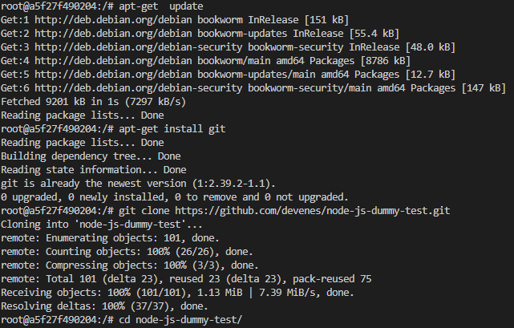

Do instalacji zależności określonych pliku package.json używamy polecenia 

```
npm install
```

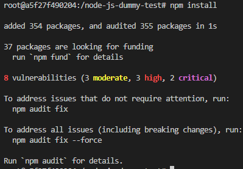

Następnie po instalacji niezbędnych zależności, można uruchomić test dołączony do sklonowanego repozytorium poleceniem 

```
npm test
```

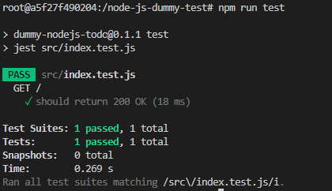

#### 2. Stwórz dwa pliki Dockerfile automatyzujące kroki powyżej.

#### Kontener pierwszy ma przeprowadzić kroki aż do builda

W celu zautomatyzowania naszych działań tworzymy plik `Dockerfile` w naszym przypadku `node-builder.Dockerfile`, który zbuduje nam sklonowaną aplikację oraz `node-test.Dockerfile` dzięki któremu wykonamy testy na podstawie utworzonego  uprzednio `buildera`. Aby uruchomić aplikację musimy utworzyć `node-deploy.Dockerfile`

**node-builder.Dockerfile**
```
FROM node

RUN git clone https://github.com/devenes/node-js-dummy-test
WORKDIR /node-js-dummy-test
RUN npm install
```

**node-test.Dockerfile**

```
FROM node-builder
RUN npm test
```
**node-deploy.Dockerfile**
```
FROM node-builder
CMD ["npm", "start"]
```


## Lab 4