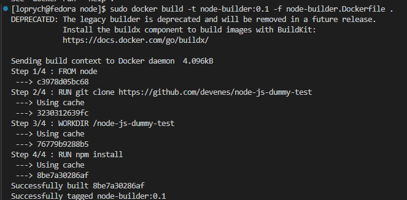
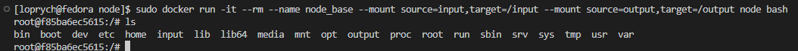
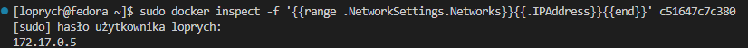

# Sprawozdanie 2
## Łukasz Oprych 410687 Informatyka Techniczna

## Lab 3

Celem następujących zajęć było zbudowanie i uruchomienie testów w repozytorium dwóch aplikacji dysponujących otwartą licencją, które posiadają narzędzia na kształt `make build` oraz `make test` (**meson**, **ninja** dla [**irssi**](https://github.com/irssi/irssi) **npm** dla [**todo web app**](https://github.com/devenes/node-js-dummy-test)).

#### 1. Wykonaj kroki build i test wewnątrz wybranego kontenera bazowego.

Na początek zaczniemy od aplikacji **irssi**, uruchomimy kontener, sklonujemy repozytorium i doinstalujemy wymagane zależności. 

Naszą pracę rozpoczniemy od uruchomienia kontenera interaktywnie z fedorą, który w prosty sposób umożliwi nam pracę na tym repozytorium, ponieważ kod aplikacji głównie jest stworzony w języku C.


Następnie w celu sklonowania repozytorium oraz kompilacji programu, musimy doinstalować kompilator **gcc**, buildery **meson, ninja** oraz **git'a**

Aby je zainstalować użyjemy poniższego polecenia:


Następnie sklonujemy repozytorium następującym poleceniem:


Po wykonaniu powyższych kroków, można przejść do katalogu z pobranego repozytorium 

```
cd irssi
```
i zbudujemy aplikację poleceniem 
```
meson build
```


Aby skompilować poprawnie program, [**dokumentacja**](https://github.com/irssi/irssi/blob/master/INSTALL) w repozytorium informuje nas, że należy doinstalować między innymi niniejsze narzędzia


Doinstalujmy je:


Po doinstalowaniu ponownie zbudujemy poleceniem `meson build`


następnie w celu zbudowania aplikacji używamy polecenia 

```
ninja -C irssi/Build
```


Po zbudowaniu aplikacji uruchomimy testy ze sklonowanego repozytorium poleceniem 

```
ninja test
```


Jak widać wszystkie testy przeszły pozytywnie i możemy opuścić kontener poleceniem `exit`.

Kolejnym przykładem aplikacji będzie **To do web app**, które będzie wymagać mniejszej ilości działań w celu udanej konfiguracji aplikacji.

Uruchomimy interaktywnie kontener node'owy, który usunie się po zamknięciu poleceniem:
```
sudo docker run --rm -it node /bin/bash
```


Owy obraz wybrano ponieważ, aplikacja została napisana przy użyciu Node.js.

Następnie aktualizujemy menadżer paczek, instalujemy gita 
```
apt-get update
apt-get install git
```

Podobnie jak na wcześniejszym przykładzie klonujemy repo poleceniem `git clone <https://github.com/<repo>>`.


Następnie przenosimy się do katalogu `node`.

Do instalacji zależności określonych pliku package.json używamy polecenia 

```
npm install
```


Następnie po instalacji niezbędnych zależności, można uruchomić test dołączony do sklonowanego repozytorium poleceniem 

```
npm run test
```


#### 2. Stwórz dwa pliki Dockerfile automatyzujące kroki powyżej.

#### Kontener pierwszy ma przeprowadzić kroki aż do builda

W celu zautomatyzowania naszych działań tworzymy pliki `Dockerfile`. W przypadku aplikacji node `node-builder.Dockerfile`, który zbuduje nam sklonowaną aplikację oraz `node-test.Dockerfile` dzięki któremu wykonamy testy na podstawie utworzonego  uprzednio `buildera`. 

**node-builder.Dockerfile**
```
FROM node

RUN git clone https://github.com/devenes/node-js-dummy-test
WORKDIR /node-js-dummy-test
RUN npm install
```
Polecenie `FROM node` oznacza, że obraz będzie oparty na obrazie bazowym zawierającym środowisko uruchomieniowe *Node.js*

Następnie wykonuje się polecenie `RUN git clone https://github.com/devenes/node-js-dummy-test`, które pobiera kod źródłowy z repozytorium zdalnego.

Kolejnym krokiem jest ustawienie katalogu roboczego na `/node-js-dummy-test` za pomocą polecenia `WORKDIR /node-js-dummy-test`, dzięki temu wszystkie kolejne operacje będą wykonywane w tym katalogu.

Ostatecznie, polecenie `RUN npm install` instaluje wszystkie zależności Node.js zdefiniowane w pliku package.json znajdującym się w katalogu projektu.

**node-test.Dockerfile**

```
FROM node-builder
RUN npm test
```
Polecenie `FROM node-builder` oznacza, że obraz będzie oparty o obraz bazowy, którym jest uprzednio utworzony *node-builder.Dockerfile*. Następnie wykonuje się polecenie `RUN npm test`, które uruchamia testy.

#### Wykaż, że kontener wdraża się i pracuje poprawnie

Następnie w celu wdrożenia kontenera, w uprzednio stworzonym katalogu `node` budujemy obraz za pomocą polecenia 

```
sudo docker build -t node-builder:0.1 -f ./node-builder.Dockerfile .
```
Gdzie `-t` mówi nam, że obraz będzie nazywał się `node-builder` z tagiem `0:1`, `-f`, że będzie on zbudowany przy użyciu pliku znajdującego się w aktualnym katalogu o nazwie `node-builder.Dockerfile`, w bieżącym katalogu `.`



Po zbudowaniu buildera możemy zbudować obraz odpowiadający za testy na podobnej zasadzie poleceniem 

```
sudo docker build -t node-test:0.1 -f node-test.Dockerfile .
```


W celu sprawdzenia działania budowania i testowania, można uruchomić kontenery builder i test poleceniem `sudo docker run <nazwa_obraz>`, lecz próba ich uruchomienia nie zwróci nam konkretnego wyniku.

Jedynie poleceniem `echo $?` możemy sprawdzić czy zakończenie działania kontenerów było pozytywne **zakończone zerem**


Następnie na przykładzie irssi również tworzymy obrazy builder i test.

**irssi-builder.Dockerfile**
```
FROM fedora
RUN dnf -y update && dnf -y install git meson ninja* gcc glib2-devel utf8proc* ncurses* perl-Ext*

RUN git clone https://github.com/irssi/irssi

WORKDIR /irssi
RUN meson Build
RUN ninja -C /irssi/Build
```

Poleceniem `RUN Fedora` opieramy nasz tworzony obraz o obraz systemu Fedora, który stosujemy identycznie jak we wcześniejszym poleceniu ze względu na technologię, w której stworzono aplikację.

Poleceniem `RUN dnf -y update && dnf -y install git meson ninja* gcc glib2-devel utf8proc* ncurses* perl-Ext*` podobnie jak przy ręcznej budowie obrazów aktualizujemy system i instalujemy wymagane zależności, takie jak git, meson, ninja etc.

Poleceniem `RUN git clone https://github.com/irssi/irssi`klonujemy repo.

Poleceniem `WORKDIR /irssi` ustawiamy katalog roboczy na irssi

Poleceniem `RUN meson Build` przygotowujemy środowiska do budowania

Poleceniem `RUN ninja -C /irssi/Build` w katalogu irssi/build dokonujemy kompilacji programu irssi przy użyciu ninja.

**irssi-test.Dockerfile**
```
FROM irssi-builder

WORKDIR /irssi/Build

RUN ninja test
```
W przypadku obrazu testowego opieramy go uprzednio utworzony obraz `irssi-builder`
poleceniem `FROM irssi-builder`. Ustawiamy katalog roboczy na /irssi/build, dzięki `WORKDIR /irssi/Build` i uruchamiamy testy poleceniem `RUN ninja test`.

Analogicznie budujemy obraz buildera poleceniem w uprzednio utworzonym katalogu irssi

```
sudo docker build -t irssi-builder -f ./irssi-builder.Dockerfile .
```


Obraz test budujemy poniższym poleceniem 

```
sudo docker build -t irssi-test -f ./irssi-test.Dockerfile .
```


Następnie uruchamiamy kontenery 


i sprawdzamy poleceniem `sudo docker container ps -a` efekt uruchomienia kontenerów oraz wynik wyjściowy, jak widać `exited (0)` czyli działanie zakończyło się poprawnie.


### Docker Compose

W celu automatyzacji procesu budowania obrazów, możemy stworzyć docker-compose w którym przygotujemy wykonanie tego zadania.

Najpierw w celu wykonania tej części ćwiczenia musimy dokonać instalacji poniższych narzędzi:

```
sudo dnf -y install dnf-plugins core
```


Następnie tworzymy docker-compose, przedstawione to zostanie na przykładzie repozytorium node'owego, zatem umieszczamy go w naszym uprzednio utworzonym katalogu node.

```
version: '3.8'

services:
  node-builder:
    build:
      context: .
      dockerfile: node-builder.Dockerfile
    volumes:
      - .:/node
    working_dir: /node
    command: "echo 'node builder container is ready'"

  node-test:
    build:
      context: .
      dockerfile: node-test.Dockerfile
    volumes:
      - .:/node
    working_dir: /node
    command: "echo 'node testing container is ready'"

  node-deploy:
    build:
      context: .
      dockerfile: node-deploy.Dockerfile
    volumes:
      - .:/node
    working_dir: /node
    command: "echo 'node deployment container is ready'"
```
Owy `docker-compose` definiuje budowanie, testowanie i wdrażanie aplikacji, z każdą działającą w osobnym kontenerze, z udziałem współdzielonych woluminów i ustawionym katalogiem roboczym na `/node`.

Po utworzeniu pliku uruchamiamy go poleceniem:

```
docker compose up
```


Wynikiem jest zbudowanie utworzonych obrazów.

## Lab 4
Celem kolejnych laboratoriów było zapoznanie się z dodatkowymi terminami w konteneryzacji m.in. jak **woluminy**, **sieci**. Dodatkowo poznano również narzędzie **Jenkins**.

### Zachowywanie stanu
#### Przygotuj wolumeny wejściowy i wyjściowy, o dowolnych nazwach, i podłącz je do kontenera bazowego, z którego rozpoczynano poprzednio pracę

Ćwiczenie kontynuowano w oparciu o aplikację [node'ową](https://github.com/devenes/node-js-dummy-test) wykorzystaną na ostatnich zajęciach.

Tworzenie wolumenów poleceniami:
```
docker volume create input
docker volume create output
```
Następnie można potwierdzić utworzenie wolumów poleceniem `docker volume ls`


Następnie aby sklonować projekt oraz zapisać zależności uruchamiamy pomocniczy kontener node'owy i poleceniem `--mount` podpinamy woluminy do kontenera
```
sudo docker run -it --rm --name <nazwa_kontenera_pomocniczego> --mount source=input,target=/input node bash
```
Następnie poleceniem `git clone` klonujemy repozytorium w katalogu input odpowiadającemu woluminowi wejściowemu.


#### Powyższe kroki wykonuję w kontenerze bazowym

Uruchamiamy kontener oraz podpinamy woluminy

```
sudo docker run -it --rm --name node_base --mount source=input,target=/input --mount source=output,target=/output node bash
```



Klonujemy repozytorium poleceniem 
```
git clone https://github.com/devenes/node-js-dummy-test
```
Kolejnym krokiem będzie uruchomienie builda w kontenerze bazowym poleceniem `npm install`.


Następnie kopiujemy katalog repozytorium z woluminu input do wewnątrz kontenera poleceniem
```
cp -r node-js-dummy-test/ ../
```
Zapisujemy zbudowane pliki na woluminie wyjściowym, aby były dostępne również po wyłączeniu kontenera
```
cp -r node_modules/ ../../output/
```
Na koniec możemy sprawdzić, czy przekopiowało się poprawnie poleceniem z poziomu katalogu repo
```
cd ../../output
```


Poleceniem `sudo ls /var/lib/docker/volume/<nazwa-katalogu>/_data` sprawdzamy zapisane pliki. 


Według instrukcji ponawiamy operację, ale klonowanie na wolumin wejściowy przeprowadzamy wewnątrz kontenera za pomocą git.

Używamy ponownie kontenera bazowego z woluminami i klonujemy repozytorium do nowego katalogu /input/second

Poleceniem `ls` potwierdzamy poprawne sklonowanie repozytorium


### Przedyskutuj możliwość wykonania ww. kroków za pomocą docker build i pliku Dockerfile.

Wcześniejsze instrukcje można odtworzyć również za pomocą zbudowania obrazu, który stworzymy w Dockerfile'u. W tym celu tworzymy plik `volume-build.Dockerfile` o treści odtwarzającej wczesniej wykonane kroki.

```
FROM node

RUN mkdir /input && mkdir /output

RUN --mount=type=bind,source=input,target=/input,rw
RUN --mount=type=bind,source=output,target=/output,rw

WORKDIR /input
RUN git clone https://github.com/devenes/node-js-dummy-test.git

WORKDIR /input/node-js-dummy-test
RUN npm install
CMD ["cp", "-r", "node_modules", "../../output/dockerfilebuild"]

```
Dzięki `RUN --mount=type=bind,source=input,target=/input,rw` możemy ustalić opcję montowania dla podpięcia woluminu do kontenera. W tym przypadku określa montowanie typu bind, które umożliwia podpięcie katalogu z maszyny hosta gdzie mamy sklonowane repo do kontenera.

Budujemy obraz poleceniem 
```
sudo docker build -f volume-builder.Dockerfile -t wolumindockerfile
```

### Eksponowanie portu

Kolejnym poleceniem było uruchomienie wewnątrz kontenera serwera iperf3.

Zatem uruchamiamy kontener w tym przypadku wybrałem Fedorę i instalujemy narzędzie iperf3


Następnie sprawdzamy adres kontenera serwerowego poleceniem `docker inspect`



Analogicznie uruchamiamy identyczny kontener, który pełni rolę klienta, instalujemy analogicznie iperf3.

Kolejnym krokiem będzie połączenie się z kontenera client do serwera poleceniem `iperf3 -c <adres_serwera>`, gdzie -c oznacza clienta. Będzie również widoczny raport z pruchu w trakcie połączenia, gdzie będzie między innymi widoczna prędkość transferu.


Wynik połączenia z serwera `iperf -s`, gdzie s oznacza server


Kolejnym zadaniem było wykorzystanie sieci mostkowej z użyciem nazw.

W tym celu stworzymy sieć typu bridge poleceniem `docker create -d bridge network <nazwa>`.


Następnie tworzymy dwa kontenery (pierwszy dziający jako serwer, drugi jako klient), które będą łaczyć się w utworzonej uprzednio sieci **mynetwork** poleceniem `sudo docker run --rm -it --network mynetwork --name nazwa fedora bash`.


Następnie na kontenerze serwerowym uruchamiamy usługę iperf oraz sprawdzamy adresy sieciowe kontenerów poleceniem `docker network inspect <nazwa_sieci>

```
iperf3 -s

sudo docker network inspect mynetwork
```
Jak widać sieć ma adres `172.21.0.0/16`, a kontenery zawarte w niej `172.21.0.2` oraz `172.21.0.3`


Następnie uruchamiamy narzędzie iperf na kliencie `iperf -c server`, jak widać nazwa serwera zostaje rozwiązana na adres ip serwera, dzięki protokołowi DNS, który jest uprzednio skonfigurowany.


Wynik z serwera


Kolejnym zadaniem, które należało wykonać, było połączenie się spoza kontenera (z hosta oraz spoza niego).

Do tego polecenia uruchamiamy kontener, który ma uruchomiony opcję mapowania portów hosta na porty kontenera `-p 5201:5201`. Pozwala nam to na przekierowanie ruchu sieciowego z portów na hoście do portów w kontenerze. Kontener ponownie będzie znajdował się w utworzonej sieci **mynetwork**.


Następnie z hosta łączymy się z serwerem za pomocą iperf polecniem `iperf -c <adres_serwera>`, rolę hosta będzie w tym przypadku pełnić wirtualna maszyna 


Log z kontenera w celu przedstawienia przepustowości komunikacji dokonamy poleceniem

```
sudo docker logs <nazwakonteneraserwerowego>
```


Połączenie spoza hosta wykonałem ze stacji roboczej, która ma zainstalowany system operacyjny windows 11. W tym celu musiałem zainstalować narzędzie iperf3. Następnie w wierszu poleceń uruchomiłem iperf3 poleceniem.

```
iperf3.exe -c <adresmaszynywirtualnej> -p <port>
```
Wynik połączenia spoza hosta


Logi z serwera


### Instancja Jenkins

Zgodnie z dokumentacją [jenkinsa](https://www.jenkins.io/doc/book/installing/docker/) przeprowadzamy instalacje skonteneryzowanej instancji Jenkinsa z pomocnikiem DIND

Tworzymy sieć dla **Jenkinsa**
```
sudo docker network create jenkins
```

Nastęnie instalujemy skonteneryzowaną instancję **Jenkins** poleceniem, które pobierze obraz i skonfiguruje instancje

```
sudo docker run \
 --name jenkins-docker \
 --rm \
 --detach \
 --privileged \
 --network jenkins \
 --network-alias docker \
 --env DOCKER_TLS_CERTDIR=/certs \
 --volume jenkins-docker-certs:/certs/client \
 --volume jenkins-data:/var/jenkins_home \
 --publish 2376:2376 \
 docker:dind \
 --storage-driver overlay2
```

Kolejnym krokiem instrukcji jest zainicjalizowanie instancji oraz wykazanie działających kontenerów, oraz ukazanie ekranu logowania

W tym celu należy utworzyć obraz jenkins przy użyciu **Dockerfile**.

Tworzymy w katalogu ze sprawozdaniem jenkins.Dockerfile i uzupełniamy zgodnie z dokumentacją 
```
FROM jenkins/jenkins:2.440.2-jdk17
USER root
RUN apt-get update && apt-get install -y lsb-release
RUN curl -fsSLo /usr/share/keyrings/docker-archive-keyring.asc \
  https://download.docker.com/linux/debian/gpg
RUN echo "deb [arch=$(dpkg --print-architecture) \
  signed-by=/usr/share/keyrings/docker-archive-keyring.asc] \
  https://download.docker.com/linux/debian \
  $(lsb_release -cs) stable" > /etc/apt/sources.list.d/docker.list
RUN apt-get update && apt-get install -y docker-ce-cli
USER jenkins
RUN jenkins-plugin-cli --plugins "blueocean docker-workflow"
```
Następnie budujemy obraz poleceniem
```
docker build -t myjenkins-blueocean:2.440.2-1 -f jenkins.Dockerfile .
```
Uruchamiamy kontener poleceniem
```
docker run \
 --name jenkins-blueocean \
 --restart=on-failure \
 --detach \
 --network jenkins \
 --env DOCKER_HOST=tcp://docker:2376 \
 --env DOCKER_CERT_PATH=/certs/client \
 --env DOCKER_TLS_VERIFY=1 \
 --publish 8080:8080 \
 --publish 50000:50000 \
 --volume jenkins-data:/var/jenkins_home \
 --volume jenkins-docker-certs:/certs/client:ro \
 myjenkins-blueocean:2.440.2-1
 ```
 Jak widać inicjalizacja została wykonana pomyślnie, w celu zalogowania się na przeglądarce wchodzimy na `<adres_maszyny_wirtualnej>:8080`
 


Poleceniem `sudo docker ps` ukazujemy działające kontenery


Dostęp do hasła administratora uzyskujemy za pomocą polecenia 
```
sudo docker exec <id_kontenera> cat /var/jenkins_home/secrets/initialAdminPassword
```

