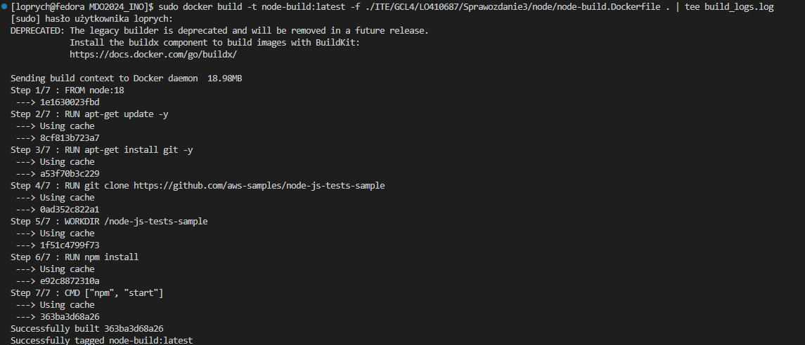
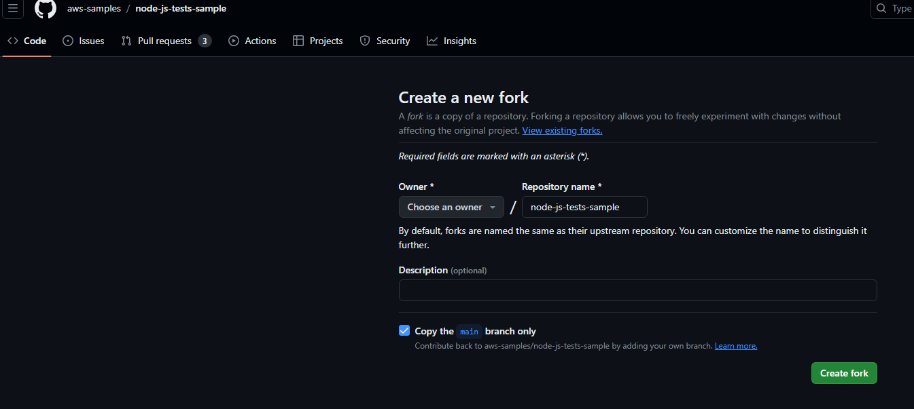
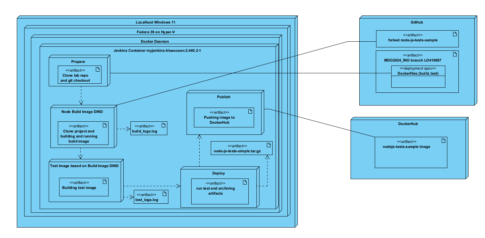

# Sprawozdanie 3
## Łukasz Oprych 410687 Informatyka Techniczna

## Lab 5-7

Celem następujących zajęć było zautomatyzowanie procesu budowania, testowania i wdrażania aplikacji na docelowej instancji Dockera poprzez użycie Jenkinsa.

Rozpoczynamy ćwiczenie od Uruchomienia obrazu Dockera i blueocean w celu konfiguracji Jenkinsa, dokładnie objaśnienie instalacji znajduje się w poprzednim sprawozdaniu.

Wynik wykonanych kroków powinien być następujacy:


### Uruchomienie
Kolejnym krokiem po pomyślnym zalogowaniu się do Jenkinsa było utworzenie podstawowych projektów, jednego, który zwróci uname, i drugi który zwróci błąd w przypadku godziny nieparzystej.

W tym celu w przechodzimy do opcji **Nowy projekt** gdzie tworzymy **ogólny projekt** i nazywamy go np. uname. 


Następnie w menu konfiguracji projektu przechodzimy do opcji środowisko do uruchomienia, dodajemy krok **Uruchom powłokę** i w oknie command wpisujemy polecenie `uname`, które pozwoli nam wyświetlić nazwę hosta.


Następnie wybrany projekt uruchamiamy opcją Uruchom, gdy projekt wykona się możemy zobaczyć logi konsoli, jak widać przy drugim podejściu wykonał się on udanie.


Logi z konsoli mówią nam, że uname to **Linux**


Kolejno tworzymy projekt zwracający błąd przy godzinie nie parzystej. Podobnie jak w przypadku **uname** tworzymy ogólny projekt, uruchamiamy powłoke, a następnie tworzymy skrypt, w tym przypadku Bashowy.

```bash
#!/bin/bash

hour=$(date +%H)

if [ $((hour % 2)) -eq 1 ]; then
    echo "Błąd: Godzina jest nieparzysta."
    exit 1
else
    echo "Godzina jest parzysta."
    exit 0
fi
```
Przykład wykonania zadania o godzinie 21:


Kolejnym zadaniem było uruchomić obrazy projektu poprzez projekt w Jenkins (w moim przypadku ze względu na zmianę wykorzystywanego projektu innego niż z poprzednich zajęć), które polega na sklonowaniu repozytorium, przełączeniu się na odpowiednią gałąź i zbudowaniu obrazów do budowania i testowania.

Wynik zbudowania obrazu lokalnie poniższym poleceniem z poziomu katalogu repo przedmiotowego:



Kroki tworzenia projektu:

Polecenia powłoki budujące obrazy:

Wynik buildera i testera:

**Builder**

**Tester**


### Tworzenie Pipeline'a

Aplikację, którą wybrano do wdrożenia jest prosty projekt [**Sample Game Unit Test Application**](https://github.com/aws-samples/node-js-tests-sample)  napisany w **Node.js** zawierający testy, posiada on otwartą licencję MIT-0 pozwalającą na operowanie kodem. Projekt wybrano ze względu na prostotę przedstawienia wykonania pipeline'u. 

Program zgodnie z widocznymi wcześniej krokami buduje się oraz przechodzi dołączone do niego testy.

Ze względu na mały brak w `package.json`, który sprawiał problem w wykonaniu kroku deploy, zdecydowałem się na fork własnej kopii repozytorium. W celu dokonania forka przechodzimy do repozytorium projektu, wybieramy w górnym lewym rogu opcję fork a następnie podajemy gdzie będzie znajdować się repozytorium oraz pod jaką nazwą.



Fork na moim profilu prezentuje się w następujący sposób:


Kolejnym krokiem było utworzenie diagramów UML aktywności i wdrożeń, w celu utworzenia diagramów wykorzystano Visual Paradigm.

**Diagram aktywności**


**Diagram wdrożeń**


### Pipeline stage prepare, build, test, deploy, publish

W pipelinie użyto 2 obrazów, jeden do budowania drugi do testowania aplikacji. Budowanie nastąpiło bezpośrednio w kontenerze CI, ze względu na prostotę rozwiązania, większą wydajność oraz zastosowanie ćwiczeniowe, które wydaje się nie wymagać bardzo wysokiego poziomu bezpieczeństwa.

**Obraz budujący node-build** -
Uzywa on LTS wersji node:18, która pozwala na wykonanie projektu, instaluje gita oraz klonuje sforkowane repozytorium i instaluje zależności.
```Dockerfile
FROM node:18
RUN apt-get update -y
RUN apt-get install git -y
RUN git clone https://github.com/loprych/node-js-tests-sample
WORKDIR /node-js-tests-sample
RUN npm install


CMD ["npm", "start"]
```

**Obraz testujący node-test** - Oparty o obraz node-build, pozwala wykonać testy.
```Dockerfile
FROM node-build
WORKDIR /node-js-tests-sample
RUN npm test
CMD ["npm", "start"]
```

Stage prepare:

```groovy
stage('Prepare') {
            steps {
                echo 'Preparing...'
                sh "rm -rf MDO2024_INO"
                sh "docker system prune --all --force"
                sh "git clone https://github.com/InzynieriaOprogramowaniaAGH/MDO2024_INO"
                sh "pwd"
                sh "ls -la"
                dir('MDO2024_INO'){
                    sh "git checkout LO410687"
                }
                
                sh 'touch build_logs.log'
                sh 'touch test_logs.log'
            }
        }
```
Część prepare była kombinacją kroków usuwania istniejącego repozytorium oraz wszystkich obrazów kontenerów, a także klonowania repozytorium z przełączeniem na własny branch. Dodatkowo utworzono pliki z logami, które zawierają informacje o etapach budowania i testowania.

Stage build:
```groovy
 stage('Build') {
            steps {
                echo 'Building...'
                dir('MDO2024_INO'){
                    sh 'ls -a'
                    sh 'docker build -t node-build:latest -f ./ITE/GCL4/LO410687/Sprawozdanie3/node/node-build.Dockerfile .| tee build_logs.log'
                    sh 'docker run --name node-build node-build:latest'
                }
            }
        }
```
Część build buduje obraz z Dockerfile, który znajduje się w podanej ścieżce oraz zapisuje utworzone logi do pliku.
Stage test:
```groovy
stage('Tests') {
            steps {
                echo 'Testing...'
                dir('MDO2024_INO'){
                    sh 'ls -la'
                    sh 'docker build -t node-test:latest -f ./ITE/GCL4/LO410687/Sprawozdanie3/node/node-test.Dockerfile . | tee test_logs.log'
                }
            }
        }
```
Część tests buduje obraz z Dockerfile, tym razem przeznaczonego do wykonywania testów, również znajdującego się w tym samym katalogu.
Stage deploy:
```groovy
 stage('Deploy') {
            steps {
                echo 'Cleaning and deploying...'
                dir('MDO2024_INO'){
                    sh 'ls -la'
                    sh 'docker rm node-build'
                    sh 'docker rm node-test'
                    archiveArtifacts artifacts: "build_logs.log"
                    archiveArtifacts artifacts: "test_logs.log"
                }
                script {
                    if(params.PROMOTE){
                        sh "mkdir ${params.VERSION}"
                        sh "cd ${params.VERSION}"
                        sh 'docker run --name node-test node-test:latest'
                    } else {
                        sh 'echo "Fail"'
                    }
                }
            }
        }
```
W części Deploy od samego początku czyszczone są utworzone wcześniej obrazy kontenerów oraz następuje eksportowanie logów. Tworzony jest również folder, który prezentuje konkretne wersje aplikacji, po czym nastepuje przechodzenie do tego folderu oraz uruchomienie konteneru z obrazem.
Stage publish:
```groovy
stage('Publish') {
            steps {
                echo 'Publishing...'
                script {
                    if(params.PROMOTE) {
                        sh 'echo "Pushing image to DockerHub"'
                        
                        sh "echo '${params.Password}' | docker login -u lukoprych --password-stdin"
                        
                        sh "docker tag node-test:latest lukoprych/node-js-tests-sample:${params.VERSION}"
                        
                        sh "docker push lukoprych/node-js-tests-sample:${params.VERSION}"
                        
                        sh 'docker rm node-test'
                        
                        sh "tar -czvf node-js-tests-sample-${params.VERSION}.tar.gz ${params.VERSION}/"
                        echo 'Creating artifact...'
                        archiveArtifacts artifacts: "node-js-tests-sample-${params.VERSION}.tar.gz"
                    } else {
                        echo 'Promote parameter is false. Skipping publishing to DockerHub.'
                    }
                }
            }
        }
```
Część publish została wdrożona po dokładnym sprawdzeniu, czy poprzednie etapy działają bez problemu. Artefakt zostaje utworzony i jest gotowy do pobrania, podczas gdy obraz kontenera wysyłany jest na DockerHub. Dzięki temu, upubliczniona zostaje paczka, która będzie łatwa do zainstalowania dla innych użytkowników. Aby zalogować się do DockerHuba wykorzytujemy hasło zamieszczone w parametrach, które zostanie pobrane przy uruchomieniu pipeline'a, aby nie musieć upubliczniać go w pliku. Etap publikacji kończymy usunięciem instancji dockera i zapakowaniu projektu w skompresowaną paczkę .tar.gz. Archiwum tar.gz jest formatem artefaktu, gdyż jest jednym z najprostszych sposobów na spakowanie projektu i przeniesienie go na inną maszynę.

Należało zwrócić uwagę na to, że dopiero gdy użytkownik wyrazi chęć publikowania projektu, wykonują się kroki etapu Deploy oraz Publish. Aby sprawnie móc kontrolować chęć publikacji, należało wprowadzić odpowiednio zdefiniowane parametry, które widnieją z samego początku pipeline'a:

```groovy
 parameters {
        booleanParam(
            name: "PROMOTE",
            defaultValue: false,
            description: "Czy chcesz wypromować artefakt?"
        )
        string(
            name: "VERSION",
            defaultValue: "",
            description: "Podaj numer wersji"
        )
        string(
            name: "Password",
            defaultValue: "123",
            description: "Podaj hasło"
        )
    }
```

**PROMOTE** określa czy występuje chęć publikacji, jeżeli tak, należy uzupełnić okno **VERSION**. **Password** pobiera hasło potrzebne do logowania na DockerHubie. Na Jenkinsie prezentuje się to następująco:


Na samym końcu pipeline'a zamieszczony jest fragment do wylogowania się z DockerHuba, wykonywany za każdym razem:

```groovy
   post {
        always {
            sh 'docker logout'
        }
    }
```
Następnie po skonfigurowaniu pipeline, mogliśmy go uruchomić opcją **Uruchom**, a następnie wybierając opcję **PROMOTE**, **numer wersji** oraz **Hasło**.


 Powyżej przedstawione etapy wykonały się prawidłowo, wynikiem działania jest utworzenie 3 artefaktów logi z builda, testowania oraz spakowana aplikacja w formacie tar.gz


Logi widoczne z konsoli:


Następnie po potwierdzeniu poprawności wykonania się pipeline'u, utworzono plik Jenkinsfile w katalogu przedmiotowym z treścią skopiowaną powyższych kroków. Aby wykonać pipeline przy użyciu tego pliku należało skonfigurować pipeline w poniższy sposob podając repozytorium, gałąź oraz lokalizację i nazwę pliku.


Jak widać pipeline oparty o Jenkinsfile również działa poprawnie.


Ostatecznym wynikiem pipeline było opublikowanie zwersjonowanego artefaktu na repozytorium w serwisie DockerHub:

