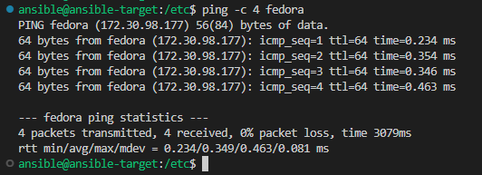

# Sprawozdanie 4
## Łukasz Oprych 410687 Informatyka Techniczna

## Lab 8-9

## Automatyzacja i zdalne wykonywanie poleceń za pomocą Ansible

Pierwszym krokiem w tym ćwiczeniu będzie utworzenie maszyny wirtualnej z systemem operacyjnym takim jak na maszynie z poprzednich zajęć. Będzie ona nam potrzebna do wykonania instrukcji podanych przez maszynę zarządczą z wykorszystaniem Ansible.

W tym celu przechodzimy do Menadżera Funkcji Hyper-V i wybrania opcji 

Nowa -> maszyna wirtualna 


Idziemy zgodnie z instalatorem krok po kroku, wybieramy UEFI Generacja 2, ilość pamięci RAM 2048MB i dysk VHD wedle uznania. Należy pamiętać aby w ustawieniach maszyny wyłączyć Secure Boot.


Następnie po uruchomieniu maszyny wirtualnej przechodzimy do instalatora i wykonujemy kolejne kroki instalacji systemu operacyjnego.


Podsumowanie instalacji:


Na maszynie zarządcy (będzie to maszyna z poprzednich zajęć) instalujemy `ansible` poleceniem:

```bash
sudo dnf install -y ansible
```
Na maszynie zarządzanej zapewniamy `tar` oraz serwer `ssh`, dokonujemy to poleceniami:

```bash
sudo dnf install tar
sudo dnf install openssh
```
Dodajemy użytkownika ansible, ustawiamy hasło i nadajemy mu odpowiednie uprawnienia:
```bash
sudo useradd ansible
sudo passwd ansible
sudo usermod -aG wheel ansible
```


Następnie w celu łatwej identyfikacji maszyny w sieci korzystamy z polecenia:

```bash
sudo hostnamectl set-hostname ansible-target'
```
Wynik możemy sprawdzić poleceniem 
```
hostname
```


Następnie wykonujemy migawkę z poziomu menadżera hyper-v opcją `Punkt kontrolny`


Kolejnym krokiem w celu komunikacji między maszynami przy użyciu protokołu **ssh**
utworzenie oraz wymienienie między maszynami kluczy SSH tak, by logowanie `ssh ansible@ansible-target` nie wymagało podania hasła.

Klucze ssh generujemy poleceniem 
```bash
ssh-keygen -t <typ-szyfrowania>
```
Wynik z maszyny zarządczej:


W celu prostej komunikacji między maszynami wprowadzamy nazwy DNS maszyn wirtualnych.

Przechodzimy do definicji DNS w katalogu `etc/hosts` w przypadku **Fedory**.
Dodajemy adres loopback, adres w sieci i hostname'y maszyn.


Weryfikacji poprawności wykonania możemy sprawdzić poleceniem `ping <hostname>`

 

Następnie poniższym poleceniem kopiujemy klucz między maszynami

```bash
ssh-copy-id -i ~/.ssh/id_<typ-szyfrowania>.pub/<username>@<hostname>
```


Jak widać logowanie działa:


## Inwentaryzacja

W celu dokonania definicji hostów zarządzanych przez ansible tworzymy w folderze ze sprawozdaniem plik inwentaryzacji w formacie `.yaml`

***inventory.yaml***
```yaml
all:
  children:
    Orchestrators:
      hosts:
        fedora:
          ansible_host: fedora
          ansible_user: loprych

    Endpoints:
      hosts:
        ansible-target:
          ansible_host: ansible-target
          ansible_user: ansible
```

