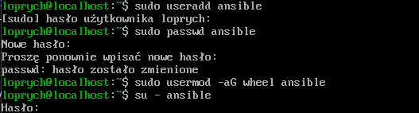
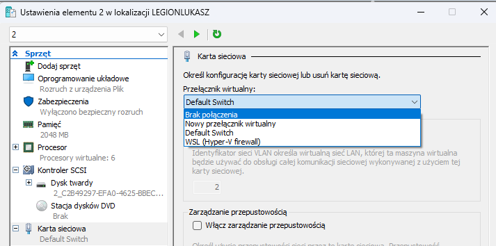
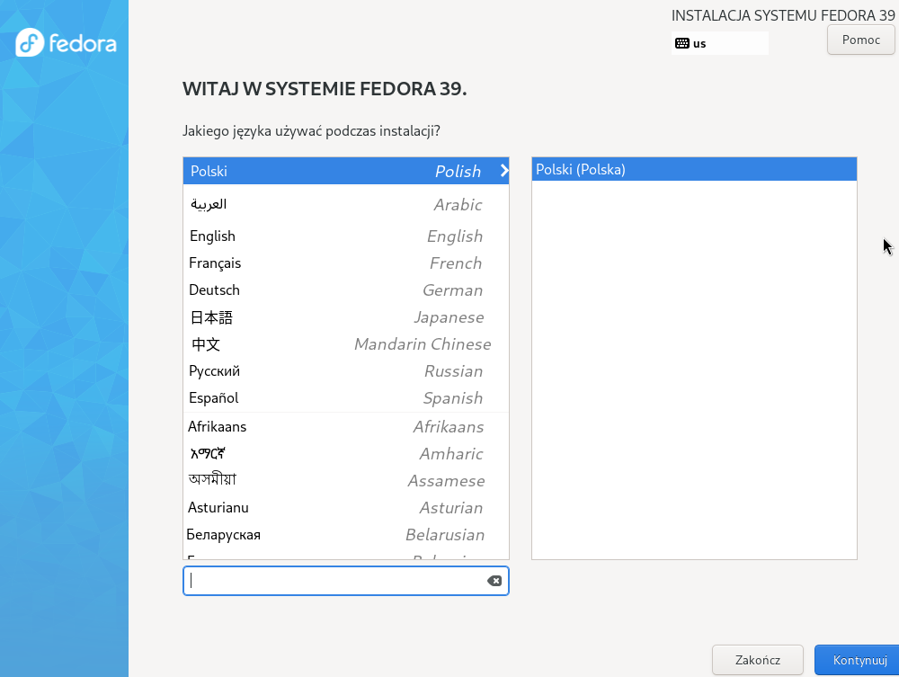

# Sprawozdanie 4
## Łukasz Oprych 410687 Informatyka Techniczna

## Lab 8-9

## Automatyzacja i zdalne wykonywanie poleceń za pomocą Ansible

Pierwszym krokiem w tym ćwiczeniu będzie utworzenie maszyny wirtualnej z systemem operacyjnym takim jak na maszynie z poprzednich zajęć. Będzie ona nam potrzebna do wykonania instrukcji podanych przez maszynę zarządczą z wykorszystaniem Ansible.

W tym celu przechodzimy do Menadżera Funkcji Hyper-V i wybrania opcji 

Nowa -> maszyna wirtualna 


Idziemy zgodnie z instalatorem krok po kroku, wybieramy UEFI Generacja 2, ilość pamięci RAM 2048MB i dysk VHD wedle uznania. Należy pamiętać aby w ustawieniach maszyny wyłączyć Secure Boot.


Następnie po uruchomieniu maszyny wirtualnej przechodzimy do instalatora i wykonujemy kolejne kroki instalacji systemu operacyjnego.


Podsumowanie instalacji:


Na maszynie zarządcy (będzie to maszyna z poprzednich zajęć) instalujemy `ansible` poleceniem:

```bash
sudo dnf install -y ansible
```
Na maszynie zarządzanej zapewniamy `tar` oraz serwer `ssh`, dokonujemy to poleceniami:

```bash
sudo dnf install tar
sudo dnf install openssh
```
Dodajemy użytkownika ansible, ustawiamy hasło i nadajemy mu odpowiednie uprawnienia:
```bash
sudo useradd ansible
sudo passwd ansible
sudo usermod -aG wheel ansible #przyda się między innymi do aktualizacji pakietów
```



Następnie w celu łatwej identyfikacji maszyny w sieci korzystamy z polecenia:

```bash
sudo hostnamectl set-hostname ansible-target'
```
Wynik możemy sprawdzić poleceniem 
```
hostname
```


Następnie wykonujemy migawkę z poziomu menadżera hyper-v opcją `Punkt kontrolny`


Kolejnym krokiem w celu komunikacji między maszynami przy użyciu protokołu **ssh**
utworzenie oraz wymienienie między maszynami kluczy SSH tak, by logowanie `ssh ansible@ansible-target` nie wymagało podania hasła.

Klucze ssh generujemy poleceniem 
```bash
ssh-keygen -t <typ-szyfrowania>
```
Wynik z maszyny zarządczej:


W celu prostej komunikacji między maszynami wprowadzamy nazwy DNS maszyn wirtualnych.

Przechodzimy do definicji DNS w katalogu `etc/hosts` w przypadku **Fedory**.
Dodajemy adres loopback, adres w sieci i hostname'y maszyn.


Weryfikacji poprawności wykonania możemy sprawdzić poleceniem `ping <hostname>`

 

Następnie poniższym poleceniem kopiujemy klucz między maszynami

```bash
ssh-copy-id -i ~/.ssh/id_<typ-szyfrowania>.pub/<username>@<hostname>
```


Jak widać logowanie działa:


## Inwentaryzacja

W celu dokonania definicji hostów zarządzanych przez ansible tworzymy w folderze ze sprawozdaniem plik inwentaryzacji w formacie `.yaml`

***inventory.yaml***
```yaml
all:
  children:
    Orchestrators:
      hosts:
        fedora:
          ansible_host: fedora
          ansible_user: loprych

    Endpoints:
      hosts:
        ansible-target:
          ansible_host: ansible-target
          ansible_user: ansible
```

Kolejnym krokiem było wykonanie ządania `ping` do wszystkich maszyn, w celu sprawdzenia łączności między maszynami oraz definicji pliku.

Dokonujemy tego za pomocą polecenia:

```bash 
ansible -i inventory.yaml all -m ping
```


Kolejnym poleceniem było skopiowane pliku inwentaryzacji na maszynę Endpointową oraz wykonanie ping na wszystkie hosty.

***pingall.yaml***
```yaml
- name: Copy inventory and ping all
  hosts: Endpoints
  remote_user: ansible

  tasks:
    - name: Copy inventory.yaml to ansible-target
      copy:
        src: /home/loprych/MDO2024_INO/ITE/GCL4/LO410687/Sprawozdanie4/inventory.yaml
        dest: /home/ansible/

    - name: Ping all hosts using the copied inventory file
      ansible.builtin.ping:
```

Takowy playbook uruchamiamy poleceniem:

```bash
ansible-playbook -i <inventory> <playbook>
```

Pierwsze wykonanie:


Drugie wykonanie:


Różnica w postaci changed=1 przy pierwszym wykonaniu mówi nam, że podczas zadania kopiowania pliku inventory.yaml na maszynę o nazwie ansible-target, faktycznie doszło do zmiany na tej maszynie w postaci pojawienia się pliku inventory.yaml na maszynie ansible-target.

Następnym poleceniem było dokonanie aktualizacji pakietów przy użyciu Ansible
Tworzymy poniższy playbook:
***update.yaml***
```yaml
- name: Update packages on target system
  hosts: Endpoints
  tasks:
    - name: Upgrade all packages
      ansible.builtin.dnf:
        name: "*"
        state: latest
      become: true
```

Następnie poleceniem z parametrem `--ask-become-pass`, który pozwala na wykonanie aktualizacji jako root po podaniu hasła, dzięki dodaniu w yamlu parametru `become: true`.

```bash
ansible -i <inventory> --ask-become-pass <playbook>
```
Jak widać jesteśmy pytani o hasło `BECOME password`:


Kolejnym poleceniem było zrestartowanie usługi `sshd` i `rngd`, które w przypadku systemu operacyjnego fedora nie występuje domyślnie.


Tworzymy poniższy playbook dokonujący restartu ssh

***restartsshd.yaml***
```yaml
- name: Restart ssh deamon
  hosts: Endpoints
  become: true
  tasks:
    - name: Use systemd to restart running sshd deamon
      systemd:
        name: sshd
        state: restarted
```

Następnie poniższym poleceniem dokonujemy restartu usługi `ssh` przy użyciu ansible:

```bash
 ansible-playbook -i inventory.yaml --ask-become-pass ./playbook/restartsshd.yaml
```


Kolejnym poleceniem było przeprowadzenie operacji względem maszyny z wyłączonym serwerem SSH, odpiętą kartą sieciową.

Zatem przechodzimy do menadżera zarządzanej przez ansible maszyny wirtualnej i odpinamy kartę sieciową wybierając przełącznik `brak połączenia`:



Następnie poniższym poleceniem zatrzymujemy usługę i sprawdzamy po tym jej status

```bash
systemctl stop sshd
systemctl status sshd
```

Widoczny wynik:


Następnie próbujemy wykonać ping przy użyciu playbooka

```bash
ansible-playbook -i inventory.yaml ./playbook/pingall.yaml
```

Wynik wykonania polecenia: 


## Zarządzanie kontenerem

Kolejnym krokiem było Uruchomienie kontenera sekcji `Deploy` z poprzednich zajęć przy użyciu playbooka.

Obraz node-js-tests-sample, który został zamieszczony na DockerHub.


W celu poprawnego wykonania ćwiczenia należało na maszynie zarządzanej zainstalować oraz uruchomić `Dockera`

```bash
dnf -y install Docker
systemctl start Docker
```
Następnie tworzymy playbooka umożliwiającego pobranie oraz uruchomienie kontenera z aplikacją

***node.yaml***
```yaml
- name: Deploy node
  hosts: Endpoints
  tasks:
    - name: Pull node-js-tests-sample image from DockerHub
      docker_image:
        name: lukoprych/node-js-tests-sample:1.0.12
        source: pull
    
    - name: Run node container
      docker_container:
        name: node
        image: lukoprych/node-js-tests-sample:1.0.12
        state: started
        interactive: yes
        tty: yes
```
 
 Jak widać zamieszczono dwa zadania pullujące obraz oraz uruchamiające kontener node w trybie interaktywnym.

 ```bash
ansible-playbook -i inventory.yaml playbooks/node.yaml
```

Wynik wykonania polecenia:


Jak widać stan maszyny został zmieniony ze względu na pobranie obrazu oraz uruchomienie kontenera.

Następnie poleceniami sprawdzamy istnienie obrazu oraz działanie kontenera:

```bash
sudo docker images
sudo docker ps
```
Jak widać obraz i kontener istnieją

 

Następnie powyższe kroki ubrano w rolę przy użyciu szkieletowania `ansible-galaxy`

W tym celu generujemy odpowiednią strukturę katalogową poleceniem

```bash
ansible-galaxy init deploy-irssi
```
Widoczna struktura katalogowa:


W `tasks/main.yml` tworzymy zadania zbliżone do `node.yaml`

***main.yml***
```yaml
---
- name: Deploy node container
  docker_image:
    name: "lukoprych/node-js-tests-sample:{{ VERSION }}"
    source: pull

- name: Run node container
  docker_container:
    name: node
    image: "lukoprych/node-js-tests-sample:{{ VERSION }}"
    state: started
    tty: yes
    interactive: yes
```

Zadany parametr jest uzupełniany dzięki uzupełniu `defaults/main.yml`

***main.yml***
```yaml
---
VERSION: 1.0.12
```
Następnie tworzymy playbooka, który wykonuje utworzone role

***node-deploy.yaml***
```yaml
- name: Deploy node using node-deploy role
  hosts: Endpoints
  roles:
    - role: node-deploy
      vars:
        VERSION: "1.0.12"
```

Playbooka wywołujemy poleceniem

```bash
ansible-playbook -i ../inventory.yaml ../playbook/node-deploy.yaml
```

Wynik, jak widać obraz był już wcześniej pobrany na maszynę i nie dokonała się w tym zadaniu żadna zmiana:


## Instalacja nadzorowana

Ćwiczenie zaczynamy od instalacji systemu operacyjnego Fedora 39 w sposób nadzorowany przy użyciu netinst, pozwoli to nam na ustawienie wszystkich potrzebnych parametrów do instalacji nienadzorowanej, która jest głównym celem naszego ćwiczenia.

Instalacje przeprowadzamy w sposób identyczny jak na początku sprawozdania.

Następnym krokiem było pobranie pliku odpowiedzi anaconda-ks.cfg

Wydobywamy go przy użyciu polecenia 

```bash
sudo cat /root/anaconda-ks.cfg 
```

Zdefiniowane zewnętrzne repozytoria nie są uwzględnione w plikach odpowiedzi, ponieważ nie są one konfigurowane przez użytkownika podczas instalacji. Zamiast tego, są one automatycznie wykrywane i dodawane. Pierwszą modyfikacją naszego pliku odpowiedzi będzie uwzględnienie lokalizacji serwerów lustrzanych repozytorium Fedora oraz aktualizacji.

```bash
url --mirrorlist=http://mirrors.fedoraproject.org/mirrorlist?repo=fedora-39&arch=x86_64
repo --name=update --mirrorlist=http://mirrors.fedoraproject.org/mirrorlist repo=updates-released-f39&arch=x86_64
```

W celu wyczyszczenia partycji dyskowych przed zainstalowaniem systemu zmieniamy parametr polecenia `clearpart` na 
```bash
clearpart --all
```

Prezentujący się plik anaconda-ks.cfg w następujący sposób zamieszczamy na repozytorium zajęciowym

```kickstart
# Generated by Anaconda 39.32.6
# Generated by pykickstart v3.48
#version=DEVEL
# Use graphical install
graphical

# Keyboard layouts
keyboard --vckeymap=pl --xlayouts='pl'
# System language
lang pl_PL.UTF-8

# Repository
url --mirrorlist=http://mirrors.fedoraproject.org/mirrorlist?repo=fedora-39&arch=x86_64
repo --name=update --mirrorlist=http://mirrors.fedoraproject.org/mirrorlist?repo=updates-released-f39&arch=x86_64

%packages
@^custom-environment

%end

# Run the Setup Agent on first boot
firstboot --enable

# Generated using Blivet version 3.8.1
ignoredisk --only-use=sda
autopart
# Partition clearing information
clearpart --all 

# System timezone
timezone Europe/Warsaw --utc

#Root password
rootpw --lock
user --groups=wheel --name=loprych --password=$y$j9T$kxp4/yalmVE/AJu..X5IN1ft$33sx5.jKWsTB4UGcYac2exC2.xTqHvEF4z5zps3dLq5 --iscrypted --gecos="loprych"

reboot
```
Tak prezentujący się plik zamieszczamy na repozytorium zajęciowym.

Następnie po tworzymy kolejną maszynę wirtualną (instrukcje identyczne jak wcześniej). Jednakże w menu grub wciskamy klawisz `e` i ukazuje nam się poniższy widok.


Uzupełniamy go o parametr, który pozwoli na zaciągnięcie naszego pliku kickstart z repozytorium.

```
inst.ks=https://raw.githubusercontent.com/InzynieriaOprogramowaniaAGH/MDO2024_INO/LO410687/ITE/GCL4/LO410687/Sprawozdanie4/anaconda-ks.cfg
```


Ukazuje nam się graficzne menu instalacyjne:



Następnie jak widać plik kickstart wykonał część instrukcji za nas, co uprzednio robiliśmy manualnie:


Pomyślnie kończymy instalacje:


Następnie po instalacji uzupełniamy plik kickstart o dodatkowe parametry zgodnie z dokumentacją. Dodajemy do packages moby-engine, który umożliwi uruchomienie aplikacji z obrazu DockerHubowego.

```kickstart
%packages
@^production-server
moby-engine

%end

```
Następnie uzupełniamy sekcję [%post](https://docs.fedoraproject.org/en-US/fedora/f36/install-guide/appendixes/Kickstart_Syntax_Reference/#sect-kickstart-postinstall), która w pliku konfiguracyjnym Kickstart pozwala na wykonywanie poleceń po zakończeniu instalacji systemu. Jest to miejsce, w którym można wprowadzić niestandardowe konfiguracje, instalować dodatkowe oprogramowanie, kopiować pliki konfiguracyjne czy wykonywać skrypty konfiguracyjne.
```

%post --erroronfail --log=/root/ks-post.log

cat << 'EOF' > /etc/systemd/system/node-docker.service

usermod -aG docker root
systemctl enable docker

[Unit]
Description=Download docker and run
Requires=docker.service
After=docker.service

[Service]
Type=oneshot
RemainAfterExit=yes
ExecStart=/usr/bin/docker pull lukoprych/node-js-tests-sample:1.0.12
ExecStart=/usr/bin/docker run -t --name node -e TERM=xterm lukoprych/node-js-tests-sample:1.0.12

[Install]
WantedBy=multi-user.target
EOF

systemctl daemon-reload
systemctl enable node-docker.service
systemctl start node-docker.service

%end
```
 Opcja `--erroronfail` oznacza, że jeśli któreś z poleceń w sekcji %post zakończy się niepowodzeniem (zwróci niezerowy kod wyjścia), instalator zakończy instalację z błędem. Opcja `--log=/root/ks-post.log` przekierowuje wszystkie wyniki działania poleceń z sekcji %post do pliku `/root/ks-post.log`, umożliwiając zapisanie logów dla ewentualnej analizy.

`[Unit]` definiuje metadane usługi, takie jak opis, zależności i kolejność uruchamiania.
`[Service]` określa, jak usługa powinna być uruchamiana, w tym polecenia wykonywane w celu pobrania i uruchomienia kontenera Docker.

Aby ćwiczenie wykonało się poprawnie, przy uruchamianiu kontenera, dodano parametry -t (tworzy terminal tty w kontenerze) -e (służy przekazaniu zmiennej środowiskowej TERM) oraz TERM=xterm (rodzaj używanego terminala).

```
ExecStart=/usr/bin/docker run -t --name node -e TERM=xterm lukoprych/node-js-tests-sample:1.0.12
```

`[Install]` informuje nas, gdzie usługa powinna być zainstalowana w systemie. W tym przypadku, usługa jest dodana jako wymagana do uruchomienia przy przejściu w tryb wielu użytkowników **multi-user.target**.

Po dodaniu pliku usługi **systemd**, następuje ponowne wczytanie konfiguracji **systemd** za pomocą `systemctl daemon-reload`.

Usługa `node-docker.service` jest ustawiona do automatycznego uruchamiania po każdym starcie systemu, korzystając z 
`systemctl enable node-docker.service`.

Po wykonaniu uzupełnień w instrukcji, restartujemy maszynę używaną do instalacji nienadzorowanej, wybieramy system operacyjny w trybie rescue i wybieramy opcję `Boot first drive`


Gdy system operacyjny uruchomi się wykonujemy polecenie,
```
systemctl status node-docker.service
```
 którym sprawdzamy stan uruchomionej aplikacji, którą zadaliśmy w pliku.

 Poleceniem potwierdzam istnienie obrazu, który miał się pobrać.
 ```
 sudo docker images
 ```

 Wynik:

 

Jak widać usługa node-docker.service działa.

Poniższym poleceniem wyświetlamy logi po wykonaniu sekcji post z pliku kickstart.
```
sudo cat /root/ks-post.cfg
```
Poleceniem `docker ps` ukazujemy istnienie takowego kontenera z aplikacją z poprzednich zajęć.

```
sudo docker ps -a
```
Wynik:

 