# Sprawozdanie 5
## Łukasz Oprych 410687 Informatyka Techniczna

## Lab 10-11

Celem danego ćwiczenia było wykorzystanie `Kubernetesa` we wdrażaniu kontenerów zarządzalnych.

### Instalacja kubernetesa

W tym celu zaopatrujemy się w implementację stosu k8s `minikube`.
Instalacja  została wykonana na podstawie [dokumentacji](https://minikube.sigs.k8s.io/docs/start/). 

Wymagania sprzętowe w celu prawidłowego działania to: dwurdzeniowy CPU, 2GB RAM oraz 20GB wolnej pamięci dyskowej.

Instalację wykonujemy na dystrybucji Fedora w architekturze x86-64, z typem instalatora RPM package.

Pobieramy paczkę przy użyciu `curl'a`:
```bash
curl -LO https://storage.googleapis.com/minikube/releases/latest/minikube-latest.x86_64.rpm
```
Instalujemy:
```bash
sudo rpm -Uvh minikube-latest.x86_64.rpm
```

Następnie uruchamiamy poleceniem:
```bash
minikube start
```

Efekt wykonanych poleceń:

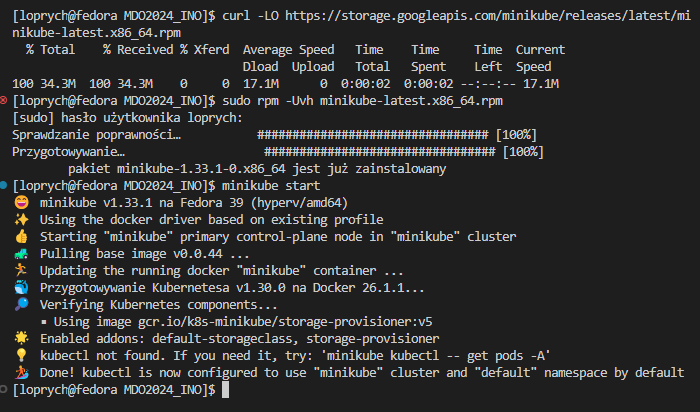

Następnie uruchamiamy dashboard, który w sposób graficzny pozwala na zarządzanie kontenerami oraz pozostałymi zasobami. 

```bash
minikube dashboard
```

Dashboard uruchomił się pod widocznym adresem.

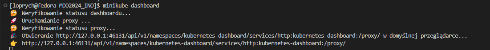


Z powodu ustawień przeglądarki, należało skopiować link i dostać się do dashboardu w przeglądarce. Port 46131 został automatycznie przekierowany przy użyciu `vsc`, więc bez problemu można było się dostać.

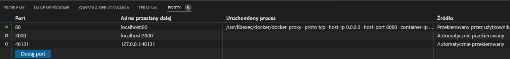

Dashboard prezentuje się następująco: 

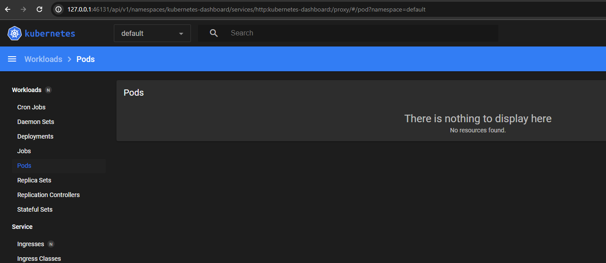

Dashboard pozwala nam m.in. zarządzać Podami kubernetesowymi w zakładce Pods

#### Pod
`Pod` jest najmniejszą jednostką w Kubernetes, którą można utworzyć, wdrożyć i zarządzać.
Każdy pod zawiera jeden lub więcej kontenerów, które są uruchamiane wspólnie na tym samym hoście i współdzielą zasoby takie jak sieć i system plików.
Pody mają własne IP, dzięki czemu aplikacje działające w różnych podach mogą się komunikować bezpośrednio, 

#### Deployment
`Deployment` zarządza replikami podów i zapewnia, że określona liczba podów jest zawsze uruchomiona.

W przypadku przerwania prac nad kontenerami w Kubernetes, aby nie doszło do zaburzenia prac w przyszłości zatrzymać `minikube` poleceniem:

```bash
minikube stop
```

Poniższym poleceniem sprawdzamy czy działa kontener kubernetesowy.
```bash
docker ps
```

Jak widać kontener minikube działa:

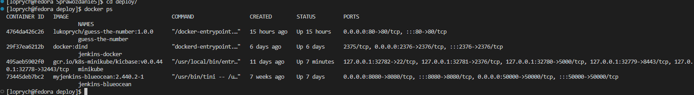


Następnie w celu sprawnego zarządzania zasobami, zainstalowano `kubectl`.

Pobieramy poleceniem:
```bash
kubectl get po -A
```

### Analiza posiadanego kontenera

Aplikacją użytą do opracowania ćwiczenia będzie bazująca na obrazie **nginx** z własną konfiguracją. Będzie to prosta gra do zgadywania wylosowanej liczby. Jest to aplikacja webowa, która działa nieprzerwanie po uruchomieniu kontenera.

Następnie musimy przygotować obraz naszej aplikacji przy użyciu
Dockerfile do zbudowania aplikacji.
Prezentuje się on następująco:
```Dockerfile
FROM nginx:1.26

COPY ./index.html /usr/share/nginx/html/index.html
```

Wybrano wersję 1.26, ponieważ jest to aktualnie najnowszą wersją **stable** i posiada wystarczającą konfigurację na wykonanie ćwiczenia. Następnie kopiowana jest nasza własna konfiguracja, którą utworzono w pliku `index.html`

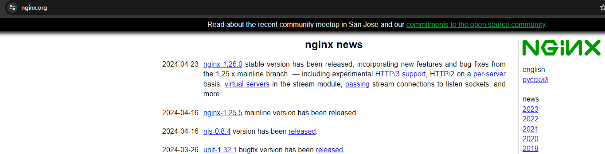

Następnie obraz znajdujący się w katalogu **deploy** repozytorium zajęciowego ze sprawozdaniem, buduję poleceniem:

```bash
docker build -t guess-the-number -f Dockerfile .
```

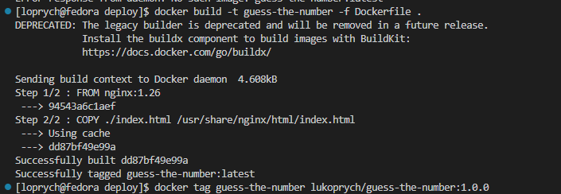

Aplikacja nie posiada napisanych testów, lecz można ją przetestować ręcznie, uruchamiając kontener i  sprawdzając czy liczba się losuje i zwracany jest wynik naszej próby odgadnięcia.

Uruchomienie kontenera (przykładowo na porcie 8000):
```bash
docker run -d --rm -p 8000:8000 --name guess-the-number guess-the-number
```

Potwierdzamy czy kontener działa nieprzerwanie poleceniem:
```bash
docker ps
```

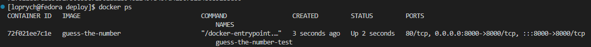

Test aplikacji:

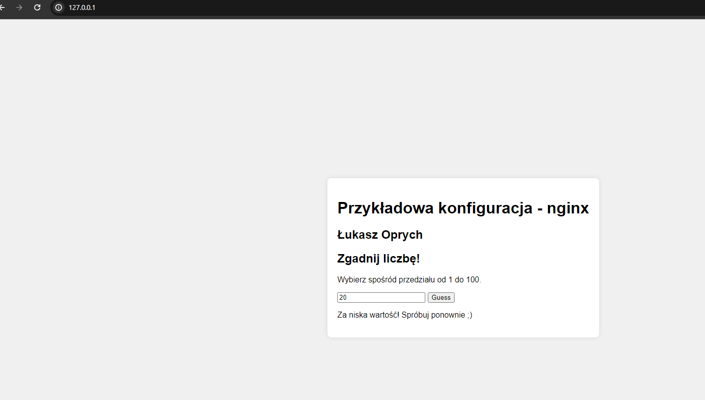

Następnie obraz zamieszczam na platformie **Dockerhub**.

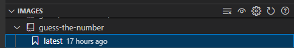

Loguję się z poziomu terminala poniższym poleceniem i podaję dane logowania:

```bash
docker login
```

Następnie taguję obraz, który będziemy pushować:
```bash
docker tag guess-the-number lukoprych/guess-the-number:1.0.0
```
Na koniec dokonujemy push obrazu:

```bash
docker push lukoprych/guess-the-number:1.0.0
```
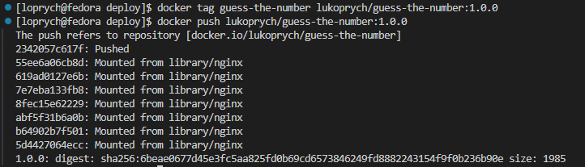

Jak widać poprawnie zamieszczono obraz na **Dockerhub**

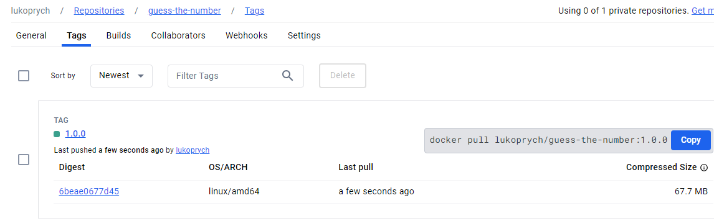

Następnie spróbujemy uruchomić kontener, ściągając obraz **Dockerhub**.

```bash
docker run -d --rm -p 80:80 --name guess-the-number lukoprych/guess-the-number:1.0.0
```

Jak widać kontener działa i nie zamyka się:

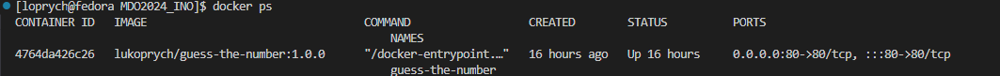

### Uruchomienie oprogramowania

Tę część ćwiczenie rozpoczynamy od uruchomienia kontenera na stosie **k8s**


Przed uruchomieniem kontenera sprawdzamy poleceniem, czy port na, którym chcemy uruchomić kontener jest wolny, w tym przypadku wybrano 80.

```bash
sudo netstat -tuln | grep :80 
```

Jeżeli nie wyświetli się nic przypisanego do portu 80, to znaczy, że port jest wolny

Jak widać port jest wolny, uzyskujemy jedynie informację o zajętym porcie 8080

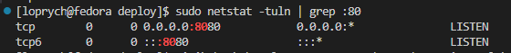

Następnie uruchmiamy kontener poleceniem, które wykorzystuje nasz obraz z **Dockerhub** oraz port 80:
```bash
minikube kubectl run -- guess-the-number --image=lukoprych/guess-the-number:1.0.0 --port=80 --labels app=guess-the-number
```

W celu ułatwienia korzystania z `kubectl` w środowisku **Minikube**, tworzymy alias `kubectl`, który przekierowuje wszystkie polecenia kubectl na pełne polecenie `minikube kubectl`. Dzięki temu, możemy używać standardowych poleceń `kubectl` do zarządzania lokalnym klastrem **Kubernetes** uruchomionym za pomocą **Minikube**

```bash
alias kubectl="minikube kubectl --"
``` 

Wystawiamy aplikację na zewnątrz klastra przy pomocy serwisu, który przekierowuje ruch do kontenera, umożliwiając dostęp do aplikacji z zewnątrz. Jest to przydatne, gdy chcemy udostępnić aplikację publicznie, na przykład do testów lub udostępnienia usługi klientom.

```bash
kubectl expose pod guess-the-number --port=80 --target-port=80 --name=guess-the-number
```
 
Jak widać nasz kontener uruchomiony w minikube został ubrany w pod.

via **dashboard**:

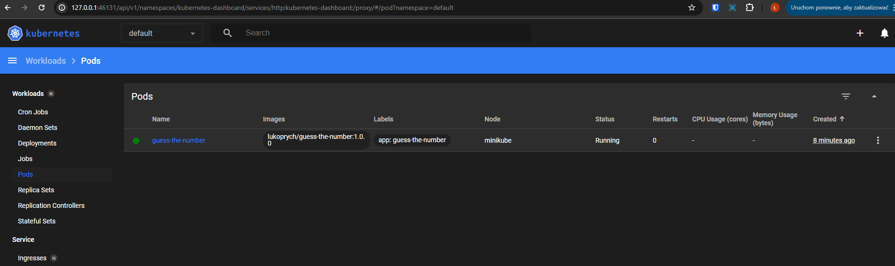

via **kubectl**:

Używamy polecenia:
```bash 
kubectl get all
```

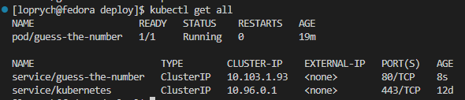


Aby uzyskać dostęp do eksponowanej aplikacji, użyjemy polecenia `kubectl port-forward` do przekierowania ruchu sieciowego z portu 3000 na naszym lokalnym komputerze do portu 80 wewnątrz kontenera o nazwie **guess-the-number**. Po przekierowaniu, możemy otworzyć przeglądarkę internetową i przejść pod adres `http://127.0.0.1:3000`, aby uzyskać dostęp do aplikacji.

Polecenie:
```bash
kubectl port-forward guess-the-number 3000:80
```

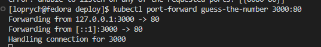

Należy też ręcznie przekierować port w `vsc`
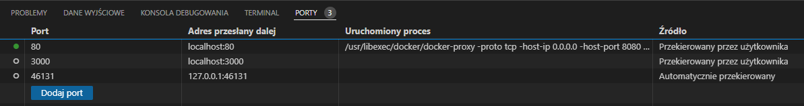

Jak widać aplikacja działa na porcie 3000

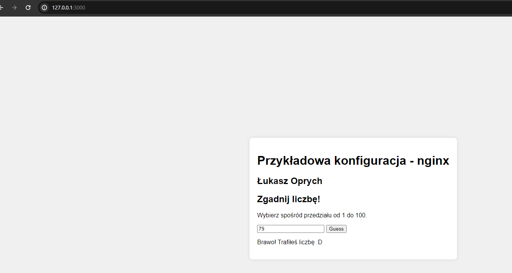


## Konwersja wdrożenia ręcznego na wdrożenie deklaratywne YAML

Powyższe kroki wdrożeniowe, które wykonano ręcznie, zostaną teraz wykonane za pomocą pliku YAML na podstawie [dokumentacji](https://kubernetes.io/docs/concepts/workloads/controllers/deployment/#creating-a-deployment), co pozwoli nam częściowo zautomatyzować wdrażanie.

W pliku określamy liczbę replik aplikacji na 4, wykorzystywany jest obraz wcześniej załączony na DockerHuba, działanie będzie odbywać się na porcie 80.

**guess-the-number-deployment.yaml**
```yaml
apiVersion: apps/v1
kind: Deployment
metadata:
  name: game-deploy
  labels:
    app: guess-the-number
spec:
  replicas: 4
  selector:
    matchLabels:
      app: guess-the-number
  template:
    metadata:
      labels:
        app: guess-the-number
    spec:
      containers:
      - name: guess-the-number
        image: lukoprych/guess-the-number:1.0.0
        ports:
        - containerPort: 80
```

Następnie wdrażamy plik znajdując się w tym samym katalogu, poleceniem: 
```bash 
kubectl -- apply -f ./guess-the-number-deployment.yaml
```

Poleceniem `get deployments` możemy sprawdzić stan naszego deploya.
```bash
kubectl get deployments
```

Status wdrażania w trakcie, można sprawdzić poleceniem:
```bash
kubectl rollout status deployments/game-deploy
```

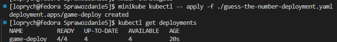 
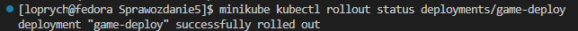

Wynik z dashboardu:

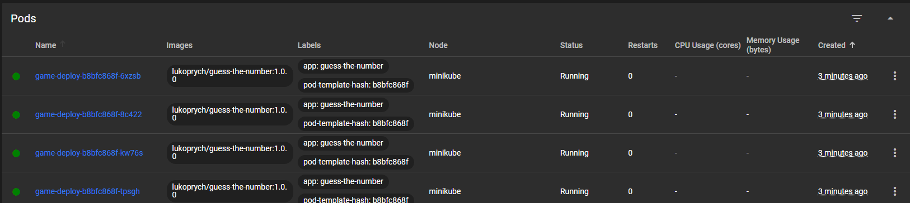

### Przygotowanie nowego obrazu

Do ćwiczenia wykorzystano ponownie obraz **nginx** z własną konfiguracją.
Zapewniono 2 nowe wersje obrazu, w których dodano modyfikację w postaci przedstawienia za pomocą paragrafu mówiącym o wersji oprogramowania, dodatkowo wersję z błędem, zamieszczając wywołanie programu false, który zawsze zwraca status zakończenia 1, czyli błąd.

Przykładowa zmiana
```html
    <div class="game">
        <h1>Przykładowa konfiguracja - nginx</h1>
        <p>Wersja 1.0.2</p>
        <h2>Łukasz Oprych</h2>
        <h2>Zgadnij liczbę!</h2>
        <p>Wybierz spośród przedziału od 1 do 100.</p>
        <input type="number" id="guess" placeholder="Wprowadź liczbę">
        <button onclick="checkGuess()">Guess</button>
        <p id="message"></p>
    </div>
```

Wersja z błędem
```
FROM nginx:1.26

COPY ./index.html /usr/share/nginx/html/index.html

CMD ["false"]
```

Następnie nowe wersje obrazów wdrażano ręcznie z użyciem **Dockera**

Zbudowanie obrazu
```bash
docker build -t guess-the-number .
```
Otagowanie obrazu
```bash
docker tag guess-the-number lukoprych/guess-the-number:<version>
```
Wypchnięcie obrazu na **Dockerhub**
```bash
docker push lukoprych/guess-the-number:<version>
```
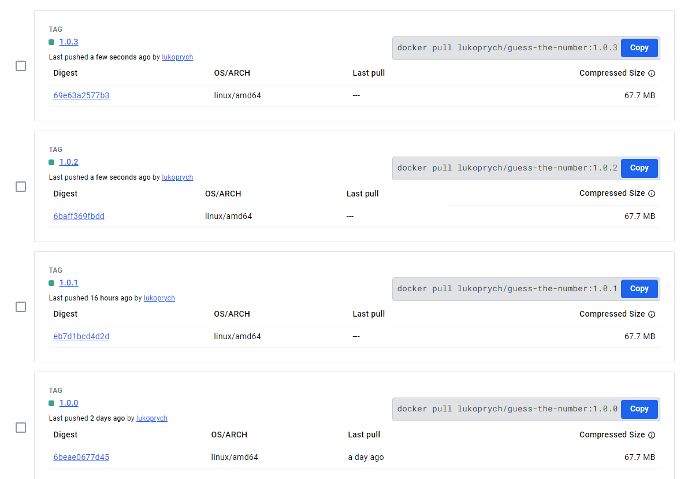

Wynik jednego ze zmienionych obrazów:

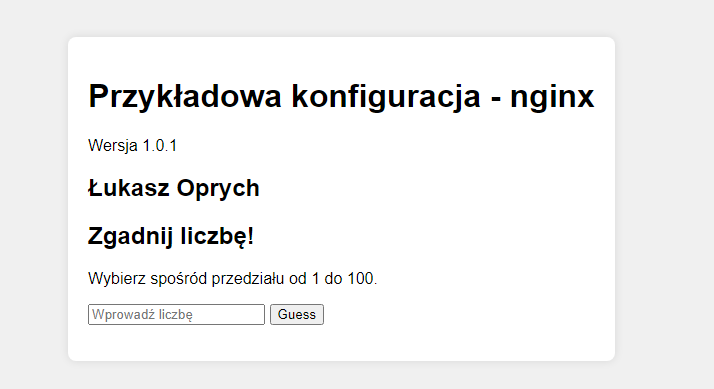

### Zmiany w deploymencie

Następnym krokiem w ćwiczeniu było zaaktualizowanie pliku YAML o następujące zmiany:
* zwiększenie replik np. do 8
* zmniejszenie liczby replik do 1
* zmniejszenie liczby replik do 0

Dla powyższych zmian wystarczyło w pliku deploymentowym zaaktualizować parametr ilości replik np do 8.:
```yaml
spec:
  replicas: 8
``` 
Następnie mogliśmy zaaplikować zmiany ponownie poleceniem `apply`

```bash 
kubectl -- apply -f ./guess-the-number-deployment.yaml
```
Wynik wprowadzenia 8 replik:
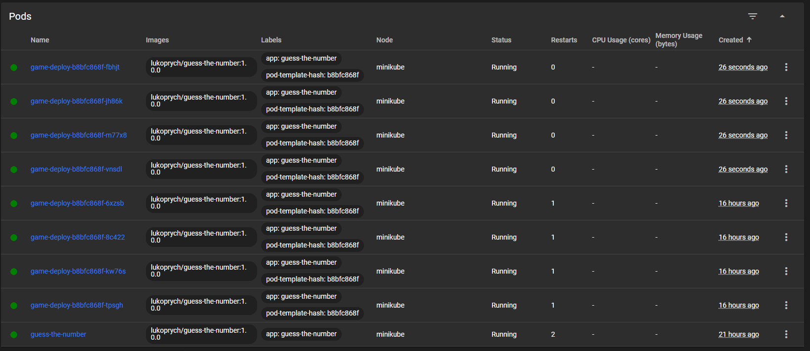
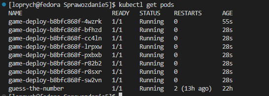

Zmniejszenie replik do 1:
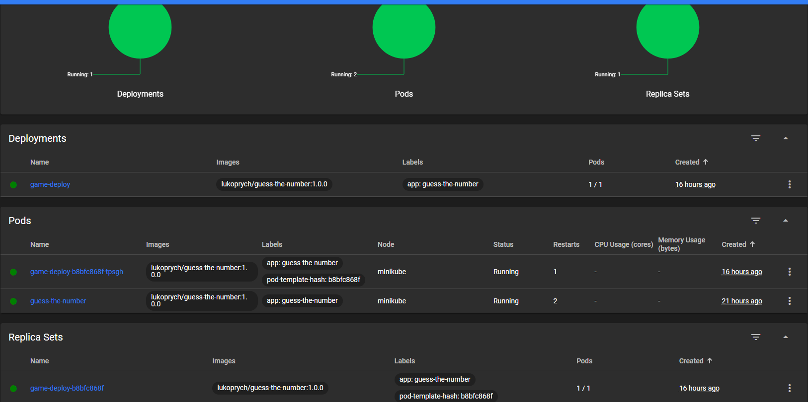
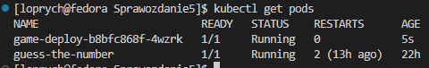

Zmniejszenie replik do 0:
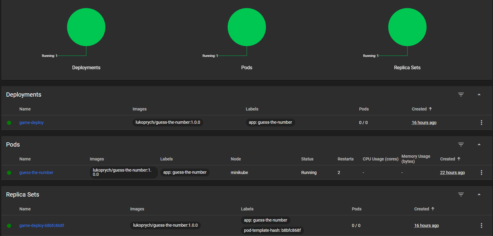
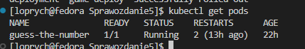

Ustawienie liczby replik na 0 skutkuje usunięciem wszystkich podów związanych z tym Deploymentem. Taka operacja jest często używana w różnych scenariuszach, takich jak:

Wyłączenie aplikacji: Tymczasowe wyłączenie aplikacji bez usuwania definicji Deploymentu. To może być przydatne w celach konserwacyjnych lub podczas aktualizacji aplikacji.

Oszczędność zasobów: Zatrzymanie aplikacji w celu oszczędności zasobów, np. w kwestii kosztów użycia chmury, bez konieczności usuwania całej konfiguracji.

* Zastosowanie nowej wersji obrazu

Zastosowanie nowej wersji obrazu wiąże się z modyfikacją parametru image w spec containers, w tym przypadku dokonujemy zmiany z 1.0.0 na 1.0.1. Następnie wykonujemy krok `apply`. W tym przypadku zastosowano 4 repliki.

```yaml
    spec:
      containers:
      - name: guess-the-number
        image: lukoprych/guess-the-number:1.0.1
        ports:
        - containerPort: 80
```
Wynik:

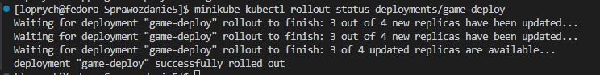

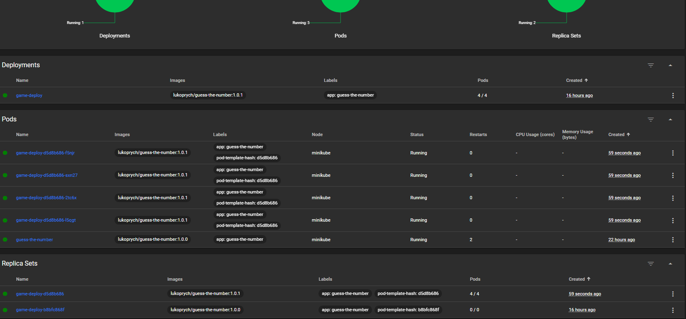


* Zastosowanie starszej wersji obrazu

Następnie dokonujemy w pliku deployment zmianę ponownie na starszą wersję 1.0.0

```yaml
    spec:
      containers:
      - name: guess-the-number
        image: lukoprych/guess-the-number:1.0.0
        ports:
        - containerPort: 80
```


Wynik `apply`

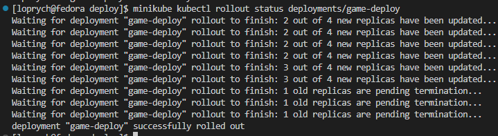

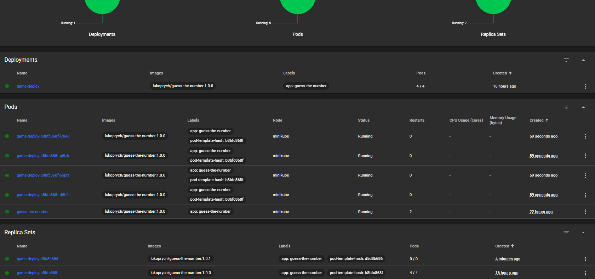


* Przywrócenie poprzednich wersje wdrożeń za pomocą poleceń
* ```kubectl rollout history```

```bash
kubectl rollout history deployment/guess-the-number
```
Polecenie to zwraca nam historię zmian deploymentu, wraz z powodem.

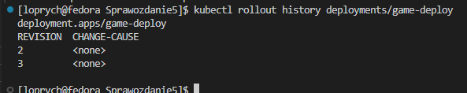

* ```kubectl rollout undo```
```bash
kubectl rollout undo deployment/guess-the-number
```
Polecenie to pozwala nam wrócić do poprzedniej rewizji deploymentu.

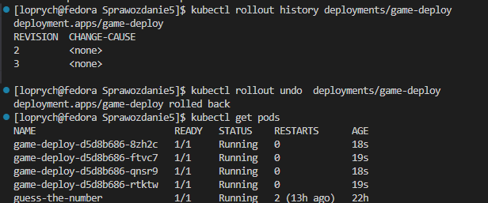

Dodatkowo w innym czasie przetestowano działanie obrazu z błędem:
Wprowadzenie wersji z błędem prezentuje się w następujący sposób (wersja obrazu 1.0.3)

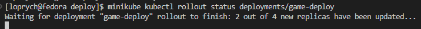
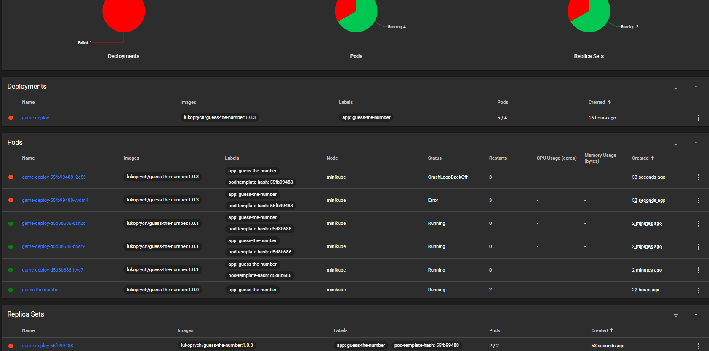

Kontener niestety się nie uruchomi, otrzymujemy błąd, k8s podejmuje ponowną próbę uruchomienia obrazu.


### Kontrola Wdrożenia

Następnym krokiem było napisanie skryptu weryfikującego czy wdrożenie wykonało się w 60 sekund.

**script.sh**
```bash
#!/bin/bash

DEPLOYMENT_NAME="game-deploy"
NAMESPACE="default" 
TIMEOUT=60
INTERVAL=5

end=$((SECONDS + TIMEOUT))

while [ $SECONDS -lt $end ]; do
    READY_REPLICAS=$(kubectl get deployment "$DEPLOYMENT_NAME" -n "$NAMESPACE" -o jsonpath='{.status.readyReplicas}')
    REPLICAS=$(kubectl get deployment "$DEPLOYMENT_NAME" -n "$NAMESPACE" -o jsonpath='{.status.replicas}')

    echo "Ready replicas: ${READY_REPLICAS}/${REPLICAS}"

    if [ "$READY_REPLICAS" == "$REPLICAS" ]; then
        echo "Deployment $DEPLOYMENT_NAME is successfully rolled out on time."
        exit 0
    fi

    sleep $INTERVAL
done

echo "Deployment $DEPLOYMENT_NAME did not roll out within ${TIMEOUT} seconds"
exit 1
```


Skrypt sprawdza, czy wdrożenie zakończyło się sukcesem w ciągu 60 sekund. Ustawia nazwę wdrożenia, namespace, czas oczekiwania (60 sekund) i interwał sprawdzania (5 sekund).
Oblicza czas zakończenia, dodając czas oczekiwania do bieżącego czasu.
W pętli co 5 sekund sprawdza status wdrożenia:
Pobiera liczbę gotowych replik oraz całkowitą liczbę replik.
Wyświetla informacje o liczbie gotowych i całkowitych replik.
Sprawdza, czy liczba gotowych replik jest równa całkowitej liczbie replik.
Jeśli tak, wyświetla komunikat o sukcesie i kończy działanie.
Jeśli czas oczekiwania minie, a wdrożenie nie jest gotowe, wyświetla komunikat o niepowodzeniu i kończy działanie.

Wynik:

Po wykonaniu apply w aktualnej wersji działającej:

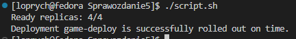

Po zastosowaniu zmian w pliku deployment:

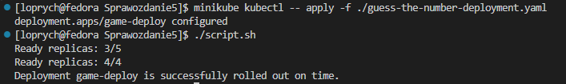

Wersja z błędem:

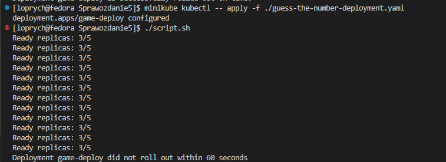

### Strategie wdrożenia
 
 Strategia **Recreate** to strategia domyślnie stosowana przy deploymencie. Polega na usunięciu wszystkich podów przed uruchomieniem nowych. Powoduje to krótką przerwę w dostępności aplikacji, ponieważ stare pody są usuwane zanim nowe zostaną uruchomione. Przydatne, gdy nowa wersja nie jest kompatybilna z poprzednią lub gdy chce się uniknąć konfliktów pomiędzy starymi i nowymi podami. Przykład został ukazany we wcześniejszym etapie ćwiczenia.


**rolling-update-deployment.yaml**
```yaml
apiVersion: apps/v1
kind: Deployment
metadata:
  name:  game-deploy-rolling-update
  labels:
    app: guess-the-number
spec:
  replicas: 4
  strategy: 
    type: RollingUpdate
    rollingUpdate:
      maxUnavailable: 2
      maxSurge: 25%
  selector:
    matchLabels:
      app: guess-the-number
  template:
    metadata:
      labels:
        app: guess-the-number
    spec:
      containers:
      - name: guess-the-number
        image: lukoprych/guess-the-number:1.0.2
        ports:
        - containerPort: 80
```

Strategia **Rolling Update** stopniowo zastępuje stare pody nowymi. Ustawienie parametru `maxUnavailable` na 2 oznacza, że maksymalnie dwa pody mogą być niedostępne podczas aktualizacji. Parametr maxSurge: 25% oznacza, że można uruchomić dodatkowe 25% podów ponad zadeklarowaną liczbę replik (czyli w przypadku czterech replik jest to jeden dodatkowy pod). Rolling update umożliwia ciągłe działanie aplikacji z minimalnymi przerwami w dostępności, ponieważ nowe pody są uruchamiane zanim stare zostaną usunięte. Zaobserwowane efekty obejmują płynne przejście pomiędzy wersjami, co jest widoczne na obrazku 

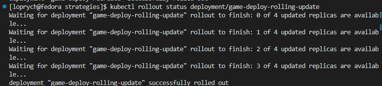

**canary-deployment.yaml**
```yaml
apiVersion: apps/v1
kind: Deployment
metadata:
  name: game-deploy-canary
  labels:
    app: guess-the-number
    track: canary
spec:
  replicas: 1
  selector:
    matchLabels:
      app: guess-the-number
      track: canary
  template:
    metadata:
      labels:
        app: guess-the-number
        track: canary
    spec:
      containers:
      - name: clock-nginx
        image: lukoprych/guess-the-number:1.0.2
        ports:
        - containerPort: 80
```

Strategia **Canary** wdraża nową wersję aplikacji na małej liczbie podów (w tym przypadku 1) przed pełnym wdrożeniem. 

```yaml
track: canary 
```
Powyższa etykieta służy do identyfikacji tych podów. 

Canary pozwala na testowanie nowej wersji w środowisku produkcyjnym na niewielkiej grupie użytkowników, zanim pełne wdrożenie zostanie wykonane. Jest to przydatne do wykrywania problemów przed wdrożeniem na większą skalę.

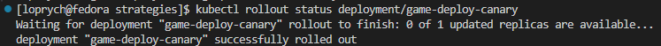


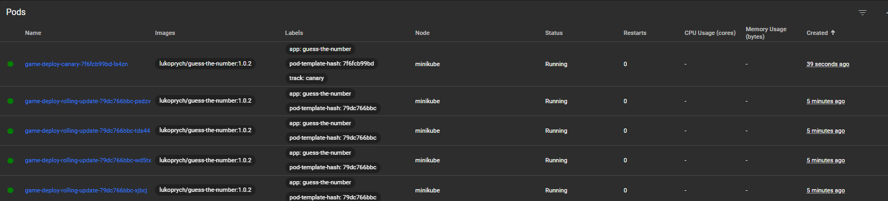

Podsumowując:
- Strategia Recreate jest najprostszą  strategią, ale podczas wdrożenia może wystąpić krótkotrwałe niedostępność aplikacji, ponieważ wszystkie repliki są zatrzymywane i usuwane jednocześnie.
- Strategia Rolling Update pozwala na płynne przejście z jednej wersji aplikacji na drugą, ponieważ aktualizacja odbywa się stopniowo replika po replice. Dzięki temu unika się długotrwałej niedostępności, a użytkownicy mogą korzystać z aplikacji podczas aktualizacji.
- Strategia Canary Deployment umożliwia wprowadzenie nowej wersji aplikacji dla części replik, co pozwala na wczesne testowanie i ocenę wpływu nowej wersji na wybraną grupę użytkowników. Pozwala to na zminimalizowanie ryzyka wprowadzenia błędnej wersji do produkcji.

### Użycie serwisów 

W Kubernetes, serwisy są kluczowym elementem, który pozwala na komunikację pomiędzy podami oraz na udostępnianie aplikacji na zewnątrz klastra. Serwis zapewnia, że ruch jest kierowany tylko do działających podów, co zwiększa niezawodność aplikacji. Może być on zaaplikowany wewnątrz deploymentu danej aplikacji, bądź w osobnym.

W tym przypadku utworzono osobny plik yaml, używający aplikacji z ćwiczenia. Serwis przekierowuje port 80 dostepny wewnatrz klastra na 80-ty port na podach, do którego serwis przekieruje ruch.

**services.yaml**
```yaml
apiVersion: v1
kind: Service
metadata:
  name: service
spec:
  selector:
    app: guess-the-number
  ports:
    - protocol: TCP
      port: 80
      targetPort: 80
```
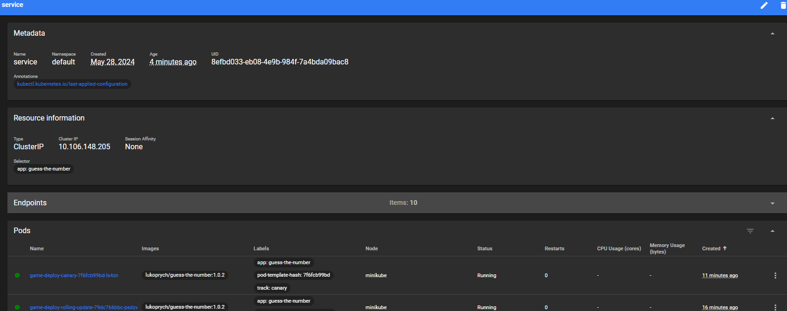

Następnie po wykonaniu `apply `możemy przekierować port lokalny na serwis poleceniem:

```bash
kubectl port-forward service/service 9090:80
```

Wynik: 

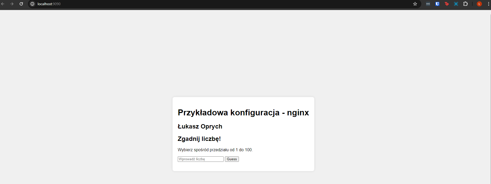


