# Zajęcia 01 - Wprowadzenie, Git, Gałęzie, SSH

---

## Sawina Łukasz - LS412597

### Wstęp

Zajęcia zostały wykonane przy wykorzystaniu Hyper-V do utworzenia wirtualnego systemu oraz systemu Fedora w wersji 39. Do komunikacji z maszyna wykorzystywane jest połączenie przy pomocy SSH oraz Visual Studio Code (VSC) jako edytor plików z rozszerzeniem `Remote Explorer`.

### 1. Zainstaluj klienta Git i obsługę kluczy SSH

Do zainstalowania git-a na maszynie wirtualnej musimy wykorzystać polecenie:

```bash
dnf install git
```

### 2. Sklonuj repozytorium przedmiotowe za pomocą HTTPS i personal access token

Aby utworzyć persona access token musimy przejść na GitHub do Setting > Developer settings > Personal access token > Tokens (classic).

Na tej stronie wypełniamy wszystkie opcje jakie ma posiadać nasz access token oraz jego okres ważności.

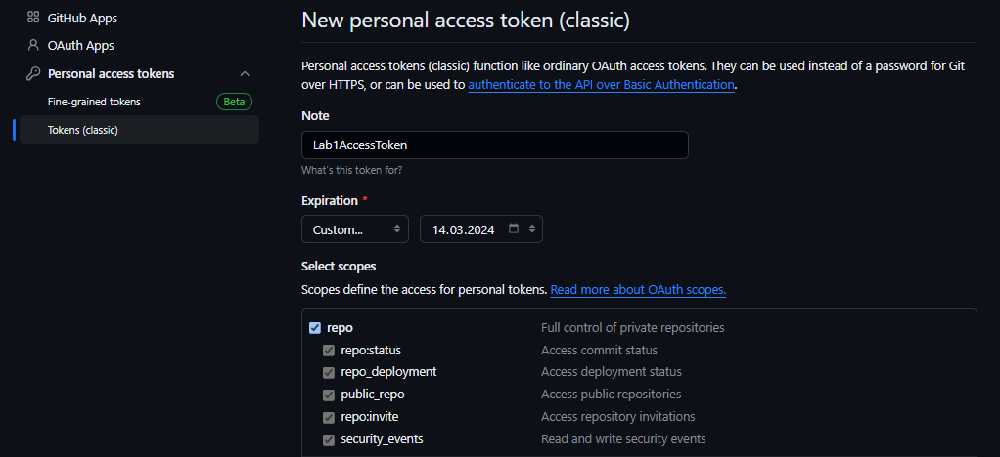

Nastepnie po utwozreniu personal access token zostaje on nam zaprezentowany na stronie. Ważne, aby go zapisać ponieważ nie będzie możliwości ponownego wglądu na niego.

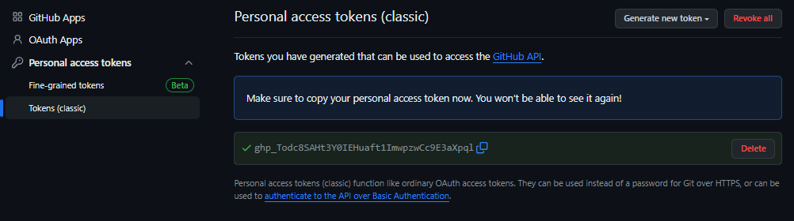

Po utworzeniu personal access token oraz zapisaniu go możemy sklonować repozytorium przedmiotowe przy pomocy polecenia:

```bash
git clone https://<username>:<token>@github.com/<ścieżka-repozytorium> <ścieżka-docelowa-repozytorium>
```

W miejsce `username` wstawiamy nazwę naszego użytkownika, a `token` skopiowany personal acces token.

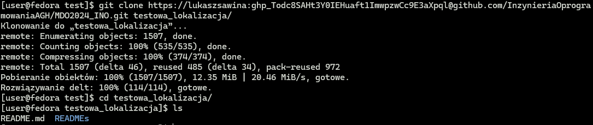
Jak widać powyżej repozytorium zostało sklonowane bez problemów.

### 3. Upewnij się w kwestii dostępu do repozytorium jako uczestnik i sklonuj je za pomocą utworzonego klucza SSH

Aby umożliwić klonowanie korzystanie z repozytorium przy pomocy GitHub potrzebujemy skonfigurować nasze klucze SSH, w tym celu najpierw musimy wygenerować parę kluczy (prywatny oraz publiczny). W tym celu wykorzystujemy polecenie:

```bash
ssh-keygen
```

> Aby wygenerowac klucze inne niż RSA możemy wykorzystać dodatkowe opcje polecenia ssh-keygen możemy dodać flagę `-t`, która określa algorytm do generowania klucza (przykładowo ed25519) oraz `-n`, która określa zabezpieczenie hasłem klucza prywatnego. Przykładowe wygenerowanie klucza z algorytmem ed25519 oraz zabezpieczone hasłem:
>
> ```bash
> ssh-keygen -t ed25519 -N 'haslo'
> ```

Po wykonaniu polecenia zostaniemy zapytani o miejsce w którym zapisać parę naszych kluczy, w tym przypadku zostawiamy domyślną, czyli `/home/user/.ssh`

> Jak widać na poniższym zdjęciu pojawia się informacja, że klucz już istnieje oraz czy go nadpisać, jest to spodowane tym, że wcześniej zostały już przeze mine wygenerowane. Przy pierwszym uruchomieniu ten komunikat się nie pojawi.

Następnie zostaniemy zapytani dwukrotnie o passphrase, które pozostawiamy puste.

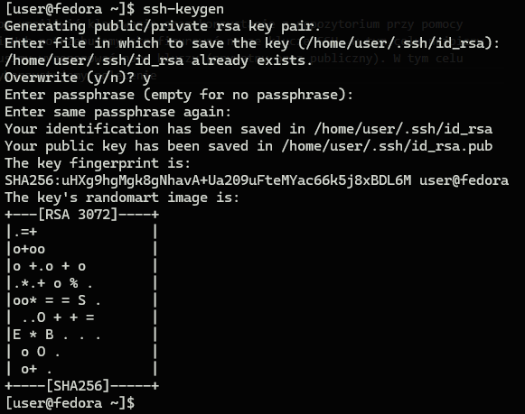

Po wszystkim klucz zostanie wygenerowany i będziemy mogli go znaleźć w ścieżce wspomnianej wyżej `/home/user/.ssh`

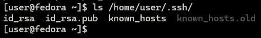

> Jak można zauważyć pojawiają się tam dwa ważne dla nas pliki id_rsa oraz id_rsa.pub. Bardzo ważne, aby zawartości pliku id_rsa oraz samego pliku nigdy nikomu nie udostępniać. Dla nas będzie ważny plik id_rsa.pub, ponieważ to w nim znajduje się klucz publiczny.

W następnej kolejności odczytujemy nasz PUBLICZNY klucz ssh, który znajduje się w pliku `id_rsa.pub`. Do odczytania jego zawartości możemy wykorzystać polecenie `cat`

```bash
cat /home/user/.ssh/id_rsa.pub
```

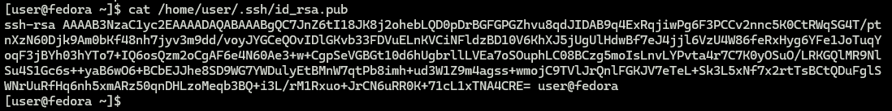

Jego zawartość kopiujemy i przechodzimy do naszego konta na github. W lokalizacji Settings > SSH and GPG keys wybieramy przycisk `New ssh key`, podajemy nazwę dla naszego klucza oraz skopiowany wcześniej klucz.

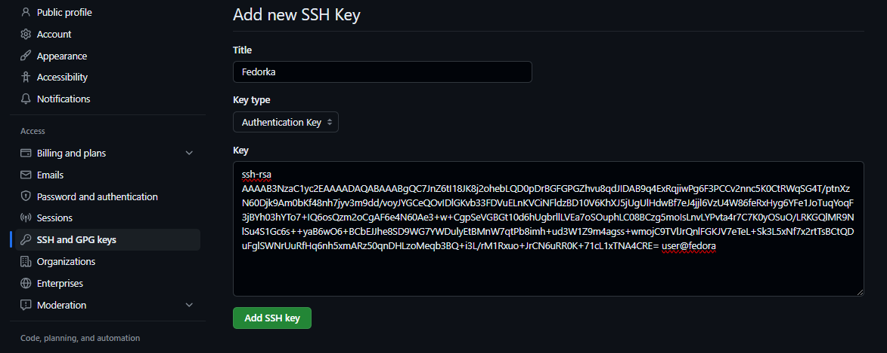

Po czym wciskamy przycisk `Add ssh key` i potwierdzamy tą operację podając hasło. Nasz klucz powinien się teraz znaleźć w liście wszystkich dodanych kluczy SSH do github.

W tym momencie dzięki dodaniu klucza SSH możemy sklonować repozyrotium przy pomocy SSH, wykonując polecenie:

```bash
git clone git@github.com:InzynieriaOprogramowaniaAGH/MDO2024_INO.git <ścieżka-docelowa-repozytorium>
```

### 4. Przełącz się na gałąź main, a potem na gałąź swojej grupy

Przy pomocy polecenia przechodzimy na gałąź grupy ćwiczeniowej:

```bash
git checkout GCL4
```

### 5. Utwórz gałąź o nazwie "inicjały & nr indeksu"

Następnie chcemy utworzyć nową gałąź "inicjały & nr indeksu", aby utworzyć nową gałąź do powyższego polecenia musimy dodać opcję `-b`. Polecenie będzie wyglądało następującą:

```bash
git checkout -b LS412597
```

> Ponieważ gałąź została przezemnie utworzona wcześniej, dlatego pokażę, że wszystkie gałęzie znajdują się na lokalnym repozytorium przy pomocy
>
> ```bash
> git branch
> ```
>
> 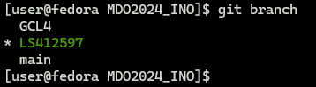

### 6. Rozpocznij pracę na nowej gałęzi

> Przed rozpoczęciem pracy na gałęzi wykorzystujemy program VisualStudio Code (VSC) z rozszerzeniem Remote Explorer do połączenia się z wirtaulną maszyną oraz pracy z plikami.

- W katalogu właściwym dla grupy utwórz nowy katalog, także o nazwie "inicjały & nr indeksu"

Przez wykorzystanie programu VSC czynnośc ta jest prosta, wystarczy utworzyć katalog z poziomu eksploratora plików.

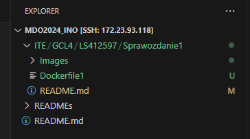

- Napisz Git hooka - skrypt weryfikujący, że każdy Twój "commit message" zaczyna się od "twoje inicjały & nr indexu".

Bazująć na przykładowych Git hookach znajdujących się w ścieżce `commit-msg.sample` .git/hooks/ tworzymy nowy plik. Do sprawdzania zawartości commit message wykorzystuję własny regex, który wymaga, aby wiadomość zaczynała się od `LS412597`.

```bash
#!/bin/bash

# Regex
regex="^LS412597.*"

# Pobieranie commit message
commit_msg=$(cat "$1")

# Sprawdzenie commit message
if [[ ! $commit_msg =~ $regex ]]; then
    echo "Błąd: Commit message nie zaczyna się od LS412597!"
    exit 1
fi
```

Jak widać na poniższym zdjęciu hook działa prawidłowo.

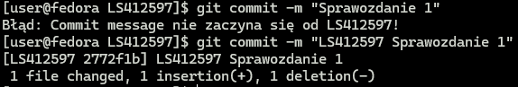

Teraz możemy nasz utwrzony plik przenieść do lokalizacji `.git/hooks/` przy pomocy polecenia:

```bash
cp commit-msg ~/MDO2024_INO/.git/hooks
```

> Ścieżka docelowa może się różnić, w zależności od tego gdzie zapisane jest repozytorium.

- Spróbuj wciągnąć swoją gałąź do gałęzi grupowej

Po przeniesieniu się na gałąź roboczą grupy przy pomocy polecenia:

```bash
git checkout GCL4
```

Możemy spróbować przenieść swoje zmiany na gałęzi do gałęzi roboczej przy pomocy polecenia:

```bash
git merge LS412597 -m "LS412597 merge"
```

> Do polecenia dodaję automatycznie message, ponieważ przy zrobieniu merga tworzony jest automatycznie commit, który wymaga podania commit messega

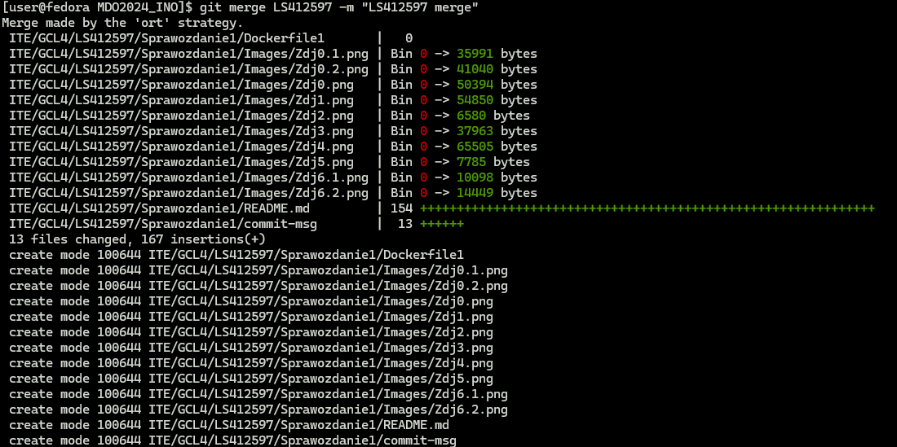

- Zaktualizuj sprawozdanie i wyślij aktualizację do zdalnego źródła

Przy pomocy polecenia:

```bash
git push
```

możemy wszystkie nasze zacommitowane zmiany przesłać do zdalnego źródła.

> Przed zrobieniem push'a warto sprawdzić czy wszystkie zmiany zostały zacommitowane, dokonać tego możemy przez polecenie:
>
> ```bash
> git status
> ```
>
> Jeśli jakieś zmiany nie zostały zcommitowane, musimy je dodać, a następnie zrobić commita:
>
> ```bash
> git add .
> git commit -m "<commit message>"
> ```
>
> Powyżesze kroki są wykonywane zawsze przed zrobieniem `git push`
>
> > Przy `git add` musimy podać jakie rzeczy powinno nam dodać, znajdując się w głównym katalogu repozytorium można użyc po prostu ., która doda wszystkie wprowadzone zmiany, można również określać konkretne pliki, które chcemy dodać przez wypisanie ich po spacji.
