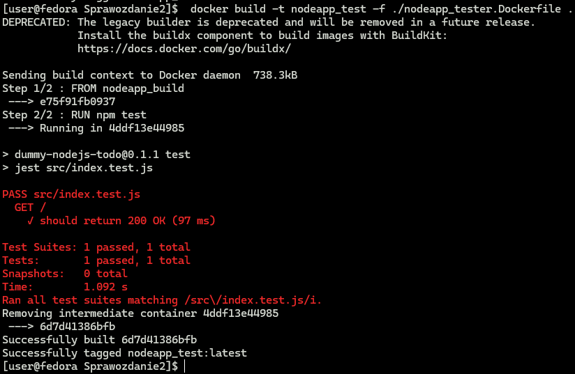

# Zajęcia 03 - Dockerfiles, kontener jako definicja etapu

---

## Sawina Łukasz - LS412597

### Wstęp

Zajęcia zostały wykonane przy wykorzystaniu Hyper-V do utworzenia wirtualnego systemu oraz systemu Fedora w wersji 39. Do komunikacji z maszyna wykorzystywane jest połączenie przy pomocy SSH oraz Visual Studio Code (VSC) jako edytor plików z rozszerzeniem `Remote Explorer`.
Do wykonania poniższych czynności wymagane jest wykonanie kroków ze sprawozdania nr. 1 (wymagany git oraz docker na maszynie)

### Wybór oprogramowania na zajęcia

Do wykonania tego zadania potrzebujemy aplikacji OpenSource, która będzie pozwalała na uruchomienie w repozytorium czegoś na kształt `make build` oraz `make test`. W tym celu wykorzystane zostaną dwa repozytoria:

- IRSI - link: https://github.com/irssi/irssi. Aplikacja ta pozwala na wcześniej wspomniane mechaniki, w tym przypadku jednak zamiast `make` wykorzystywane jest `ninja`,
- To Do Web App - link: https://github.com/devenes/node-js-dummy-test. Aplikacja jest napisana z wykorzystaniem Node.js dzięki czemu zamiast `make` możemy wykorzystywać polecenie `npm`.

Przed przystąpieniem do pracy z dockerem zapoznamy się z tymi dwoma aplikacjami lokalnie, na pierwszy rzut pójdzie To Do Web App.

- Do przygotowanego wczesniej katalogu testowego `~/test` klonujemy repozytorium.

  

- Ponieważ jest to aplikacja napisana z wykorzystaniem Node.js w takim celu musimy pobrać takową paczkę.
  Do tego wykorzystamy polecenie:

  ```bash
    sudo dnf install nodejs
  ```

  

- Teraz, gdy mamy potrzebne narzędzia do uruchomienia aplikajci przechodzimy do jej lokalizacji i przy pomocy polecenia `npm install` pobieramy wszystkie potrzebne zależności, to polecenie jest naszym odpowienikiem polecenia `make build`, którego poszukiwaliśmy w aplikacji.

  

- Po zainstalowaniu wszystkich zależności nie zostało nic innego jak uruchomienie testów przy pomocy `npm test` oraz uruchomienie aplikacji przy pomocy polecenia `npm start`.

  

> Jak widać w aplikacji znajduje się tylko jeden test i całe szczęście przechodzi bez zarzutów.


> Aplikacja została uruchomiona i dostaliśmy informację, że można się z nią połączyć pod adresem http://localhost:3000. Jednak otwarcie jej w przeglądarce poza wirtualną maszyną wymagałoby dodatkowej pracy, więc uznajemy, że aplikacja działa.

Po przetestowaniu uruchomienia pierwszej aplikacji, przyszła pora na drugą, trudniejszą do uruchomienia.

- Podobnie jak w poprzedniej apliakcji zaczynamy od sklonowania repozytorium

  

- Z repozytorium aplikacji możemy wyczytać, że do kompilacji wymagane jest wcześniejsze pobranie:

  - meson-0.53 build system with ninja-1.8 or greater
  - pkg-config (or compatible)
  - glib-2.32 or greater
  - openssl (for ssl support)
  - perl-5.8 or greater (for building, and optionally Perl scripts)
  - terminfo or ncurses (for text frontend)

  dlatego kolejnym krokiem będzie doinstalowanie wszystkich potrzebnych zależności. Kroku tego możemy dokonać w jednym poleceniu lub pobierać każdy z nich z osobna.

  ```bash
  sudo dnf -y install meson ninja* gcc glib2-devel utf8proc* ncurses* perl-Ext*
  ```

  > Ponieważ instalowane jest wiele rzeczy i pokazywanie całego wyniku instalacji mija się z sensem pomijam zrzut ekranu tego kroku.

- Po pobraniu wszystkich potrzebnych zależności możemy przejść do katalogu repozytorium i rozpocząć budowanie:

  ```bash
    cd irssi/
    meson Build
    cd Build/
    ninja
  ```

  
  
  

- Po zbudowaniu aplikacji przyszła pora na uruchomienie testów, w tym celu w lokalizajci `/irssa/Build` uruchomimy testy `ninja test`

  
  Jak widać wszystkie testy zakończyły się pozytywnie :)

### Przeprowadzenie buildu w kontenerze

### 1. Wykonaj kroki build i test wewnątrz wybranego kontenera bazowego

> Powyższy krok został wykonany nie w kontenerze a w systemie głównym dlatego pomijam ten punkt, wykonanie jest jednakowe, jedyna różnica, to miejsce w którym jest wykonywany.

## IRSSI

### 2. Stwórz dwa pliki Dockerfile automatyzujące kroki powyżej, z uwzględnieniem następujących kwestii:

- Kontener pierwszy ma przeprowadzać wszystkie kroki aż do builda.

W tym celu tworzymy nasz pierwszy plik DockerFile, dla ujednolicenia nazewnictwa nazwy plików będziemy poprzedać nazwą aplikacji. Tak oto tworzymy plik `irssi_builder.Dockerfile`

```Dockerfile
  FROM fedora:39
  RUN dnf -y update && dnf -y install git meson ninja* gcc glib2-devel utf8proc* ncurses* perl-Ext*
  RUN git clone https://github.com/irssi/irssi
  WORKDIR /irssi
  RUN meson Build
  RUN ninja -C /irssi/Build
```

Jak można zauważyć idą kolejno zawartością pliku:

> FROM: kontener opieramy na obrazie z systemem Fedora w wersji 39,

> RUN dnf: wykonujemy aktualizację pakietów systemowych i następnie instaluje zestaw narzędzi i bibliotek wymaganych do budowy oprogramowania, warto zauważyć, że dodatkowo pobieramy git'a ponieważ nie jest on domyślnie w systemie Fedora (przy testowym budowaniu i uruchamianiu aplikajci nie pobieraliśmy go, ponieważ już był zainstalowany na systemie),

> RUN git clone: klonujemy repozytorium Irssi z GitHuba

> WORKDIR: ustawiamy katalog roboczy na `/irssi`,

> RUN meson Build: wykonujemy komendę meson w do skonfigurowania budowy Irssi,

> RUN ninja: uruchamiamy komendę ninja w celu wykonania faktycznej budowy Irssi.

- Kontener drugi ma bazować na pierwszym i wykonywać testy

Tworzymy kolejny plik Dockerfile, tym razem będzie to plik do tworzenia obrazu z uruchomionymi testami:

```Dockerfile
  FROM irssi_build
  WORKDIR /irssi/Build
  RUN ninja test
```

> WAŻNE przy twozreniu orbazu z pierwszego dockerfila musimy ustawić nazwę obrazu taką jak w tym pliku, lub ewentualnie zmienić ją w tym pliku.

Idąc kolejno zawartością pliku:

> FROM irssi-buil: obraz bedziemy opierali na obrazie utworzonym przez poprzedni dockerfile.

> WORKDIR: ustawiamy katalog roboczy na `/irssi/Build`

> RUN ninja test: uruchamiamy testy.

### 3. Wykaż, że kontener wdraża się i pracuje poprawnie.

Do zbudowania naszych dockerfilów użyjemy polecenia:

```bash
 docker build -t <nazwa_obrazu> -f ./<nazwa_pliku+Dockerfile> .
```

Zaczniemy od zbudowania obrazu `Irssi_build`, w tym celu wykonamy polecenie

```bash
 docker build -t irssi_build -f ./irssi_builder.Dockerfile .
```


Jak widać nasz obraz został zbudowany. Obecnie w tym obrazie znajduje się system Fedora z pobranymi pewnymi zewnętrznymi narzędziami i zbudowaną aplikacją. Nic więcej się w niej nie znajduje. Przy próbie uruchomienia naszego obrazu nie dostaniemy żadnego wyniku, ponieważ kontener będzie oczekiwał na polecenie do wykonania i od razu go wyłączy, ponieważ żadne polecenie nie zostanie przekazane.


Po zbudowaniu obrazu `Irssi_build` możemy zbudować nasz Dockerfile zawierający uruchomienie testów, nazwiemy go `irssi_test`:

```bash
 docker build -t irssi_test -f ./irssi_tester.Dockerfile .
```


Jak widać nasz obraz został zbudowany, a w trakcie budowania zostały wykonane testy. Tutaj podobnie, gdybyśmy chcieli uruchomić nasz obraz nie dostaniemy żadnego wyniku.

## TO DO WEB APP

### 2. Stwórz dwa pliki Dockerfile

- Dla tej aplikacji powtórzymy wcześniejsze kroki, zaczniemy od utworzenia dockerfila dla budowania aplikacji. W tym celu możemy wykorzystać już istniejący obraz `Node`, który na szczęście posiada w sobie wszystkie niezbędzne narzędzia do zbudowania naszej aplikacji, nawet posiada w sobie narzędzie git. Tworzymy plik `nodeapp_builder.Dockerfile`

```Dockerfile
FROM node
RUN git clone https://github.com/devenes/node-js-dummy-test.git
WORKDIR /node-js-dummy-test
RUN npm install
```

nasz plik wygląda podobnie jak w przypadku poprzedniej aplikacji. Obraz opieramy na obrazie `Node`, klonujemy repozytorium, zmieniamy katalog roboczy, instalujemy wszystkie zależności.

Następnie tworzomy dockerfila dla testów, będziemy go opierali o wcześniej utworzony obraz i wykonamy w nim polecenie `npm test`.

```Dockerfile
FROM nodeapp_build
RUN npm test
```

### 3. Wykaż, że kontener wdraża się i pracuje poprawnie.

Tutaj identycznie jak wcześniej będziemy budowac nasze pliki dockerfile.

Zaczniemy od pliku `nodeapp_builder.Dockerfile`

```bash
 docker build -t nodeapp_build -f ./nodeapp_builder.Dockerfile .
```


Po zbudowaniu obrazu ze zbudowaną aplikacją możemy zbudować nasz obraz z testami.

```bash
 docker build -t nodeapp_test -f ./nodeapp_tester.Dockerfile .
```



Dla obu tych obrazów próba uruchomienia ich nie da żadnego efektu, ponieważ nie podaliśmy żadnej komendy, którą nasz obraz ma wykonać.
