# Zajęcia 03 - Jenkins pipeline

---

## Sawina Łukasz - LS412597

### Wybrana aplikacja

Jako aplikację dla której zostanie przygotowany pipeline wybrałem aplikację napisaną w Node.js. Jest to aplikacja 'TakeNote', która pozwala użytkownikowi na tworzenei notatek.

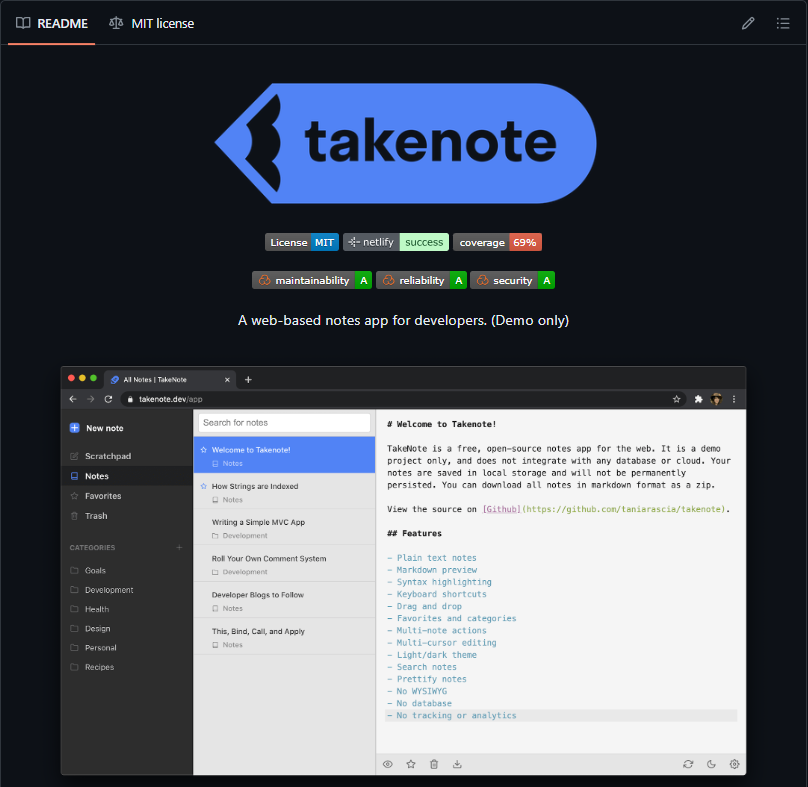

Repozytorium posiada licenję MIT, która bez problemu pozwoli nam na pracowanie z tym programem, ponieważ jest to popularna licencja open-source.
Celowo wybrałem tą aplikację, ponieważ jest to bardziej rozbudowany projekt posiadający całkiem sporo zależności oraz większą ilość testów.

### Dockerfile

W pierwszej kolejności chcemy przygotować sobie nasze podstawowe pliki dockerfile, które będą odpowiedzialne za: budowanie, testowanie oraz deploy.

#### Budowanie

Kod aplikacji został napisany kilka lat temu, dlatego do zbudowania wymagana jest odpowiednia wersja node.js, w tym przypadku v12.

Aby zbudować nasz obraz z aplikacją tworzymy następujący dockerfile:

```Dockerfile
FROM node:12-alpine

RUN apk update && \
    apk add --no-cache git && \
    git clone https://github.com/taniarascia/takenote.git  && \
    apk del git
WORKDIR /takenote
# Make sure dependencies exist for Webpack loaders
RUN apk add --no-cache \
    autoconf \
    automake \
    bash \
    g++ \
    libc6-compat \
    libjpeg-turbo-dev \
    libpng-dev \
    make \
    nasm
RUN npm install
```

Jak widać obraz tworzymy na podstawie node:12-alpine, jest to celowo wybrana wersja odchudzonego node, ponieważ chcemy aby nasz obraz był jak najmniejszy objętościowo oraz nie zawierał niepotrzebnych dodatków.
Ponieważ nasz kod musimy pobrać z repozytorium musimy zainstalować git'a, przy pomocy którego zrobimy klonowanie, po sklonowaniu git już nam nie będzie potrzebny, dlatego możemy się go pozbyć, aby nie zajmował dodatkowego miejsca.

Czasami może się zdażyć, że nasz obraz nie zostanie zbudowany przez brak zależności, które są potrzebne dla webpacka, w tym celu upewniamy się, że wszystkie są zainstalowane na naszym obrazie

Możemy sprawdzić powodzenie budowania naszego obrazu przez zbudowanie obrazu lokalnie.

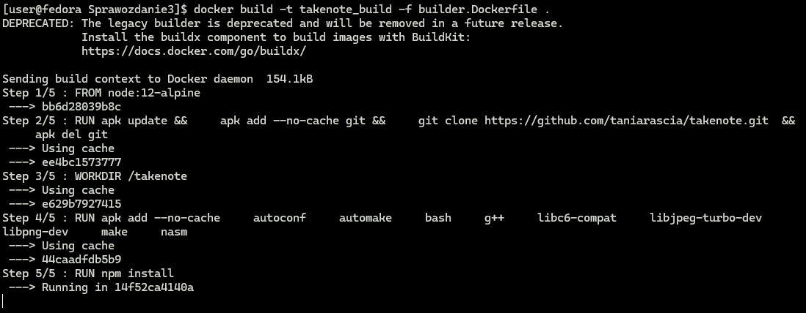
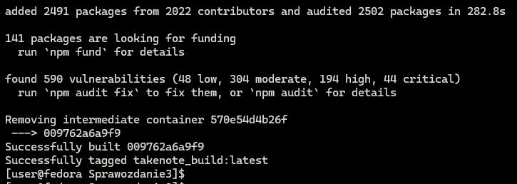

#### Testowanie

Kiedy mamy już gotowy obraz ze zbudowaną aplikacją możemy przygotować obraz do testowania aplikacji, w tym celu tworzymy kolejny dockerfile z zawartością:

```Dockerfile
FROM takenote_build

RUN npm test
```

Obraz bazuje na podstawie wcześniej zbudowanego obrazu z naszą aplikacją, nastęnie przy pomocy npm test uruchamiamy testy w naszej aplikacji.

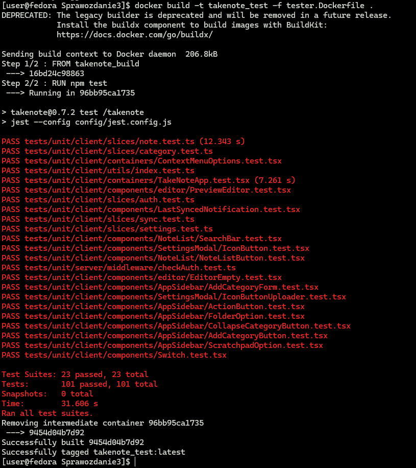

#### Deploy

Jak nasza aplikacja jest już zbudowana oraz wszystkie testy przeszły pomyślnie pora na przygotowanie obrazu do deployu.

```Dockerfile
FROM takenote_build

WORKDIR /takenote
RUN npm run build

EXPOSE 5000

ENTRYPOINT npm run prod
```

Ponownie nasz obraz bazuje na obrazie ze zbudowaną aplikacją. W aplikacji został przygotowany skrypt o nazwie prod, który odpowiada za uruchomienie aplikacji po zbudowaniu, odpowiednik `npm start`. Wymaga to wcześniejszego zbudowania aplikacji przy pomocy `npm run build`, dodatkowo ujawniamy port 5000, ponieważ na takim porcie nasłuchuje nasza aplikacja.

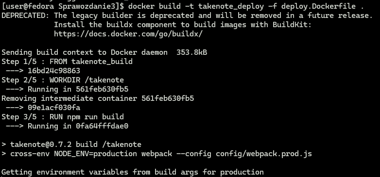
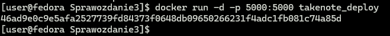
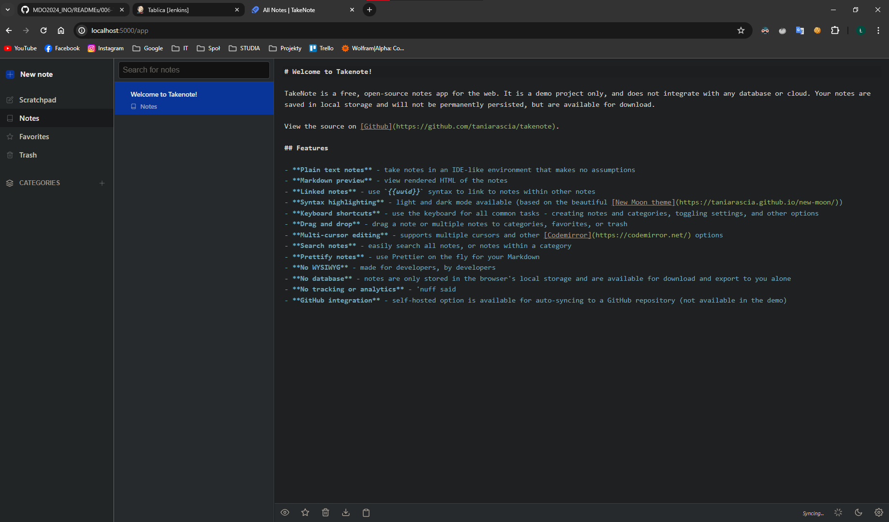

Jak widać nasz obraz deployowy został zbudowany, ujawniliśmy port 5000 oraz sprawdziliśmy w przeglądarce, czy nasza aplikacja na pewno działa.

Teraz, gdy mamy wszystkie potrzebne pliki dockerfile, możemy przejść do konstrukcji pipelina wdrożeniowego.

### Koncepcja pipelinu

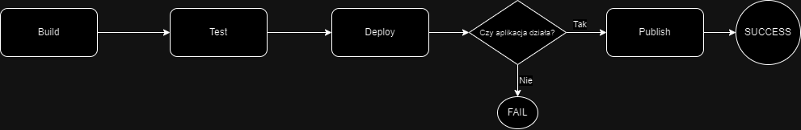

Powyższy diagram UML przedstawia zamysł tworzonego pipelinu, całość składa się z kilku etapów: build, test, deploy, test deploy, publish.
Pipeline będzie uruchamiany ręcznie oraz jako wersjonowanie wykorzystany będzie input, w którym wprowadzamy ręcznie numer wersji jakim zostanie otagowany obraz, dodatkowo przed rozpoczęciem budowania numer wersji zostanie zwalidowany, czy nie istnieje już taki numer. Dodatkowo przy uruchomieniu pipelinu będzie możliwość ustawienia danej wersji jako `Latest` przez checkbox pod polem na wersję aplikacji.

Dzięki budowie pipelinu w sytuacji, gdy któryś z etapów nie zostanie prawidłowo wykonany proces zostanie przerwany, dzięki czemu tylko przy sprawdzaniu numeru wersji oraz smoke testu aplikacji będziemy musieli zadbać o przerwanie.

Na koniec po całym procesie wszystkie utworzone obrazy zostaną wyczyszczone, aby nie zaśmiecać kontenera DIND.

Jako wynik końcowy pipeline będzie udostępniał na dockerhub obraz zdeployowanej aplikacji, dzięki czemu, gdy będziemy chcieli uruchomić naszą aplikację wystarczy jedynie pobrać z dockerhub odpowiedni obraz oraz uruchomić kontener, aplikacja już jest uruchomiona na tym obrazie.

### Tworzenie pipelinu

Na początek musimy zalogować się na jenkins i utworzyć nowy pipeline przez wybranie `+ Nowy projekt`, podajemy nazwę naszego pipelinu oraz wybieramy `Pipeline` i akceptujemy wszystko przyciskiem `OK`.

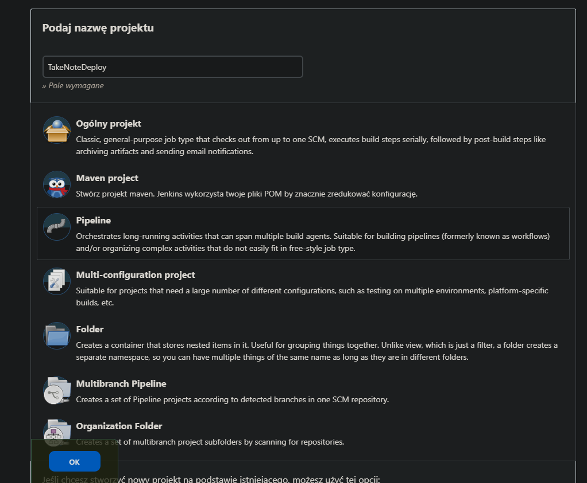

Następnie w konfiguracji pipelinu dodajemy krótki opis, zaznaczamy opcję `To zadanie jest sparametryzowane` i dodajemy dwie zmienne: "Tekst" o nazwie VERSION (z domyślną wartością i krótkim opisem) oraz "Wartość logiczna" o nazwie LATEST (z krótkim opisem).

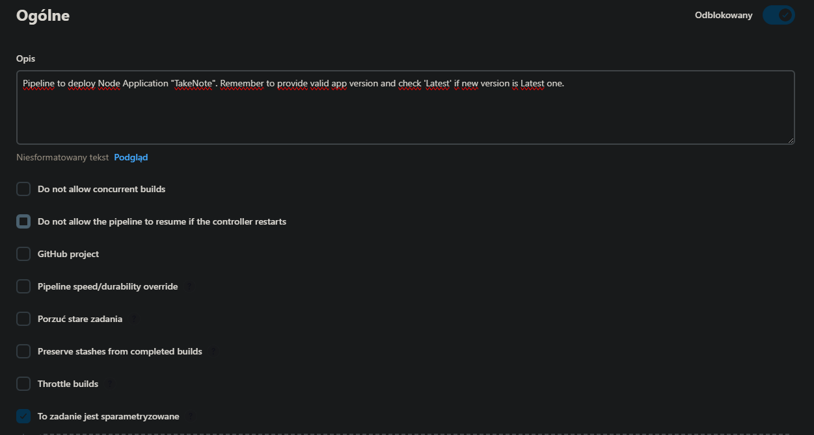
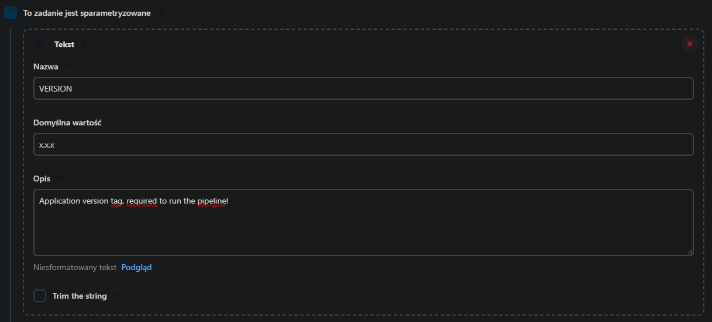
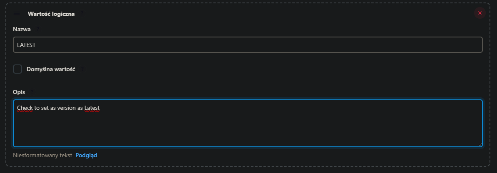

W zakładce "Pipeline" wybieramy "Pipeline script from SCM, jako SCM wybieramy GIT, podajemy URL do naszego repozytorium, nazwę brancha z któego ma korzystać oraz ścieżkę w jakim znajdzie się nasz Jenkinsfile.

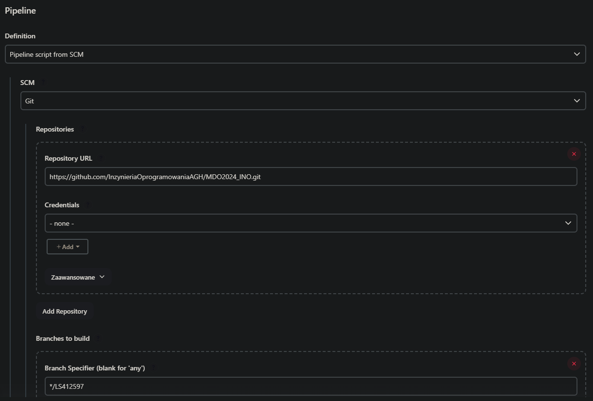
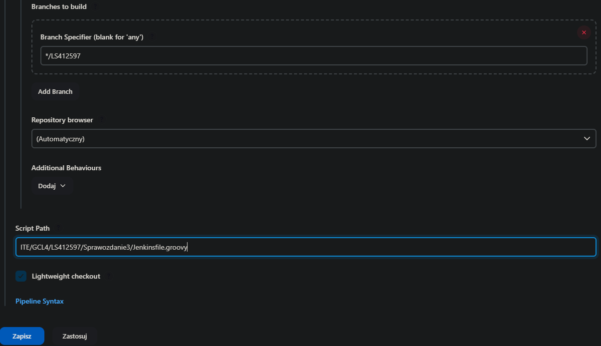

Teraz możemy zapisać nasz pipeline i przejść do pisania Jenkinsfila.

> W jenkinsfile wykorzystujemy plugin dockerfile, dlatego w Jenkins > Zarządzaj Jenkinsem > Plugins musimy doinstalować następujący pluginy: Docker plugin oraz Docker Pipeline.
> 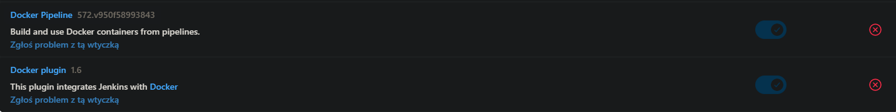

#### Jenkinsfile

W ścieżce identycznej jak podanej w konfiguracji pipelinu tworzymy plik jenkinsfile.

```groovy
pipeline {
    agent any

    parameters {
        string(name: 'VERSION', defaultValue: 'x.x.x', description: 'Enter the version of the Docker image')
        booleanParam(name: 'LATEST', defaultValue: false, description: 'Check to set as latest')
    }

    stages {
        stage('Check Version') {
            steps {
                script {
                    // Zdefiniowanie URL do konkretnego tagu w Docker Hub API
                    def tagUrl = "https://registry.hub.docker.com/v2/repositories/lukaszsawina/take_note_pipeline/tags/${params.VERSION}"

                    // Wykonanie zapytania do Docker Hub API
                    def httpResponseCode = sh(script: "curl -s -o /dev/null -w '%{http_code}' ${tagUrl}", returnStdout: true).trim()

                    // Sprawdzenie, czy kod odpowiedzi to 404
                    if (httpResponseCode == '404') {
                        echo "Tag ${params.VERSION} does not exist. Proceeding with the pipeline."
                    } else {
                        error "The version ${params.VERSION} is already used. Please specify a different version."
                    }
                }
            }
        }
        stage('Build') {
            steps {
                script {
                    // Budowa aplikacji z użyciem pliku Dockerfile builder.Dockerfile
                    docker.build('takenote_build', '-f ITE/GCL4/LS412597/Sprawozdanie3/builder.Dockerfile .')
                }
            }
        }

        stage('Test') {
            steps {
                script {
                    // Testowanie aplikacji z użyciem pliku Dockerfile tester.Dockerfile
                    docker.build('takenote_test', '-f ITE/GCL4/LS412597/Sprawozdanie3/tester.Dockerfile .')
                }
            }
        }

        stage('Deploy') {
            steps {
                script {
                    // Tworzomy sieć o nazwie deploy
                    sh 'docker network create deploy || true'
                    // Budowanie obrazu Docker
                    def appImage = docker.build('takenote_deploy', '-f ITE/GCL4/LS412597/Sprawozdanie3/deploy.Dockerfile .')

                    // Uruchomienie kontenera w tle o nazwie 'app'
                    def container = appImage.run("-d -p 5000:5000 --network=deploy --name app")

                    // Sprawdzenie, czy aplikacja działa, wykonując żądanie HTTP
                    sh 'docker run --rm --network=deploy curlimages/curl:latest -L -v  http://app:5000'

                    // Zatrzymanie kontenera
                    sh 'docker stop app'

                    // Usunięcie kontenera
                    sh 'docker container rm app'

                    // Usunięcie sieci
                    sh 'docker network rm deploy'

                    sh 'docker rmi takenote_build takenote_test'
                }
            }
        }
        stage('Publish') {
            steps {
                script {
                        // Logowanie do DockerHub
                        withCredentials([usernamePassword(credentialsId: 'lukaszsawina_id', usernameVariable: 'DOCKERHUB_USER', passwordVariable: 'DOCKERHUB_PASS')]) {
                            sh 'echo $DOCKERHUB_PASS | docker login -u $DOCKERHUB_USER --password-stdin'
                        }
                        sh "docker tag takenote_deploy lukaszsawina/take_note_pipeline:${env.VERSION}"
                        sh "docker push lukaszsawina/take_note_pipeline:${env.VERSION}"

                        if (params.LATEST) {
                            sh "docker tag takenote_deploy lukaszsawina/take_note_pipeline:latest"
                            sh "docker push lukaszsawina/take_note_pipeline:latest"
                        }

                }
            }
        }
    }
    post {
            always {
                // Czyszczenie po zakończeniu
                sh 'docker system prune -af'
            }
        }
}

```

Jak widać plik jest obszerny, dlatego przejdziemy od góry każdy fragment po kolei:

#### Parameters:

W tej zakładce deklarujemy nasze zmienne, które zostały utworzone w konfiguratorze pipelinu, jak widać mamy tam dwie zmienne: VERSION oraz LATEST.

#### Check version:

Stage, który odpowiada za walidację numeru wersji. Krok ten wysyła zapytanie przy pomocy CURL na adres `https://registry.hub.docker.com/v2/repositories/{nazwa repozytorium}/tags/{numer wersji}`, dzięki temu jeśli obraz o danym tagu już istnieje dostaniemy kod 200, w przypadku braku danej wersji zwracany jest kod 404, następnie sprawdzany jest kod i podejmowane odpowiednie działanie, paradoksalnie chcemy otrzymać kod 404, a nie 200.

#### Build:

Ten krok buduje obraz z wykorzystujac plik builder.Dockerfile. Efekt jest identyczny jak przy ręcznym uruchomieniu.

#### Test:

Wykorzystując tester.Dockerfile tworzony jest obraz, w którym wykonywane są testy, gdy wszystkie testy przejdą pipeline przechodzi do kolejnego kroku.

#### Deploy:

W tym kroku wykonywane jest kilka rzeczy, najpierw tworzona jest nowa sieć o nazwie "deploy" przy pomocy skryptu bashowego `docker network create deploy || true`, || true odpowiada za to, że gdy istnieje już taka sieć (pozostałość po innym uruchomieniu) to nie zostanie przerwany pipeline (normalnie zostałby zwrócony błąd).

Następnie na podstawie pliku deploy.Dockerfile tworzony jest obraz ze zdeployowaną aplikacją, obraz ten jest uruchamiany w kontenerze w tle, nadawana jest mu nazwa "app" ukazany jest port 5000 oraz dołączona jest sieć "deploy". Następnie uruchamiany jest kontener z obrazem CURL, który jest uruchamiany z połączoną siecią "deploy" i jako entryponit wysyła zapytanie do uruchomionej aplikacji. W sytuacji, gdy kontener z curlem zwróci błąd, oznacza to, że aplikacja nie działa i pipeline jest przerywany, jednak gdy test się powiedzie zatrzymywany jest kontener z aplikacją oraz usuwana jest sieć. Dodatkowo usuwane są obrazy z testami oraz z buildem. Pozostaje nam jedynie obraz ze zdeployowaną aplikacją.

#### Publish:

Ostatnim etapem w pipeline jest publish. Wykorzystująć credentiale zapisane w Jenkins logujemy się do dockera, a następnie tworzymy tag dla naszej aplikacji z odpowiednią wersją oraz pushujemy obraz, dodatkowo gdy zaznaczona jest opcja Latest tworzony jest nowy tag Latest oraz ponownie pushowany jest obraz.

> Aby dodać Credentials przechodzimy do Zarządzaj Jenkinsem > Credentials > (global) i dodajemy nowe `+ Add Credentials`.
> 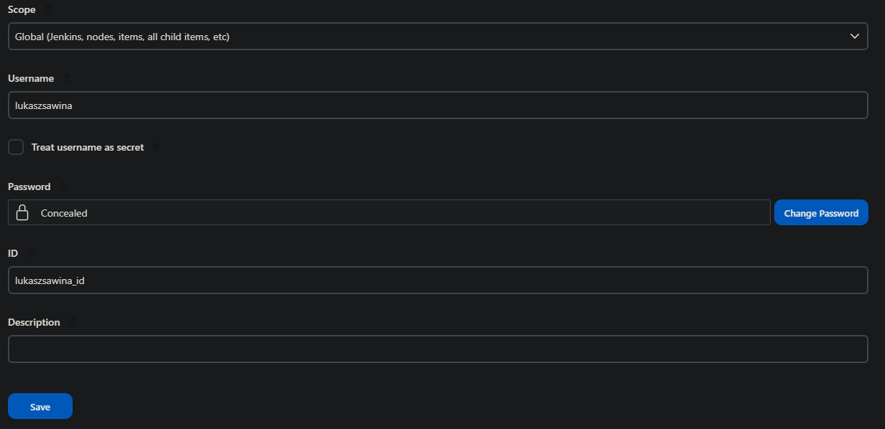
> Podajemy nazwę użytkownika oraz hasło dla platformy dockerhub. Ważne jest, aby zapamiętać ID jakie podajemy, ponieważ na jego podstawie w Jenkinsfile wybierane są odpowiednie dane.

> Do prawidłowego działania pipelinu musimy w dockerhub utworzyć repozytorium, na które będzie nasza aplikacja wysyłana. W tym celu musimy się zalogować na dockerhub przejść do zakładki "Repositories" i utworzyć nowe repozytorium "Create repository", podajemy nazwę naszego repozytorium oraz krótki opis.
> 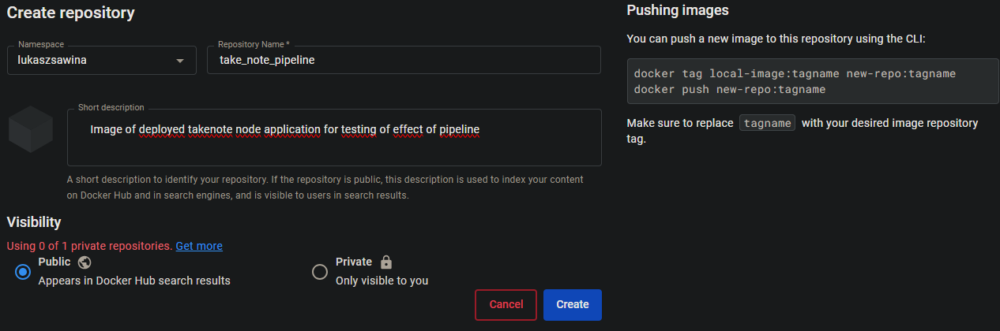
> nazwa repozytorium określona jest w etapie Publish, dlatego ważne, aby była tam podana prawidłowo.

#### Post:

Etap końcowy jest wykonywany zawszee niezależnie czy nasz pipeline został przerwany lub zakończył się sukcesem, jego zadaniem jest wyczyszczenie kontenera DIND w któryum znajdują się wszystkie obraz tworzone podczas pipelinu. Służy to do dbania o miejsce na naszym dysku, które niestety nie jest studnią bez dna :(

> W przypadku większej ilości pipelinów wdrożeniowych oraz tworzących obrazy ten etap może być problematyczny, ponieważ zakończenie tego pipelinu może zaburzyć działanie innych działających pipelinów, dlatego warto go zmienić, przy dodawaniu innych pipelinów.

Nasz plik jenkinsfile jest już gotowy do testowania.

### Test pipelinu:

Najpierw sprawdzimy działanie walidacji naszej wersji, wcześniej uruchomiłem pipeline, którzy utworzył mi kilka wersji programu: 1.0.0, 1.0.1, 1.0.2, 1.0.3.

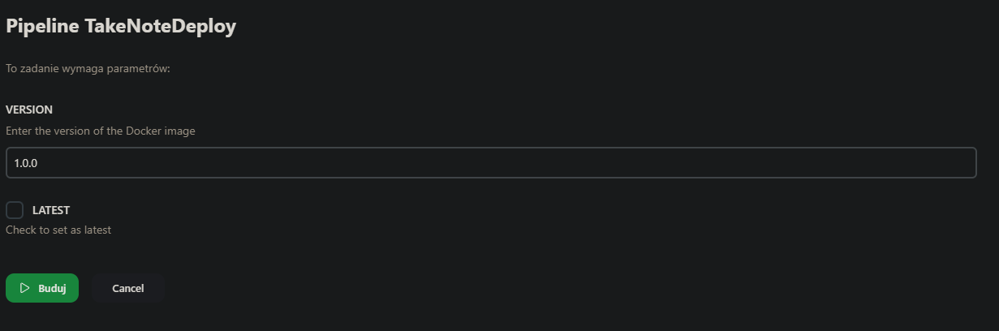

Przy uruchomieniu pipelinu podałem wersję 1.0.0 i w efekcie otrzymałem:

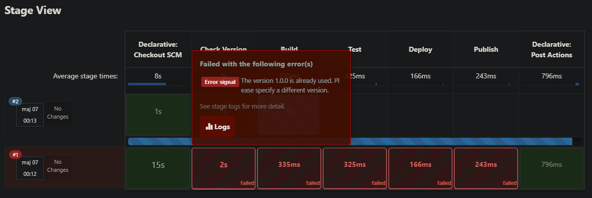

Jak widać w informacji błędu podane jest, że wersja 1.0.0 już istnieje i pojawia się prośba o podanie innego numeru co świadczy o prawidłowej walidacji numeru wersji.

Teraz podajmy prawidłowy numer wersji, w tym przypadku będzie to 1.0.4 oraz zaznaczymy, że będzie to wersja LATEST.

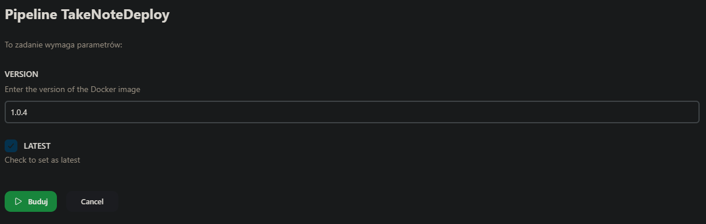

Po odczekaniu kilku minut otrzymujemy w efekcie końcowym:

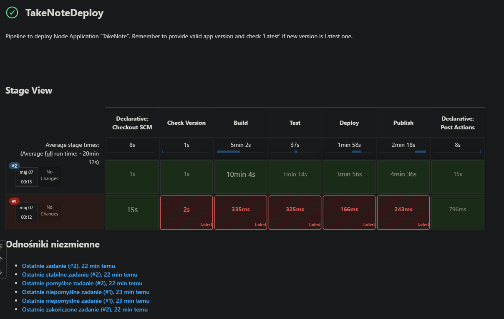

Jak widać wszystko pięknie świeci się na zielono, teraz sprawdźmy czy na dockerhub rzeczywiście znajduje się nasza nowa wersja.

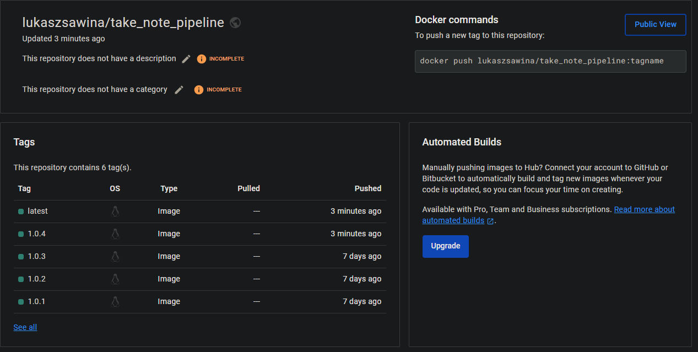

Jak widać pojawiła się nowa wersja oraz nowa wersja LATEST, co świadczy o sukcesie działania naszego pipeliniu. Teraz możemy sprawdzić jak nasz obraz działa, gdy pobierzemy go z dockerhuba lokalnie i uruchomimy.

Przy pomocy polecenia:

```bash
docker run -d -p 5000:5000 lukaszsawina/take_note_pipeline
```

Kontener na podstawie obrazu ze zdeployowaną aplikacją zostanie uruchomiony w tle, ponieważ obraz jeszcze nie istnieje w lokalnym dokerze zostanie on pobrany z dockerhub z tagiem Latest.

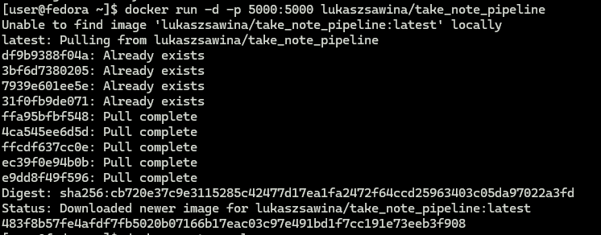
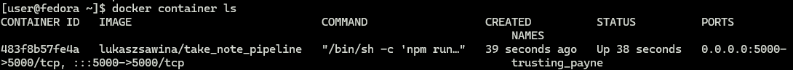
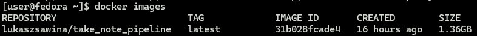

Jak widać nasz kontener został utworzony oraz obraz z aplikacją został pobrany z dockerhub. Teraz sprawdźmy czy aplikacja na pewno działa.

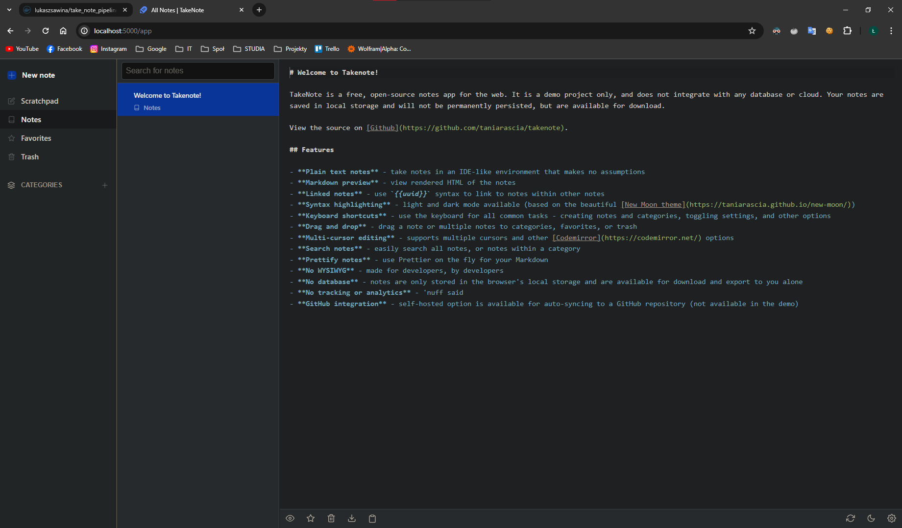

Jak widać nasza aplikacja działa prawidłowo.

### Podsumowanie

Jak można zauważyć utworzony pipeline nie odbiega od założonego pipelinu z diagramu UML, pojawiają się co prawda dwa dodatkowe kroki (verify version oraz post), ale całe założenie jest dobrze odwzorowane. W efekcie utrzymaliśmy pipeline gotowy do wykorzystania do wdrażania naszej aplikacji napisanej w Node.js. W efekcie końcowym otrzymujemy gotowy obraz z aplikacją, która nie wymaga żadnych dodatkowych konfiguracji poza ukazaniem portów, którą można uruchomić przy pomocy jednego polecenia.
