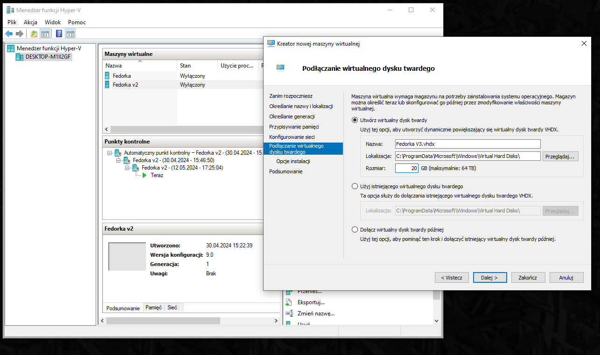

# Sprawozdanie 04 - ANSIBLE

---

## Sawina Łukasz - LS412597

### Przygotowanie maszyn

Do wykonania zadania zdalnego wykorzystnia poleceń Ansible potrzebna nam jest dodatkowa maszyna, w moim przypadku jest to kolejna wirtualna maszyna z systemem Fedora v38 (identyczna jak główna wirtualna maszyna). Przy instalacji systemu tworzymy dodatkowo użytkownika "ansible", który bedzie nam potrzebny w późniejszej części zadania.


Dodatkowo musimy zapewnić obecność narzędzi `tar` oraz `sshd`, aby sprawdzić czy system posiada owe narzędzia można wykorzystać polecenie:

```bash
tar --help
```

oraz

```bash
sshd --help
```

TAR

SSHD


W sytuacji, gdy któregoś z programu brakuje wystarczy go doinstalować:

```bash
sudo dnf install tar

sudo dnf install openssh-server
```

Nazwę maszyny możemy określić podczas instalacji, lub już po zmieniając jej nazwę w pliku `/etc/hostname`.

Na naszej głównej maszynie potrzebujemy zainstalować Ansible, do tego wykorzystujemy polecenie:

```bash
sudo dnf install ansible
```

Jak widać na mojej maszynie już jest zainstalowany program:


Następnie potrzebujemy wygenerować klucz ssh i wymienić go z drugą maszyną, tak aby można było się z nią połączyć bez podawania hasła. W tym celu generujemy sobie nowy klucz i przesyłamy go na użytkownika na drugiej maszynie:

```bash
ssh-keygen -t rsa -b 4096 -f ~/.ssh/[key-name]
ssh-copy-id -i ~/.ssh/[keyname].pub [username]@[hostname]
```

Jak widać połączenie się przez ssh z drugą maszyną zostało wykonane bez pytania o hasło, co oznacza, że pomyślnie zadziałały powyższe polecenia (nazwa hosta zamiast adresu IP będzie wytłumaczona poniżej)


Aby nie musieć podawać adresu IP przy łaczeniu się z maszyną możemy na głównej maszynie edytować plik `/etc/hosts` i dopisać do niego naszą maszynę "ansible-target", dzięki czemu nie musimy znać cały czas jej adresu IP:


Jak widać w ostatniej linii mamy dopisany adres oraz nazwę dodatkowej maszyny, co pozwala nam używać nazwy maszyny zamiast adresu IP, można to było zobaczyć powyżej przy połączeniu przez SSH.

### Inwentaryzacja

Do korzystania z Ansible potzrebujemy utworzyć plik `inventory.ini`, w którym określimy hosty z jakimi będziemy pracować:

```ini
[Endpoints]
ansible-target

[Orchestrators]
127.0.0.1
fedora
```

Jak widać w sekcji Endpoints mamy nazwę maszyny dodatkowej, to na niej będą wykonywane wszystkie operacje jakie określimy w Ansible, w Orchestrators mamy naszą maszynę podaną na 2 sposoby, przez jej adres loopback oraz nazwę maszyny.

Dla przetestowania możemy wykorzystać plik inwentaryzacji i wysłać na wszystkie hosty w Enpoints ping:

```bash
ansible Endpoints --module-name ping --inventory ./inventory.ini -u ansible
```

> Ważne aby znajdować się w lokalizacji gdzie jest plik inventory.ini lub podać odpowiednią ścieżkę do niego!

> Na końcu polecenia występuje "-u ansible" ponieważ domyślnie ansible będzie próbowało się połączyć z użytkownikiem o identycznej nazwie jak ten z którego uruchamiamy polecenie


Jak widać nasz ansible oraz inventory działa prawidłowo!

### Playbook

Do wykonania większej ilosci zadań możemy wykorzystać playbooki, w których określamy co ma się wykonać na maszynach docelowych. W pierwszej kolejności będziemy chcieli wykonać następujące czynności:

- Wysłać żądanie PING
- Skopiować plik inventaryzacji na maszynę Enpoints
- Zaktualizować pakiety systemu
- Zrestartować usługę SSHD

W tym celu tworzymy plik `playbook.yml`

```yaml
- name: My playbook
  hosts: Endpoints
  remote_user: ansible
  become: yes

  tasks:
    - name: Ping my hosts
      ansible.builtin.ping:

    - name: Copy file with owner and permissions
      ansible.builtin.copy:
        src: ./inventory.ini
        dest: /home/ansible/inventory.ini
        owner: ansible
        group: ansible
        mode: u=rw,g=r,o=r

    - name: Upgrade all packages
      ansible.builtin.dnf:
        name: "*"
        state: latest

    - name: Zrestartuj usługę SSH
      ansible.builtin.service:
        name: sshd
        state: restarted
```

Jak widać na początku podajemy nazwę naszego playbooku, hosty na których ma sie wszystko wykonać (są to hosty określone w inventory) oraz użytkownika na którym ma się to wykonać. Dodatkowo określamy, aby wszystko było wykonywane z poziomu sudo, przy pomocy `become: yes`.

Następnie mamy określone taski, ansible udostępnia moduły, które pomogą nam wykonać wszystkie te czynności, przykładowo do wysłania żądania PING wykorzystujemy `ansible.builtin.ping`, do skopiowania pliku: `ansible.builtin.copy` itd.

Przy kopiowaniu pliku musimy określić źródło, miejsce docelowe, właściciela pliku, grupę do której ma należeć oraz uprawnienia.

Do aktualizacji pakietów systemu wykorzystujemy `ansible.builtin.dnf`, który pobierze nam latest paczki.

Do zrestartowania usługi SSHD wykorzystujemy `ansible.builtin.service` na którym podajemy nazwę usługi, czynność jaką ma wykonać (state) oraz ponownie ma to zrobić z poziomu sudo.

Pora przetestować nasz playbook, wykonujemy to poleceniem:

```bash
ansible-playbook ./playbook.yaml --inventory ./inventory.ini
```


Jak widać wykonało się pięć tasków, w podsumowaniu widzimy, że OK pojawiło się dla 5 z nich oraz changed dla 2, teraz gdy wykonamy ponownie to samo otrzymamy pewną różnicę w wyniku:


Jak widać tym razem tylko 1 zadanie ma status changed, różnica pojawia się w zadaniu ze skopiowanie pliku, jest to spowodowane tym, że ansible już wykonał wcześniej to zadanie i nie powtarza go ponownie, nic nie zostało zmienione w tym przypadku, podobnie jest dla aktualizacji paczek, wcześniej testowo wykonałem playbooka, dlatego teraz otrzymuję przy nim OK.

Teraz sprawdzmy co się stanie, gdy na docelowej maszynie wyłączymy SSH (odłączymy kartę sieciową).


Jak widać otrzymaliśmy błąd w którym mamy powiedziane, że pojawił się problem przy połączeniu przez SSH, połączenie z hostem ansible-target na porcie 22 nie zostało wykonane. Można się było domyślić takiego obrotu spraw, ponieważ ansible wykorzystuje ssh do łączenia się z maszynami.

Następne co chcemy osiągnąć, to aby nasz playbook był w stanie uruchomić kontener docker z aplikacją z poprzedniego sprawozdania, w tym celu playbook musi zapewnić, aby Docker był zainstalowany oraz pobrał i uruchomił obraz z aplikacją. W tym celu dodajemy następujące linijki do playbooka:

```yaml
 - name: Pobierz Docker
      ansible.builtin.dnf:
        name: docker
        state: latest

    - name: Aktywuj docker
      ansible.builtin.service:
        name: docker
        state: started

    - name: Pull obrazu take_note_pipeline
      command: docker pull lukaszsawina/take_note_pipeline

    - name: Run obrazu take_note_pipeline
      command: docker run -d -p 5000:5000 --name=app lukaszsawina/take_note_pipeline
```

Teraz po wykonaniu naszego playbooka nasza aplikacja będzie działała w tle na drugiej maszynie:


Sprawdźmy teraz czy nasza aplikacja działa, na przeglądarce spróbujemy się połączyć z nią podająć adres IP maszyny oraz odpowiedni port.


### Role

Teraz jak mamy działający playbook możemy go ubrać w rolę, w tym celu musimy utworzyć rolę, w tym celu wykorzystujemy polecenie:

```bash
ansible-galaxy init my_role
```


W wyniku w katalogu została utworzona struktura katalogów my_role, która wygląda następująco:


Teraz w katalogu tasks w pliku main.yml umieszczamy wszystkie nasze taski, które wcześniej posiadaliśmy w playbooku, a w playbooku zamiast tasków określamy rolę:

playbook.yml

```yaml
- name: My playbook
  hosts: Endpoints
  remote_user: ansible
  become: yes
  roles:
    - my_role
```

main.yml

```yml
---
- name: Ping my hosts
  ansible.builtin.ping:

- name: Copy file with owner and permissions
  ansible.builtin.copy:
    src: ./inventory.ini
    dest: /home/ansible/inventory.ini
    owner: ansible
    group: ansible
    mode: u=rw,g=r,o=r

- name: Upgrade all packages
  ansible.builtin.dnf:
    name: "*"
    state: latest

- name: Zrestartuj usługę SSH
  ansible.builtin.service:
    name: sshd
    state: restarted

- name: Pobierz Docker
  ansible.builtin.dnf:
    name: docker
    state: latest

- name: Aktywuj docker
  ansible.builtin.service:
    name: docker
    state: started

- name: Pull obrazu take_note_pipeline
  command: docker pull lukaszsawina/take_note_pipeline

- name: Run obrazu take_note_pipeline
  command: docker run -d -p 5000:5000 --name=app lukaszsawina/take_note_pipeline
```


Teraz, gdy uruchomimy nasz playbook wynik zostanie taki sam, jednak nasze taski mamy zapisane w innej lokalizacji. Dodatkowo możemy zauważyć inne katalogi odpowiedzialne za inne rzeczy w playbooku, co pozwala bardziej rozbudować nasz playbook w przyszłości.

Dodatkowo, w naszym playbooku, jak już wiemy, że aplikacja działa prawidłowo dodamy fragment, który będzie zatrzymywał oraz usuwał nasz kontener z aplikacją. W tym celu trzeba dodać następująće linijki:

```yml
- name: Stop kontener z take_note_pipeline
  command: docker stop app

- name: Del kontner z take_note_pipeline
  command: docker rm app
```


## Instalacja nadzorowana oraz nienadzorowana

Kolejną czynnością jaką chcemy wykonać jest zautomatyzowanie procesu instalacji systemu, w tym celu najpierw ręcznie wykonamy instalację nadzorowaną na podstawie której będziemy później tworzyć automatyzację.

Systemem na którym będziemy wykonywać automaty zację jest Fedora v40. Naszym zadaniem będzie najpierw utworzenie maszyny wirtualnej (w tym przypadku w Hyper-V):

#### Tworzenie wirtualnej maszyny


> Podajemy nazwę naszej maszyny.


> Wybieramy 2 generację.


> Określamy wielkość pamięci RAM, w tym przypadku hojnie 2GB.


> Podpinamy go do default switch



> Określamy wielkośc dysku


> Możemy od razu podać plik ISO z jakiego ma nam uruchomić instalację


> Dodatkowo musimy wyłączyć w ustawieniach "Włącz bezpieczny rozruch" ponieważ instalacja może się nawet nie odpalić.

#### Instalacja systemu

Po utworzeniu naszej maszyny uruchamiamy ją


> Wybieramy opcję install


> Określamy język


> Uzupełniamy informacje o instalacji, w tym przypadku wybieramy dysk na którym ma zostać zainstalowany system, włączamy użytkownika root oraz tworzymy dodatkowego użytkownika, po czym rozpoczynamy instalację


> Idziemy zrobić kawusię i czekamy aż system się zainstaluje


> Instalacja się zakończyła i uruchamiamy ponownie maszynę.

Teraz po uruchomieniu systemu i zalogowania się na użytkownika odczytujemy zawartość pliku `anaconda-ks.cfg`, który znajduje się w lokalizacji:

```bash
/root/anaconda-ks.cfg
```


Zawartość tego pliku musimy sobie zapisać, tak abyśmy mogli ją edytować a następnie mieć do niej dostęp, w tym celu zapisujemy ją na naszych lokalnych repozytoriach.

#### Zmiany w pliku anaconda-ks.cfg

Pierwsze co musimy zmienić to podanie lokalizacji serwerów lustrzanych repozytorium fedory oraz aktualizacji.

```
url --mirrorlist=http://mirrors.fedoraproject.org/mirrorlist?repo=fedora-40&arch=x86_64
repo --name=update --mirrorlist=http://mirrors.fedoraproject.org/mirrorlist?repo=updates-released-f40&arch=x86_64
```

Dodatkowow chcemy wyczyścić partycję dystkową przed zainstalowaniem systemu, dlatego dopisujemy polecenie `clearpart --all`

Nasz plik ma na ten moment następującą treść:

```kickstart
# Generated by Anaconda 40.22.3
# Generated by pykickstart v3.52
#version=DEVEL
# Use graphical install
graphical

# Keyboard layouts
keyboard --vckeymap=pl --xlayouts='pl'
# System language
lang pl_PL.UTF-8

# Repository
url --mirrorlist=http://mirrors.fedoraproject.org/mirrorlist?repo=fedora-40&arch=x86_64
repo --name=update --mirrorlist=http://mirrors.fedoraproject.org/mirrorlist?repo=updates-released-f40&arch=x86_64

%packages
@^custom-environment

%end

# Run the Setup Agent on first boot
firstboot --enable

# Generated using Blivet version 3.9.1
ignoredisk --only-use=sda
autopart

# Partition clearing information
clearpart --all

# System timezone
timezone Europe/Warsaw --utc

# Root password
rootpw --iscrypted $y$j9T$nHyIdenQwXILAkEecz0JspDn$TEwxQYi7szO5bQBNH3Si0Gl7ePvLGnXFsrD82YEvh8D
user --groups=wheel --name=user --password=$y$j9T$sJ9fLzkS18PBT2u5ywdHzf9O$UZ0Dt9s2mz.j8OxjlMwMYDPQHCgiUNR4ffrwML6rOf3 --iscrypted --gecos="user user"
```

Nowy plik zamieszczamy w repozytorium i sprawdzamy jak sprawić aby mieć do niego dostęp z zewnątrz.


Jak widać pod odpowiednim adresem z prefixem `raw` mamy dostęp do naszego pliku konfiguracji.

Teraz przetestujmy nasz plik.

### Instalacja z pliku kickstart

W tym celu tworzymy nową maszynę identycznie jak poprzednio.
