# Sprawozdanie 5 - Wdrażanie na zarządzalne kontenery: Kubernetes

---

## Sawina Łukasz - LS412597

### Wstęp

Kubernetes to platforma do automatyzacji wdrażania, skalowania i operacji kontenerowych aplikacji. Umożliwia zarządzanie klastrami kontenerów, zapewniając wysoką dostępność, skalowalność i prostotę w obsłudze. Dzięki funkcjom takim jak automatyczne skalowanie, samonaprawianie się podów oraz deklaratywne zarządzanie infrastrukturą, Kubernetes znacząco upraszcza zarządzanie złożonymi aplikacjami kontenerowymi w produkcji.

Naszym zadaniem będzie zainstalowanie kubernatesa oraz uruchomienie poda z wcześniej wdrożoną aplikacją, a następnie wykorzystanie funkcjonalności kubernatesa do zautomatyzowania procesu.

### Instalacja

Aby zainstalować kubernatesa możemy posłużyć się stroną [minikube](https://minikube.sigs.k8s.io/docs/start/) w której mamy pokazane jak prawidłowo zainstalować w zależności od tego na jakim systemie ma pracować. W moim przypadku wybieramy Linux z architekturą x86-64 i typ instalacji RPM package, ponieważ kubernates będzie uruchamiany na systemie Fedora.

Jak pokazuje strona musimy w terminalu uruchomić następujace polecenia:

```bash
curl -LO https://storage.googleapis.com/minikube/releases/latest/minikube-latest.x86_64.rpm
sudo rpm -Uvh minikube-latest.x86_64.rpm
```

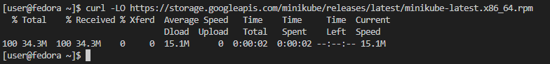

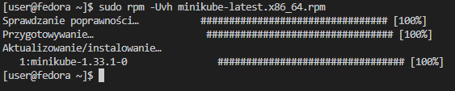

Po zainstalowaniu kubernatesa możemy go uruchomić przy pomocy polecenia:

```bash
minikube start
```

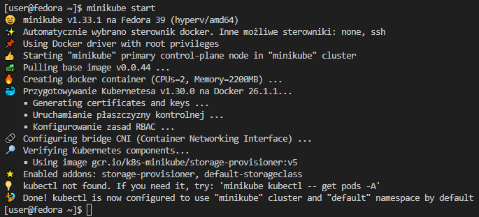

Jak widać kubernates został uruchomiony, dodatkowo widzimy informację, że utworzył on kontner w dockerze, przy pomocy wtyczki do VSCode możemy zauważyć, że istnieje nowy działający kontener gcr.io/k8s...

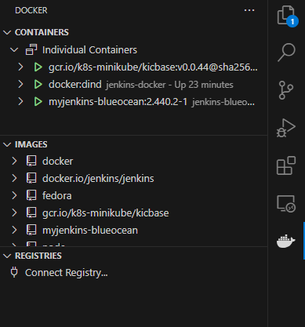

Dodatkową przydatną rzeczą, która jest opisana w dokumentacji jest dodanie aliasu co ułatwi nam pracę z kubernatesem. W tym celu w terminalu musimy wpisać:

```bash
alias kubectl="minikube kubectl --"
```

Dodatkowo kubernates oferuje możliwość zobaczenia na stronie swojego obecnego stanu, w tym celu musimy uruchomić tzw. dashboard:

```bash
minikube dashboard
```

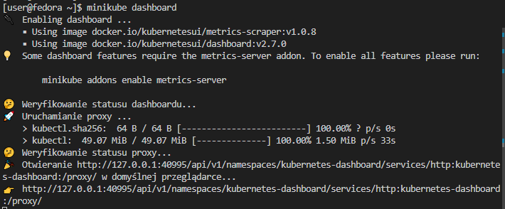

Uruchomienie tego polecenia w VSCode dodatkowo automatycznie doda port 40995 do listy forwardowanych portów:

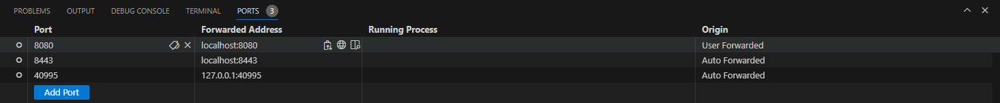

Strona z dashboardem powinna się uruchomić automatycznie w przeglądarce, jednak gdyby tak się nie stało wystarczy otworzyć adres, który jest widoczny w konsoli.

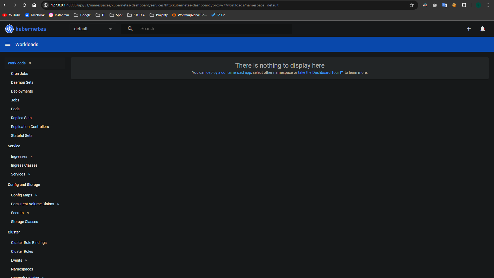

Dzięki dashboardowi będziemy mieli wgląd na to co obecnie dzieje się z naszymi podami.

### Uruchomienie kontenera na stosie k8s

Teraz naszym zadaniem będzie uruchomienie kontenera z aplikacją z poprzedniego sprawozdania przy pomocy kubernatesa, w tym celu musimy wykonać poniższe polecenie:

```bash
minikube kubectl -- run <nazwa-wdrożenia> --image=<obraz-docker> --port=<wyprowadzany port> --labels app=<nazwa-wdrożenia>
```

W moim przypadku będzie to wyglądać następująco:

```bash
minikube kubectl -- run take-note-app --image=lukaszsawina/take_note_pipeline --port=5000 --labels app=take-note-app
```

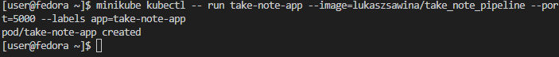

Dodatkowo możemy sprawdzić jak wygląda nasz dashboard obecnie

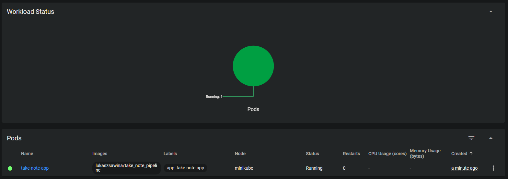

Jak widzimy pojawił się nam nowy pod o nazwie `take-note-app`

Przy pomocy polecenia:

```bash
minikube kubectl -- get pods
```

Możemy dodatkowo sprawdzić status działających obecnie podów, jak widać nasz pod ma obecnie status running.

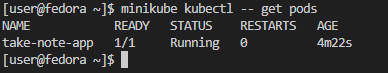

Niestety jeszcze nie możemy połączyć się do naszego poda, ponieważ nie mamy wyprowadzonych portów, aby to wykonać musimy użyć polecenia:

```bash
minikube kubectl -- port-forward pod/<nazwa poda> <Numer portu>:<Numer portu>
```

Gdzie pierwszy port to port przez który będziemy się łączyć, a drugi to port na którym działa nasz pod (określony wczęsniej). Poglądowo ustalę, aby łączenie się z aplikacją było przez port 5050. W tym celu wykonuję polecenie:

```bash
minikube kubectl -- port-forward pod/take-note-app 5050:5000
```

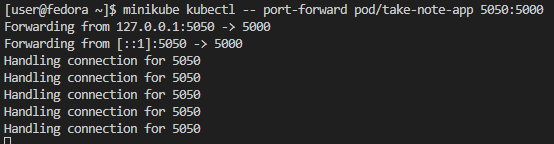

Jak widać nasze przekierowywanie portów działa, dodatkowo musimy ręcznie dodać port 5050 do listy w VSCode abyśmy mogli się połączyć przy pomocy localhost:

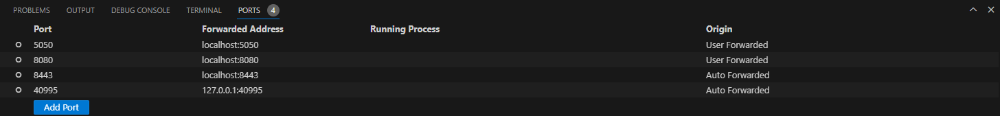

Teraz możemy sprawdzić czy nasza aplikacja otworzy się gdy wejdziemy na adres `localhost:5050`


SUKCES, jak widać udało się nam uruchomić poda z wykorzystaniem obrazu naszej aplikacji i skonfigurować przekierowywanie portów tak, abyśmy mogli dostać się do aplikacji.
