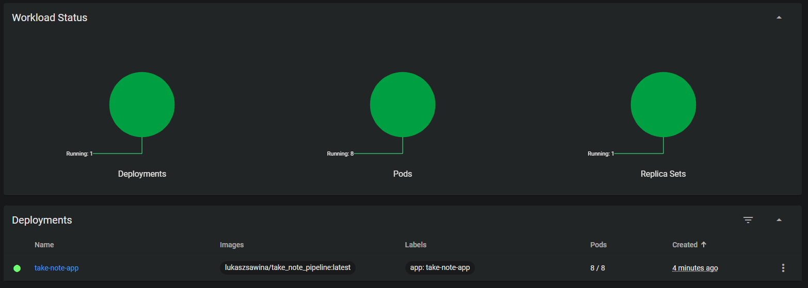

# Sprawozdanie 5 - Wdrażanie na zarządzalne kontenery: Kubernetes

---

## Sawina Łukasz - LS412597

### Wstęp

Kubernetes to platforma do automatyzacji wdrażania, skalowania i operacji kontenerowych aplikacji. Umożliwia zarządzanie klastrami kontenerów, zapewniając wysoką dostępność, skalowalność i prostotę w obsłudze. Dzięki funkcjom takim jak automatyczne skalowanie, samonaprawianie się podów oraz deklaratywne zarządzanie infrastrukturą, Kubernetes znacząco upraszcza zarządzanie złożonymi aplikacjami kontenerowymi w produkcji.

Naszym zadaniem będzie zainstalowanie kubernatesa oraz uruchomienie poda z wcześniej wdrożoną aplikacją, a następnie wykorzystanie funkcjonalności kubernatesa do zautomatyzowania procesu.

### Instalacja

Aby zainstalować kubernatesa możemy posłużyć się stroną [minikube](https://minikube.sigs.k8s.io/docs/start/) w której mamy pokazane jak prawidłowo zainstalować w zależności od tego na jakim systemie ma pracować. W moim przypadku wybieramy Linux z architekturą x86-64 i typ instalacji RPM package, ponieważ kubernates będzie uruchamiany na systemie Fedora.

Jak pokazuje strona musimy w terminalu uruchomić następujace polecenia:

```bash
curl -LO https://storage.googleapis.com/minikube/releases/latest/minikube-latest.x86_64.rpm
sudo rpm -Uvh minikube-latest.x86_64.rpm
```


Po zainstalowaniu kubernatesa możemy go uruchomić przy pomocy polecenia:

```bash
minikube start
```


Jak widać kubernates został uruchomiony, dodatkowo widzimy informację, że utworzył on kontner w dockerze, przy pomocy wtyczki do VSCode możemy zauważyć, że istnieje nowy działający kontener gcr.io/k8s...


Dodatkową przydatną rzeczą, która jest opisana w dokumentacji jest dodanie aliasu co ułatwi nam pracę z kubernatesem. W tym celu w terminalu musimy wpisać:

```bash
alias kubectl="minikube kubectl --"
```

Dodatkowo kubernates oferuje możliwość zobaczenia na stronie swojego obecnego stanu, w tym celu musimy uruchomić tzw. dashboard:

```bash
minikube dashboard
```


Uruchomienie tego polecenia w VSCode dodatkowo automatycznie doda port 40995 do listy forwardowanych portów:


Strona z dashboardem powinna się uruchomić automatycznie w przeglądarce, jednak gdyby tak się nie stało wystarczy otworzyć adres, który jest widoczny w konsoli.


Dzięki dashboardowi będziemy mieli wgląd na to co obecnie dzieje się z naszymi podami.

### Uruchomienie kontenera na stosie k8s

Teraz naszym zadaniem będzie uruchomienie kontenera z aplikacją z poprzedniego sprawozdania przy pomocy kubernatesa, w tym celu musimy wykonać poniższe polecenie:

```bash
minikube kubectl -- run <nazwa-wdrożenia> --image=<obraz-docker> --port=<wyprowadzany port> --labels app=<nazwa-wdrożenia>
```

W moim przypadku będzie to wyglądać następująco:

```bash
minikube kubectl -- run take-note-app --image=lukaszsawina/take_note_pipeline --port=5000 --labels app=take-note-app
```


Dodatkowo możemy sprawdzić jak wygląda nasz dashboard obecnie


Jak widzimy pojawił się nam nowy pod o nazwie `take-note-app`

Przy pomocy polecenia:

```bash
minikube kubectl -- get pods
```

Możemy dodatkowo sprawdzić status działających obecnie podów, jak widać nasz pod ma obecnie status running.


Niestety jeszcze nie możemy połączyć się do naszego poda, ponieważ nie mamy wyprowadzonych portów, aby to wykonać musimy użyć polecenia:

```bash
minikube kubectl -- port-forward pod/<nazwa poda> <Numer portu>:<Numer portu>
```

Gdzie pierwszy port to port przez który będziemy się łączyć, a drugi to port na którym działa nasz pod (określony wczęsniej). Poglądowo ustalę, aby łączenie się z aplikacją było przez port 5050. W tym celu wykonuję polecenie:

```bash
minikube kubectl -- port-forward pod/take-note-app 5050:5000
```


Jak widać nasze przekierowywanie portów działa, dodatkowo musimy ręcznie dodać port 5050 do listy w VSCode abyśmy mogli się połączyć przy pomocy localhost:


Teraz możemy sprawdzić czy nasza aplikacja otworzy się gdy wejdziemy na adres `localhost:5050`


SUKCES, jak widać udało się nam uruchomić poda z wykorzystaniem obrazu naszej aplikacji i skonfigurować przekierowywanie portów tak, abyśmy mogli dostać się do aplikacji.

### Konwersja wdrożenia ręcznego na wdrożenie deklaratywne YAML

Naszym kolejnym zadaniem będzie zautomatyzowanie poprzednich kroków, będziemy chcieli przygotować plik YAML, który będzie opisywał nasze wdrozenie i na jego podstawie robić apply kubernatesa.

W tym celu musimy przygotować plik yaml:

```yaml
apiVersion: apps/v1
kind: Deployment
metadata:
  name: take-note-app
  labels:
    app: take-note-app
spec:
  replicas: 4
  selector:
    matchLabels:
      app: take-note-app
  template:
    metadata:
      labels:
        app: take-note-app
    spec:
      containers:
        - name: take-note-app
          image: lukaszsawina/take_note_pipeline:latest
          ports:
            - containerPort: 5000
```

Gdy mamy już gotowy plik do wdrożenia możemy go wykorzystać przy pomocy polecenia:

```bash
minikube kubectl -- apply -f deployment.yaml
```


Jak widać nasz plik został wykorzystany do wdrożenia aplikacji, dodatkowo przy pomocy polecenia:

```bash
minikube kubectl -- rollout status deployment/take-note-app
```

Możemy zauważyć status naszego deploymentu, teraz zobaczmy jak to wygląda w dashboardzie.


Jak widać pojawiło się dużo nowych rzeczy, po pierwsze co można zauwaćyć, to aż 4 pody, jest to spowodowane tym, że w pliku z konfiguracją deploymentu ustawiliśmy `replicas` na 4. Możemy również zobaczyć status naszego deploymentu oraz poszczególnych podów które pracują.

### Przygotowanie nowego obrazu

Teraz do dalszego działania z kubernatesem musimy zrobić kilka przygotować, w tym celu musimy utworzyć kilka wersji obrazu naszej aplikacji, jak widać ja już wcześniej miałem utworzone inne wersje.


Dodatkowo musimy przygotować wersję obrazu, którego próba uruchomienia zakończy się błędem. W tym celu lokalnie wykorzystuję stare pliki dockerfile i zmieniam zawartość pliku deploy.Dockerfile na następującą

```Dockerfile
FROM takenote_build

# WORKDIR /takenote
# RUN npm run build

# EXPOSE 5000

# ENTRYPOINT npm run prod

CMD ["false"];
```

W ten sposób po uruchomieniu kontenera z takim obrazem zostanie zwrócony błąd. Dodatkowo zakomentowałem pozostałe linie, aby skrócić czas oczekiwania na zbudowanie obrazu.


Jak widać obraz został zbudowany, konener uruchomiony, ale możemy zauważyć, że zakończył się z kodem 1, czyli tak jak chcieliśmy.

Teraz wystarczy nasz obraz pushnąć na dockerhub z odpowiednim tagiem. (przykładowo 120.0.0)


Teraz przetestujmy jak zachowa się nasz deployment, gdy wykorzystamy niedziałający obraz:

```yaml
apiVersion: apps/v1
kind: Deployment
metadata:
  name: error-take-note-app
  labels:
    app: error-take-note-app
spec:
  replicas: 4
  selector:
    matchLabels:
      app: error-take-note-app
  template:
    metadata:
      labels:
        app: error-take-note-app
    spec:
      containers:
        - name: error-take-note-app
          image: lukaszsawina/take_note_pipeline:120.0.0
          ports:
            - containerPort: 5000
```

W tym celu przygotowałem nowy plik yaml, który wykorzystuje odpowiednią wersję obrazu:


Jak widać po uruchomieniu naszego błędnego deploymentu na wszystkich podach otrzymujemy informację, że wystąpił błąd.

### Zmiany w deploymencie

Teraz będziemy testowali deployment z różnymi wartościami replik oraz wersjami obrazu.

- 8 replik

Zmianiamy `replicas` z 4 na 8 i następnie robimy apply:




- 1 replika


- 0 replik


Jak widać dla tej wersji nie pojawił się nam żaden pod.

- Wykorzystanie nowej wersji programu

`image: lukaszsawina/take_note_pipeline:2.0.0` jak widać pojawia się nam tutaj 2.0.0 co jest w moim repozytorium nowszą wersją niż latest (latest jest wersją 1.0.4)


Przy pomocy polecenia:

```bash
minikube kubectl -- rollout history deployment/take-note-app
```

Jesteśmy w stanie przeglądać historię naszego wdrożenia


Jak widać pojawiają się nam dwie wersje, ponieważ wykorzystaliśmy dwie różne wersje obrazów.

Jeśli chcielibyśmy się cofnąć do poprzedniej wersji wdrożenia możemy użyć polecenia:

```bash
minikube kubectl -- rollout undo deployment/take-note-app
```


Po wykonaniu tego polecenia automatycznie zmieniła się wersja przy naszym obrazie w deploymencie.

### Kontrola wdrożenia

Naszym kolejnym zadniem będzie stworzenie skryptu, który będzie wykonywał wdrożenie i sprawdzał czy w czasie 60 sekund udało się wykonać wdrożenie, w przeciwnym wypadku wrócimy wersją do poprzedniej.

W tym celu tworzymy skrypt bashowy:

```bash
#!/bin/bash

DEPLOYMENT_FILE="deployment.yaml"
DEPLOYMENT_NAME="error-take-note-app"
TIMEOUT_SECONDS=60
INTERVAL_SECONDS=5
TIME_PASSED=0

minikube kubectl -- apply -f $DEPLOYMENT_FILE

while [ $TIME_PASSED -lt $TIMEOUT_SECONDS ]; do
    STATUS=$(minikube kubectl -- get deployment $DEPLOYMENT_NAME -o jsonpath='{.status.conditions[?(@.type=="Available")].status}')

    if [ "$STATUS" == "True" ]; then
        echo "Wdrożenie $DEPLOYMENT_NAME zostało zakończone pomyślnie."
        exit 0
    fi

    sleep $INTERVAL_SECONDS
    TIME_PASSED=$((TIME_PASSED + INTERVAL_SECONDS))
done

echo "Przekroczono limit czasu ($TIMEOUT_SECONDS sekund) oczekiwania na zakończenie wdrożenia $DEPLOYMENT_NAME."
exit 1

```

Nadajemy mu odpowiednie uprawnienia:

```bash
chmod +x wdrozenie.sh
```


Testujemy z wykorzystaniem pliku deployment.yaml

Teraz zobaczmy jak działa z wykorzystaniem error-deployment.yaml


### Strategie wdrożenia

Teraz będziemy chcieli przetestować działąnie różnych strategii wdrażania:

- Recreate:

```yaml
apiVersion: apps/v1
kind: Deployment
metadata:
  name: take-note-app
  labels:
    app: take-note-app
spec:
  replicas: 4
  selector:
    matchLabels:
      app: take-note-app
  strategy:
    type: Recreate
  template:
    metadata:
      labels:
        app: take-note-app
    spec:
      containers:
        - name: take-note-app
          image: lukaszsawina/take_note_pipeline:2.0.0
          ports:
            - containerPort: 5000
```

Recreate działa na zasadzie usunięcia istniejących podów i utworzenie nowych, niestety problemem takiego podejścia jest pewien moment, w którym nie ma żadnych działających podów.

- RollingUpdate

```yaml
apiVersion: apps/v1
kind: Deployment
metadata:
  name: take-note-app
  labels:
    app: take-note-app
spec:
  replicas: 4
  selector:
    matchLabels:
      app: take-note-app
  strategy:
    type: RollingUpdate
    rollingUpdate:
      maxUnavailable: 3
      maxSurge: 50%
  template:
    metadata:
      labels:
        app: take-note-app
    spec:
      containers:
        - name: take-note-app
          image: lukaszsawina/take_note_pipeline:2.0.0
          ports:
            - containerPort: 5000
```

Strategia ta działa na stopniowym zastępowaniu istniejących podów nowymi, nie usuwa jednocześnie wszystkich tylko kolejno usuwa i tworzy nowy pod. Jest to domyślna strategia. Parametr maxUnavailable określa ile maksymalnie podów może nie działać, w moim przypadku ustawiłem, że minimum jeden pod musi być działający, maxSurge określa ile dodatkowych podów można uruchomić ponad określoną ilość.

- Canary

```yaml
apiVersion: apps/v1
kind: Deployment
metadata:
  name: take-note-app
  labels:
    app: take-note-app
    track: canary
spec:
  replicas: 4
  selector:
    matchLabels:
      app: take-note-app
      track: canary
  template:
    metadata:
      labels:
        app: take-note-app
        track: canary
    spec:
      containers:
        - name: take-note-app
          image: lukaszsawina/take_note_pipeline:2.0.0
          ports:
            - containerPort: 5000
```

Wdrozenie canary wdraża nową wersję aplikacji stopniowo, pozwalając testować aplikację na niewielkiej ilości podów przed pełnym wdrożeniem.

### Service

Aby wykorzystać service musimy przygotować sobie osobny plik yaml:

```yaml
apiVersion: v1
kind: Service
metadata:
  name: service
spec:
  selector:
    app: take-note-app
  ports:
    - protocol: TCP
      port: 80
      targetPort: 5000
```

A następnie zrobić jego apply i ustawić przekierowanie portów:


