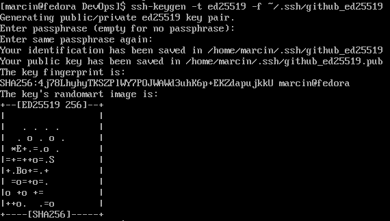
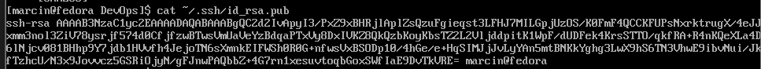
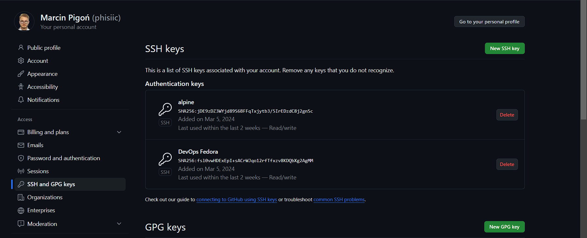
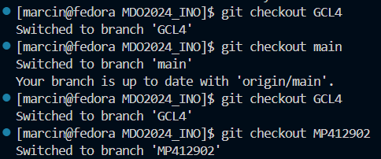
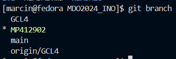
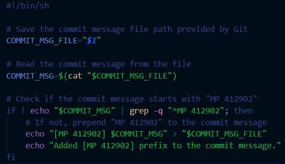
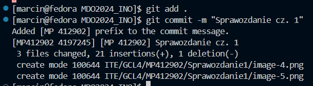
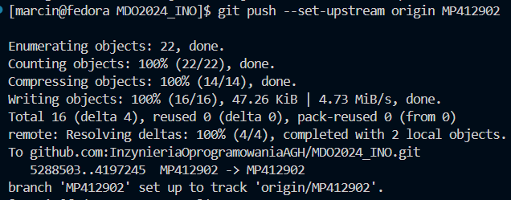
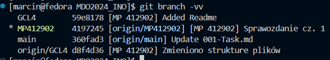
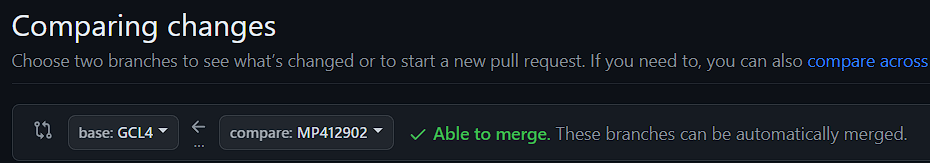

# Sprawozdanie 1
## Marcin Pigoń
## ITE gr. 4

### Cel: Zapoznanie się z podstawowymi działaniami w Git oraz podstawową konteneryzacją korzystając z Dockera.

### Lab 1

#### 0. Przygotowanie maszyny wirtualnej
Pobrałem program VirtualBox, gdyż już korzystałem z tego środowiska i nie mam dostępu do wirtualizatora Hyper-V, ponieważ mam jedynie wersję Windows Home. 
Dystrybucją Linuxa, którą wybrałem była Fedora, ponieważ jest znana i jest wiele materiałów na internecie.  

#### 1. Zainstaluj klienta Git i obsługę kluczy SSH

Korzystając z polecenia install, pobrałem klienta Git, który umożliwia działanie Gita na mojej maszynie wirtualnej. Należało użyć również przy tym poleceniu *sudo*, ponieważ jest to operacja, która pozwala wykonać polecenie z uprawnieniami administratora.

Do obsługi kluczy SSH zainstalowano w analogiczny sposób *openssh*.

#### 2. Sklonuj repozytorium przedmiotowe za pomocą HTTPS i personal access token

Po wygenerowaniu **personal access token** https://github.com/settings/tokens, mogłem go wykorzystać przy poleceniu **git clone** i sklonować repozytorium przedmiotowe, do którego będę później przesyłać swoje pliki.

Strona GitHub przypomina o traktowaniu swoich personal access token jak haseł i nie udostępniania ich. 

#### 3. Utworzenie kluczy SSH i połączenie ich do GitHub~

Za pomocą polecenia ssh-keygen generujemy pary kluczy (prywatny + publiczny).
Opcja **-t** odpowiada za typ klucza - w moim przypadku były to klucze ed25529 oraz rsa.
Opcja **-f** odpowiada za nazwę pliku.

Druga para kluczy była wygenerowana z użyciem wyłącznie polecenia ssh-keygen, co oznaczało, że nazywały się domyślnie *id_rsa* dla klucza prywatnego, a *id_rsa.pub* dla klucza publicznego. 

Zawartość klucza publicznego

Klucz publiczny pozwala połączyć się z maszyną w bezpieczny sposób. 
Klucz prywatny nigdy nie powinien być udostępniany.

Wstawiono ten klucz publiczny w GitHub w zakładce **SSH and GPG keys**

Sklonowano repozytorium, teraz przy wykorzystaniu połączenia SSH:
**git clone git@github.com:InzynieriaOprogramowaniaAGH/MDO2024_INO.git**

Również tutaj połączyłem się do swojej maszyny wirtualnej przez środowisko Visual Studio Code i Extension *Remote Explorer - SSH*. Umożliwia to bardziej intuicyjny dostęp do maszyny i pozwala na dodaniu innych pakietów, które pozwalają na bardziej efektywną pracę - np. podświetlanie składni skryptów Bash. Jest to znacznie wygodniejsze w użyciu niż *nano*. Również w łatwy sposób można kopiować oraz wklejać do maszyny wirtualnej. To rozwiązanie również pozwala na otwieranie kilku terminali jednocześnie. 

#### 4. Przełącz się na gałąź main, a potem na gałąź swojej grupy 

Do przełączania się pomiędzy gałęziami stosujemy polecenie **git checkout**. 
Opcja **-b** przy tym poleceniu powoduje utworzenie nowej gałęzi.

#### 5. Utwórz gałąź o nazwie inicjały & nr indeksu
Utworzyłem swojego brancha tak jak w poprzednim kroku i na nim pracowałem.

Korzystając z polecenia git branch możemy zobaczyć jakie gałęzie istnieją. Branch na zielono to jest obecna gałąź, na której pracujemy.

#### 6. Napisz Git hooka - skrypt weryfikujący, że każdy Twój "commit message" zaczyna się od "MP412902".

Git hooks - skrypty wykonywane automatycznie przez Git w określonych punktach w procesie pracy z repozytorium. 
W naszym przypadku, należało zastosować hook **commit-msg**, który urachamiany jest w momencie wprowadzenia przez użytkownika wiadomości do commita. 

Skrypt ten sprawdza, czy mój commit message zaczyna się od MP 412902. Jeżeli nie, to dodaje do początku commit message [MP 412902]. Kopia skryptu została zapisana w moim katalogu *MP412902*, a wersja, która faktycznie jest aktywowana musiała być umieszczona w folderze **.git/hooks**. 

#### 7. Dodanie zmian i wysłanie do zdalnego źródła
W celu wysłania moich plików do repozytorium przedmiotowego, należało najpierw dodać zmiany plików roboczych do obszaru staging za pomocą polecenia **git add .**. Kropka oznacza dodanie wszystkich zmienionych plików do następnego commita. 

Następnie należało zapisać zmiany w lokalnym repozytorium za pomocą polecenia **git commit -m "Sprawozdanie cz. 1"**. Opcja *-m* pozwala na dodanie komunikatu zatwierdzenia bez konieczności otwierania edytora tekstu. 

Widać, że git-hook zadziałał, ponieważ widzimy, że dodało do wiadomości *MP412902* oraz, że udało się zapisać zmiany w plikach roboczych.

Następnie należy wysłać zapisane zmiany do repozytorium. W tym celu należy użyć polecenia **git push**. Aczkolwiek, ponieważ nasze lokalne repozytorium nie wie, który lokalny branch ma śledzić brancha z repozytorium przedmiotu należało uformułować komendę w następujący sposób:

Opcja *--set-upstream* ustawia śledzenie zdalnej gałęzi z poziomu naszej gałęzi roboczej.

Używając **git branch -vv** możemy zobaczyć na jakim etapie każdy branch jest, oraz co śledzi.

#### 8. Wciągnięcie zmian do gałęzi grupowej
Z poziomu GitHub'a tworzy się *pull request*, czyli prośbę o włączenie swoich zmian do repozytorium. 

Należy wybrać gałęzie: do której chcemy włączyć nasze zmiany oraz gałąź, gdzie te zmiany nastąpiły.

Ukończony pull request wygląda następująco:

Zawiera on informacje o wszystkich commitach, które nastąpiły dotychczas.

### Lab 2

