# Sprawozdanie 1
## Marcin Pigoń
## ITE gr. 4

### Cel: Zapoznanie się z podstawowymi działaniami w Git oraz  konteneryzacją korzystając z Dockera.

### Lab 1

#### 0. Przygotowanie maszyny wirtualnej
Pobrałem program VirtualBox, gdyż już korzystałem z tego środowiska i nie mam dostępu do wirtualizatora Hyper-V, ponieważ mam jedynie wersję Windows Home. 
Dystrybucją Linuxa, którą wybrałem była Fedora, ponieważ jest znana i jest wiele materiałów na internecie.  

#### 1. Zainstaluj klienta Git i obsługę kluczy SSH

Korzystając z polecenia install, pobrałem klienta Git, który umożliwia działanie Gita na mojej maszynie wirtualnej. Należało użyć również przy tym poleceniu *sudo*, ponieważ jest to operacja, która pozwala wykonać polecenie z uprawnieniami administratora.

Do obsługi kluczy SSH zainstalowano w analogiczny sposób *openssh*.

#### 2. Sklonuj repozytorium przedmiotowe za pomocą HTTPS i personal access token

Po wygenerowaniu **personal access token** https://github.com/settings/tokens, mogłem go wykorzystać przy poleceniu **git clone** i sklonować repozytorium przedmiotowe, do którego będę później przesyłać swoje pliki.

Strona GitHub przypomina o traktowaniu swoich personal access token jak haseł i nie udostępniania ich. 

#### 3. Utworzenie kluczy SSH i połączenie ich do GitHub~

Za pomocą polecenia ssh-keygen generujemy pary kluczy (prywatny + publiczny).
Opcja **-t** odpowiada za typ klucza - w moim przypadku były to klucze ed25529 oraz rsa.
Opcja **-f** odpowiada za nazwę pliku.

Druga para kluczy była wygenerowana z użyciem wyłącznie polecenia ssh-keygen, co oznaczało, że nazywały się domyślnie *id_rsa* dla klucza prywatnego, a *id_rsa.pub* dla klucza publicznego. 

Zawartość klucza publicznego

Klucz publiczny pozwala połączyć się z maszyną w bezpieczny sposób. 
Klucz prywatny nigdy nie powinien być udostępniany.

Wstawiono ten klucz publiczny w GitHub w zakładce **SSH and GPG keys**

Sklonowano repozytorium, teraz przy wykorzystaniu połączenia SSH:
**git clone git@github.com:InzynieriaOprogramowaniaAGH/MDO2024_INO.git**

Również tutaj połączyłem się do swojej maszyny wirtualnej przez środowisko Visual Studio Code i Extension *Remote Explorer - SSH*. Umożliwia to bardziej intuicyjny dostęp do maszyny i pozwala na dodaniu innych pakietów, które pozwalają na bardziej efektywną pracę - np. podświetlanie składni skryptów Bash. Jest to znacznie wygodniejsze w użyciu niż *nano*. Również w łatwy sposób można kopiować oraz wklejać do maszyny wirtualnej. To rozwiązanie również pozwala na otwieranie kilku terminali jednocześnie. 

#### 4. Przełącz się na gałąź main, a potem na gałąź swojej grupy 

Do przełączania się pomiędzy gałęziami stosujemy polecenie **git checkout**. 

Opcja **-b** przy tym poleceniu powoduje utworzenie nowej gałęzi.

#### 5. Utwórz gałąź o nazwie inicjały & nr indeksu
Utworzyłem swojego brancha tak jak w poprzednim kroku i na nim pracowałem.

Korzystając z polecenia git branch możemy zobaczyć jakie gałęzie istnieją. Branch na zielono to jest obecna gałąź, na której pracujemy.

#### 6. Napisz Git hooka - skrypt weryfikujący, że każdy Twój "commit message" zaczyna się od "MP412902".

Git hooks - skrypty wykonywane automatycznie przez Git w określonych punktach w procesie pracy z repozytorium. 
W naszym przypadku, należało zastosować hook **commit-msg**, który urachamiany jest w momencie wprowadzenia przez użytkownika wiadomości do commita. 

Skrypt ten sprawdza, czy mój commit message zaczyna się od MP 412902. Jeżeli nie, to dodaje do początku commit message [MP 412902]. Kopia skryptu została zapisana w moim katalogu *MP412902*, a wersja, która faktycznie jest aktywowana musiała być umieszczona w folderze **.git/hooks**. 

#### 7. Dodanie zmian i wysłanie do zdalnego źródła
W celu wysłania moich plików do repozytorium przedmiotowego, należało najpierw dodać zmiany plików roboczych do obszaru staging za pomocą polecenia **git add .**. Kropka oznacza dodanie wszystkich zmienionych plików do następnego commita. 

Następnie należało zapisać zmiany w lokalnym repozytorium za pomocą polecenia **git commit -m "Sprawozdanie cz. 1"**. Opcja *-m* pozwala na dodanie komunikatu zatwierdzenia bez konieczności otwierania edytora tekstu. 

Widać, że git-hook zadziałał, ponieważ widzimy, że dodało do wiadomości *MP412902* oraz, że udało się zapisać zmiany w plikach roboczych.

Następnie należy wysłać zapisane zmiany do repozytorium. W tym celu należy użyć polecenia **git push**. Aczkolwiek, ponieważ nasze lokalne repozytorium nie wie, który lokalny branch ma śledzić brancha z repozytorium przedmiotu należało uformułować komendę w następujący sposób:

Opcja *--set-upstream* ustawia śledzenie zdalnej gałęzi z poziomu naszej gałęzi roboczej.

Używając **git branch -vv** możemy zobaczyć na jakim etapie każdy branch jest, oraz co śledzi.

#### 8. Wciągnięcie zmian do gałęzi grupowej
Z poziomu GitHub'a tworzy się *pull request*, czyli prośbę o włączenie swoich zmian do repozytorium. 

Należy wybrać gałęzie: do której chcemy włączyć nasze zmiany oraz gałąź, gdzie te zmiany nastąpiły.

Ukończony pull request wygląda następująco:

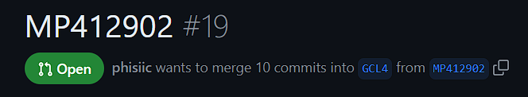

Zawiera on informacje o wszystkich commitach, które nastąpiły dotychczas.

### Lab 2

#### 1. Zainstalowanie Dockera w systemie linuksowym

Tak jak w poprzednim laboratorium, zainstalowano Dockera korzystając z sudo dnf install: 

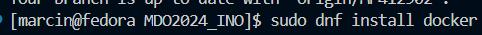

Sprawdzenie, czy poprawnie zainstalowano program:

.png)

#### 2. Rejestracja w Docker Hub
#### 3. Pobranie obrazów

Obrazy to szablony zawierające wszystkie potrzebne zależności i konfiguracje potrzebne do uruchomienia kontenera z aplikacją.
Należało pobrać cztery obrazy: *hello-world, busybox, fedora, mysql*.
Obrazy pobiera się poprzez Dockera - stosując komendę **docker pull**:

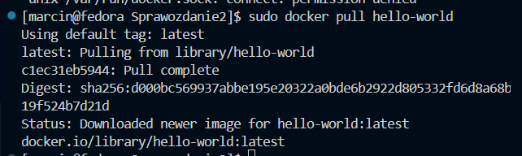

Warto zauważyć, że należy użyć *sudo* przy pobieraniu pakietów, gdyż Docker potrzebuje uprwanień do ich zainstalowania.

W ten sposób pobrano wszystkie obrazy. 

Można sprawdzić wszystkie pobrane obrazy przez komendę **docker images**:

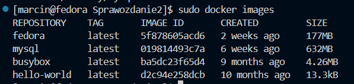

#### 4. Uruchomienie kontener z obrazu *busybox*

Polecenie **docker run** służy do uruchomienia nowego kontenera z podanym obrazem. 

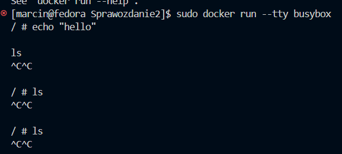

Stosując opcję **--tty** podpinamy obecny terminal do kontenera.

Można również odpalić kontener w tle i później się do niego podłączyć. W tym celu stosujemy opcję **-d** (detached) oraz podając mu komendę co ma robić na początku, żeby się nie wyłączył bezpośrednio po jego odpaleniu. Nadałem kontenerowi nazwę używając **--name**. 
Przy wykorzystaniu **docker ps** można zobaczyć wszystkie aktywne kontenery, a z opcją **-a**, nawet wyłączone kontenery wraz z aktywnymi.

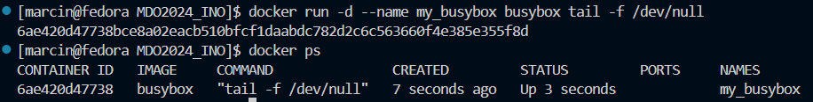

Łączę się do włączonego kontenera poprzez **docker exec** z opcją **-it** (interactive).

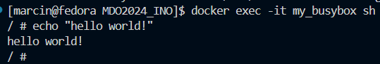

Sprawdzenie wersji busybox wewnątrz kontenera:

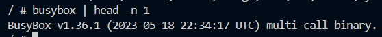

Po wyjściu z shella *exitem*, kontener nie zostaje zamknięty i nadal działa.

Zakończenie działania kontenera możemy osiągnąć używając **stop** lub **kill**, gdzie *stop* pozwala kontenerowi na zakończenie zadań i posprzątaniu po sobie, a *kill* nie czeka na zatrzymanie działania kontenera i po prostu go zatrzymuje.

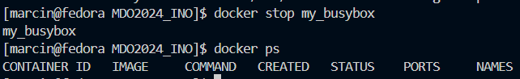

#### 5. Uruchomienie "system w kontenerze" (Fedora)
Uruchomiono kontener interaktywnie, a następnie sprawdzono działanie procesu o ID1 w kontenerze. Okazało się jednak, że obraz Fedory w kontenerze nie zawierał komendy *ps*, więc po jej wgraniu: 

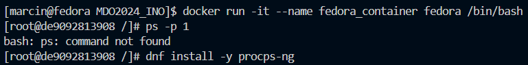

Sprawdzamy działanie PID1:

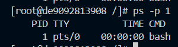

Procesy Dockera na hoście (*ps auxft* w terminalu hosta):

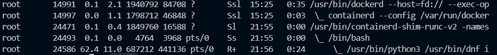

Widzimy, że proces 24493 u hosta to jest PID1 w kontenerze. Oznacza to, że root wewnątrz kontenera jest ten sam co root hosta. 

#### 6. Dockerfile

Dockerfile to plik, który zawiera zestaw instrukcji do tworzenia obrazów z odpowiednimi zależnościami wgranymi. Pozwala to ułatwić działanie kontenerów i ich łatwe przenoszenie na inne maszyny, ponieważ jeden skrypt pozwala nam zbudować to samo środowisko. 

Podczas próby zbudowania obrazu z Dockerfilem napotkałem na błąd:

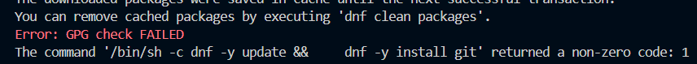

Problem z GPG key. 

Po głębszym zastanowieniu się nad błędem, który wyglądał następująco:

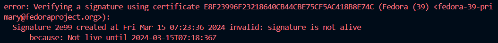

Doszedłem do wniosku, że maszyna wirtualna, na której pracuję nigdy nie była wyłączona - data na maszynie wirtualnej była z dnia jej utworzenia *06.03.2024*. Certifykat potrzebny do aktualizacji dnf oraz pobrania git'a potrzebował signature z przyszłości (15.03.2024) w stosunku do maszyny, stąd ten błąd. Po zmianie daty systemu na aktualną oraz instalacji *chrony* (program, który synchronizuje zegar systemowy w sposób bezpieczny z zegarami serwerów) udało się aktualizować dnf oraz pobrać git'a. 

**Dockerfile**
Przygotowałem prosty plik, który 
- Bazuje na najnowszym obrazie fedory (*FROM fedora:latest*)
- Aktualizuje dnf oraz pobiera git (*dnf update, dnf install git*)
- Klonuje repozytorium przedmiotu (*git clone*)
- Ustawia katalog roboczy (*WORKDIR*)
- Daje komendę początkową dla kontenera (*CMD*)

Następnie obraz możemy zbudować używając polecenia **docker build -t [nazwa_obrazu] [ścieżka_do_dockerfile]**. 

Ponieważ znajduję się w katalogu z Dockerfilem, moje polecenie wygląda następująco:

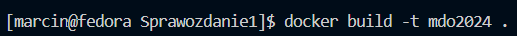

Sprawdzam obrazy mojego dockera, żeby zobaczyć czy udało się stworzyć mój obraz *mdo2024*:

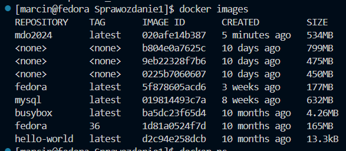

Jak widać, obraz mdo2024 powstał i można uruchomić aplikacje na jego podstawie. Również można zauważyć obrazy z "none" - powstały one podczas błędu GPG z niepoprawnym czasem systemu, więc je usuwam korzystając z polecenia **docker rmi [id_obrazu]**, żeby nie marnowały miejsca na dysku.

Uruchamiam kontener z utworzonego obrazu w trybie interaktywnym i sprawdzam czy udało się sklonować repozytorium.

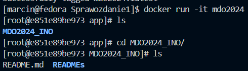

Widzimy, że istnieje katalog MDO2024_INO i reszta zawartości, co oznacza, że repozytorium zostało poprawnie sklonowane.

Mogę zobaczyć uruchomione kontenery przy użyciu **docker ps -a**

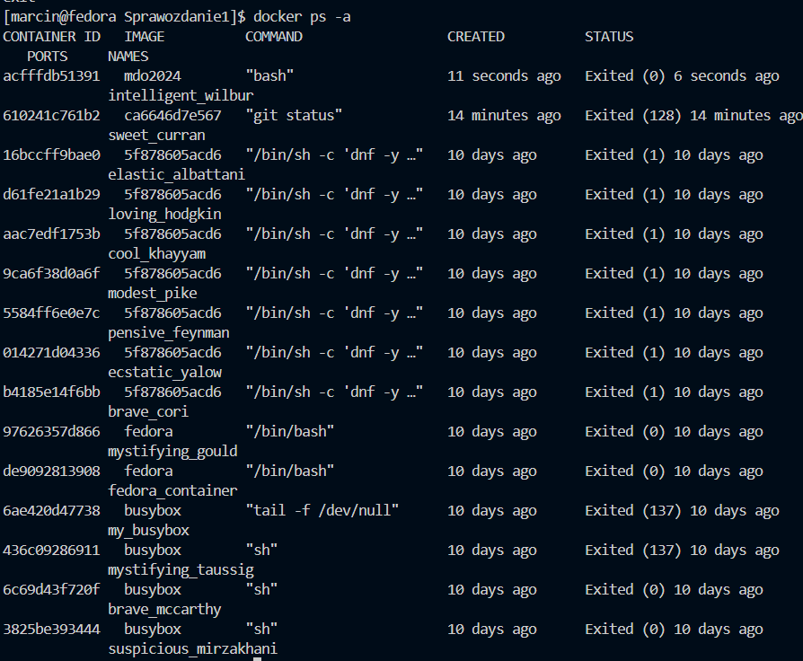

Widać utworzony kontener *intelligent_wilbur*.

Usuwam kontener przy użyciu **docker rm [nazwa]**, ale można również usunąć za pomocą **docker rm [id]**. 

### Wnioski 

- Git jest kluczowym narzędziem przy większych projektach, gdyż pozwala na rozwijanie programu przez wiele drużyn na osobnych gałęziach. 

- Klucze SSH pozwalają na bezpieczne połączenie się do git.

- Dockera umożliwia łatwe tworzenie, uruchamianie i zarządzanie kontenerami, co przekłada się na elastyczność i niezależność aplikacji od środowiska, a także ułatwia proces wdrażania aplikacji.

- Dockerfile umożliwia standaryzację procesu budowy obrazów kontenerów, co przyspiesza wdrażanie aplikacji i zapewnia spójność środowiska pracy.

- Problemy związane z błędem GPG key pokazują, jak istotne jest odpowiednie skonfigurowanie środowiska pracy, w tym synchronizacja zegara systemowego, co może mieć wpływ na działanie różnych narzędzi i procesów.

