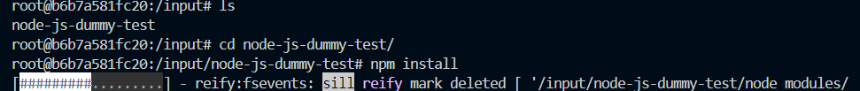
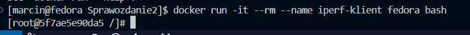
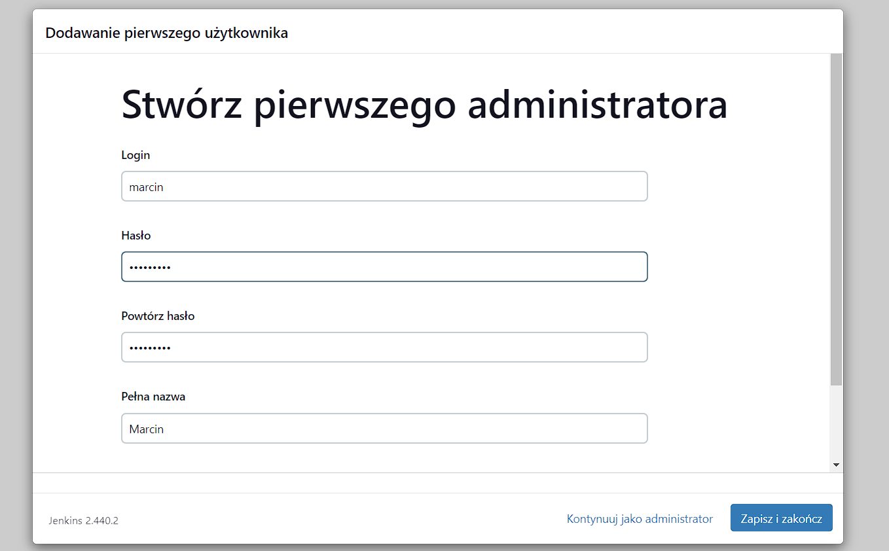

# Sprawozdanie 2
## Marcin Pigoń
## ITE gr. 4

### Cel: Zapoznanie się z Dockerfile oraz sieciami w Dockerze.

### Lab 3
***
Tworząc programy, często korzystamy z bibliotek oraz frameworków - zależności zewnętrznych, które niekoniecznie muszą być zainstalowane na maszynie klienta. W tym celu stosujemy kontenery Dockera - odizolowane środowiska, w których możemy uruchamiać nasze aplikacje wraz z ich zależnościami, niezależnie od systemu operacyjnego czy konfiguracji maszyny docelowej. Dzięki temu zapewniamy spójność środowiska uruchomieniowego oraz ułatwiamy proces wdrażania aplikacji, eliminując potencjalne problemy związane z różnicami w środowiskach wykonawczych. Jednak, każdorazowa konfiguracja takiego kontenera jest czasochłonna i może być ułatwiona poprzez wykorzystanie narzędzia do definiowania obrazów kontenerowych, takiego jak Dockerfile. Dockerfile to plik tekstowy zawierający instrukcje służące do budowania obrazu kontenera.

W Dockerfile możemy zdefiniować wszystkie kroki niezbędne do skonfigurowania środowiska uruchomieniowego naszej aplikacji. Możemy określić bazowy obraz, instalować zależności, kopiować pliki aplikacji do kontenera, konfigurować zmienne środowiskowe oraz uruchamiać polecenia inicjalizacyjne.

W tym ćwiczeniu należało wykorzystać Dockerfile do automatyzacji procesu tworzenia kontenera. W tym celu wykorzystano dwa repozytoria:
- node-js-dummy-test: https://github.com/devenes/node-js-dummy-test
- irssi: https://github.com/irssi/irssi 

Oba repozytoria zawierały możliwość buildowania oraz przeprowadzania testów; w repozytorium node.js używamy *npm*, a dla irssi *ninja*. 

Przykładowo, chcąc przeprowadzić instalację programu irssi w nowym środowisku, należałoby instalować wszystkie zależności zanim możemy przeprowadzić instalację programu i jego uruchomienie. Lista zależności wygląda następująco: *git meson ninja gcc glib2-devel utf8proc ncurses perl-Ext openssl*. Każdorazowa instalacja ręcznie jest dość uciążliwa, więc możemy napisać prosty plik *irssi-builder.Dockerfile*, który skraca wgrywanie wszystkich zależności do jednej komendy *docker build*. 

W Dockerfile'u korzystamy z różnych poleceń, takich jak:

- FROM: definiuje bazowy obraz, na którym rozwijamy nasz kontener.
- RUN: polecenia, które mają zostać wykonane podczas budowania obrazu.
- WORKDIR: katalog roboczy.
- CMD: domyślna komenda, która ma być uruchomiona w kontenerze, gdy nie podamy innej. 

Warto również zauważyć, że mamy osobne biblioteki developerskie - przykładowo *glib2-devel*, które są wyposażone w dodatkową funkcjonalność w porównaniu co do zwykłej. Dlatego również trzeba uważnie czytać dokumentację programów, żeby nie mieć później problemów z brakującymi zależnościami.

W wyniku polecenia:
*docker build -t irssi-builder -f irssi-builder.Dockerfile .* 
Otrzymujemy obraz z zainstalowanym i zbudowanym programem irssi. Konteneryzacja upraszcza przenoszenie budowania aplikacji do innych maszyn.

W analogiczny sposób zbudowano obraz wykorzystując Dockerfile do wykonywania testów dla tej aplikacji - irssi-tester.Dockerfile:

Używamy RUN zamiast CMD, ponieważ chcemy, żeby testy się wykonały od razu podczas budowania obrazu do testów, a nie podczas jego odpalenia. W dodatku używamy RUN, kiedy nie chcemy pozwolić użytkownikowi na wykonywanie dodatkowych czynności w terminalu (po wykonaniu testów), gdyż może to naruszać na bezpieczeństwo lub konfiguracje kontenera.

Sprawdzam używając 'docker images' powstałe obrazy do budowania i testowania. Na ich podstawie teraz mógłbym uruchomić kontener, ale bez polecenia początkowego kontener od razu się wyłączy. Jednak trzeba się zastanowić nad sensownością tworzenia kontenera dla tego programu - irssi jest systemem chatu IRC (Internet Relay Chat), więc nie jest to często spotykany use-case dla konteneryzacji.

Częściej spotyka się kontenery dla usług sieciowych lub innych backendowych programów. Przykładem jest aplikacja node'owa.

W analogiczny sposób stworzono dockerfile do budowania, testowania oraz deployowania:

node-builder.Dockerfile

node-tester.Dockerfile

node-deployer.Dockerfile

Odpalając dockerfile używając run widzimy aktywację portu - nasz kontener się zbudował z obrazu node-builder a następnie przy uruchomieniu odpalił się z poleceniem npm start.

Sprawdzając odpalone kontenery używając docker ps widzimy odpalony kontener irssi oraz node.

### Lab 4

W Dockerze, "volumes" są używane do trwałego przechowywania danych pomiędzy kontenerami i hostem, umożliwiając separację danych od kontenerów oraz łatwiejsze zarządzanie nimi. Stosuje się je do takich celów jak bazy danych, pliki konfiguracyjne i logi, zapewniając dostępność danych po ponownym uruchomieniu kontenera.

Tworzymy volume za pomocą polecenia docker volume create.

Następnie sprawdzamy czy poprawnie zostały stworzone woluminy przez ls

Zadanie polegało na sklonowaniu repozytorium za pośrednictwem volumes bez instalacji git'a w kontenerze. 

Osiągnąłem to poprzez stworzenie kontenera pomocniczego, który klonuje repozytorium do woluminu, a nastepnie włączam kontener z woluminem. 

sudo docker run -it --rm --name temp_container --mount source=vol_in,target=/input node bash

Teraz w kontenerze pomocniczym klonuje repozytorium:

Teraz mamy repozytorium w woluminie i możemy utworzyć kontener bazowy z oba woluminami - in i out. Z vol_in mogę skopiować repozytorium do vol_out. 

Buduję program poprzez npm install

Poleceniem cp (copy) mogę przenieść zbudowany program do woluminu wyjściowego

Można spróbować użyć polecenia VOLUME w Dockerfile'u do utworzenia woluminu, przykładowo polecenie to mogłoby wyglądać:

Niestety jednak nie tworzy to woluminy jak przy volume create. 

Inną możliwością jest uruchomieniem dockerfile'a z poleceniem RUN --mount i dołączeniem odpowiednich woluminów.

Sprawdzam folder z moimi utworzonymi woluminami, który znajduje się w /var/lib/docker/volumes

W ten sposób mogę zweryfikować poprawność skopiowania danych do tego foldera i te dane będą zawsze dostępne, ponieważ są trwale na systemie hosta, a nie jedynie w kontenerze. Warto również zauważyć, że jedynie mogę wyświetlić zawartości folderów, ponieważ system blokuje otwierania foldera docker, nawet jako użytkownik uprzywilejowany. 

Kolejne zadanie polegało na zbudowaniu sieci docker (docker network) oraz eksponowania portu. Sieci te pozwalają na komunikację kontenerów między sobą oraz z zewnętrznymi serwisami. Umożliwia to tworzenie aplikacji mikroserwisowych - rozdzielenie aplikacji na mniejsze niezależne części, które współpracują ze sobą w dostarczeniu programu. 

Korzystam z programu iperf3, służącego do pomiaru przepustowości sieci poprzez generowanie ruchu między dwoma punktami w sieci. 

W celu stworzenia kontenera z iperf-serwerem, korzystam z polecenia 

Obrazem tutaj jest 'networkstatic/iperf3', który jest często używanym obrazem z skonfigurowanym serwerem iperf3 gotowym do użycia. Port 5201 jest portem domyślnym wykorzystywanym przez ten program. Uruchomienie kontenera z opcją -s pozwala na czekanie serwera na połączenia

Sprawdzam adres IP utworzonego kontenera korzystając z docker inspect <nazwa_serwera>

I w NetworkSettings mamy zawartą informację na temat adresu IP

Następnie tworzę kontener dla klienta, przez który będę się łączył do kontenera serwerowego

Instaluję program iperf3 w kontenerze

A następnie łączę się do kontenera serwerowego za pomocą jego adresu IP poleceniem:

Gdzie opcja -c oznacza "client" oraz -p zaznacza do którego portu chcemy się podłączyć. W wyniku działania programu otrzymujemy wartości

Test wykonany na serwerze

Jak widać prędkości serwera i klienta były takie same.

Następnie należało utworzyć sieć typu bridge do połączenia się i zmierzenia przepustowości. Sieć typu bridge w Dockerze jest domyślną siecią, która izoluje kontenery od hosta oraz umożliwia komunikację między nimi, zapewniając również domyślne przekazywanie portów pomiędzy kontenerami a hostem.

Tworzymy taką sieć poleceniem 
docker network create <nazwa_sieci>

Następnie tworzę kontenery (serwera i klienta) w utworzonej sieci

Sprawdzając adres IP poleceniem inspect, widzimy, że w sieciach pojawiła się utworzona sieć:

Sprawdzając prędkości w tym przypadku

Dodatkowo, jak sprawdzę swoją sieć poleceniem

Mogę zobaczyć, które kontenery znajdują się w mojej sieci:

Taka możliwość pozwala mi na połączenie się poprzez adres IP jak i również przez nazwę kontenera, gdyż należą do tej samej sieci. 

Więc polecenie iperf3 -c iperf-serwer wykonuje to samo co gdybym się połączył przez adres IP. 

Próba połączenia się do serwera z poziomu hosta (maszyny wirtualnej z Fedorą 39) za pomocą nazwy kontenera nie działa, ponieważ nazwy kontenerów nie są automatycznie rozpoznawane przez systemy DNS na poziomie hosta. 

Zatem w celu połączenia się należy użyć adresu IP. 

Próba połączenia się do hosta spoza nie powiodła się - jest to ponieważ port nie został eksponowany i nie był widoczny spoza hosta. W tym celu należało uruchomić usługę iperf3 podając port:

Dodatkowo, musiałem ręcznie sforwardować port z poziomu Visual Studio Code, ponieważ program nie wykrył automatycznie otwartego portu, gdzie w przypadku aplikacji node'owej wykonał to sam.

Po wykonaniu tego kroku, mogłem połączyć się do kontenera serwera wewnątrz maszyny wirtualnej z poziomu Windowsa (hosta maszyny wirtualnej). Również muszę wspomnieć, że adres jaki wykorzystałem to 127.0.0.1 (localhost) zamiast adresu lokalnego IP wewnątrz maszyny. 

Ostatnie zadanie polegało na instancji Jenkins. Jenkins to narzędzie do automatyzacji procesów ciągłej integracji i dostarczania oprogramowania, które umożliwia programistom automatyzację testów, kompilacji i wdrażania aplikacji.

Pierwsze należy utworzyć sieć Jenkins

Teraz możemy wprowadzić komendę docker run, która służy do konfiguracji i instalacji instancji

Następnie tworzę Dockerfile do tworzenia oficjalnego obrazu Jenkins:

Buduję obraz z wykorzystaniem polecenia

I uruchamiamy kontener z isntancją Jenkins.

W celu odblokowania Jenkins, należy przejść do strony https://localhost:8080, gdzie znowu musiałem ręcznie przekazywać port 8080. 

Jak widać instalacja poszła pomyślnie. 

Sprawdzam uruchomione kontenery

Sprawdzam hasło do Jenkins poleceniem: 

Po podaniu hasła z logów otrzymujemy możliwość instalacji wtyczek

Ostatecznie mogę stworzyć adminstratora

