# Sprawozdanie 3
## Marcin Pigoń
## ITE gr. 4

### Cel: Zapoznanie się z Pipeline oraz Jenkins.

### Lab 5

Pipeline możemy rozumieć jako zestaw kroków lub etapów, których celem jest automatyzacja procesu wytwarzania oprogramowania. Każdy krok w pipeline może wykonywać osobne zadania, takie jak: kompilacja kodu, testowanie, pakowanie aplikacji oraz wdrażanie jej na serwer. Pipeline umożliwia model CI/CD (continuous integration and continuous delivery) - oznacza to, że zmiany w kodzie są automatycznie testowane i wdrażane, co skraca czas potrzebny na dostarczenie nowych funkcjonalności lub poprawek. 

Jenkins jest popularnym narzędziem do automatyzacji ciągłej integracji i dostarczania. Monitoruje repozytoria kodu w poszukiwaniu zmian i gdy one są wykryte to Jenkins uruchamia utworzone przez użytkownika polecenia; np. budowanie projektu, uruchamianie testów jednostkowych i wdrażanie aplikacji. Jenkins umożliwia tworzenie i zarządzanie pipeline'ami. 

Środowisko na zajęcia prezentuje się następująco:

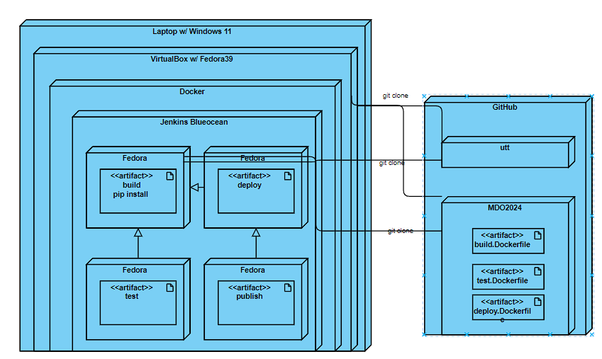

Wewnątrz maszyny wirtualnej startujemy kontener z Jenkins, który przeprowadza kolejne kroki z budowania aplikacji na podstawie dockerfile'i. 

Diagram aktywności wygląda tak:

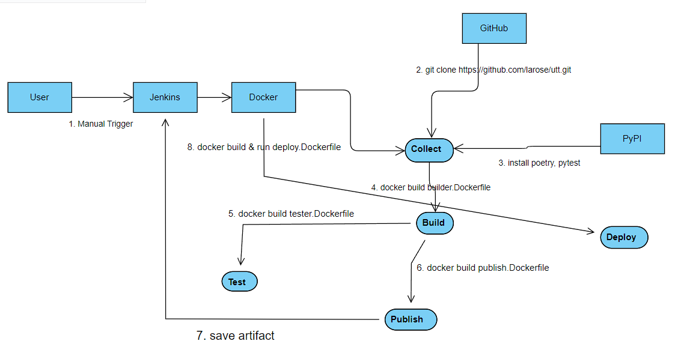

Zajęcia polegały na utworzeniu pipeline do buildowania, testowania oraz deployowania wybranej aplikacji. Z powodu dużej popularności repozytorium, z którego wcześniej korzystałem zdecydowałem się pracować z nowym repozytorium - moro - aplikacja do pomiaru czasu osoby w pracy. Była ona na podstawie node. Jednak aplikacja ta nie jest wspierana od 5 lat, więc jest bardzo przestarzała i występowało wiele problemów na etapie instalacji zależności oraz przeprowadzania testów. 

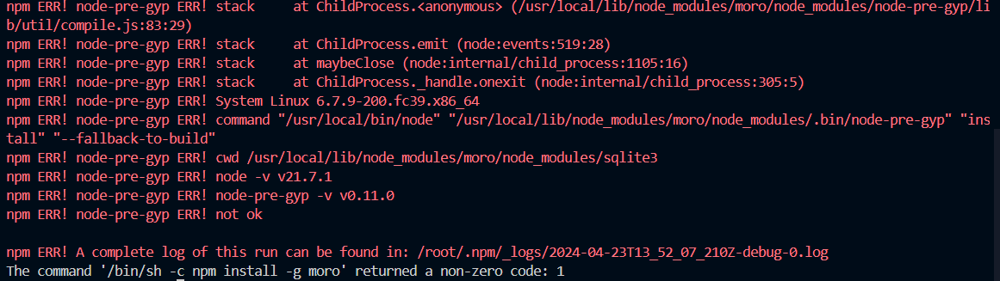

Zmieniłem repozytorium ponownie na "utt" - aplikacja Pythonowa, która również mierzy czas czynności. W związku z tym, musiałem napisać nowe Dockerfile do budowania, testowania oraz deployowania, które będą używane w pipeline. 

Sprawdzam poprawność działania nowych obrazów i kontenerów:

Build
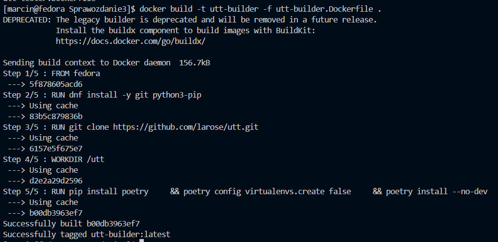

Test
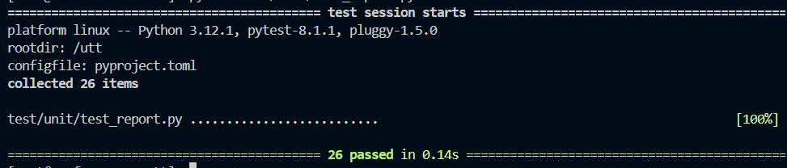

Deploy
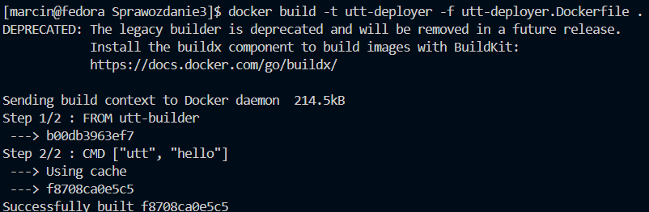

Poleceniem "utt hello" zaczynamy pomiar czasu, który pózniej będziemy sprawdzać. 

Instalacja Jenkins została przeprowadzona w poprzednim sprawozdaniu. 

Zaczynając pracę z Jenkins, możemy przetestować podstawowe projekty - projekt ten będzie wyświetlać uname w Jenkins:

Należy ustawić w krokach budowania polecenie, które chcemy wykonać i je uruchomić
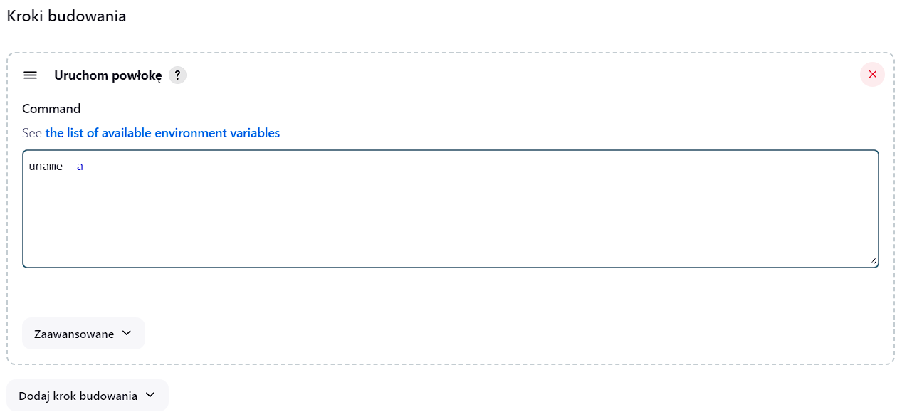

W logach konsoli możemy sprawdzić działanie
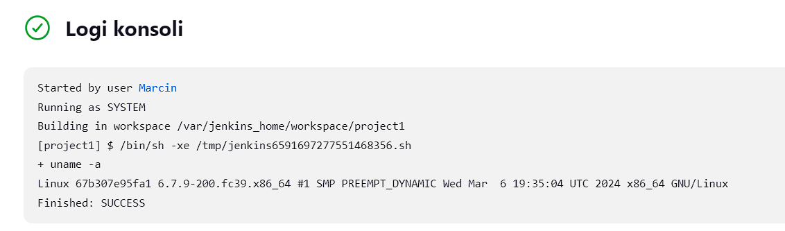

Następnie przechodzimy do projektu, w którym sprawdzamy czy godzina jest parzysta - jeśli jest to zwracamy informację, a jeśli nie to zwracany jest błąd.

Krokiem budowania jest prosty skrypt bashowy
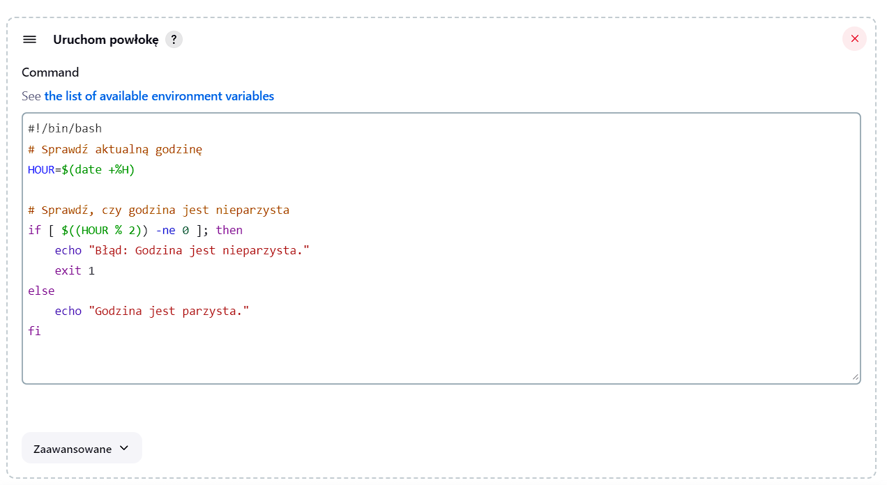

Błąd skryptu, ponieważ godzina była nieparzysta
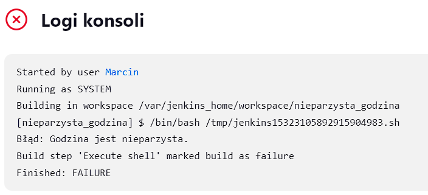

Poprawnie działający skrypt o parzystej godzinie
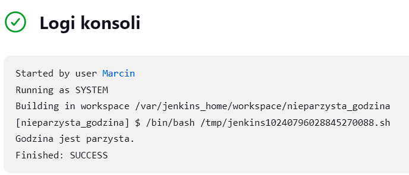

Dzięki logom konsoli, możemy sprawdzać co poszło nie tak w naszych pipelinach/projektach i próbować to naprawić.

