# Sprawozdanie 3
## Marcin Pigoń
## ITE gr. 4

### Cel: Zapoznanie się z Pipeline oraz Jenkins.

### Lab 5

Pipeline możemy rozumieć jako zestaw kroków lub etapów, których celem jest automatyzacja procesu wytwarzania oprogramowania. Każdy krok w pipeline może wykonywać osobne zadania, takie jak: kompilacja kodu, testowanie, pakowanie aplikacji oraz wdrażanie jej na serwer. Pipeline umożliwia model CI/CD (continuous integration and continuous delivery) - oznacza to, że zmiany w kodzie są automatycznie testowane i wdrażane, co skraca czas potrzebny na dostarczenie nowych funkcjonalności lub poprawek. 

Jenkins jest popularnym narzędziem do automatyzacji ciągłej integracji i dostarczania. Monitoruje repozytoria kodu w poszukiwaniu zmian i gdy one są wykryte to Jenkins uruchamia utworzone przez użytkownika polecenia; np. budowanie projektu, uruchamianie testów jednostkowych i wdrażanie aplikacji. Jenkins umożliwia tworzenie i zarządzanie pipeline'ami. 

Środowisko na zajęcia prezentuje się następująco:

Wewnątrz maszyny wirtualnej startujemy kontener z Jenkins, który przeprowadza kolejne kroki z budowania aplikacji na podstawie dockerfile'i. Kontener Jenkins Blueocean musi działać, żeby była możliwość zarządzania pipelinem. Kontenery Dockera działają z GitHubem w celu sklonowania obrazów z mojej gałęzi na repozytorium przedmiotowym oraz klonują kod programu oraz testów z repozytorium Ultimate Time Tracker. 

Diagram aktywności wygląda tak:

Zajęcia polegały na utworzeniu pipeline do buildowania, testowania oraz deployowania wybranej aplikacji. Z powodu dużej popularności repozytorium, z którego wcześniej korzystałem zdecydowałem się pracować z nowym repozytorium - moro - aplikacja do pomiaru czasu osoby w pracy. Była ona na podstawie node. Jednak aplikacja ta nie jest wspierana od 5 lat, więc jest bardzo przestarzała i występowało wiele problemów na etapie instalacji zależności oraz przeprowadzania testów. 

Zmieniłem repozytorium ponownie na "utt" - aplikacja Pythonowa, która również mierzy czas czynności. W związku z tym, musiałem napisać nowe Dockerfile do budowania, testowania oraz deployowania, które będą używane w pipeline. 

Sprawdzam poprawność działania nowych obrazów i kontenerów:

Build
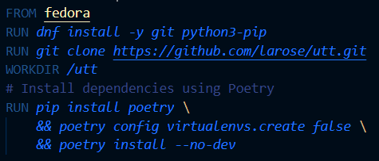

Test
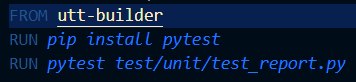

Deploy
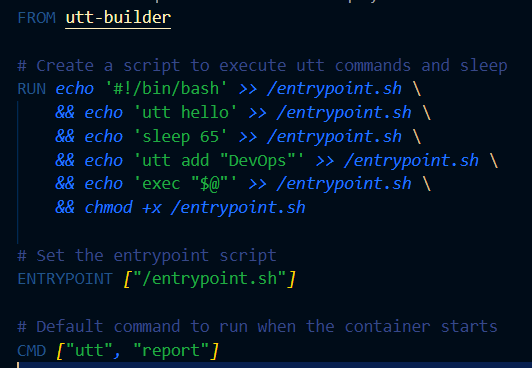

Tworzę skrypt, który jest entrypointem kontenera. W nim będę zaczynał pomiar czasu a wyświetlany będzie raport.
Poleceniem "utt hello" zaczynamy pomiar czasu, który pózniej będziemy sprawdzać. 

Wynik uruchamiania deployer'a

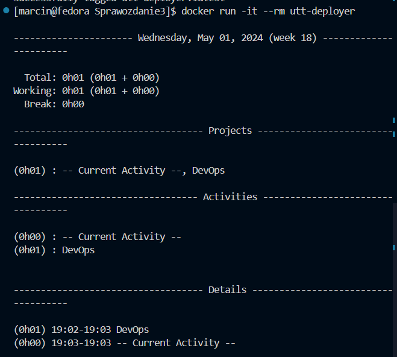

Instalacja Jenkins została przeprowadzona w poprzednim sprawozdaniu, więc nie będę jej ponownie omawiać.  

Zaczynając pracę z Jenkins, możemy przetestować podstawowe projekty - projekt ten będzie wyświetlać uname w Jenkins:

Należy ustawić w krokach budowania polecenie, które chcemy wykonać i je uruchomić

W logach konsoli możemy sprawdzić działanie

Następnie przechodzimy do projektu, w którym sprawdzamy czy godzina jest parzysta - jeśli jest to zwracamy informację, a jeśli nie to zwracany jest błąd.

Krokiem budowania jest prosty skrypt bashowy

Błąd skryptu, ponieważ godzina była nieparzysta

Poprawnie działający skrypt o parzystej godzinie

Dzięki logom konsoli, możemy sprawdzać co poszło nie tak w naszych pipelinach/projektach i próbować to naprawić.

Następnie należało stworzyć "prawdziwy projekt", który klonował moją gałąź z repozytorium i budował z dockerfile obraz. 

Tworzę projekt z odpowiednim linkiem do repozytorium:

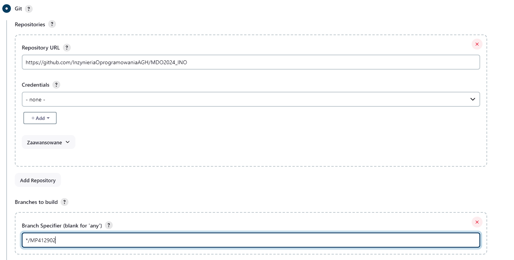

Dodano kroki budowania:
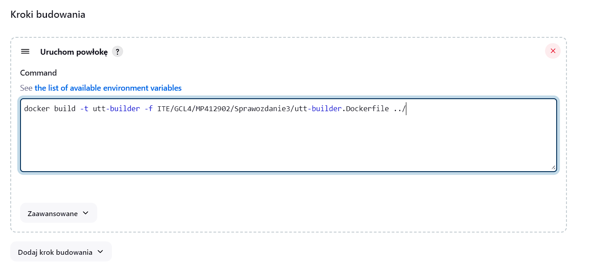

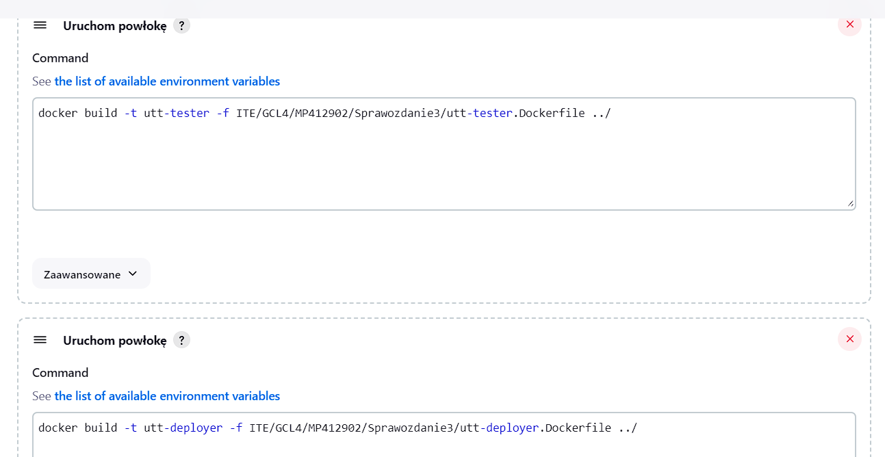

Ostatecznie powiodło się zbudować obraz z dockerfile
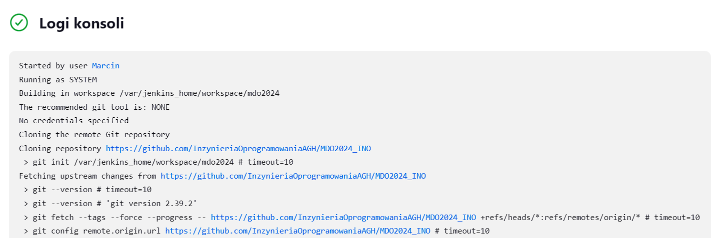

**Tworzenie Pipeline**
Licencja programu Ulitmate Time Tracker (utt) jest objęty licencją GPL-3.0 - oznacza to, że jest open-source i można go wykorzystywać do celów naukowych oraz modyfikować. 

Pipeline początkowo składa się z podstawowych kroków, które wcześniej były wykonywane za pomocą Dockerfiles. Krok deploy wymaga osobnego obrazu, ponieważ uruchamiamy kontener z programem oraz skrpytem do jego uruchamiania, a w buildzie jedynie pobieramy i budujemy obraz.  Pierwszym krokiem natomiast w tej wersji jest wyczyszczenie środowiska, żeby instalacja i budowanie przebiegało w tych samych warunkach bez pozostałości z poprzednich prób budowania.

Budowanie może przebiegać w DIND (Docker in Docker) lub bezpośrednio w kontenerze z CI. Różnica podejść polega na tym, że DIND jest bardziej odizolowany od podejścia w kontenerze - proces ten jest w osobnym kontenerze, wewnątrz kontenera. Podejście DIND jest jednak bardziej wymagające ze względu na wymaganą konfigurację kontenerów wewnątrz kontenerów oraz wymaga więcej zasobów systemowych. 

*Stage Clean*
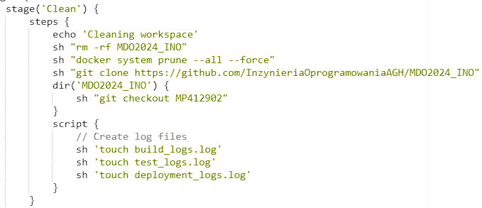

W tym etapie usuwane są stare wersje plików oraz stare obrazy, żeby instalacja oraz budowa nie była przeprowadzana z cache'u. W ten sposób symulujemy świeżą instalację oraz możemy stwierdzić czy nie brakuje żadnych zależności. Tworzone oraz są pliki logów, do których będą zapisywane informacje z następnych kroków pipeline. Klonuję tutaj nasze repozytorium oraz przełączam się na swoją gałąź, żeby mieć dostęp do swoich plików.

*Stage Build*
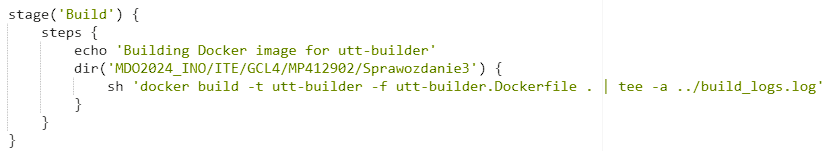

Tutaj w identyczny sposób co w localhost zmieniamy katalog roboczy i tworzymy obraz bazowy z wszystkimi zależnościami. Obraz ten jest wykorzystywany w obrazie testowym oraz do deploy'owania. Logi są również zapisywane do odpowiedniego pliku.

*Stage Test*
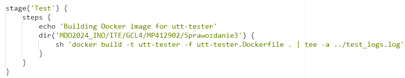

Tutaj uruchamiam testy za pomocą pytest i zapisuję ich wynik do logów testowych.

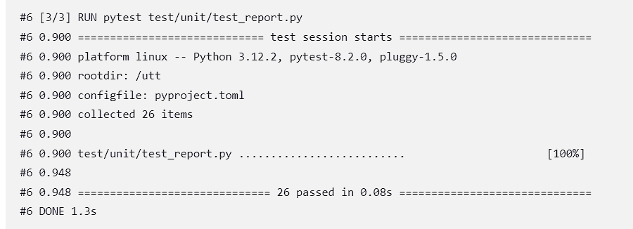

*Stage Deploy*
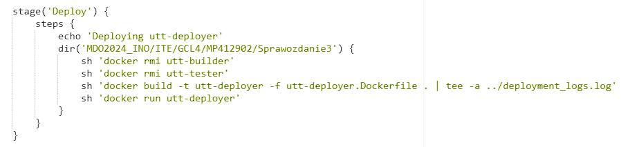

Podstawowa wersja deploy buduje obraz z programem i skryptem, który mierzy minutę i nadaje zadanie "DevOps". Następnie uruchamiany jest kontener, który wypisuje nam działanie do logów. Sprzątane są tutaj również już niepotrzebne obrazy do budowania oraz testowania, ponieważ one nie będą używane przez użytkownika.

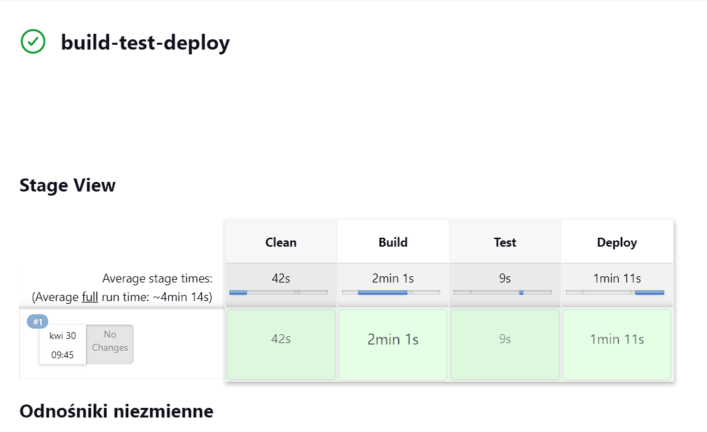

Udało się odpalić prosty pipeline służący do budowania, testowania oraz deployowania aplikacji. Warto pamiętać, że czas wykonania w kroku deploy jest o wydłużony o minutę, żeby pokazać prawidłowe działanie programu utt. 

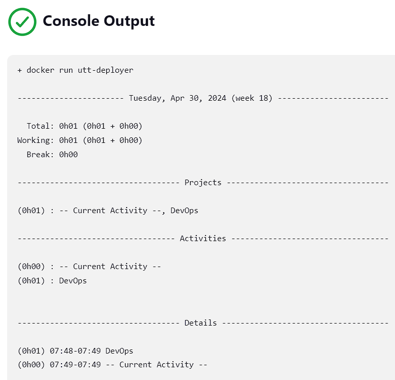

Wdrożenie tej aplikacji wykonam poprzez publikację obrazu do DockerHub, ponieważ wtedy nie będzie wymagać konfiguracji środowiska - plik dockerfile się tym zajmię. Oczywiście można byłoby stworzyć plik TAR lub ZIP, w którym miałbym wgrany wykonywalny kod, i wysłać go do Python Package Index (PyPI). Jednak program ten jest gotowy do działania i ustawiony wewnątrz obrazu. Publikując obraz do DockerHub jestem pewien, że aplikacja będzie miała odizolowane środowisko do działania. Wadą jednak tego podejścia jest potrzebna znajomość pracy z kontenerami Dockera oraz większe zapotrzebowanie pamięci, gdyż obraz Docker'a jest większy niż tylko potrzebne pliki. 

Najpierw jednak dodam archiwizację logów do poszczególnych kroków. Zapamiętując logi podczas budowania, testowania oraz deploy'u pozwolą na późniejszą retrospekcję oraz ewentualny debugging na ich podstawie. Dodano również parametr pipeline - wersje obrazu. 

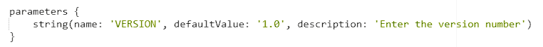

Poprzez parametry możemy w szybki i prosty sposób zmieniać działanie pipeline - czy to przez opcje True/False np. przy DEBUGGING lub dodawanie numeru wersji do obrazu oraz logów.

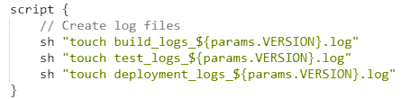

Archiwizacja logów
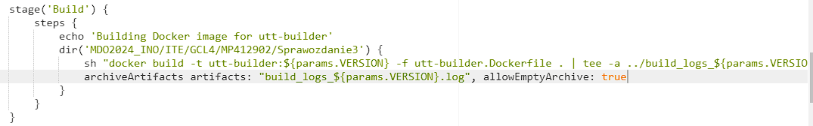

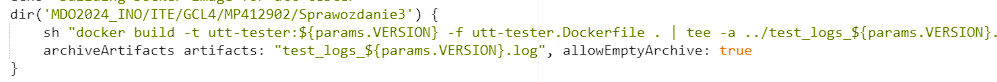

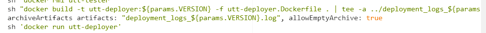

Ostatnim krokiem w pipeline jest publikowanie obrazu do DockerHub. W tym celu należy utworzyć nowy etap pipeline w następujący sposób:

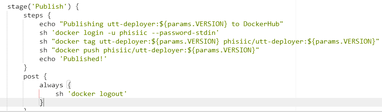

Należało zalogować się do Dockera swoim kontem i podać hasło - robię to wprowadzając hasło, żeby nie było w pliku Jenkinsfile. 

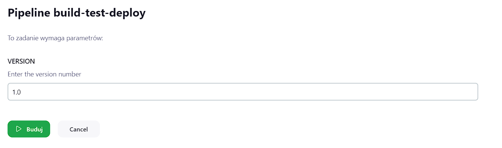

Napotkałem problem podczas deployowania w Jenkinsie:

Mianowicie w etapie deploy, obraz się budował z tagiem nadanej wersji, ale ponieważ Dockerfile bazował się na wersji latest utt-builder, nie mógł go pullować. W takim wypadku należy zmodyfikować utt-deployer w taki sposób:

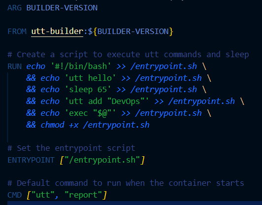

Nie można zapomnieć wysłać zmian na zdalne repozytorium, ponieważ zmiany zostaną tylko lokalnie (pipeline pobiera pliki z GitHub a nie z maszyny!)

Skrypt pipeline'u też musi ulec zmianie - należy dodać argument przy buildowaniu:
 

