Nadanie hostname 'ansible-target'

Wymiana kluczy ssh, umożliwiająca łączenie się bez podawania hasła

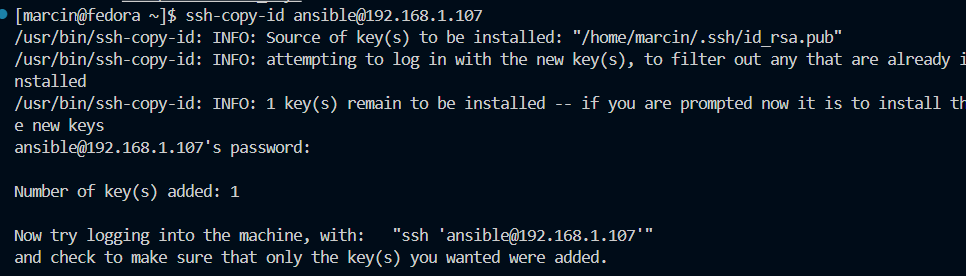

Wymiana udana - nie trzeba hasła

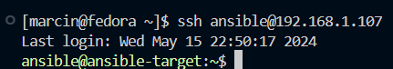

Upewnienie się, że program tar jest zainstalowany

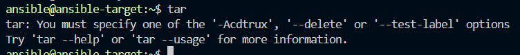

Dodanie do `etc/hosts` ansible-target, żeby umożliwić połączenie się za pomocą hostname, zamiast adresu ip.

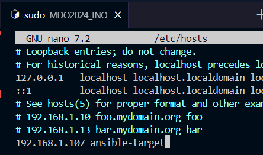

Połączenie działa 

### Inwentaryzacja

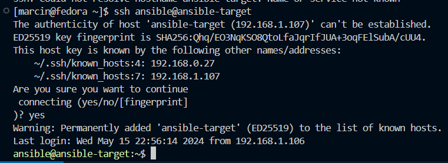

Problem z pingowaniem siebie: nie było klucza w authorized keys. Po jego dodaniu działa

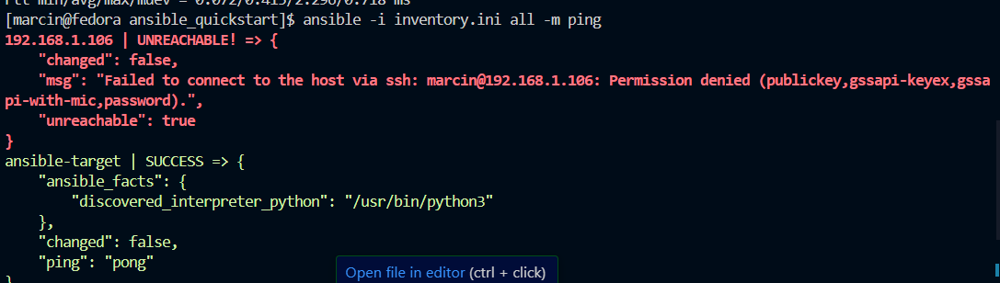

Udany ping

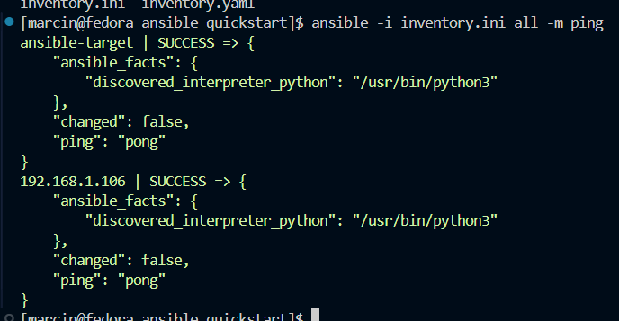

### Playbook Ansible

**ping.yml**

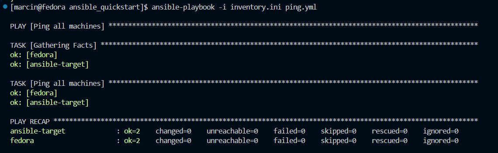

**copy_inventory.yml**

Pierwsze uruchomienie

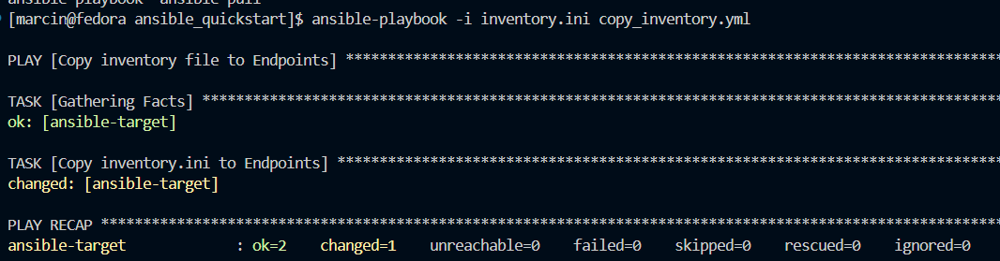

Drugie uruchomienie

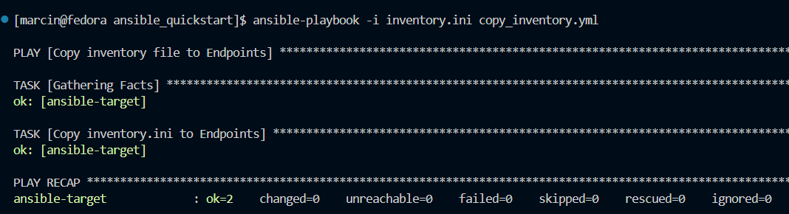

Sprawdzenie istnienia pliku na drugiej maszynie wirtualnej

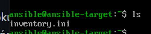

**update.yml**

wymagane sudo
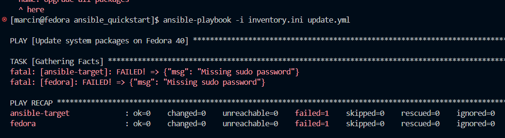

Sprawdzenie pakietów przed update

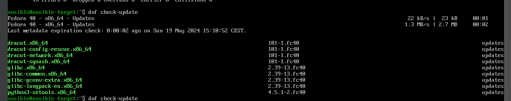

Po odpaleniu update.yml

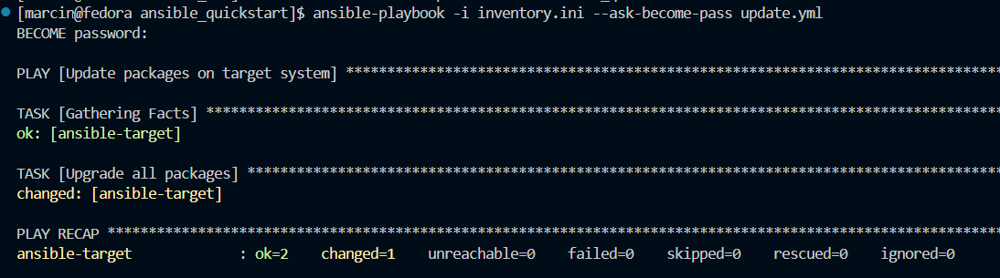

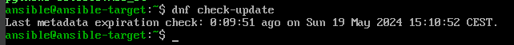

**restart.yml**
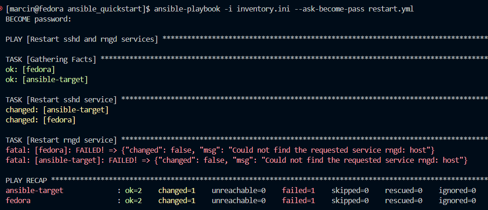

Nie ma rngd, trzeba zainstalować

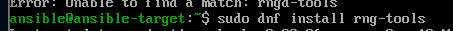

Start usługi oraz sprawdzenie czy jest aktywna

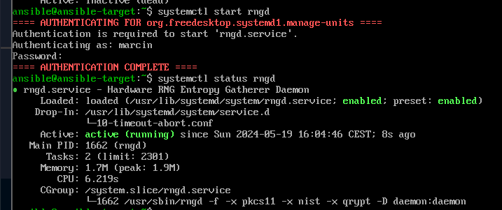

Udany restart usług

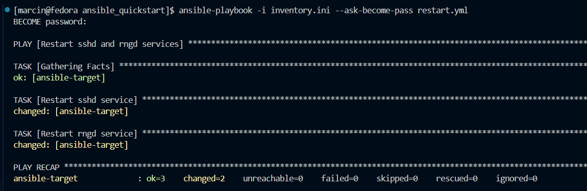

Widać, że usługa rng została zrestartowana, ponieważ czas działania jest od momentu wywołania playbook'a restart. Pozwala nam to na weryfikację działania playbooka. 

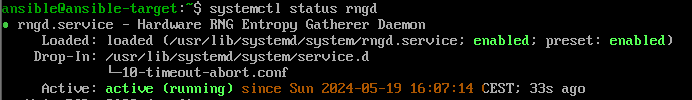

**Odpięcie karty sieciowej oraz wyłączenie usługi SSH**

Odpięcie karty sieciowej wykonane zostało za pomocą ustawień VirtualBox'a. 
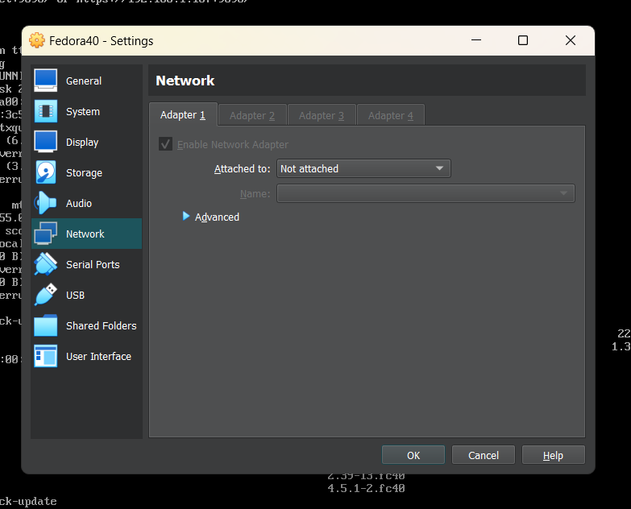

Wyłączenie SSH oraz sprawdzenie statusu.
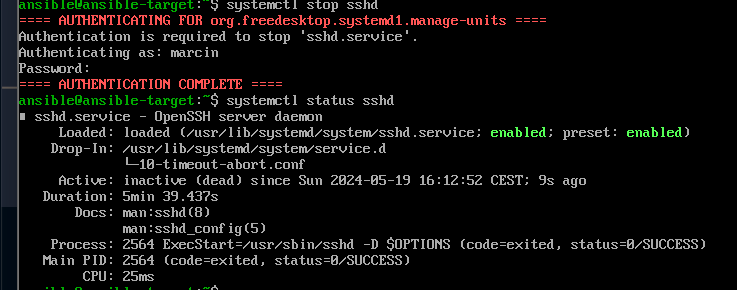

Próba przekopiowania inventory.ini do maszyny wirtualnej.

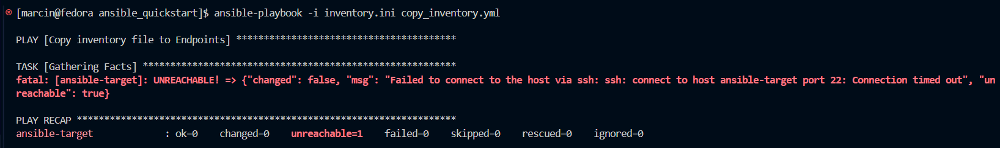

Maszyna wirtualna nie może odnaleźć w sieci target'a, więc program Ansible nie jest w stanie przesłać pliku. 

Po zrestartowaniu maszyny i ustawieniu bridged adapter, wszystko dziąła jak powinno

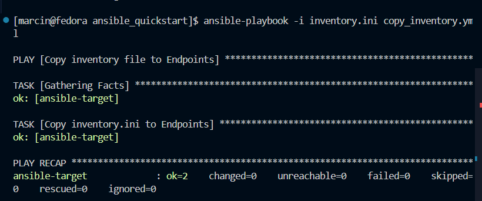

**Konteneryzacja za pomocą Ansible**

W celu pobrania obrazu, który był umieszczony na DockerHub na poprzednich zajęciach należy zainstalować program Docker na maszynie docelowej.

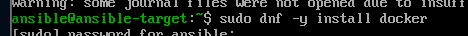

Sprawdzenie, czy Docker prawidłowo może pobrać obraz testowy hello-world

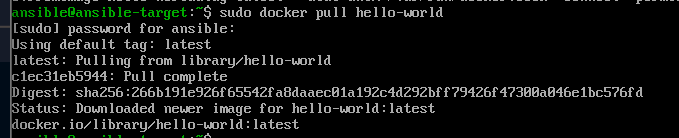

Należało napisać playbook do pobrania obrazu oraz uruchomienie kontenera z nim. 

Sprawdzenie poprawnego pobrania z playbooka oraz uruchomienia kontenera

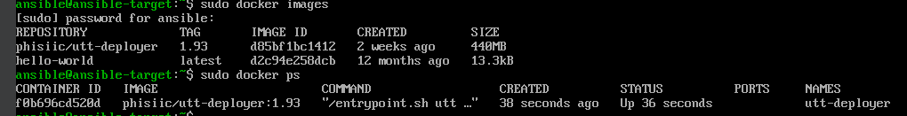

Tworzymy rolę w ansible-galaxy *utt-deployer*

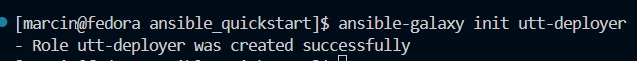

W nowo utworzonym katalogu tasks uzupełniamy plik main.yml o instrukcje podobne do wcześniej napisanego playbooka

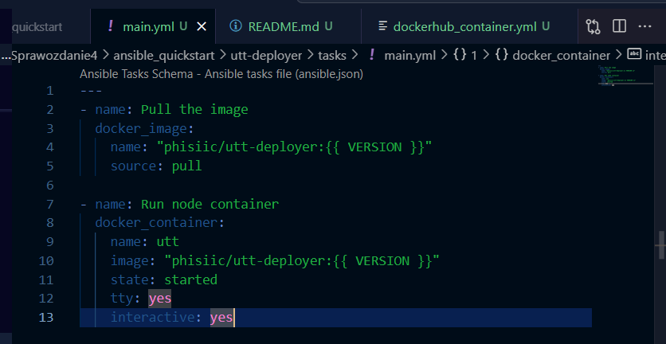

Wersję możemy ustawić wewnątrz defaults/main.yml

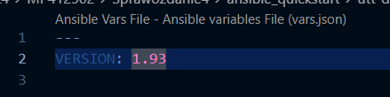

Należy teraz napisać playbook, który wykorzystuje rolę 

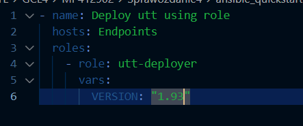

Po jego uruchomieniu otrzymałem błąd:

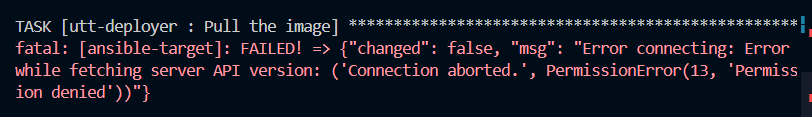

Sugeruje on, że docker nie ma uprawnień na systemie docelowym, więc należy użyć become. W tym celu należy uzupełnić main.yml w /tasks oraz w playbook'u role.yml, który korzysta z zadań w utt-deployer. 

Wskutek tych zmian otrzymujemy taką informację

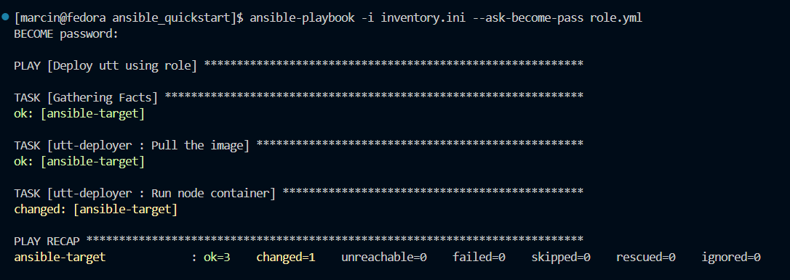

Oznacza, że obraz nie został znowu pobrany, tylko skorzystał z gotowego (wcześniej pobranego obrazu) i jedyną zmianą było ponowne uruchomienie kontenera z obrazu. 

## Instalacje nienadzorowane

Początkowo należało zainstalować nowy obraz maszyny wirtualnej o systemie operacyjnym Fedora 39. Wybrano tę wersję Fedory, ponieważ jest stabilniejsza i wersja 40 jest świeża, co oznacza, że może występować wiele błędów. 

e w GRUB i dodanie linku do wstawionego na GitHubie pliku

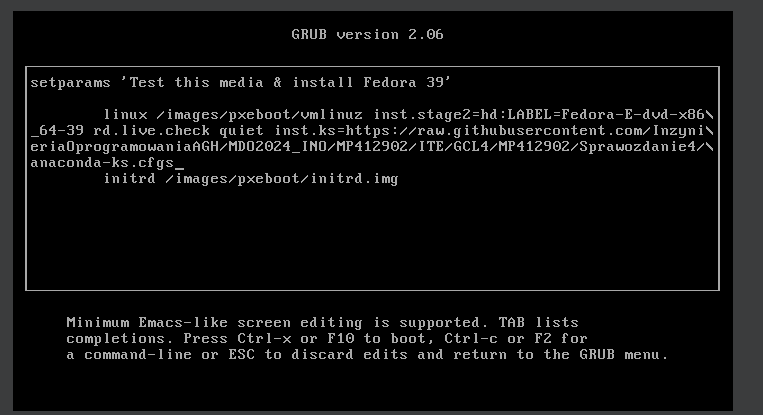