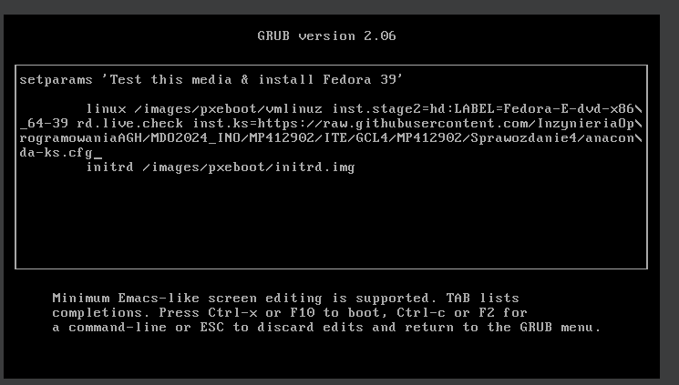
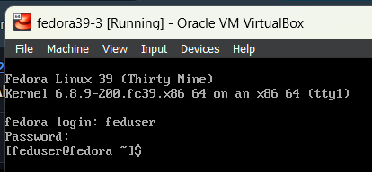
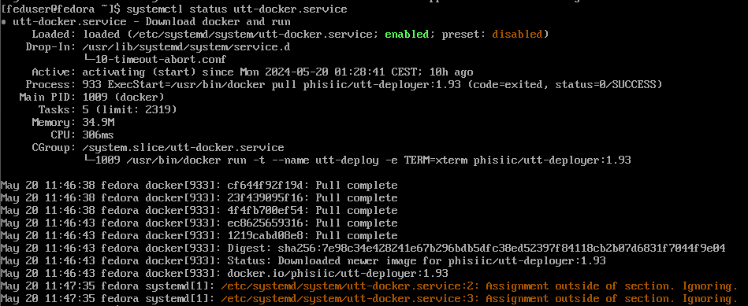
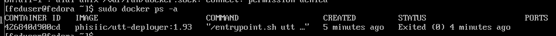
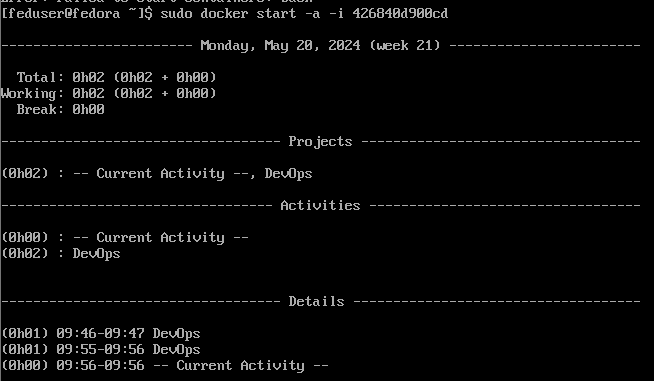
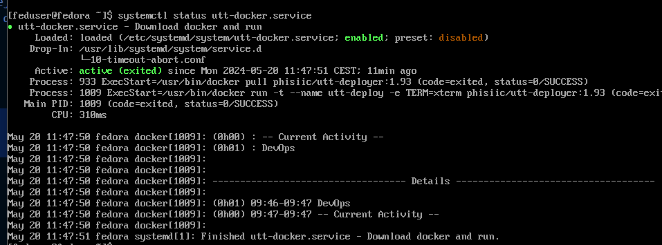

# Sprawozdanie 4
## Marcin Pigoń
## ITE gr. 4

### Cel: Zapoznanie się z zarządcą Ansible oraz instalacją nienadzorowaną

### Lab 8

*Ansible* jest narzędziem open-source, które służy do automatyzacji zarządzania konfiguracją, wdrażania aplikacji oraz orkiestracji zadań. Jest bezagentowy - oznacza to, że maszyny docelowe nie wymagają instalowania dodatkowego oprogramowania. Komunikacja odbywa się poprzez SSH. Ansible jest dosyć prosty w użyciu oraz korzysta z YAML - język, który jest logiczny oraz czytelny dla człowieka.

Pierwszym zadaniem było stworzenie nowej maszyny wirtualnej, która miała jak najmniejszy zbiór oprogramowania. Maszyna działała na najnowszej dystrybucji Fedory - Fedora40. Chcemy wykazać, że jedynie potrzeba SSH oraz tar, żeby na systemie dało się instalować nowe oprogramowanie oraz zarządzać nią. Ansible należało jedynie zainstalować na głównej maszynie (zarządcy). 

Instalacja Ansible odbywa się wskutek komendy `sudo dnf install -y ansible`. W analogiczny sposób pobieramy tar oraz sshd na nowej maszynie (ale sshd jest już domyślnie pobrane w systemie).

Kolejnym krokiem było utworzenie użytkownika 'ansible' oraz nadanie hostname 'ansible-target' dla odbiorcy. Użytkownika możemy dodać przez `sudo useradd ansible` i wykorzystać `sudo passwd ansible` do zmiany hasła. Zmiany nazwy host'a możemy dokonać przez `sudo hostnamectl set-hostname ansible-target`. Hostname służy do identyfikacji maszyny w sieci, żeby nie musieć pamiętać adresów IP, co może być kłopotliwe przy większej infrastrukturze IT. 

Jak już było wspomniane, Ansible działa przez łącza SSH. W tym celu należy wygenerować hasło poleceniem `ssh-keygen`, które domyślnie wygeneruje parę kluczy o typie rsa - jeden prywatny a drugi publiczny. Klucz publiczny należy przesłać do maszyny odbiorczej, w tym celu zastosowano `ssh-copy-id <user>@<ip>`.

Wymiana kluczy ssh, umożliwiająca łączenie się bez podawania hasła


Wymiana udana - klucz został skopiowany do pliku `.ssh/authorized_keys` w maszynie odbiorczej, co pozwala nam na połączenie się bez podawania hasła.


Upewnienie się, że program tar jest zainstalowany


Dodanie do `etc/hosts` ansible-target, żeby umożliwić połączenie się za pomocą hostname.


Możemy teraz się łączyć do maszyny poprzez `ssh <user>@<hostname>` zamiast ip.


### Inwentaryzacja

Ansible Inventory, czyli inwentarz, jest listą hostów, na których Ansible ma wykonywać zadania. Określamy adresy hostów poprzez adresy IP lub ich nazwę DNS. Plik ten może być formatu `.ini` lub `.yaml`. Różnica polega na tym, że `.yaml` jest zazwyczaj stosowany do bardziej złożonych infrastruktur, ponieważ jest czytelniejszy. Jednak w scenariuszu korzystamy jedynie z dwóch maszyn, więc dlaczego użyłem `.ini`. 

Plik `inventory.ini` wygląda następująco:

```
[Orchestrators]
fedora ansible_user=marcin

[Endpoints]
ansible-target ansible_user=ansible

```

Podział jest na `Orchestrators`, czyli maszyna nadzorująca - wysyłająca instrukcje. W tym przypadku jest to hostname mojej głównej maszyny `fedora` oraz użytkownik na niej wpisany `marcin`. 

`Endpoints` to węzły końcowe, nasze docelowe. W tym przypadku jest to `ansible-target` oraz użytkownik `ansible`. 

Po utworzeniu inwentarza, możemy odwoływać się do wymienonych w nim maszyn. Pierwszym zadaniem było pingowanie wszystkich hostów. Możemy wywołać komendę `ansible -i inventory.ini all -m ping`. Jednak napotkałem problem: pingowanie fedory przez siebie: nie było klucza w authorized keys. Z nieznanych mi przyczyn plik `authorized_keys` był katalogiem a nie plikiem.


Po zmianie i wklejeniu klucza, udało się wywołać ping.


### Playbook Ansible

Playbook w Ansible to plik napisany w formacie `.yaml` lub `.yml`, który definiuje zestaw zadań do wykonania na danych hostach. Playbooki są podstawowym narzędziem do automatyzacji procesów konfiguracyjnych, wdrożeniowych oraz zarządzania infrastrukturą w Ansible. Każdy playbook składa się z jednego lub więcej "plays", a każdy "play" opisuje zestaw zadań (tasks) do wykonania na określonych grupach hostów.

Playbooki wywołujemy komendą `ansible-playbook -i <inventory.ini/yaml> <playbook-name.yaml>`

#### ping.yml

Pierwszym playbookiem do napisania był playbook, który wysyła żądanie `ping` do wszystkich maszyn. Praktycznie to samo co wcześniej, tylko w formie playbooka.

Napisano taki playbook:

```
- name: Ping all machines
  hosts: all
  tasks:
    - name: Ping all machines
      ping:

```

Po jego wywołaniu otrzymujemy wynik:


Ping się udał, dostajemy odpowiedź `ok` dla obu hostów. 

**copy_inventory.yml**

Kolejnym playbookiem był `copy_inventory.yml` 

Pierwsze uruchomienie


Drugie uruchomienie


Sprawdzenie istnienia pliku na drugiej maszynie wirtualnej


**update.yml**

wymagane sudo


Sprawdzenie pakietów przed update


Po odpaleniu update.yml


**restart.yml**


Nie ma rngd, trzeba zainstalować


Start usługi oraz sprawdzenie czy jest aktywna


Udany restart usług


Widać, że usługa rng została zrestartowana, ponieważ czas działania jest od momentu wywołania playbook'a restart. Pozwala nam to na weryfikację działania playbooka. 


**Odpięcie karty sieciowej oraz wyłączenie usługi SSH**

Odpięcie karty sieciowej wykonane zostało za pomocą ustawień VirtualBox'a. 


Wyłączenie SSH oraz sprawdzenie statusu.


Próba przekopiowania inventory.ini do maszyny wirtualnej.


Maszyna wirtualna nie może odnaleźć w sieci target'a, więc program Ansible nie jest w stanie przesłać pliku. 

Po zrestartowaniu maszyny i ustawieniu bridged adapter, wszystko dziąła jak powinno


**Konteneryzacja za pomocą Ansible**

W celu pobrania obrazu, który był umieszczony na DockerHub na poprzednich zajęciach należy zainstalować program Docker na maszynie docelowej.


Sprawdzenie, czy Docker prawidłowo może pobrać obraz testowy hello-world


Należało napisać playbook do pobrania obrazu oraz uruchomienie kontenera z nim. 


Sprawdzenie poprawnego pobrania z playbooka oraz uruchomienia kontenera


Tworzymy rolę w ansible-galaxy *utt-deployer*


W nowo utworzonym katalogu tasks uzupełniamy plik main.yml o instrukcje podobne do wcześniej napisanego playbooka


Wersję możemy ustawić wewnątrz defaults/main.yml


Należy teraz napisać playbook, który wykorzystuje rolę 


Po jego uruchomieniu otrzymałem błąd:


Sugeruje on, że docker nie ma uprawnień na systemie docelowym, więc należy użyć become. W tym celu należy uzupełnić main.yml w /tasks oraz w playbook'u role.yml, który korzysta z zadań w utt-deployer. 

Wskutek tych zmian otrzymujemy taką informację


Oznacza, że obraz nie został znowu pobrany, tylko skorzystał z gotowego (wcześniej pobranego obrazu) i jedyną zmianą było ponowne uruchomienie kontenera z obrazu. 

## Instalacje nienadzorowane

Początkowo należało zainstalować nowy obraz maszyny wirtualnej o systemie operacyjnym Fedora 39. Wybrano tę wersję Fedory, ponieważ jest stabilniejsza i wersja 40 jest świeża, co oznacza, że może występować wiele błędów. 

e w GRUB i dodanie linku do wstawionego na GitHubie pliku




Odpalenie zainstalowanej maszyny oraz zalogowanie się do użytkownika z pliku anaconda-ks.cfg



Maszyna jest zainstalowana poprawnie z pliku konfiguracyjnego, więc można wykonać dalszą część laboratorium - dodanie czynności po instalacyjnych (post)

Odpalając maszynę możemy sprawdzić czy utt-docker.service jest odpalony:



I widzimy, że obraz istnieje świeżo po instalacji, bez potrzeby manualnego pobrania.  

Kontener również został utworzony i zakończył się prawidłowo.



Po ponownym wystartowaniu kontenera, widzimy, że licznik czasu wynosił 2 minuty - oznacza to, że przy starcie kontener się odpalił w tle, działał i zakończył się po minucie. Ponowne odpalenie tego samego kontenera doliczyło minutę do poprzedniej. Wiem, że service działał w tle, ponieważ mogłem się zalogować do maszyny oraz operować w niej, podczas gdy skrypt utt się wykonywał.



Sprawdzając status utt-docker.service widzimy, że usługa jest **active (exited)**. Wcześniej ten service był w stanie **activating**.




