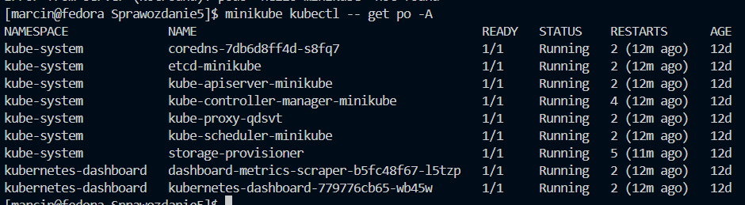
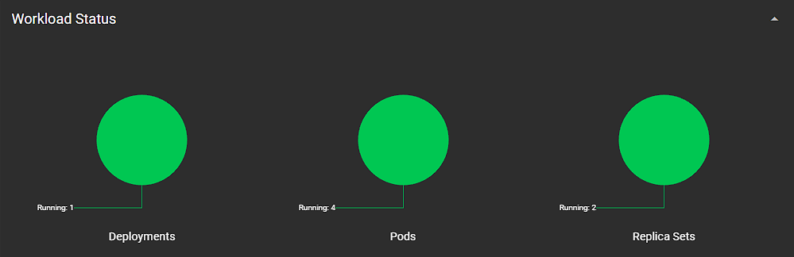

# Sprawozdanie 5
## Marcin Pigoń
## ITE gr. 4

### Cel: Wdrażanie na zarządzalne kontenery: Kubernetes

### Lab 10, 11

Kubernetes to otwartoźródłowa platforma do zarządzania kontenerami. Umożliwia automatyzację wdrażania, skalowania i operacji kontenerowych aplikacji, co znacznie ułatwia zarządzanie złożonymi systemami rozproszonymi. Kubernetes zarządza klastrami maszyn fizycznych lub wirtualnych, na których działają kontenery, organizując je w logiczne jednostki do łatwiejszego zarządzania i odkrywania. Dzięki Kubernetes organizacje mogą efektywniej wykorzystać zasoby infrastrukturalne i zwiększyć niezawodność swoich aplikacji.

Pojęcia związane z Kubernetes:

* Klaster: Kubernetes zarządza klastrem maszyn (serwerów), które mogą być fizyczne lub wirtualne. Klaster składa się z jednego głównego węzła (master node) i kilku węzłów roboczych (worker nodes).

* Kontenery i Pody: Aplikacje uruchamiane są w kontenerach. Kubernetes grupuje kontenery w jednostki zwane podami (pods). Pod to najmniejsza jednostka obliczeniowa, która może zawierać jeden lub więcej kontenerów.

* Deklaratywne podejście: Użytkownik definiuje w plikach konfiguracyjnych (najczęściej w formacie YAML) jak aplikacja powinna działać - ile instancji ma być uruchomionych, jakie zasoby (CPU, pamięć) są potrzebne, jak mają być zorganizowane sieci i przechowywanie danych.

Pierwszym krokiem laboratorium było zapewnienie maszynie wirtualnej następujących zasobów:


Instalację przeprowadzamy zgodnie z [instrukcją](https://minikube.sigs.k8s.io/docs/start/)


Moja maszyna wirtualna działa na systemie operacyjnym Fedora 39, więc wybrałem paczkę RPM. Instalator pobrałem komendą:

`curl -LO https://storage.googleapis.com/minikube/releases/latest/minikube-latest.x86_64.rpm`
`sudo rpm -Uvh minikube-latest.x86_64.rpm`

Następnie trzeba uruchomić klaster - `minikube start`


Pobranie `kubectl`



Sprawdzenie nodes - `minikubectl get nodes`


Jedynym węzłem jest moja maszyna i ma rolę *control-plane*, co oznacza, że zarządza klastrem.

Nadanie aliasu (zmiany nazwy polecenia). Pozwoli mi wywoływać komendy poleceniem kubectl zamiast minikubectl.


Stworzenie sample deployment, żeby zobaczyć, czy Kubernetes działa poprawnie.


Uruchomienie osiągamy poprzez `kubectl get services hello-minikube` oraz polecenie z port-forwarding `kubectl port-forward service/hello-minikube 7080:8080`.


Dashboard (GUI/panel zarządzania) możemy odpalić przez `minikube dashboard`.


Widać działający deployment `hello-minikube`. Skoro wiemy, że wszystko działa jak powinno, możemy już go wyłączyć w następujący sposób:

`minikubectl delete pod hello-minikube` - usunięcie pod'a, który uruchamia aplikację.
`minikubectl delete service hello-minikube` - usunięcie serwisu, który eksponuje aplikację na zewnątrz.

Lub poprzez dashboard:


Czysty dashboard 


W celu wdrożenia własnego kontenera do Kubernetes, ćwiczenie wymagało aplikacji działającej w trybie ciągłym. Niestety, moja aplikacja [ze sprawozdania 3](https://github.com/InzynieriaOprogramowaniaAGH/MDO2024_INO/blob/MP412902/ITE/GCL4/MP412902/Sprawozdanie3/utt-deployer.Dockerfile) kończyła działanie po wykonaniu skryptu odmierzenia czasu. W tym celu zmodyfikowałem działanie kontenera poprzez wypisywanie danych na stronę internetową, a kontener sprawiał funkcję serwera. 

[`utt-server.Dockerfile`](https://github.com/InzynieriaOprogramowaniaAGH/MDO2024_INO/blob/MP412902/ITE/GCL4/MP412902/Sprawozdanie5/utt-server.Dockerfile) to nowy plik, z którego tworzę obraz. Teraz jednak należało opublikować do Dockerhuba zmianę, więc zmodyfikowałem skrypt pipeline'u, żeby przesyłał odpowiedni plik.

Zmiana kroku deploy, żeby była wersja serwerowa (działająca w trybie ciągłym) zamiast kontenera, który wykonywał pomiar czasu i kończy działanie. Zmieniono obraz, który budujemy.

``` 
stage('Deploy') {
            steps {
                echo 'Deploying utt-deployer'
                dir('MDO2024_INO/ITE/GCL4/MP412902/Sprawozdanie5') {
                    sh "docker build -t utt-deployer:${params.VERSION} --build-arg BUILDER_VERSION=${params.VERSION} -f utt-server.Dockerfile . | tee -a ../deployment_logs_${params.VERSION}.log"
                    archiveArtifacts artifacts: "deployment_logs_${params.VERSION}.log", allowEmptyArchive: true
                    sh "docker rmi utt-builder:${params.VERSION}"
                    sh "docker rmi utt-tester:${params.VERSION}"
                }
            }
        }
```

W wyniku opublikowano wersję 2.0, która działa w wersji ciągłej, pozwalając mi na kontynuację ćwiczenia.


Uruchomienie kontenera na stosie Kubernetes możemy dokonać używając:
`minikube kubectl -- run utt-deployer --image=phisiic/utt-deployer:2.0 --port=8080 --labels app=utt-deployer`

Można zobaczyć czy pod jest 'Running' poleceniem:


Lub w dashboardzie: 


Oznacza to, że program został zaciągnięty z Dockerhub i działa.

Żeby mieć dostęp do działającego pod'a należy wyeksportować port. Wykonuję ten krok poleceniem `minikube kubectl -- port-forward pod/utt-deployer 8000:8000`. Korzystam z portu 8000, ponieważ w moim Dockerfile jest on eksportowany.


Wchodząc na adres `http://localhost:8000/`, widzimy rezultat prostego html:


Pod działa poprawnie i udało się wyeksponować port.

### Konwersja wdrożenia ręcznego na wdrożenie deklaratywne YAML

Ręczne wdrażanie kontenerów mija się z celem Kubernetes. W tym celu należy napisać plik `utt-deployment.yaml`, w którym możemy wykonać wszystkie dotychczas wykonane czynności automatycznie, oraz powielić liczbę podów (repliki), na których pracujemy, zamiast korzystać z jednego. Ma to za zadanie zapewnić odporność na awarie oraz skalowalność aplikacji poprzez zapewnienie żądanej liczby kopii tej samej aplikacji w klastrze.

`utt-deployment.yaml`
```
apiVersion: apps/v1
kind: Deployment
metadata:
  name: utt-deployer
  labels:
    app: utt-deployer
spec:
  replicas: 4
  selector:
    matchLabels:
      app: utt-deployer
  template:
    metadata:
      labels:
        app: utt-deployer
    spec:
      containers:
      - name: utt-deployer
        image: phisiic/utt-deployer:2.0
        ports:
        - containerPort: 8000
```

* apiVersion i kind: Określają rodzaj zasobu Kubernetes, który tworzymy, w tym przypadku jest to Deployment.
* metadata: Zawiera metadane dla wdrożenia, takie jak nazwa i etykiety.
* spec: Zawiera specyfikację wdrożenia, w tym liczbę replik i szablon kontenera.
* replicas: Określa liczbę replik wdrożenia, w naszym przypadku jest to 3.
* selector i template: Określają, które pody należą do wdrożenia na podstawie etykiet.
* containers: Definiuje kontener wdrożenia, w tym obraz Docker, który ma być uruchamiany, oraz porty, które mają być wystawione.

Po napisaniu tego pliku wdrażamy zmiany `kubectl apply`


Możemy sprawdzić jak zmienią się odpalone pody 


Oraz zobaczyć powstały deployment


Następnie należało utworzyć nowe wersje wcześniej utworzonego obrazu, żeby miały inny tag. Tym razem zbuduję wersję `utt-deployer:3.0` i ręcznie pushuję ją na Dockerhuba. Będzie ona identyczna w funkcjonalności do wersji 2.0, jedynie różnić się będzie tagiem. 

Budujemy nową wersję obrazu:
```
docker build --build-arg BUILDER_VERSION=2.0 -t utt-deployer:3.0 -f utt-server.Dockerfile .
```

Oznaczamy:
```
docker tag utt-deployer:3.0 phisiic/utt-deployer:3.0
```

Pushujemy na Dockerhub:
```
docker push phisiic/utt-deployer:3.0
```

Sprawdzam Dockerhub, żeby się upewnić, że obraz istnieje


Należy również utworzyć wersję z błędem - obraz poprawnie się buduje, ale kontener zwraca błąd gdy jest włączony.

W tym celu napisano nowy Dockerfile `utt-blad.Dockerfile`

```
ARG BUILDER_VERSION

FROM utt-builder:${BUILDER_VERSION}

CMD ["blad"]
```

Kontener na podstawie tego obrazu zakończy się niepowodzeniem, gdyż nie ma polecenia 'blad'. Powtarzamy krok budowania i pushowania na Dockerhuba, ale tym razem z tagiem 'error'. 

Mamy zatem wszystkie potrzebne wersje obrazu:


### Zmiany w deploymencie
Dzięki pliku `utt-deployment.yaml` w szybki sposób możemy zmienić konfigurację klastru. Pierwszą zmianą jaką wykonam będzie **zwiększenie liczby replik na 8**:

```
...
  labels:
    app: utt-deployer
spec:
  replicas: 8 
  selector:
    matchLabels:
      app: utt-deployer
...
```

Po każdej zmianie należy zarejestrować zmiany - `kubectl apply -f utt-deployment.yaml`. 
Sprawdźmy zatem jak wygląda teraz dashboard:


Działa 1 deployment oraz 9 podów (8 replik + 1 początkowy, który został uruchomiony ręcznie).

**Zmniejszenie liczby replik na 1**:

```
...
  labels:
    app: utt-deployer
spec:
  replicas: 1 
  selector:
    matchLabels:
      app: utt-deployer
...
```

Sprawdzając repliki w dashboardzie, możemy zauważyć, że ich stan zmienił się z `Running` na `Terminating`


Po ich zakończeniu zostaje tylko `utt-deployer` oraz jedna replika:


Warto również zauważyć, że replika działa od ok. godziny - więc repliki nie są zależne od jednej konfiguracji - jeżeli mamy więcej niż potrzebujemy, jedynie te niepotrzebne zostaną wyłączone. Pozostałe będą działać dalej, a nie będą tworzone od nowa do nowej konfiguracji deploymentu.

**Zmniejszenie liczby replik na 0**:

```
...
  labels:
    app: utt-deployer
spec:
  replicas: 0 
  selector:
    matchLabels:
      app: utt-deployer
...
```

Dashboard:


Deployment nadal jest Running, mimo że nie ma żadnych podów działających wskutek jego aktywacji. Oczywiście jedynie utt-deployer odpalony ręcznie działa nadal. 

Usunąłem ten pod, żeby zobaczyć czy coś się zmieni


Widzimy, że deployment nadal działa i replica sets - będąc puste - również działa. 

**Zastosowanie nowej wersji obrazu - utt-deployer:3.0**

Modyfikacja `utt-deployment.yaml` wyglądała w następujący sposób: 
```
    spec:
      containers:
      - name: utt-deployer
        image: phisiic/utt-deployer:3.0
        ports:
        - containerPort: 8000
```
Powrócono również do liczby replik równej 4. 

Podczas tworzenia podów z nową wersją możemy zauważyć coś ciekawego:


Powstaje nowe Replica Set - wersje się nie zgadzają, więc repliki nie mogą być uznawane za jeden set. 


Czas zmiany również znacznie wzrósł - czekałem ok. 2/3 minut na wdrożenie zmian, kiedy przy zmianie liczby replik czekałem kilka sekund.  


**Zastosowanie starszej wersji obrazu - utt-deployer:2.0**

Zmieniono `utt-deployment.yaml` na wersję poprzednią:
```
    spec:
      containers:
      - name: utt-deployer
        image: phisiic/utt-deployer:2.0
        ports:
        - containerPort: 8000
```

Nic nadzwyczajnego tutaj się nie stało, ale prędkość wykonania była taka jak wcześniej - najdłuższym procesem było zakończenie działania podów 3.0, odpalenie podów 2.0 było bardzo szybkim zdarzeniem.



**Zastosowanie wersji z błędem - utt-deployer:error**

Zmieniono `utt-deployment.yaml` na wersję z błędem:
```
    spec:
      containers:
      - name: utt-deployer
        image: phisiic/utt-deployer:error
        ports:
        - containerPort: 8000
```


Tutaj wydarzyło się coś niespodziewanego - pody z wersją 2.0, które działały przed wywołaniem wersji z błędem - nie zakończyły działania w całości. Jeden zdążył zakończyć działanie zanim pody z błędną wersją zwróciły błąd. Takich podów było 2. Powinno ich być 4, ale Kubernetes nie widzi sensu tworzenia więcej replik skoro pierwsze nie działały. Ciekawe jest, że pody z poprzedniego deploymentu nie kończą swojej pracy.


Forwardując port jednego z replik, możemy zobaczyć czy faktycznie strona jest dostępna:


**Historia poprzednich wdrożeń**
Aby zobaczyć historię wersji wdrożeń, można użyć polecenia `kubectl rollout history deployment <nazwa_deploymentu>`:


**Cofnięcie do konkretnej wersji**
Aby cofnąć wdrożenie do konkretnej wersji, należy użyć polecenia `kubectl rollout undo deployment utt-deployer --to-revision=<NUMER_REWIZJI>`:


Powoduje to wrócenie do wersji z 4 replikami oraz wersji obrazu 3.0.

### Kontrola wdrożenia

Napisano skrypt bashowy `deployment-check.sh`, który sprawdzał, czy wdrożenie "zdążyło" się wdrożyć w 60s. Nadano mu praw wykonalności poprzez `chmod +x <skrypt>`. 

`deployment-check.sh`
```
#!/bin/bash

# Nazwa wdrożenia do monitorowania
DEPLOYMENT_NAME="utt-deployer"

# Maksymalny czas oczekiwania (w sekundach)
MAX_WAIT_TIME=60

# Początkowy czas
START_TIME=$(date +%s)

# Funkcja sprawdzająca status wdrożenia
check_deployment_status() {
    STATUS=$(minikube kubectl -- rollout status deployment/${DEPLOYMENT_NAME} --watch=false)
    echo "${STATUS}"
}

# Pętla sprawdzająca status co 1 sekundę
while true; do
    CURRENT_TIME=$(date +%s)
    ELAPSED_TIME=$((CURRENT_TIME - START_TIME))

    # Sprawdzenie, czy upłynął maksymalny czas oczekiwania
    if [[ ${ELAPSED_TIME} -ge ${MAX_WAIT_TIME} ]]; then
        echo "Czas oczekiwania przekroczony (${MAX_WAIT_TIME} sekund)"
        exit 1
    fi

    # Sprawdzenie statusu wdrożenia
    DEPLOYMENT_STATUS=$(check_deployment_status)

    # Sprawdzenie, czy wdrożenie zostało zakończone sukcesem
    if [[ "${DEPLOYMENT_STATUS}" == *"successfully rolled out"* ]]; then
        echo "Wdrożenie ${DEPLOYMENT_NAME} zakończone sukcesem w ciągu ${ELAPSED_TIME} sekund"
        exit 0
    fi

    # Oczekiwanie 1 sekundę przed kolejnym sprawdzeniem
    sleep 1
done
```

Odpalając skrypt w jednym terminalu, po rollbacku do działającej wersji:


Po rollbacku do wersji 'error':


Po zmianie `utt-deployment.yaml` i zatwierdzeniu zmian:

