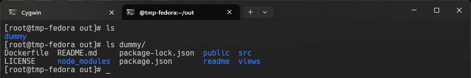

# Dockerfiles, kontener jako definicja etapu
Stanisław Pigoń

## Wybór oprogramowania
Do realizacji ćwiczenia student wybrał rekomendowane przez prowadzącego projekty [node-js-dummy-test](https://github.com/devenes/node-js-dummy-test) oraz [irssi](https://github.com/irssi/irssi), spełniające wszystkie wymagania dotyczące projektu implementowanego przez *pipeline* tworzony na późniejszym etapie ćwiczenia (otwarta licencja, pliki umożliwiające budowe projektu, zdefiniowane testy). Mechanizmami budowy w. wy. projektów są kolejno **npm** i **ninja**.

### Weryfikacja wymagań dobranego oprogramowania
#### irssi
- dysponuje otwartą licencją


- jest umieszczone wraz ze swoimi narzędziami Makefile


- zawiera zdefiniowane i obecne w repozytorium testy


#### dummy-js-app
- dysponuje otwartą licencją


- jest umieszczone wraz ze swoimi narzędziami Makefile


- zawiera zdefiniowane i obecne w repozytorium testy


### Sklonowanie i budowa oprogramowania (instalacja wymaganych zależności)
#### irssi
- sklonowanie repozytorium


- instalacja zależności


- budowa i instalacja projektu


- uruchomienie testów


- uruchomienie programu


#### dummy-js-app
- sklonowanie repozytorium


- instalacja zależności


- uruchomienie testów


- uruchomienie aplikacji


## Przeprowadzenie buildu w kontenerze
#### irssi
##### `src/irssi/build.Dockerfile`
```docker
FROM fedora
RUN dnf -y update && dnf -y install git meson ninja* gcc glib2-devel utf8* ncurses* perl-Ext* openssl
WORKDIR /root/irssi
RUN git clone https://github.com/irssi/irssi .
RUN meson Build
RUN ninja -C /root/irssi/Build && ninja -C Build install
```


- `docker build -t irssi-build - < src/irssi/build.Dockerfile`


##### `src/irssi/test.Dockerfile`
```docker
FROM irssi-build
WORKDIR /root/irssi/Build
RUN ninja test
```
- `docker build -t irssi-test - < src/irssi/test.Dockerfile`


##### Testowe uruchomienie `irssi` w kontenerze `irssi-build`
- `docker run --rm -h tmp-irssi-build -it irssi-build`


#### node-js-dummy-test
##### `src/dummy/build.Dockerfile`
```docker
FROM node
WORKDIR /root/dummy
RUN git clone https://github.com/devenes/node-js-dummy-test .
RUN npm i
```

- `docker build -t dummy-build - < src/dummy/build.Dockerfile`


##### `src/dummy/test.Dockerfile`
```docker
FROM dummy-build
WORKDIR /root/dummy
RUN npm test
```


- `docker build -t dummy-test - < src/dummy/test.Dockerfile`

##### `src/dummy/run.Dockerfile`
```docker
FROM dummy-build
WORKDIR /root/dummy
EXPOSE 3000
CMD ["npm", "start"]
```

- `docker build -t dummy-run - < src/dummy/run.Dockerfile`


#### Testowe uruchomienie kontenera `dummy-js-app`
- `docker run --rm -it -p 80:3000 dummy-run


## Wykorzystanie `docker-compose`
### `src/compose.yml`
```yml
version: '3'

services:
  irssi:
    build:
      dockerfile: irssi/build.Dockerfile
      context: .
  dummy:
    build:
      dockerfile: dummy/run.Dockerfile
      context: .
    ports:
      - "80:3000"
```

- `docker-compose`


- Uruchomiona aplikacja


## Dyskusje
| Pytanie | irssi | dummy-js-app |
| -------- | ----- | ------------ |
| Czy program nadaje się do wdrażania i publikowania jako kontener | Raczej nie - irssi jest aplikacją opartą na tekstowym, pseudograficznym interfejsie, przez co nie nadaje się do uruchomienia w kontenerze w tle. Dystrybucja aplikacji w formie kontenera miała by sens na egzotycznych platformach, nie będących w stanie uruchomić *irssi*, jednocześnie mając możliwość uruchomienia samego kontenera. Publikacja tej aplikacji w kontenerze dla większości użytkowników skutkowałaby niepotrzebnym utrudnieniem pracy z aplikacją | Jak najbardziej - większość aplikacji webowych jest wdrażane jako kontener np. na platformach chmurowych. Mikroserwisy idealnie nadają się również do publikacji w kontenerach, ze względu na łatwość w ich uruchomieniu; cały proces *instalacji* sprowadza się do pojedynczego polecenia, eliminując potrzebę ręcznego instalowania zależności - możliwe jest również spakowanie konfiguracji razem z kontenerem czy jego rozbudowa |
| Opisz w jaki sposób miałoby zachodzić przygotowanie finalnego artefaktu | Podczas uruchomienia kontenera można by podłączać foldery z plikami binarnymi do kontenera jako volume, doprowadzając do utworzenia plików wykonywalnych aplikacji w systemie plików hosta, jednak w sutuacji, kiedy architektura kontenera różniłaby się od konfiguracji hosta, efekt prawdopodobnie będzie conajmniej niezadowalający. | Ponieważ serwis oparty jest na Node.js, folder projektu z zainstalowanymi zależnościami praktycznie stanowi gotowy artefakt, możliwy do wykorzystania na wirtulanie dowolnym systemie z zainstalowanym node (z pewnymi ogarniczeniami powiązanymi z wersjami oprogramowania). Po raz kolejny - wystarczy wykorzystać volume, aby *wynieść* pliki projektu z kontenera |
| Jeżeli program miałby być publikowany jako kontener - czy trzeba go oczyszczać z pozostałości po buildzie? | Tak, o ile nie miałaby to być wersja developerska. Również wykorzystanie publikacji w kontenerze miała by sens raczej w wariacji artefkatu przeznaczonej dla developerów | Usunięcie *pozostałości po buildzie* w przypadku aplikacji Node.js skutkowałoby pozbawieniem jej funkcjonalności - JavaScript to język skryptowy, niewymagający kompilacji, a samo określenie *builda* w jej przypadku, o ile nie dotyczy *zamrożenia* aplikacji w pliku wykonywalnym, jest nieco mylące |
| A może dedykowany *deploy-and-publish* byłby oddzielną ścieżką (inne Dockerfiles)? | Nadal nie - aplikacja wymaga podłączonego terminala i bezpośredniej interakcji ze strony użytkownika | Jak najbardziej! Skróciłoby to jeszcze bardziej proces jej wdrażania w przypacku serwisów chmurowych |
| Czy zbudowany program należałoby dystrybuować jako pakiet, np. JAR, DEB, RPM, EGG? | Tak - znacząco ułatwiło by to jej instalacje. Nie bez powodu jest to niemal jedyny sposób dystrybucji aplikacji desktopowych i mobilnych. Nawet, jeżeli na docelowym systemie będzie się ona uruchamiać w kontenerze, konteneryzator i kod aplikacji zostaną zainstalowane nawet z pojedynczego pakietu jako aplikacja docelowa, a sama knoteneryzacja będzie implementowana *pod maską* | Wykorzystana aplikacja raczej nie, natomiast gdyby implementowała ona logikę na nieco wyższym poziomie abstrakcji, jak np. routing (Nginx) lub usługę bazodanową (MongoDB) - więcej sensu będzie miałaby instalacja w systemie hosta. W przypadku *dummy-js-app* możliwe jest spakowanie w archiwum kodu źródłowego i pliku `package.json` i będzie ono wystarczające |
| W jaki sposób zapewnić taki format? Dodatkowy krok (trzeci kontener)? Jakiś przykład? | Kontener oparty o system o architekturze tożsamej z systemem docelowym (najprawdopodobniej kilka). W przypadku aplikacji opartej na C docker swietnie nadałby się do masowego tworzenia artefaktów dedykowanych dla różnych systemów operacyjnych bez potrzeby zmiany systemu hosta | Dodająć pakiet pozwalający na *zamrożenie* aplikacji w pliku binarnym lub instalatorze. Mógłby to być również trzeci kontener w zeleżności od potrzeb dodatkowego podziału procesu |

# Dodatkowa terminologia w konteneryzacji, instancja Jenkins
## Zachowanie stanu
- przygotowanie woluminu wejściowego `Vin` i wyjściowego `Vout`


### Umieszczenie repozytorium `dummy-js-app` w woluminie wejściowym `Vin`

Aby sklonować repozytorium do woluminu wejściowego, nie instalując gita w docelowym kontenerze i nie tworząc narzędzi tymczasowych, możemy sklonować repozytorium bezpośrednio do woluminu - jedynym wymaganiem jest posiadanie odpowiednich uprawnień w systemie.

### Instalacja zależności i uruchomienie projektu w kontenerze. Skopiowanie zbudowanego projektu do woluminu wyjściowego




### Ponowna instalacja z wykorzystaniem kontenera


### Możliwość wykonania opisanych kroków za pomocą `docker build` i pliku `Dockerfile`
Cały opisany moża bezproblemowo zautomatyzować z wykorzystaniem obarów docker. Zgodnie z dokumentacją `docker build`, instrukcja `RUN --mount` pozwala na zamontowanie woluminu na czas wykonania pojedynczej warstwy. Typ `bind` jest w tym przypadku szczególnie interesujący, ponieważ pozwala na zamontowanie w budowanym kontenerze plików czy katalogów systemu gospodarza. Nie licząc różnic syntaktycznych, polecenie `RUN --mount=type=bind,source=<host_fs>,target=<container_fs>` montuje obiekty tylko na okres działania warstwy tworzonej przez daną instruckję `RUN`.

## Eksportowanie portu
### Uruchomienie i przetestowanie szybkości połączenia dwóch kontenerów w domyślnej sieci mostkowej docker

> Wynik: `27.2 Gbps`

### Ponowne przeprowadzenie testu we własnej sieci `bridge` docker (rozwiązywanie nazw docker)

> Wynik: `25.9 Gbps`

### Ponowne przeprowadzenie testu sieci z poziomu hosta

> Wynik: `36.2 Gbps`

### Ponowne przeprowadzenie testu sieci z poziomu gospodarza

> Wynik: `9.94 Gbps`

### [WIP] Przedstaw przepustowość komunikacji lub problem z jej zmierzeniem (wyciągnij log z kontenera, woluminy mogą pomóc)

### *Opcjonalnie:* odwołuj się do kontenera serwerowego za pomocą nazw, a nie adresów IP
Aby wykorzystać rozwiązywanie nazw w sieci docker, wystarczy wykorzystać opcję `--network-alias <alias>` polecenia `docker run` lub uruchomić kontenery z wykorzystaniem `docker-compose`, gdzie rozwiązywane nazwy pochodzą od nazw tworzonych serwisów.

## Instancja Jenkins w systemime Linux z wyorzystaniem kontenera DinD (Docker-in-Docker)
> Wszystkie opisane w tej sekcji kroki pochodzą bezpośrednio z [dokumentacji Jenkins](hhttps://www.jenkins.io/doc/book/installing/docker/#on-macos-and-linux), lub są wariacją opisanych w dokumentacji kroków.

### Utworzenie sieci mostkowej docker dla Jenkins


### Utworzenie kontenera DinD
```bash
docker run \
  --name jnks-dind \
  --detach \
  --privileged \
  --network jenkins \
  --network-alias docker \
  --env DOCKER_TLS_CERTDIR=/certs \
  --volume jenkins-docker-certs:/certs/client \
  --volume jenkins-data:/var/jenkins_home \
  --publish 2376:2376 \
  docker:dind \
  --storage-driver overlay2
```


### Utworzenie nowego obrazu `jnks.Dockerfile` i uruchomienie kontenera Jenkins
```docker
FROM jenkins/jenkins:2.452.1-jdk17
USER root
RUN apt-get update && apt-get install -y lsb-release
RUN curl -fsSLo /usr/share/keyrings/docker-archive-keyring.asc \
  https://download.docker.com/linux/debian/gpg
RUN echo "deb [arch=$(dpkg --print-architecture) \
  signed-by=/usr/share/keyrings/docker-archive-keyring.asc] \
  https://download.docker.com/linux/debian \
  $(lsb_release -cs) stable" > /etc/apt/sources.list.d/docker.list
RUN apt-get update && apt-get install -y docker-ce-cli
USER jenkins
RUN jenkins-plugin-cli --plugins "blueocean docker-workflow"
```

- Zbudowanie obrau `jnks`


- Uruchomienie kontenera `jnks` z obrazu `jnks`


### Uzyskanie dostępu do panelu kontrolnego Jenkins
- Hasło do Jenkinsa możemy uzyskać z logów kontenera `jnks` za pomocą polecenia `docker logs jnks`


- Następnie logujemy się do panelu administracynego


- Uruchomione kontenery

