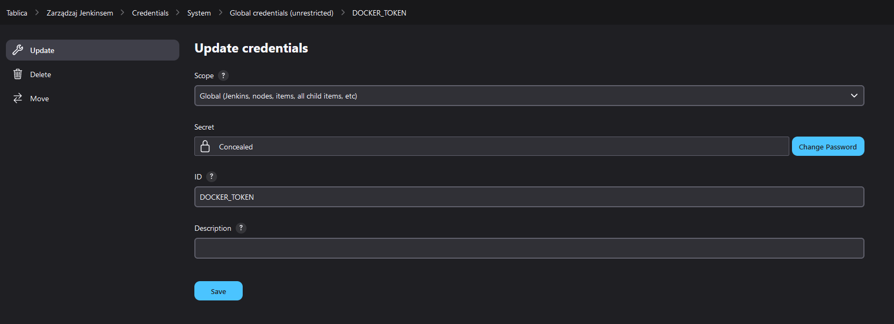

# Pipeline, Jenkins, izolacja etapów
Stanisław Pigoń

## Wstęp
### Wstępne wymagania środowiska [WIP]
### Diagram aktywności [WIP]
### Diagram wdrożeniowy [WIP]

## Przygotowanie
- Uruchomienie kontenerów Jenkins


- Logowanie do panelu Jenkins


- Główna strona panelu Jenkins po zalogowaniu


> Obrazy i kontenery Jenkins zostały przygotowane [na końcu ostatniego sprawozdania](../Sprawozdanie2/README.md#instalacja-jenkins-w-systemime-linux-z-wyorzystaniem-kontenera-dind-docker-in-docker)

- W celu utrzymania logów bez potrzeby tworzenia nowego kontenera z podłączonym woluminem, możemy wykorzystać polecenie `docker logs -f jnks > <output> 2> <output>`, gdzie `<output>` reprezentuje ścieżkę do pliku wyjściowego. Flaga `-f --follow` pozwala na utrzymanie ciągłego odczytu logów w czasie działania kontenera. Aby *złapać* również logi z niższych poziomów, do pliku przekierowywyjemy również strumień `STDERR`

## Uruchomienie
### Konfiguracja wstępna i pierwsze uruchomienie
> Pierwsze uruchomienie Jenkins opisane jest w końcowej części [ostatniego sprawozdania](../Sprawozdanie2/README.md#uzyskanie-dostępu-do-panelu-kontrolnego-jenkins)

### Utworzenie projektu `uname`
- Utworzenie nowego ogólnego projektu


- Ze względu na prostotę projektu (wywołanie `uname -a` w Jenkins) jedynym potrzenym do skonfigurowana etapem budowania jest samo wywołania polecenia. Inne ustawienia możemy na razie pominąć


- Następnie z nawigatora po lewej stronie okna możliwe jest ręczne uruchomienie projektu oraz inspekcja przeszłych wywołań. Interfejs webowy jest aktualizowany dynamicznie, dzięki czemu od razu po wywołaniu zadania można przejść do szczegółów ostatniego wywołanego zadania


- W widoku logów możemy rozczytać wynik uruchomienia polecenia `uname -a`, wraz z informacjami o wykorzystanym środowisku, poziomie dostępu, oraz położeniu pliku definiującego jedyny krok budowania


### Utworzenie projektu wyrzucającego błąd na godzinach nieparzystych
- Skrypt bash
```bash
if [[ $((`date +%H` % 2) != 0)]]; then
  exit 1
fi
```

- Utworzenie i wywołanie zadania `hours` w Jenkins


- Ustawienie harmonogramu wywoływania projektu `hours`, aby *automagicznie* wykonał się w następnej godzinie


### Utworzenie *prawdziwego* projektu
Zgodnie z [instrukcją do ćwiczenia](../../../../READMEs/005-Task.md#uruchomienie) projekt musi definiować następujące etapy:
- Sklonowanie repozytorium **MDO2024_INO**
- Przejście na osobistą gałąź SP411320
- Zbudowanie obrazów z Dockerfiles lub/i kompozycji *docker-compose*

#### Sklonowanie repozytorium, wybranie gałęzi i zbudowanie projektu
W celu automatycznego pobrania repozytorium (oraz eliminację potrzeby ciągłego kopiowania nowych wersji pipeline-script'u do ustawień obiektu Jenkins) możemy ustawić pipeline, aby przy każdym uruchomieniu pobierał pipeline-script z wybranej gałęzi wybarnego repozytorium git


### Jenkins /w Docker-in-Docker pros/cons
```diff
+ Całkowita izolacja środowiska wykonania procesu od środowiska Jenkins i innych procesów
+ Zwiększona kontrola nad środowiskiem
+ Brak dostępu do systemu plików hosta (ułatwienie procesu budowy bardziej zaawansowanych procesów)
- Brak dostępu do systemu plików hosta (zwiększone bezpieczeństwo)
- Większe zużycie zasobów
- Zwiększony poziom skomplikowania konfiguracji
```

### Pipeline
#### Zmienne
```groovy
environment {
  LOG_DIR = "/tmp/build_${BUILD_NUMBER}"
  REPO = "https://github.com/InzynieriaOprogramowaniaAGH/MDO2024_INO"
  SRC_DIR = "ITE/GCL4/SP411320/Sprawozdanie3/src/irssi"
  USER = 'pixel48'
}
```
#### Etapy
##### `Prep`
Przed uruchomieniem właściwej części pipeline'u przygotowywane jest środowisko - usunięte zostają ewentualne pozostałości po poprzedniej iteracji oraz zapewniona jest obecność folderu na wszelkiego rodzaju logi i artefakty
```groovy
stage('Prep') {
  steps {
    sh 'echo ===[Prep]==='
    sh "mkdir -p $LOG_DIR"
    sh 'docker system prune -af'
  }
}
```

##### `Build`
W pierwszym etapie przeprowadzamy build aplikacji - uzyskany obraz kontenera będzie potem wykorzystywany do przeprowadzenia testów. Sam build zawiera się w dedykowanym pliku Dockerfile i przeprowadza proces budowy aplikacji w oparciu o fedorę 39 z doinstalowanymi wymaganymi zależnościami. Umożliwia również uruchomienie aplikacji w konsoli po przekierowaniu standardowych strumieni wejścia/wyjścia w trybie interaktywnego kontenera
```dockerfile
FROM fedora
RUN dnf -y update && dnf -y install git meson ninja* gcc glib2* utf8* ncurses* openssl* perl-Ext*
WORKDIR /root/irssi
RUN git clone https://github.com/irssi/irssi .
RUN meson Build
RUN ninja -C /root/irssi/Build && ninja -C Build install
ENTRYPOINT ["irssi"]
CMD ["irssi"]
```

Repozytorium zostaje sklonowane do bierzącego folderu jescze na etapie pobrania Jenkinsfile.

```groovy
stage('Build') {
  steps {
    sh 'echo ===[Build]==='
    dir("$SRC_DIR") {
      sh "docker build -t irssi-build --no-cache - < build.Dockerfile > $LOG_DIR/docker_build-${BUILD_NUMBER}.log 2>&1"
    }
    dir("$LOG_DIR") {
      archiveArtifacts artifacts: "docker_build-${BUILD_NUMBER}.log", onlyIfSuccessful: false
    }
  }
}
```

##### `Test`
Wykonanie testów również opiera się o Dockerfile, który bazuje na obrazie z poprzedniego etapu, a następnie przeprowadza testy aplikacji. W przypadku niepowodzenia budowa obrazu, a przez to również sam pipeline, zostaną przerwane.
```dockerfile
FROM irssi-build
WORKDIR /root/irssi/Build
RUN ninja test
```

```groovy
stage('Test') {
  steps {
    sh 'echo ===[Test]==='
    dir("$SRC_DIR") {
      sh "docker build --no-cache -t irssi-test - < test.Dockerfile > $LOG_DIR/docker_test-${BUILD_NUMBER}.log 2>&1"
    }
    dir("$LOG_DIR") {
      archiveArtifacts artifacts: "docker_test-${BUILD_NUMBER}.log", onlyIfSuccessful: false
    }
  }
}
```

##### `Deploy`
W tym kroku budowany jest kontener `irssi-build`, którego jedynym zadaniem jest uruchomienie irssi z flagą `--version`. Wyizolowany numer wersji zostaje zapisany w osobnej lokalizacji dla kroku [`Publish`](#publish)
```dockerfile
FROM irssi-build AS deploy
CMD ["irssi", "--version"]
```

```groovy
stage('Deploy') {
  steps {
    sh 'echo ===[Deploy]==='
    dir("$SRC_DIR") {
      sh 'docker build -t irssi-deploy - < deploy.Dockerfile'
    }
    sh "docker run --name irssi irssi-deploy > $LOG_DIR/docker_deploy-${BUILD_NUMBER}.log"
    dir("$LOG_DIR") {
      archiveArtifacts artifacts: "docker_deploy-${BUILD_NUMBER}.log", onlyIfSuccessful: false
    }
    sh 'docker kill -f irssi'
  }
}
```

##### `Publish`
W kolejnym kroku obraz jest tagowany i publikowany w repozytorium DockerHub. Do autentyfikacji wykorzystany został token konta DockerHub, który przechowywany jest jako **secret** w Jenkins. Secrety Jenkins ustawić można w panelu administracyjnym, w zakładce `Credentials` w konfiguracji Jenkinsa



```groovy
stage('Publish') {
  environment {
    DOCKER_TOKEN = credentials('DOCKER_TOKEN')
  }
  steps {
    sh 'echo ===[Publish]==='
    sh "docker login -u $USER -p $DOCKER_TOKEN"
    sh "docker tag irssi-build $USER/irssi:`cat $LOG_DIR/docker_deploy-${BUILD_NUMBER}.log | cut -d' '  -f2 | cut -d- -f1 | sed -e 's/[^0-9]/./g'`"
    sh "docker push $USER/irssi:`cat $LOG_DIR/docker_deploy-${BUILD_NUMBER}.log | cut -d' '  -f2 | cut -d- -f1 | sed -e 's/[^0-9]/./g'` 2>&1 > $LOG_DIR/docker_push-${BUILD_NUMBER}.log"
    dir("$LOG_DIR") {
      archiveArtifacts artifacts: "docker_push-${BUILD_NUMBER}.log", onlyIfSuccessful: false
    }
  }
}
```


##### `Cleanup`
W ostatnim kroku usunięte zostają wszystkie kontenery i obrazy docker. Szyczone są również wszystkie powstałe pliki
```groovy
stage('Cleanup') {
  steps {
    sh 'echo ===[Cleanup]==='
    sh 'docker rm $(docker ps -aq) || true'
    sh 'dokeer rmi $(docker images -q) || true'
    dir("$LOG_DIR") {
      sh 'rm -rfv *'
    }
  }
}
```
