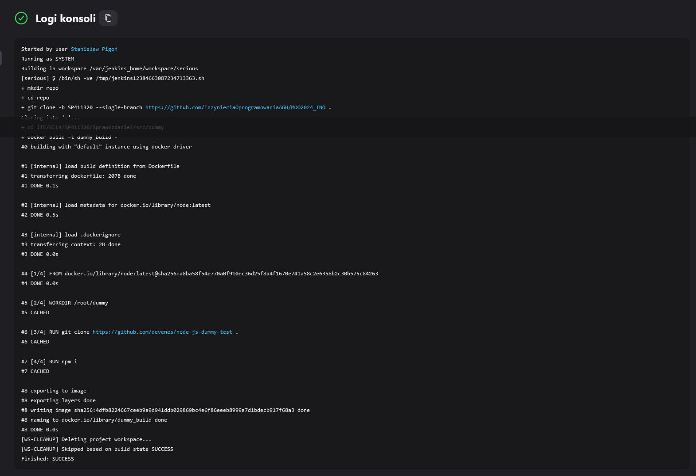

# Pipeline, Jenkins, izolacja etapów
Stanisław Pigoń

## Przygotowanie
- Uruchomienie kontenerów Jenkins


- Logowanie do panelu Jenkins


- Główna strona panelu Jenkins po zalogowaniu


> Obrazy i kontenery Jenkins zostały przygotowane [na końcu ostatniego sprawozdania](../Sprawozdanie2/README.md#instalacja-jenkins-w-systemime-linux-z-wyorzystaniem-kontenera-dind-docker-in-docker)

- W celu utrzymania logów bez potrzeby tworzenia nowego kontenera z podłączonym woluminem, możemy wykorzystać polecenie `docker logs -f jnks > <output> 2> <output>`, gdzie `<output>` reprezentuje ścieżkę do pliku wyjściowego. Flaga `-f --follow` pozwala na utrzymanie ciągłego odczytu logów w czasie działania kontenera. Aby *złapać* również logi z niższych poziomów, do pliku przekierowywyjemy również strumień `STDERR`

## Uruchomienie
### Konfiguracja wstępna i pierwsze uruchomienie
> Pierwsze uruchomienie Jenkins opisane jest w końcowej części [ostatniego sprawozdania](../Sprawozdanie2/README.md#uzyskanie-dostępu-do-panelu-kontrolnego-jenkins)

### Utworzenie projektu `uname`
- Utworzenie nowego ogólnego projektu


- Ze względu na prostotę projektu (wywołanie `uname -a` w Jenkins) jedynym potrzenym do skonfigurowana etapem budowania jest samo wywołania polecenia. Inne ustawienia możemy na razie pominąć


- Następnie z nawigatora po lewej stronie okna możliwe jest ręczne uruchomienie projektu oraz inspekcja przeszłych wywołań. Interfejs webowy jest aktualizowany dynamicznie, dzięki czemu od razu po wywołaniu zadania można przejść do szczegółów ostatniego wywołanego zadania


- W widoku logów możemy rozczytać wynik uruchomienia polecenia `uname -a`, wraz z informacjami o wykorzystanym środowisku, poziomie dostępu, oraz położeniu pliku definiującego jedyny krok budowania


### Utworzenie projektu wyrzucającego błąd na godzinach nieparzystych
- Skrypt bash
```bash
if [[ $((`date +%H` % 2) != 0)]]; then
  exit 1
fi
```

- Utworzenie i wywołanie zadania `hours` w Jenkins


- Ustawienie harmonogramu wywoływania projektu `hours`, aby *automagicznie* wykonał się w następnej godzinie


### Utworzenie *prawdziwego* projektu
Zgodnie z [instrukcją do ćwiczenia](../../../../READMEs/005-Task.md#uruchomienie) projekt musi definiować następujące etapy:
- Sklonowanie repozytorium **MDO2024_INO**
- Przejście na osobistą gałąź SP411320
- Zbudowanie obrazów z Dockerfiles lub/i kompozycji *docker-compose*

Możemy to zrealizować za pomocą poniższego skryptu:
```bash
mkdir repo
cd repo
git clone -b SP411320 --single-branch https://github.com/InzynieriaOprogramowaniaAGH/MDO2024_INO .
cd ITE/GCL4/SP411320/Sprawozdanie2/src/dummy
docker build -t dummy_build - < build.Dockerfile
```




## Sprawozdanie
###
