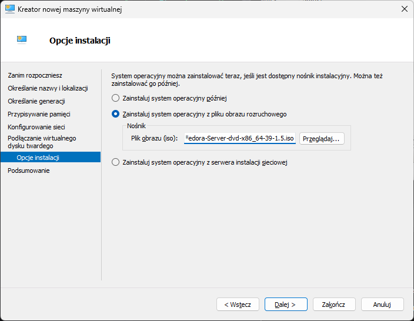

# Automatyzacja i zdalne wykonywanie poleceń za pomocą Ansible
Stanisław Pigoń

## Instalacja zarządcy Ansible
### Utworzenie masyny wirtualnej

Na początku tworzymy nową maszynę wirtualną. W przypadku wirutalizatora HyperV wybieramy opcję "Nowa" -> "Maszyna wirtualna". Następnie ustawiamy ppodstawowe parametry takie jak nazwa, generacja, ilość pamięci RAM, dysk wirtualny, sieć, etc.





### Minimalna instalacja systemu operacyjnego


Przed pierwszym uruchomieniem wyłączamy opcję "Bezpieczny rozruch" w ustawieniach maszyny wirtualnej.


Instalujemy system operacyjny Fedora Server w wersji minimalnej. W przypadku innych dystrybucji Linuxa. Wyłączamy dodatkowe opcje instalacji, takie jak serwer graficzny, serwer WWW, serwer baz danych, etc. Poniważ nie korzystami z instalatora sieciowego, nie musimy dostosowywać źródeł instalacji.


Po zakończeniu instalacji systemu operacyjnego, restartujemy maszynę wirtualną.

### Instalacja `tar` i `OpenSSH`


Po zalogowaniu się do systemu, zapewniamy obecność pakietów `tar` oraz `openssh` za pomocą polecenia `sudo dnf install -y tar openssh`.

### Ustawienie *hostname* na `ansible-target`


Następnie ustawiamy nazwę hosta na `ansible-target` za pomocą polecenia `sudo hostnamectl set-hostname ansible-target`.

### Utworzenie użytkownika `ansible`


Tworzymy użytkownika `ansible` za pomocą polecenia `sudo useradd -m -s /bin/bash ansible`, ustawiamy utworzonemu użytkownikowi hasło wykorzystując `passwd ansible`, wyłączamy maszynę i tworzymy migawkę dysku wirtualnego. Aby umożliwić zarządzanie maszyną docelową za pomocą Ansible, dodajemy użytkownika `ansible` do grupy `wheel` za pomocą polecenia `sudo usermod -aG wheel ansible`.

## Przygotowanie maszyny sterującej
### Instalacja ansible
Na głównej maszynie wirtualnej (vFedora) instalujemy ansible za pomocą polecenia `sudo dnf install -y ansible`.

### Utworzenie i wymiana kluczy SSH
Na maszynie sterującej generujemy klucz SSH za pomocą polecenia `ssh-keygen -N '' -f <docelowa_lokalizacja_pary_kluczy>`. Następnie kopiujemy klucz publiczny na maszynę docelową za pomocą polecenia `ssh-copy-id -i ~/.ssh/keys/slave.pub ansible@ansible-target`. Tworzymy również wpis w pliku `~/.ssh/config` w celu ułatwienia łączenia się z maszyną docelową.

```
Host github
  Hostname github.com
  User git
  IdentityFile ~/.ssh/keys/github/github

Host github.com
  User git
  IdentityFile ~/.ssh/keys/github/github

Host ansible-slave
  User ansible
  IdentityFile ~/.ssh/keys/slave

Host vfedora
  User user
  IdentityFile ~/.ssh/keys/self
```

> [!note]
> Aby umożliwić łatwe łączenie się z maszyną docelową, obie maszyny połączone zostały z siecią wewnętrzną `vNAT` o adresacji `7.7.7.0/24`, a ich adresy IP zostały umieszczone w pliku `/etc/hosts`.
> 

Procedurę tworzenia i wymiany kluczy powtarzamy również na maszynie docelowej, aby umożliwić łączenie się z maszyną sterującą.

### Weryfikacja połączenia SSH


## Inwentaryzacja
### Utworzenie pliku inwentarza
Tworzymy plik inwentarza, będący dowolnym plikiem tekstowym w formacie YAML, JSON lub INI. W naszym przypadku plik `inv.yml` wygląda następująco:
```yml
all:
  children:
    masters:
      hosts:
        vfedora:
    slaves:
      hosts:
        ansible-slave:
```

> [!note]
> Po doczytaniu instrukcji do ćwiczenia oraz zapoznaniu się z bardzo ~~idiotycznym~~ niejasnym powiązaniem między konwensją nazewnictwa  *master/slave* w IT z **rasizmem** przez środowiska niezwiązane z branżą IT, ~~natomiast z jakiegoś powodu wywierającymi na nią naciski polityczne,~~ możemy zmienić nazwę hosta `ansible-slave` na `ansible-wageworker` za pomocą polecenia `sudo hostnamectl set-hostname ansible-wageworker` po zalogowaniu do maszyny ściśle kontrolowanej przez ansible, aby uniknąć jakichkolwiek konotacji z wyzyskiem czy niewolniczą pracą w cywilizowanym, oświeconym społeczeństwie. Nowy plik inwentarza `inv.yml` wygląda następująco:
> ```yml
> all:
>   children:
>     entrepreneurs:
>       hosts:
>         vfedora:
>     wageworkers:
>       hosts:
>         ansible-wageworker:
> ```
> Oczywiście, zmieniamy również wpis w pliku `~/.ssh/config` i pliku `/etc/hosts`.

### Weryfikacja inwentarza
Aby zweryfikować poprawność pliku inwentarza, możemy skorzystać z polecenia `ansible -i inv.yml all -m ping`.


### Utworzenie trzeciej maszyny wirtualnej
Aby w pełni przetestować działanie ansible, tworzymy trzecią maszynę wirtualną, na której zainstalujemy system operacyjny Fedora Server w wersji minimalnej. Po zainstalowaniu systemu operacyjnego, instalujemy na niej ansible oraz wymieniamy klucze SSH z maszyną sterującą. Nowa maszyna wirutalna otrzyma adres IP `7.7.7.4` w sieci wewnętrznej oraz nazwę hosta `ansible-middlemanager`.

### Weryfikacja inwentarza po dodaniu trzeciej maszyny


## Zdalne wykonywanie procedur
### Utworzenie *Playbooka*
*Playbook* to dowolny plik tekstowy w formacie YAML, zawierający listę procedur, które mają zostać wykonane na maszynach docelowych. Możemy go utworzyć za pomocą polecenia `touch playbook.yml`. Następnie edytujemy plik za pomocą dowolnego edytora tekstu, aby dodać do niego kolejne *zagrania* (ang. *plays*).

### Wysłanie żądania `ping` do wszystkich maszyn
```yml
- name: ping
  hosts: all
  tasks:
    - name: ping
      ping:
```

### Skopiowanie pliku inwentaryzacji na maszynę docelową
```yml
- name: send
  hosts: wageworkers
  tasks:
    - name: copy
      copy:
        src: inv.yml
        dest: ~/
```

#### Pierwsze wykonanie kopii pliku inwentaryzacji
```
PLAY [send] ******************************************************************************************

TASK [Gathering Facts] *******************************************************************************
ok: [ansible-middlemanager]
ok: [ansible-wageworker]

TASK [copy] ******************************************************************************************
changed: [ansible-middlemanager]
changed: [ansible-wageworker]

PLAY RECAP *******************************************************************************************
ansible-middlemanager      : ok=2    changed=1    unreachable=0    failed=0    skipped=0    rescued=0    ignored=0
ansible-wageworker         : ok=2    changed=1    unreachable=0    failed=0    skipped=0    rescued=0    ignored=0
```

#### Drugie wykonanie kopii pliku inwentaryzacji
```
PLAY [send] ******************************************************************************************

TASK [Gathering Facts] *******************************************************************************
ok: [ansible-middlemanager]
ok: [ansible-wageworker]

TASK [copy] ******************************************************************************************
ok: [ansible-middlemanager]
ok: [ansible-wageworker]

PLAY RECAP *******************************************************************************************
ansible-middlemanager      : ok=2    changed=0    unreachable=0    failed=0    skipped=0    rescued=0    ignored=0
ansible-wageworker         : ok=2    changed=0    unreachable=0    failed=0    skipped=0    rescued=0    ignored=0
```

#### Porównanie różnic w wyjściu
```diff
8,9c8,9
< changed: [ansible-middlemanager]
< changed: [ansible-wageworker]
---
> ok: [ansible-middlemanager]
> ok: [ansible-wageworker]
12,13c12,13
< ansible-middlemanager      : ok=2    changed=1    unreachable=0    failed=0    skipped=0    rescued=0    ignored=0
< ansible-wageworker         : ok=2    changed=1    unreachable=0    failed=0    skipped=0    rescued=0    ignored=0
---
> ansible-middlemanager      : ok=2    changed=0    unreachable=0    failed=0    skipped=0    rescued=0    ignored=0
> ansible-wageworker         : ok=2    changed=0    unreachable=0    failed=0    skipped=0    rescued=0    ignored=0
```

### Aktualizacja pakietów w systemie
```yml
- name: update
  hosts: wageworkers
  vars:
    ansible_become_pass: <password>
  tasks:
    - name: update
      become: yes
      dnf:
        name: '*'
        state: latest
```

### Zrestartowanie usług `sshd` i `rngd`
```yml
- name: restart
  hosts: wageworkers
  vars:
    ansible_become_pass: <password>
  tasks:
    - name: restart sshd
      become: yes
      service:
        name: sshd
        state: restarted
    - name: restart rngd
      become: yes
      service:
        name: rngd
        state: restarted
```

### Weryfikacja działania *Playbooka*
#### Wszystkie maszyny podłączone do sieci wewnętrznej


#### Maszyna `ansible-middlemanager` odłączona od sieci wewnętrznej


## Zarządzanie kontenerem (playbook `docker.yml`)
### Instalacja i konfiguracja dockera
```yml
- name: setup docker
  hosts: wageworkers
  vars:
    ansible_become_pass: <password>
  tasks:
    - name: install docker
      become: yes
      dnf:
        name: 'docker'
        state: present
    - name: join docker group
      become: yes
      user:
        name: ansible
        groups: docker
        append: yes
    - name: start docker
      become: yes
      service:
        name: docker
        state: started
```

### Skopiowanie pliku `Dockerfile` na maszynę docelową i zbudowanie obrazów
```yml
- name: build docker images
  hosts: wageworkers
  tasks:
    - name: copy build
      copy:
        src: ../../Sprawozdanie3/src/irssi/build.Dockerfile
        dest: ~/
    - name: copy deploy
      copy:
        src: ../../Sprawozdanie3/src/irssi/deploy.Dockerfile
        dest: ~/
    - name: build images
      command: docker build -t {{ item.name }} -f {{ item.path }} .
      with_items:
        - { name: 'irssi-build', path: '~/build.Dockerfile' }
        - { name: 'irssi-deploy', path: '~/deploy.Dockerfile' }
    - name: run deploy
      command: docker run -d --name irssi-deploy -p 6667:6667 irssi-deploy
```

### Pobranie obrazu z DockerHub
```yml
- name: pull&build docker image
  hosts: wageworkers
  tasks:
    - name: pull image
      command: docker pull pixel48/irssi:1.5.1
    - name: run irssi
      command: docker run -d --name irssi -p 6667:6667 pixel48/irssi:1.5.1

### Zatrzymanie i usunięcie kontenerów
```yml
- name: prune docker
  hosts: wageworkers
  tasks:
    - name: prune docker
      command: docker system prune -f
```

### Weryfikacja działania *Playbooka*


## Ubranie kroków w role za pomocą `ansible-galaxy`
```sh
ansible-galaxy init docker
```

Uzyskany w ten spobób katalog `docker` zawiera następujące pliki:


Do pliku `tasks/main.yml` dodajemy wszystkie kroki związane z zarządzaniem kontenerem. Następnie w pliku `docker-role.yml` tworzymy nowy playbook wykorzystujący role.

```yml
- name: Use docker role
  hosts: wageworkers
  become: yes
  roles:
    - docker
```

### Weryfikacja działania *Playbooka*


# Pliki odpowiedzi dla wdrożeń nienadzorowanych
## Instalacja systemu Fedora Server (netinstall)
### Utworzenie maszyny wirtualnej
> Same as [before](#utworzenie-maszyny-wirtualnej), but ✨**netinstall**✨
## Pobranie pliku odpowiedzi
```
scp <user>@<ip>:/root/anaconda-ks.cfg .
```
[`src/anaconda-ks.cfg`](src/anaconda-ks.cfg)

## Instalacja systemu Fedora Server (kickstart)
### Utworzenie maszyny wirtualnej
> Same as [before](#utworzenie-maszyny-wirtualnej), but with ✨✨**kickstart**✨✨
