# Wdrażanie na zarządzalne kontenery
Stanisław Pigoń

## Instalacja klastra Kubernetes
### K8s
Aby zainstalować stos k8s, instalujemy minikube, posiłkując się [dokumentacją](https://minikube.sigs.k8s.io/docs/start/). Wykonujemy poniższe polecenia:
```bash
curl -LO https://storage.googleapis.com/minikube/releases/latest/minikube-linux-amd64
sudo install minikube-linux-amd64 /usr/local/bin/minikube && rm minikube-linux-amd64
```

Następnie uruchamiamy minikube:
```bash
minikube start
```

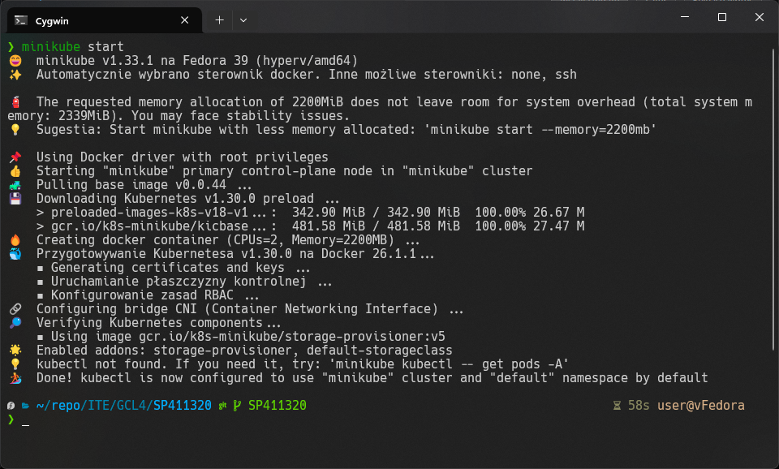

Klastrem w łatwy sposób możemy zarządzać z poziomu webowego panelu kontrolnego. Poniważ dostać do niego możemy się tylko z adresu lokalnego, polecenie `minikube dashboard` uruchamiamy w konsoli vscode podłączonego do maszyny wirtualnej - vscode automatycznie rozpoznaje próbę otwarcia przeglądarki przez polecenie i tworzy przekierowane

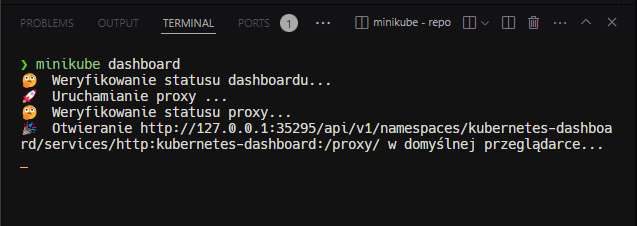

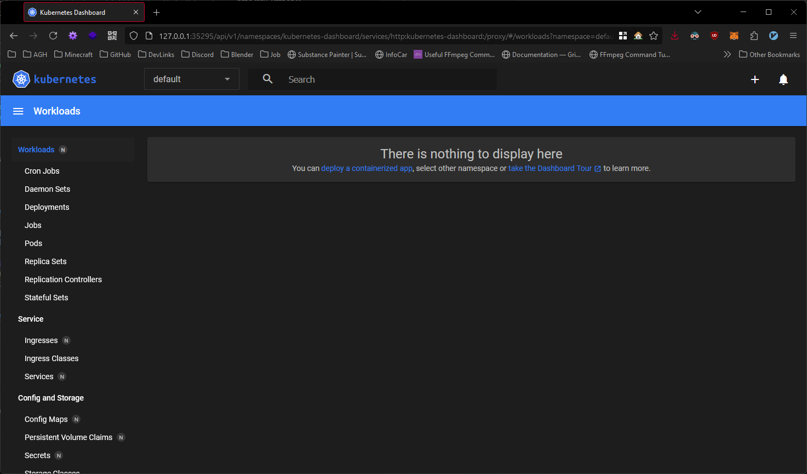

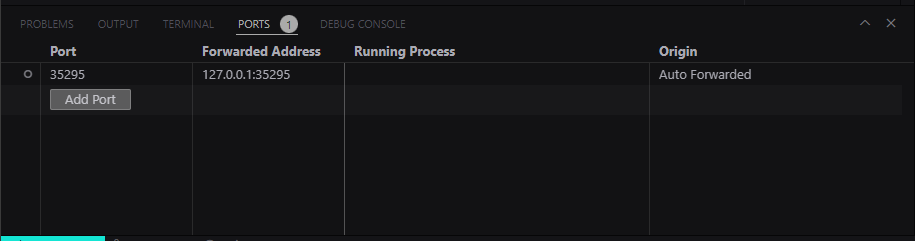

### `kubectl`
`kubectl` instalujemy również posiłkując się [dokumentacją](https://kubernetes.io/docs/tasks/tools/install-kubectl-linux/). Jest on wymagany do zarządzania zasobami Kubernetes na podobnej zasadzie podobnej do zarządzania usługami systemowymi poprzez polecenie `systemctl`.
```bash
curl -LO "https://dl.k8s.io/release/$(curl -L -s https://dl.k8s.io/release/stable.txt)/bin/linux/amd64/kubectl" # pobranie paczki
curl -LO "https://dl.k8s.io/release/$(curl -L -s https://dl.k8s.io/release/stable.txt)/bin/linux/amd64/kubectl.sha256" # pobranie sumy kontrolnej
echo "$(cat kubectl.sha256)  kubectl" | sha256sum --check # weryfikacja z sumą kontrolną
sudo install -o root -g root -m 0755 kubectl /usr/local/bin/kubectl # instalacja
```

> [!tip]
> `kubectl` jest również jednym z kontekstów polecenia `minikube`, możliwe jest więc utworzenie aliasu `kubectl='minikube kubectl --'`

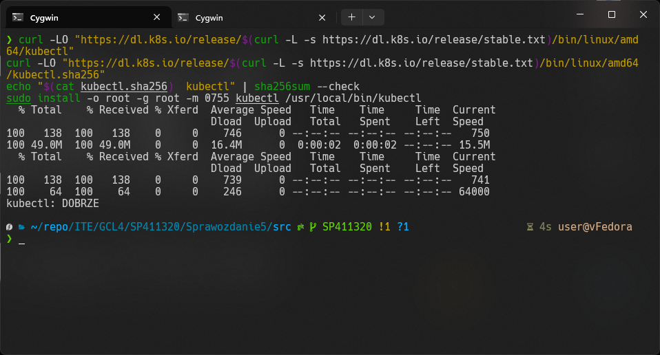

## Przygotowanie Aplikacji
### Dockerimage
Ze względu na potrzebę przygotowania aplikacji działającej w trybie ciągłym, przygotowujemy prostą stronę w pliku `index.html` i umieszczamy ją jako domyślny plik html w kontenerze nginx

```html
<!DOCTYPE html>
<html lang="en">

<head>
  <meta charset="UTF-8">
  <meta name="viewport" content="width=device-width, initial-scale=1.0">
  <title>The most powerfull hacker in the world...</title>
  <style>
    body {
      background-image: url('https://steamuserimages-a.akamaihd.net/ugc/94981434109308086/C48931A89D64785945BD0D364A481DA5BAB2B323/?imw=637&imh=358&ima=fit&impolicy=Letterbox&imcolor=%23000000&letterbox=true');
      background-size: cover;
      background-repeat: no-repeat;
      background-color: black;
    }
  </style>
</head>

<body>
</body>

</html>
```
> [`index.html`](src/index.html)

```dockerfile
FROM nginx
COPY index.html /usr/share/nginx/html/index.html
```
> `src/Dockerfile`

### Zbudowanie, preztestowanie i publikacja obrazu
Obraz budujemy i uruchamiamy poleceniami w folderze `src`
```bash
docker build -t hackerman .
docker run -d -p 80:80 --rm --name hackerman-test hackerman
```

```
CONTAINER ID   IMAGE                                 COMMAND                  CREATED          STATUS          PORTS                                                                                                                                  NAMES
321895d72cb0   hackerman                             "/docker-entrypoint.…"   24 minutes ago   Up 24 minutes   0.0.0.0:80->80/tcp, :::80->80/tcp                                                                                                      hackerman-test
964265c728e5   gcr.io/k8s-minikube/kicbase:v0.0.44   "/usr/local/bin/entr…"   26 hours ago     Up 26 hours     127.0.0.1:32772->22/tcp, 127.0.0.1:32771->2376/tcp, 127.0.0.1:32770->5000/tcp, 127.0.0.1:32769->8443/tcp, 127.0.0.1:32768->32443/tcp   minikube
```
> `docker ps`


> Uruchomiona strona

### Publikacja
Standardowo - tagujemy obraz i wypychamy go do remote'a po uprzednim zalogowaniu
```bash
docker tag hackerman pixel48/hackerman
docker login
docker push pixel48/hackerman
```

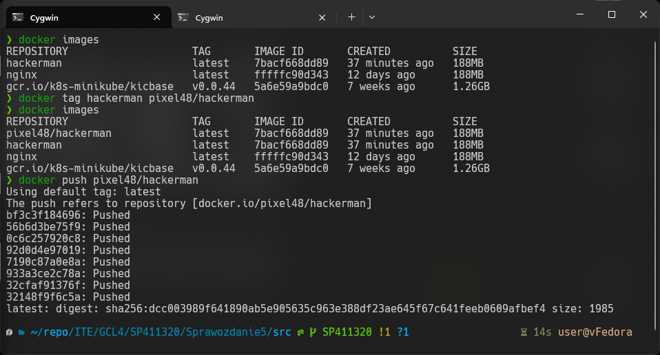

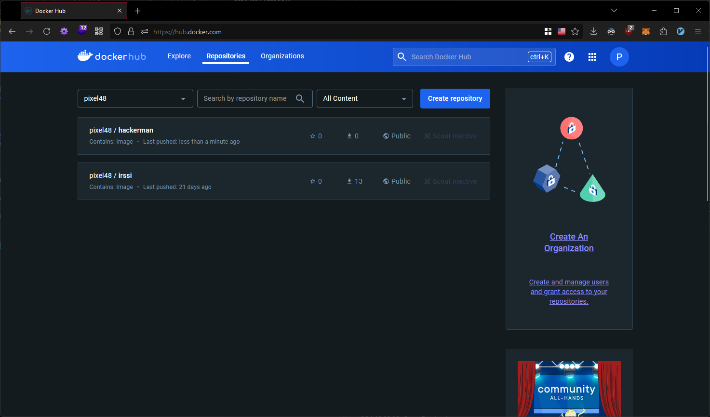

## Uruchomienie aplikacji w Kubernetes
Za pomocą `kubectl` pobieramy i uruchamiamy aplikację.

`kubectl` syntaktycznie niewiele różni się od dockera, natomiast widoczny jest znaczny nacisk położony na kontrolę ustawień sieciowych i masowe zarządzanie połączeniami

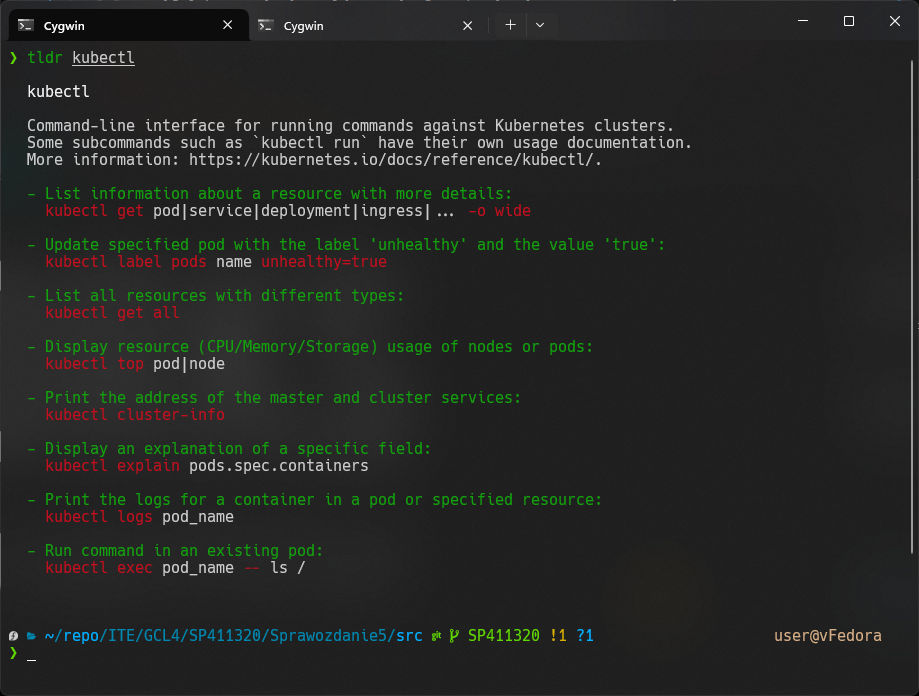

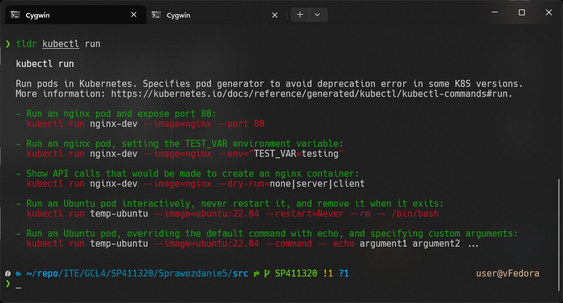

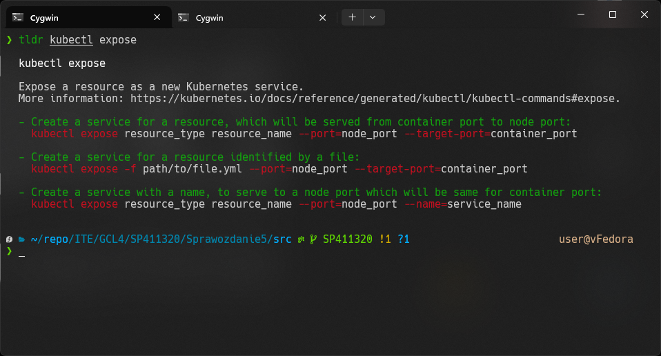

Aplikacje *podujemy* i *wystawiamy na zewnątrz* za pomocą następujących poleceń
> [!note]
> *Podujemy* i *wystawiamy na zewnątrz* są określeniami bardzo podobnymi do *spinu* elektronu, który możemy zwizualizować jako *kulę, która wiruje*, natomiast nie jest to kula, i nie wiruje - pojęcia te znacząco uogulniają faktycznie podjęte akcje.
```bash
kubectl run hackerman --image=pixel48/hackerman --port=80 --labels app=hackerman
kubectl expose pod hackerman --port=80 --target-port=80 --name=hackerman
```

Poprawność uruchomienia poda możemy zweryfikować poleceniem `kubectl get pods` oraz w panelu kontrolnym

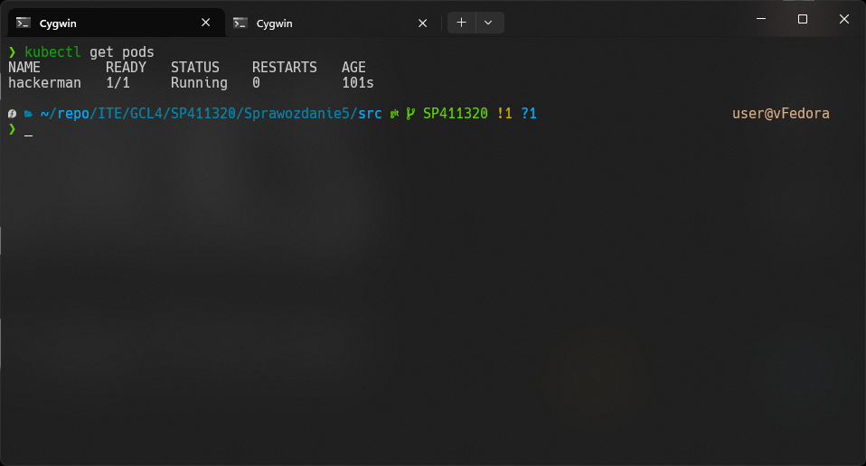

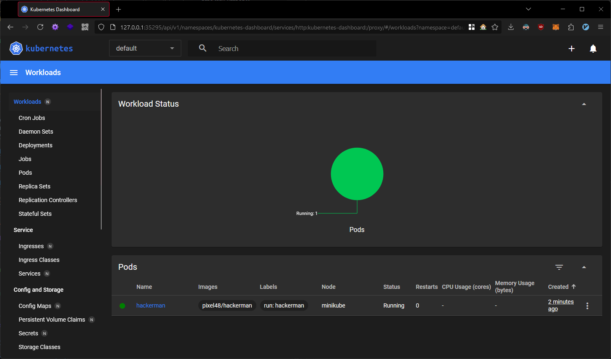

Działanie aplikacji wystawionej na porcie 80tym możemy łatwo sprawdzić, wchodząc na adres hosta


Dodatkowo możemy również przekierować dostęp do poda na inny port za pomocą `kubectl port-forward` - nie wybierając portu lokalnego kubernetes sam wybierze losowy, wolny port

```bash
kubectl port-forward pod/hackerman :80
```

## Przygotowanie pliku wdrożenia
Wdrożenia można automatyzować za pomocą plików konfiguracyjnych w formacie YAML. Ułatwia to masowe tworzenie replik aplikacji, zarządzanie rozległymi sieciami mikroserwisów oraz znacząco przyśpiesza pracę.

```yml
apiVersion: apps/v1
kind: Deployment
metadata:
  name: &h hackerman
  labels:
    app: *h
spec:
  replicas: 12
  selector:
    matchLabels:
      app: *h
  template:
    metadata:
      labels:
        app: *h
    spec:
      containers:
        - name: hackerman-image
          image: pixel48/hackerman
          ports:
            - containerPort: 80
              protocol: TCP
```
> [`hackerman-12.yml`](src/hackerman-12.yml)

Zdefiniowany w ten sposób deployment można nastepnie uruchomić za pomocą polecenia `kubectl apply -f <filename>.y[a]ml`

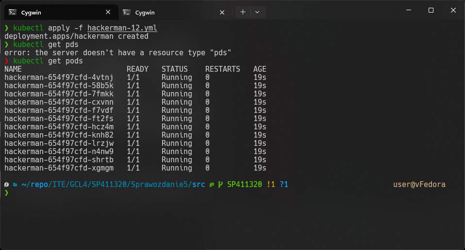

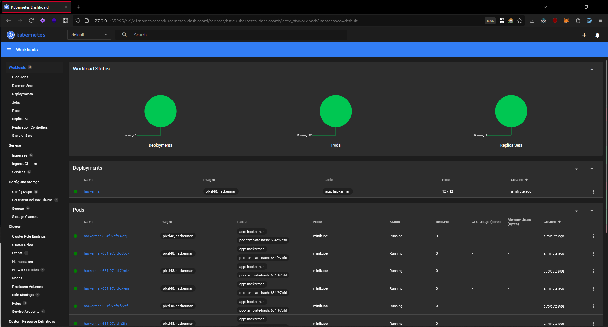

# Wdrażanie na zarządzalne kontenery: Kubernetes (2)
## Weryfikacja statusu wdrożenia
Status wdrożenia sprawdzamy poleceniem `kubectl rollout`

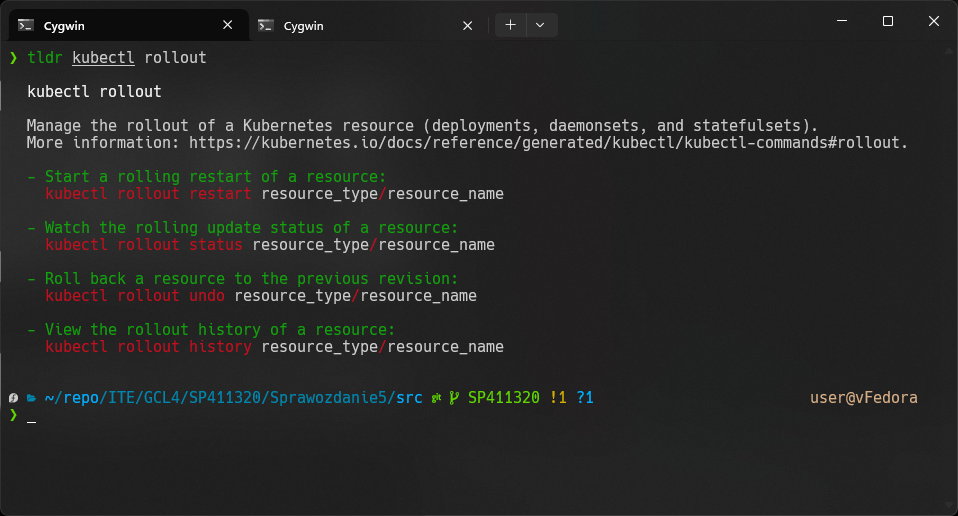

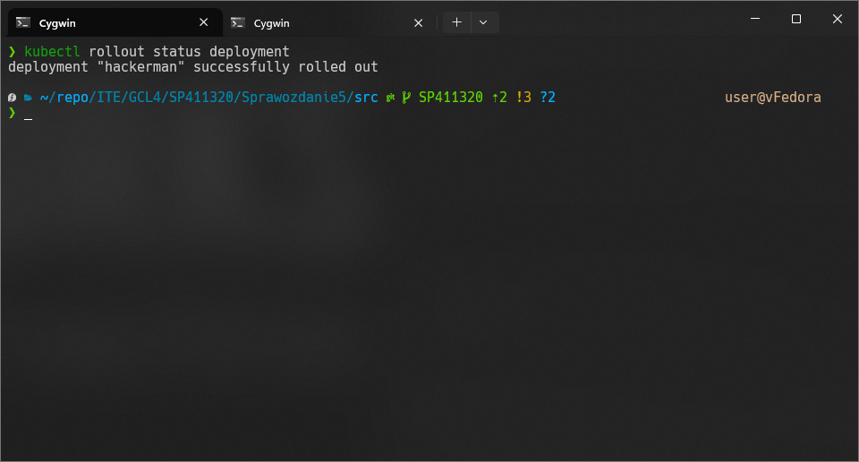

## Przygotowanie dateego obrazu
### Przygotowanie 2 datey wersji obrazu
#### Hackerman2
Zmiana polega na zmianie adresu url:
```diff
@@ -7,7 +7,7 @@
   <title>The most powerfull hacker in the world...</title>
   <style>
     body {
-      background-image: url('https://steamuserimages-a.akamaihd.net/ugc/94981434109308086/C48931A89D64785945BD0D364A481DA5BAB2B323/?imw=637&imh=358&ima=fit&impolicy=Letterbox&imcolor=%23000000&letterbox=true');
+      background-image: url('https://i.kym-cdn.com/entries/icons/facebook/000/021/807/ig9OoyenpxqdCQyABmOQBZDI0duHk2QZZmWg2Hxd4ro.jpg');
       background-size: cover;
       background-repeat: no-repeat;
       background-color: black;
```

datey obraz nosi nazwę `hackerman2`

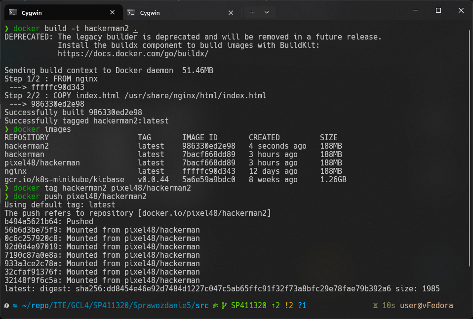

#### Kiddie
Jedynym celem obrazu `kiddie` jest natychmiastowe zakończenie swojej pracy kodem błędu. Najprostszym sposobem na utworzenie takiego obrazu jest wywołanie polecenia `false`, które zwróci kod błedu

```dockerfile
FROM scratch
CMD ["false"]
```
> [`kiddie.Dockerfile`](src/kiddie.Dockerfile)

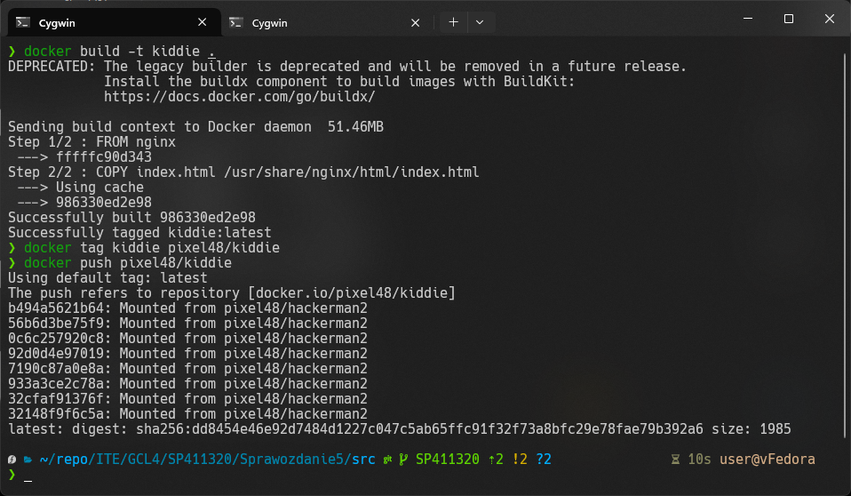

### Zmiany we wdrożeniu
#### 8 replik
```diff
@@ -5,7 +5,7 @@ metadata:
   labels:
     app: *h
 spec:
-  replicas: 12
+  replicas: 8
   selector:
     matchLabels:
       app: *h
```

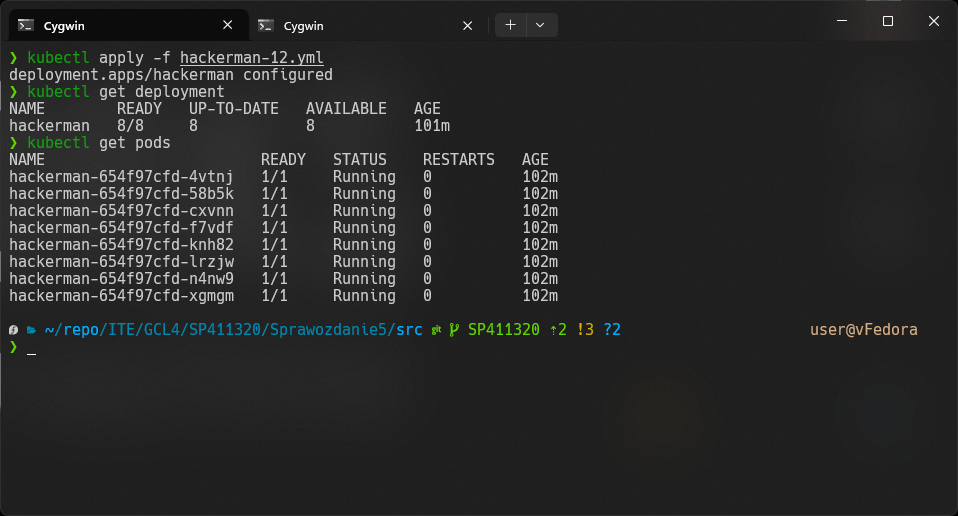


#### 1 replika
```diff
@@ -5,7 +5,7 @@ metadata:
   labels:
     app: *h
 spec:
-  replicas: 12
+  replicas: 1
   selector:
     matchLabels:
       app: *h
```

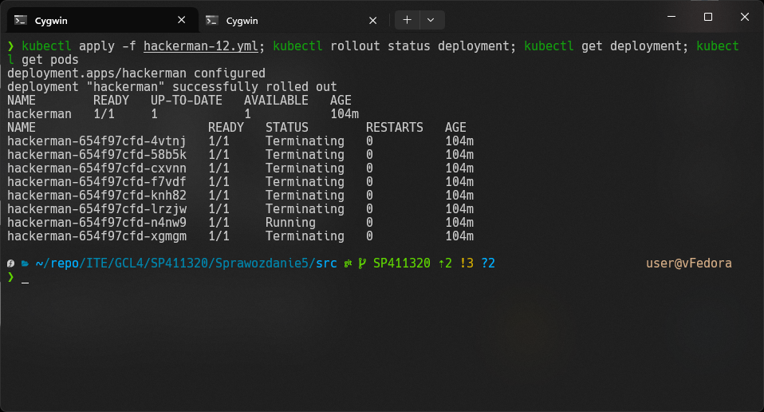

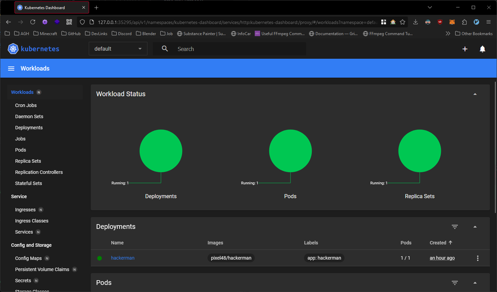

#### 0 replik
```diff
@@ -5,7 +5,7 @@ metadata:
   labels:
     app: *h
 spec:
-  replicas: 12
+  replicas: 0
   selector:
     matchLabels:
       app: *h
```

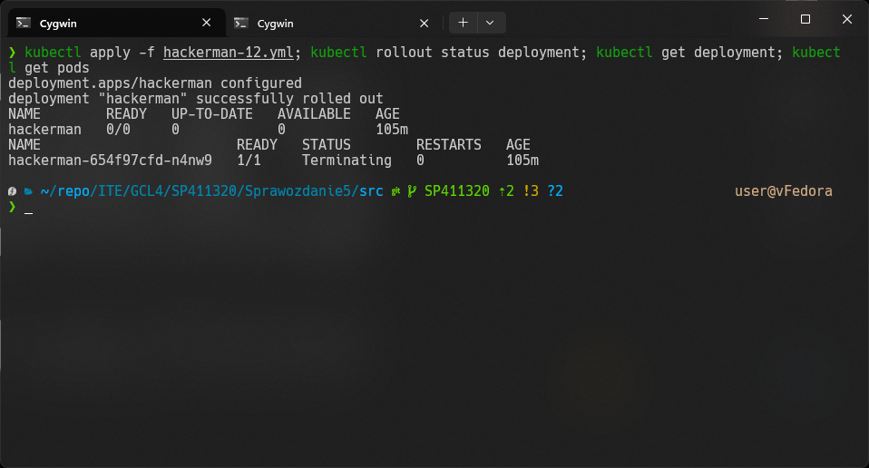

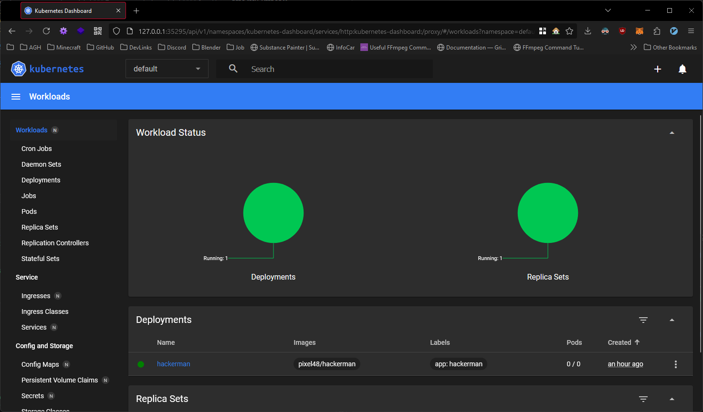

#### Zastosowanie dateej wersji obrazu
```diff
@@ -5,7 +5,7 @@ metadata:
   labels:
     app: *h
 spec:
-  replicas: 12
+  replicas: 8
   selector:
     matchLabels:
       app: *h
@@ -16,7 +16,7 @@ spec:
     spec:
       containers:
         - name: hackerman-image
-          image: pixel48/hackerman
+          image: pixel48/hackerman2
           ports:
             - containerPort: 80
               protocol: TCP
```

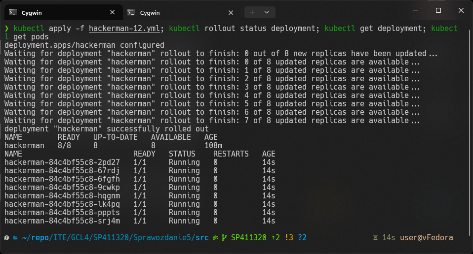


#### Zastosowanie starszej wersji obrazu
```diff
@@ -5,7 +5,7 @@ metadata:
   labels:
     app: *h
 spec:
-  replicas: 12
+  replicas: 2
   selector:
     matchLabels:
       app: *h
@@ -16,7 +16,9 @@ spec:
     spec:
       containers:
         - name: hackerman-image
-          image: pixel48/hackerman
+          image: pixel48/hackerman2
           ports:
             - containerPort: 80
               protocol: TCP
+        - name: kiddie-image
+          image: pixel48/kiddie
```

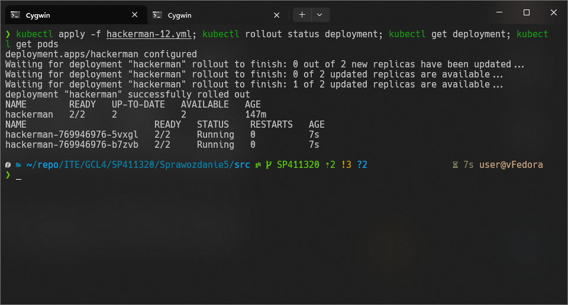

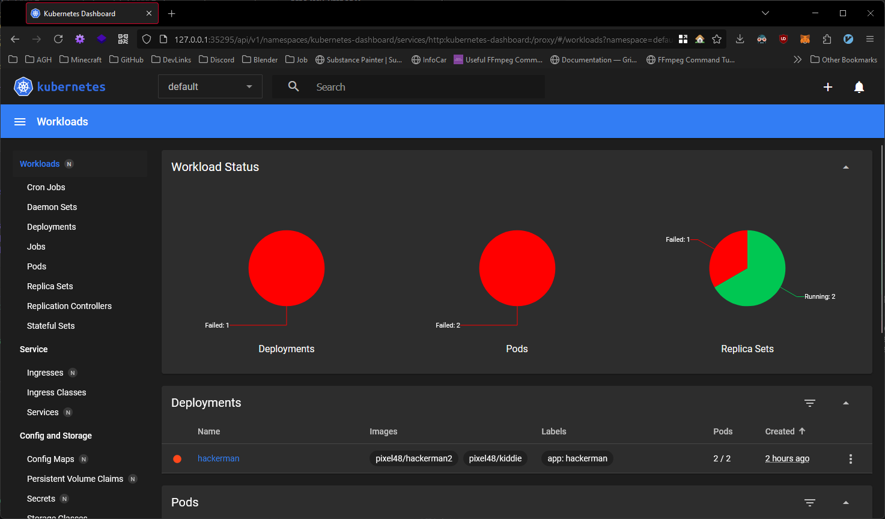

### Przywrócenie poprzednich wersji wdrożenia
#### `kubectl rollout history`
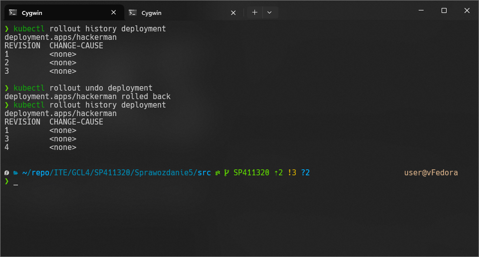

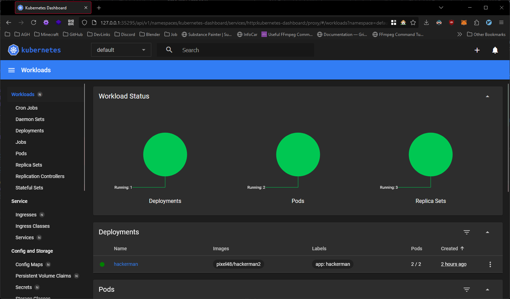

## Kontola wdrożenia
### Skrypt weryfikujący wdrożenie wdrożenia
```bash
#!/bin/bash
if [[ $# == 0 ]]; then
  echo "usage: $0 <thing>.yml"
  exit 0
fi

limit=60
stime=$(date +%s)
kubectl apply -f $1
dname=$(kubectl get deployment -o jsonpath='{.items[*].metadata.name}')
ltime=$(date +%s)
dtime=0


working=0
until [ $dtime -gt $limit ]; do
  _rdy=$(kubectl get deployment $dname -o jsonpath='{.status.readyReplicas}')
  if [ -z "$_rdy" ]; then
    _rdy=0
  fi
  _ttl=$(kubectl get deployment $dname -o jsonpath='{.status.replicas}')
  echo -ne "\rDeploying... $_rdy/$_ttl -- ${dtime}/60s"
  ltime=$(date +%s)
  dtime=$(( $ltime - $stime ))
  if [ "$_rdy" -eq "$_ttl" ]; then
    echo
    echo "DONE!"
    exit 0
  fi
done

echo
echo Timeout!
exit 1
```
> [`deploy.sh`](src/deploy.sh)

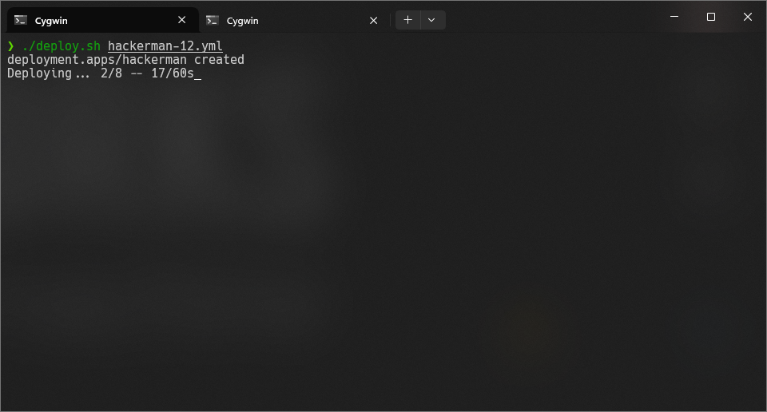

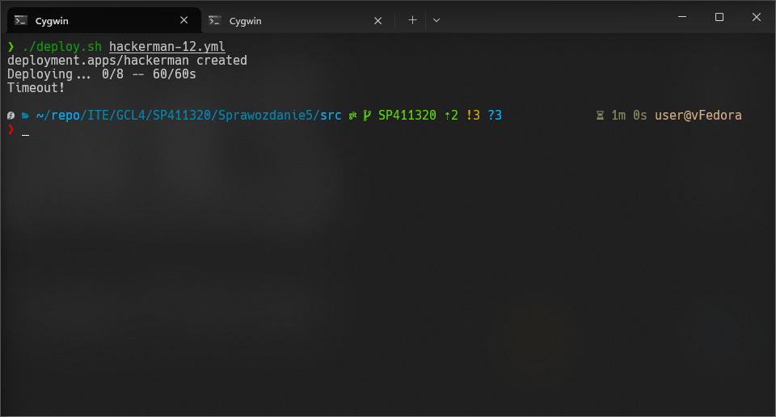

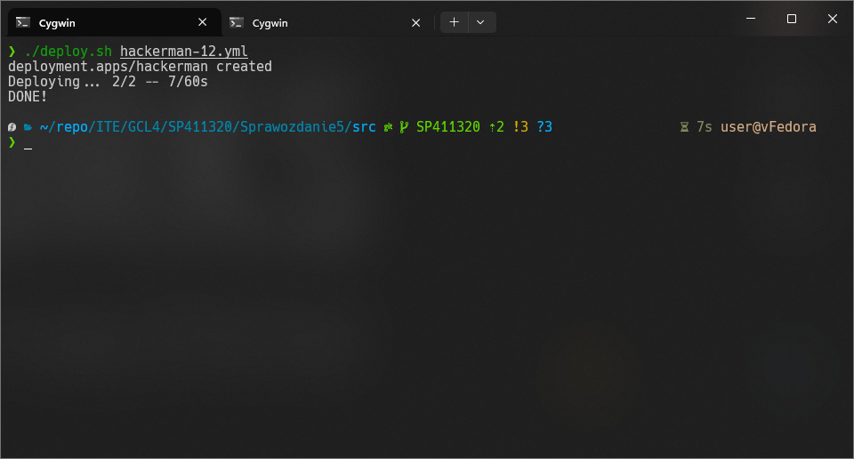

## Strategie wdroenia wdrażania wdrożeń
Stategie wdrażania definiujemy w pliku wdrożenia, w pozycji `spec/strategy/type`
### Recreate
**Recreate** - ponowne utworzenie wszystkich istniejących podów (*rekreacja*)

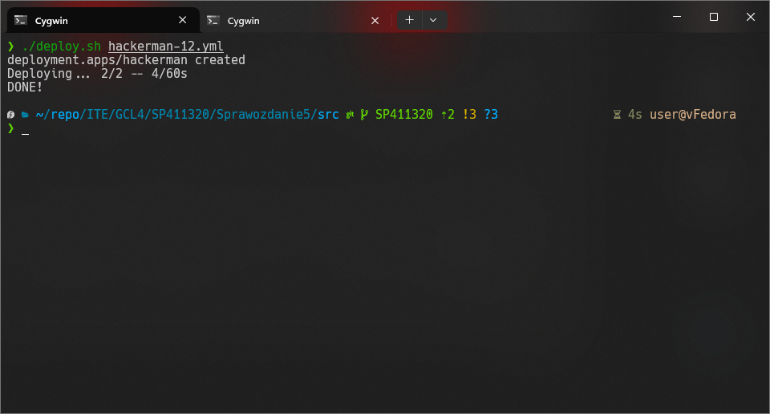


### Rolling Update
> [!note]
> Parametry:
> - `maxUnavailable` > 1
> - `maxSurge` > 20%

**Rolling Update** sekwencyjnie wymienia stare pody na nowe. W ten sposób możliwa jest *płynna* wymiana podów na nowe przy utrzymaniu ciągłości dostarczania usługi.

`maxUnavailable` kontroluje, ile podów jest jednocześnie wymieniane, `maxSurge` kontroluje, ile podów zostanie dodatkowo utworzone podczas wdrażania nowego wdrożenia

Oba parametry definiujemy jako pola pod `spec/strategy/rollingUpdate` w pliku wdrożenia

### Canary
**Canary Deployment** opiera się o częściową wymianę serwisu przy jednoczesnym testowaniu nowo wdrożonej wersji. Nazwa pochodzi od kanarków używanych w kopalniach do wykrywania metanu. Aby wdrożyć nowe wdrożenie tą strategią wdrożenia, należy ręcznie stopniowo wymieniać kolejne pody. Możemy wykorzystać do tego kontekst `scale` polecenia `kubectl`
```bash
kubectl scale deployment <deployment_name> --replicas=<new_count>
```
