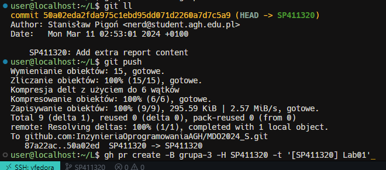

# Lab01

Stanisław Pigoń

## 1. Git i klucze SSH

### 1.1 Instalacja środowiska

W celu ułatwienia pracy w dłuższej perspektywie czasowej, prawidłowa konfiguracja środowiska pracy jest kluczowa.
System Fedora Server 39.0 instalujemy na maszynie wirtualnej Hyper-V, umieszczając obraz ISO w wirtualnym napędzie CDROM i przeprowadzamy standardową instalację systemu, uprzednio ustawiając dane urzytkownika, hasło, oraz przestrzeń dyskową do wykorzystania przez instalator. Ponieważ wykorzystujemy maszynę wirtualną, możemy oznaczyć cały dysk wirtualny do wyczyszczenia na potrzeby instalacji.


### 1.2 Konfiguracja sieci

Po zakończeniu instalacji wpinamy do uzyskanej maszyny wirtualnej odpowiednio skonfigurowany przełącznik wirtualny Hyper-V, pozwalający maszynie na połączenie się zarówno z komputerem hosta, jak i podłączoną do niego siecią w celu umożliwienia pracy ze zdalnym repozytorium. Taki typ pracy umożliwia nam wirtualna karta zewnętrzna, ustawiona na odpowieni interfejs sieciowy komputera hosta, który jest podłączony do sieci.


> Weryfikacja połączenia z siecią po stronie maszyny wirtualnej

### 1.3 Połączenie z maszyną wirtualną za pośrednictwem SSH

#### 1.3.1 Zdalna konsola

Aby przetestować połączenie, logujemy się do maszyny z konsoli hosta na dane utworzonego w trakcie instalacji użytkownika


#### 1.3.2 Zdalna sesja VSCode z wykorzystaniem kluczy SSH

##### 1.3.2.1 Utworzenie kluczy SSH

Aby umożliwić wygodne i bezpieczne połączenie z maszyną wirtualną, tworzymy parę kluczy SSH poleceniem `ssh-keygen -t ed25519 -b 4096 -N '' -f ~/.ssh/keys/vFedora`


##### 1.3.2.2 Skopiowanie kluczy na maszynę wirtualną

Aby umożliwić połączenie z maszyną wirtualną, kopiujemy klucz publiczny na maszynę wirtualną poleceniem `ssh-copy-id -i ~/.ssh/keys/vFedora.pub <remote_user>@<remote_host>` oraz sprawdzamy poprawność przeniesienia klucza na maszynę wirtualną, logując się do niej z wykorzystaniem odpowiedniego klucza prywatnego


> Jeżeli w systemie nie jest dostępne polecenie `ssh-copy-id`, wykorzystać można polecenie `scp ~/.ssh/keys/vFedora.pub <remote_user>@<remote_host>:~/.ssh/authorized_keys`, aby umieścić klucz publiczny w katalogu `.ssh` użytkownika na maszynie wirtualnej poprzez kopiowanie pliku przez SSH. Następnie należy nadać odpowiednie uprawnienia do pliku `authorized_keys` poleceniem `chmod 600 ~/.ssh/authorized_keys`

##### 1.3.2.3 Konfiguracja hosta

Aby ułatwić sobie kolejne logowania do maszyny wirtualnej, tworzymy wips w konfiguracji klienta SSH (`~/.ssh/config`) wpis umożliwiający logowanie do maszyny wirtualnej z wykorzystaniem klucza prywatnego. Dodatkowo w definicji połączenia dodać alias, umożliwiając bezpieczne logowanie do maszyny bez użycia hasła i bez konieczności podawania pełnego adresu IP maszyny wirtualnej


##### 1.3.2.4 Konfiguracja VSCode

Wtyczka _Remote - SSH_ umożliwia pracę z plikami na maszynie wirtualnej z poziomu edytora kodu VSCode. W celu umożliwienia wygodnej pracy z maszyną wirtualną, konfigurujemy połączenie z maszyną wirtualną w pliku konfiguracyjnym VSCode, umożliwiając szybkie i wygodne połączenie z maszyną wirtualną. Dodatkowo, również wbudowany terminal VSCode w trakcie sesji zdalnej korzysta z konfiguracji klienta SSH, znacząco ułatwiając pracę z maszyną wirtualną.
_Remote - SSH_ wykorzystuje konfigurację klienta SSH, przez co nie jest konieczne ponowne konfigurowanie połączenia z maszyną wirtualną w edytorze kodu.


### 1.4 Instalacja klienta Git

W przypadku systemu Fedora, instalacja klienta git sprowadza sie do wykonania polecenia `sudo dnf -y install git` w celu zainstalowania wszystkich komponentów klienta git.


### 1.4.1 Konfiguracja klienta Git

Przed rozpoczęciem pracy ze zdalnym repozytorium musimy ustawić dane użytkownika w kliencie Git oraz skonfigurować dostęp do GitHub'a za pomocą kluczy SSH.

Aby ustawić kolejno imię i nazwisko oraz email wykorzystujemy polecenie `git config` aby ustawić odpowiednio `user.name` oraz `user.email`


> Dodatkowo, aby zachować punkty poczytalności, możemy przełączyć domyślny edytor na `nano`

#### 1.4.2 Konfiguracja kluczy SSH

Komunikacja z gitem wymaga od nas użycia kluczy SSH. W celu wygenerowania kluczy SSH, wykorzystujemy polecenie `ssh-keygen -t ed25519 -b 4096 -N '' -f ~/.ssh/keys/<key_name>`. Następnie, klucz publiczny kopiujemy do ustawień konta na GitHubie, w celu umożliwienia komunikacji z serwisem za pomocą kluczy SSH, aby umożliwić bezpieczne logowanie do serwisu GitHub. Możemy również skonfigurować klienta Git, aby korzystał z klucza SSH w komunikacji z serwisem GitHub, podobnie jak w przypadku konfiguracji klienta SSH dla maszyny wirtualnej po stronie hosta.

##### 1.4.2.1 Utworzenie kluczy SSH

Zgodnie z treścią zadania tworzymy dwie pary kluczy - obie typu innego niż RSA, z czego jedna zabezpieczona jest hasłem


##### 1.4.2.2 Skopiowanie kluczy na GitHuba

Klucz publiczny kopiujemy do ustawień konta na GitHubie, w celu umożliwienia komunikacji z serwisem za pomocą kluczy SSH


#### 1.4.2.3 Konfiguracja klienta Git (VM)


## 2 Sklonowanie repozytorium

Sklonowanie repozytorium możliwe jest na 2 sposoby:

- za pomocą protokołu HTTPS i personal access token (w 2021 roku GitHub zaczął wymagać tokenów zamiast hasła do autoryzacji)
- za pomocą kluczy SSH (preferowany sposób, ze względu na bezpieczeństwo)

### 2.1 Klonowanie HTTPS

Klonowanie repozytorium za pomocą protokołu HTTPS wymaga od nas wykorzystania personal access token, który generujemy w ustawieniach konta na GitHubie. Token można odczytać tylko raz, po jego utworzeniu, dlatego warto zapisywać go w bezpiecznym miejscu, aby nie stracić dostępu do repozytorium. Dobrze jest również ustawić odpowiednie uprawnienia i termin ważności tokenu, aby zminimalizować potencjalne straty w przypadku wycieku tokenu - z odpowiednimi uprawnieniami pozwala on nawet zmienić hasło do konta na GitHubie.


### 2.2 Klonowanie SSH

Klonowanie repozytorium za pomocą SSH wymaga wygenerowania pary kluczy SSH oraz umieszczenie klucza publicznego w ustawieniach konta na GitHubie. Klucz prywatny należy prawidłowo powiązać w konfiguracji klienta SSH, aby umożliwić komunikację z serwisem GitHub.

#### 2.2.1 Generowanie kluczy SSH

Zgodnie z treścią zadania, generujemy dwie pary kluczy SSH - obie typu innego niż RSA, z czego jedna zabezpieczona jest hasłem.
Tworząc klucze SSH możemy przyśpieszyć proces generowania klucza, podając parametry w linii poleceń, zamiast korzystać z interaktywnego trybu generowania klucza. Wykorzystujemy więc kolejne opcje:

- `-t` - wybór algorytmu klucza
- `-b` - długość klucza w bitach
- `-N` - hasło do klucza (passphrase)
- `-f` - nazwa pliku klucza


#### 2.2.2 Skopiowanie kluczy na GitHuba


#### 2.2.3 Konfiguracja klienta Git (VM)

Opcjonalnie tworzymy wpis w `~/.ssh/config`, aby umożliwić szybkie i wygodne logowanie do serwisu GitHub za pomocą klucza SSH, bez potrzeby podania pełnego adresu serwera czy wykorzystywanego klucza prywatnego flagą `-i` polecenia `ssh`


#### 3 Klonowanie repozytorium za pomocą klucza SSH

Na końcu klonujemy repozytorium za pomocą klucza SSH, wykorzystując odpowiedni adres URL repozytorium


## 4 Przełączenie na gałąź `main`, a potem na gałąź swojej grupy

Aby przełączać się między znacznikami git, możemy wykorzystać polecenie `git switch` lub `git checkout`, natomiast ze względu na znacznie większą funkcjonalność i elastyczność `git checkout` dobrym pomysłem wydaje się przyzwyczajenie do korzystania z tego polecenia od początku pracy z repozytorium.


> UWAGA: Student w trakcie konfiguracji środowiska ćwiczeniowego zaciągnął plik konfiguracyjny `.gitconfig` z własngeo repozytorium, zawierający dużą ilość aliasów poleceń git dla ułatwienia pracy. Większość z tych aliasów to proste skróty poleceń, często również z dodatkowymi opcjami. Warto zauważyć, że aliasy te nie są standardowymi aliasami poleceń git, a jedynie ułatwieniem pracy dla studenta. Treści kolejnych aliasów są wyświetlane po ich wywołaniu, aby umożliwić zrozumienie ich działania i potencjalne odtworzenie opisywanych kroków

## 5 Utworzenie gałęzi o nazwie "inicjały & nr indeksu"


## 6 Rozpoczęcie pracy na nowej gałęzi (Lab01)

### 6.1 Utworzenie katalogu `<kierunek>/<grupa>/<inicjały><numerIndeksu>/Lab01/`


### 6.2 Napisanie Git hook'a

W celu zweryfikowania, czy każdy commit-message w repozytorium zaczyna się od "twoje inicjały & nr indexu" tworzymy skrypt weryfikujący, który umieszczamy w pliku `pre-commit` w katalogu `.git/hooks` w repozytorium. Skrypt ten jest wywoływany za każdym razem, gdy robimy commita, a jego zadaniem jest sprawdzenie, czy commit-message zaczyna się od "twoje inicjały & nr indexu". W przypadku, gdy commit-message nie spełnia tego warunku, skrypt zwraca kod błędu, uniemożliwiając zatwierdzenie zmian w repozytorium.
Git-hook może być napisany w dowolnym języku (może to być nawet plik binarny). W przypadku `pre-commit` jedyne, co ma znaczenie, to możliwość przyjęcia commit-message jako argumentu i zwrócenie kodu błędu w przypadku niezgodności z założeniami. Ze względu na prostotę możemy wykorzystać skrypt bashowy, sprawdzający początek linijki z commit-message.

```bash
# #!/bin/bash
# # Plik: .git/hooks/commit-msg

if `grep -q ^SP411320 $1`; then
  exit 0
fi
  echo -e >&2 "\e[31mCommit message musi zaczynać się od \e[7mSP411320\e[0m"
  exit 1
```


### 6.3-6 Dodanie skryptu do katalogu
Ponieważ *w Linux'ie wszystko jest plikiem*, aby dodać skrypt do katalogu `.git/hooks` w repozytorium, wystarczy skopiować plik do odpowiedniego katalogu. W przypadku, gdy skrypt jest już w katalogu, należy go nadpisać, aby wprowadzone zmiany w skrypcie były widoczne w repozytorium. Należy pamiętać o odpowiedniej nazwie pliku. W tym przypadku hook został napisany najpierw w katalogu `.git/hooks`, więc skopiować należy go do katalogu `Lab01/`, a nie odwrotnie.
Dodatkowo, możemy od razu dodać ten plik do repozytorium.


### 6.7 Wysłanie zmian do zdalnego źródła
Aby wysłać zmiany do zdalnego źródła, musimy najpierw zatwierdzić dodane zmiany w historii wersjii, a następnie wysłać je na serwer. W przypadku nowej gałęzi, w trakcie pierwszego wysłania konieczne będzie dowiązanie gałęzi lokalnej do gałęzi zdalnej, aby umożliwić synchronizację zmian. Wykorzystujemy do tego polecenie `git push -u <repo> <branch>`

> Możemy również dowiązać lokalną gałąź do gałęzi zdalnej o innej nazwie z wykorzystaniem skłądni `git push -u <repo> <branch>:<remote_branch>`

### 6.8 Próba wciągnięcia swojej gałęzi do gałęzi grupowej
Aby spróbować wciągnąć zmiany ze swojej gałęzi do grupowej, przełączamy się na gałąź grupową i próbujemy wciągnąć zmiany ze swojej gałęzi poleceniem `git merge <branch>`

Na szczęście ze względu na sposób działąnia repozytoriów git, modyfikacje mają charakter lokalny do momentu wypchnięcia gałęzi grupowej na serwer.


### 6.9 Zaktualizuj sprawozdanie i zrzuty o ten krok i wyślij aktualizację do zdalnego źródła (na swojej gałęzi)


## 7 Wystawienie Pull Requesta do gałęzi grupowej

Aby utworzyć PR w zdalnym repo możemy użyć zarówno interface'u na stronie GitHub'a, jak i wykorzystać narzędzie `gh` pozwalające na zarządzanie również zdalnymi repo


> Ze względu na niemożliwość zamieszczenia w sprawozdaniu wyników działania komendy do utworzenia pull-requesta tak, aby jej wyniki znalazły się w tym pull-requeście, autor w tym miejscu zdecydował się na niezamieszczenie kolejnych etapów pracy z repozytorium w sprawozdaniu dla tego ćwiczenia, ze względu na potencjalne zapętlenie ciągłego tworzenia kolejnych commitów ze zrzutami ekranu dla poprezdnich działań
