# Sprawozdanie z projektu zaliczeniowego

## Bartosz Kępczyński

### Przebieg ćwiczeń:

Początkowo znaleziono repozytorium aplikacji open source, zgodne z przedstawionymi wymaganiami. Wybraną aplikcają jest redis.

Wyciąg z licencji:

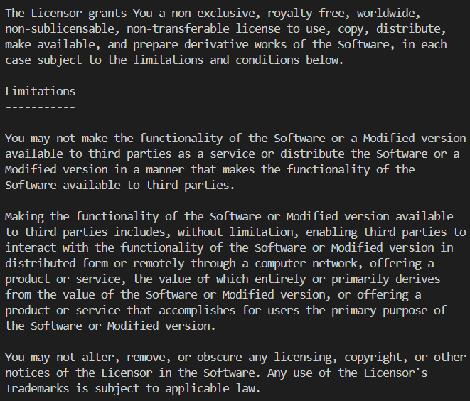

Sklonowano repozytorium aplikacji, następnie skompilowano ją i przetestowano.

Testy aplikacji:

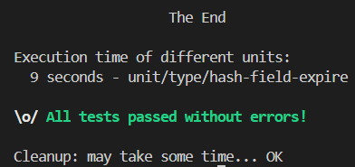

Działanie aplikacji:

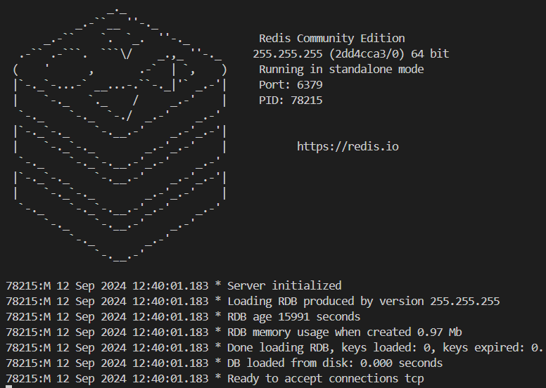
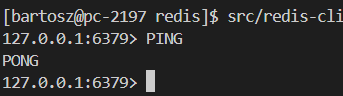

Następnie uruchomiono ją w kontenerze i sprawdzono nasłuchiwanie na porcie, oraz komunikację.

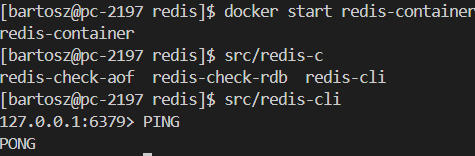

Najlepszym rozwiązaniem procesu wdrożeiowego dle tego programu będzie dystrybucja jako obraz docker. Jest on łatwo pobieralny i przenośny. Taki obraz powinien działać samodzielnie, nie wymagać pobierania dodatkowyych zależności, oraz nie powinno być w nim narzędzi deweloperskich.

Zestawiono instalację jenkinsa DIND, w tym celu również dodano użytkownika jenkins do grupy docker mającej to samo ID co grupa docker na hoście i stworzono pipeline dla projektu.

- Etap Build tworzy obraz, który instaluje wszystkie potrzebne zależności, a następnie przeprowadza testy.

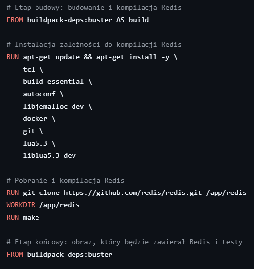
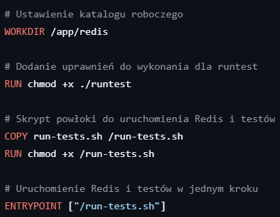
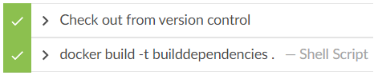

Dockerfile obrazu budującego został załączony razem ze sprawozdaniem.

- Etap Test korzysta z utworzonego wcześniej obrazu i buduje kontener do testowania.

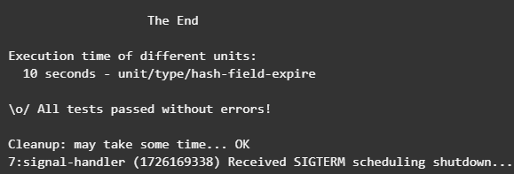

- Etap deploy buduje obraz wdrożeniowy.

Treść dockerfile do obrazu wdrożeniowego:

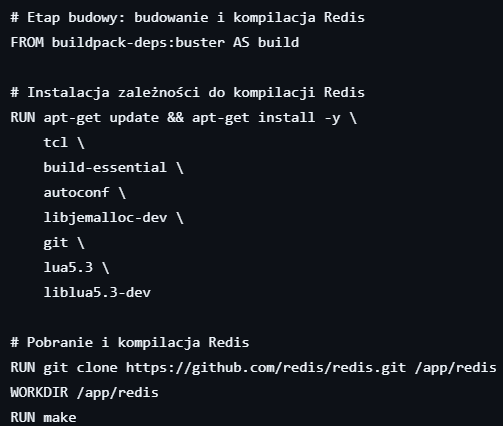
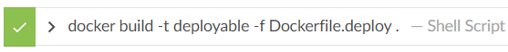

Dockerfile obrazu wdrożeniowego został załączony razem ze sprawozdaniem.

-Etap publish wysyła obraz wdrożeniowy na repozytorium dockerhub.

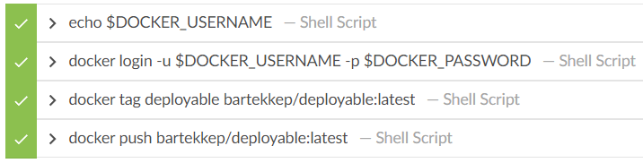

Gotowy obraz nie wymaga pobieranbia dodatkowych dependencji:

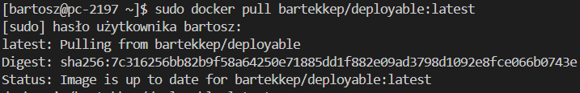