# Sprawozdanie z projektu zaliczeniowego z przedmiotu Metodyki DevOps

## Przebieg

Jako oprogramowanie Open Source wybrano aplikację `Flask`, która jest serwerem WWW i domyślnie działa na porcie TCP 5000.

#### Licencja

`Flask` jest licencjonowany na licencji BSD, co można zobaczyć na oficjalnym `githubie` aplikacji w pliku `LICENSE.txt`:

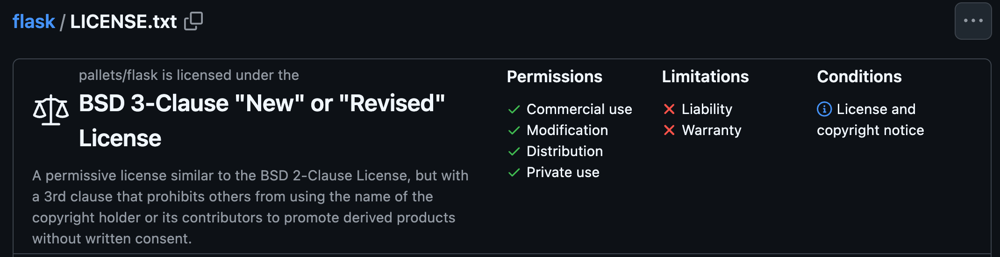

#### Testy

Aplikacja posiada liczne testy, znajdujące się w folderze `tests` w repozytorium:

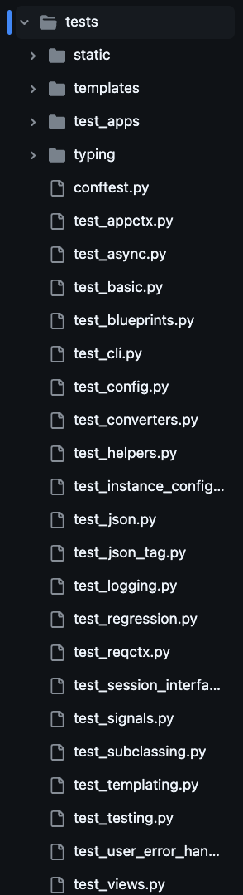

#### Uruchomienie poza kontenerem

Po stworzeniu skryptu `app.py`:

```python
from flask import Flask
app = Flask(__name__)

@app.route('/')
def hello():
    return "Hello, Flask!"

if __name__ == '__main__':
    app.run(host='0.0.0.0', port=5001)
```

Oraz uruchomieniu go za pomocą `python3 app.py`, uruchomiony zostaje serwer Flask na porcie 5001:

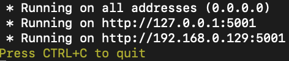

Efekt po przejściu na adres `127.0.0.1:5001` w przeglądarce:

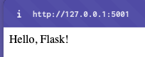

Aby uruchomić testy należało sklonować repozytorium `Flask`, przejść do katalogu głównego aplikacji, a następnie wykonać komendę `pytest`:

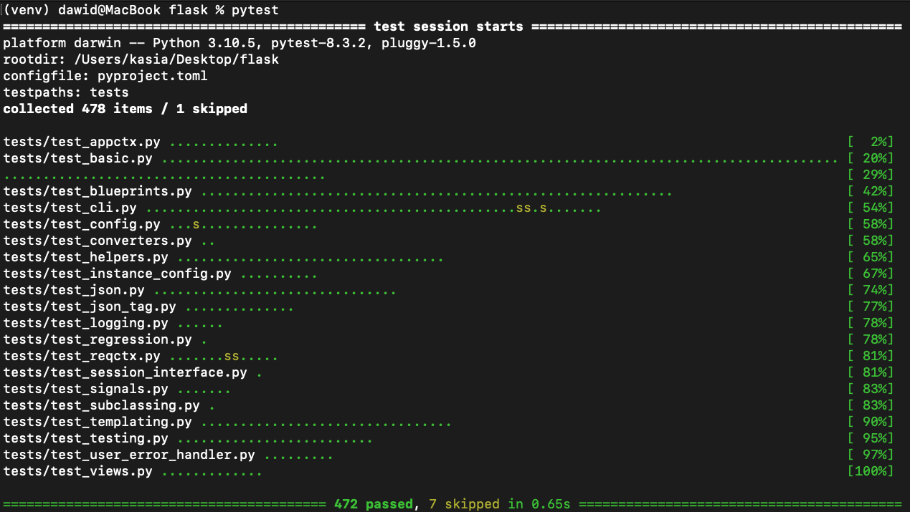

#### Uruchomienie w kontenerze

Utworzono plik `builder.Dockerfile` o następującej treści:

``` Dockerfile
FROM python:3.9-slim

RUN apt-get update && apt-get install -y git

RUN git clone https://github.com/pallets/flask ./app

WORKDIR ./app

RUN pip install -r ./requirements/build.txt && pip install flask  

EXPOSE 5001

CMD ["python", "app.py"]
```

Następnie zbudowano oraz uruchomiono kontener:
``` cmd
sudo docker build -f builder.Dockerfile -t flask-app .
sudo docker run -d -p 5001:5001 flask-app
```

Aplikacja działała wewnątrz kontenera poprawnie:
* Uruchomiony kontener:
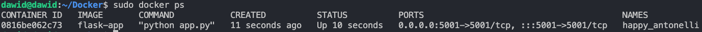
* Słuchający port:
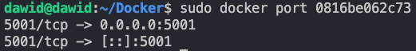
* Odpowiadająca usługa na porcie:
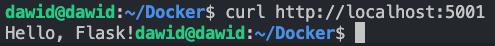

Kolejnym krokiem było utworzenie kontenera testowego. Stworzono plik `tester.Dockerfile` o następującej treści:

```Dockerfile
FROM flask-app

RUN pip install -r ./requirements/tests.txt && pip install pytest && pip install -e .[dev]

CMD ["pytest"]
```

Następnie zbudowano oraz uruchomiono kontener:
``` cmd
sudo docker build -f tester.Dockerfile -t test-app .
sudo docker run test-app
```

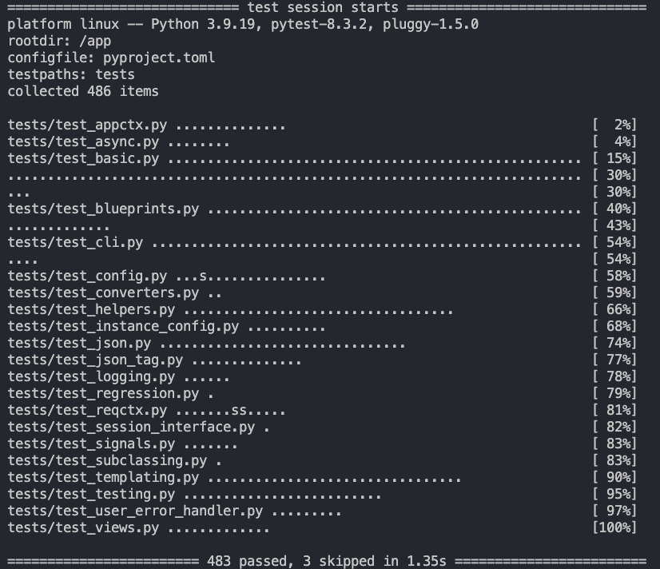

## Jenkins

Przed rozpoczęciem pracy nad krokami Build oraz Test wykonano następujące czynności:
* Stworzono maszynę wirtualną z OS Fedora bez środowiska graficznego
* Przygotowano, uruchomiono i skonfigurowano Jenkinsa według dokumentacji: https://www.jenkins.io/doc/book/installing/docker/. W efekcie powstały dwa kontenery:

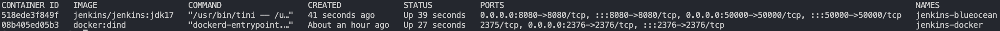

Dodatkowo:
* Instancja była osiągalna spoza maszyny wirtualnej po przejściu na adres `localhost:8080` w przeglądarce:

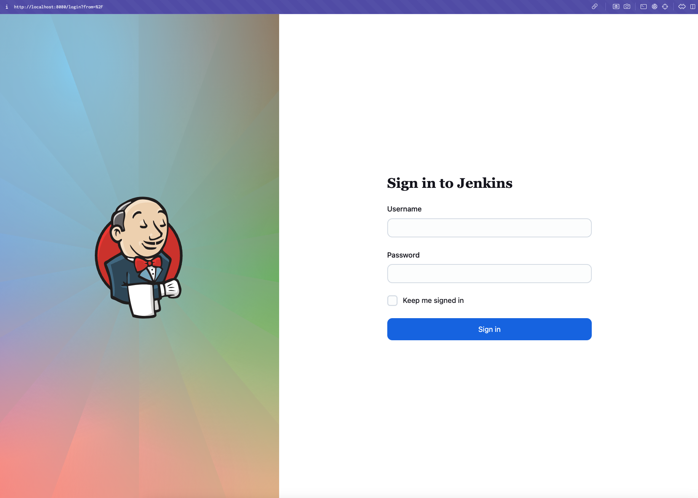

* Znacząco ograniczono możliwości korzystania z Jenkinsa dla osób niezalogowanych za pomocą poniższej ścieżki: 
`Dashboard Jenkinsa -> Manage Jenkins -> Security -> Authorization -> Matrix-based security`
Gdzie dla `Anonymous` odznaczono wszystkie 'boxy', a dla `Authenticated Users` zaznaczono je: 

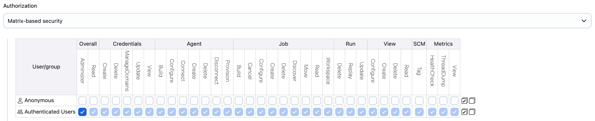

## Pipeline

Zbudowano obiekt `pipeline` za pomocą ścieżki:

`Dashboard Jenkinsa -> New Item -> Pipeline`

Początkowo miał za zadanie przeprowadzać `Build` oraz `Test` aplikacji `Flask`. Napisano w tym celu następujący skrypt:

```Groovy
pipeline {
    agent any
stages {
        stage('Prep') {
            steps {
                sh '''
                rm -rf MDO2024_INO
                git clone https://github.com/InzynieriaOprogramowaniaAGH/MDO2024_INO.git
                cd MDO2024_INO
                git checkout DP411750
                cd ITE/GCL4/DP411750
                '''
            }
        }
        stage('Build') {
            steps {
                dir("MDO2024_INO/ITE/GCL4/DP411750"){
                    sh 'docker build -t flask-app -f builder.Dockerfile . 2>&1 | tee build.log'
                }    
            }
            post {
                always {
                    archiveArtifacts artifacts: 'MDO2024_INO/ITE/GCL4/DP411750/build.log', allowEmptyArchive: true
                }
            }
        }
        stage('Test') {
            steps {
                dir("MDO2024_INO/ITE/GCL4/DP411750"){
                    sh 'docker build -t test-app -f tester.Dockerfile . 2>&1 | tee test-build.log'
                    sh 'docker run test-app 2>&1 | tee test-run.log'
                }    
            }
            post {
                always {
                    archiveArtifacts artifacts: 'MDO2024_INO/ITE/GCL4/DP411750/test-*.log', allowEmptyArchive: true
                }
            }
        }
    }
}
```

Gdzie:
* Krok `Prep` odpowiada za sklonowanie repozytorium w celu otrzymania niezbędnych w dalszych krokach `Dockerfile`, uprzednio usuwając katalog, do którego będzie klonowane wspomniane repo
* W kroku `Build` jako kontener bazowy wybrano `builder.Dockerfile` ze względu na kilka czynników. Obrazem wykorzystywanym do budowania wybranej aplikacji jest `python:3.9-slim`, jego "lekkość" (slim) zapewnia minimalne środowisko, bez zbędnych narzędzi, co przekłada się na mniejszy rozmiar obrazu oraz szybkie budowanie aplikacji. Dodatkowo w wybranym `Dockerfile` instalowane są wszystkie narzędzia niezbędne do dalszego działania aplikacji. Zapewniono również dostęp do logów buildowych za pomocą komendy `tee`. Pliki z logami są publikowane jako artefakty, co przekłada się na ich łatwy dostęp z poziomu Jenkinsa.
* W kroku `Test` jako obraz bazowy użyto `buildera` z poprzedniego kroku, następnie uruchomiono testy, a ich wyniki, podobnie jak wcześniej, zapisano jako artefakty. Plik `test-build.log` zawiera logi z budowy kontenera, natomiast `test-run.log` informuje o przebiegu testów. 

Efekty uruchomienia pipeline'a:

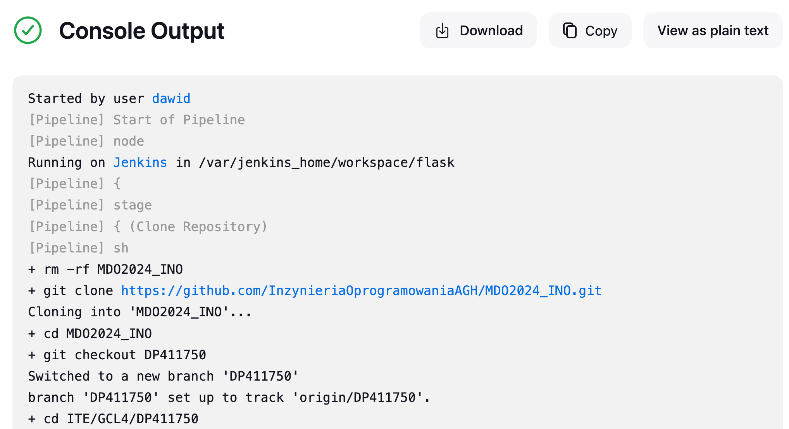
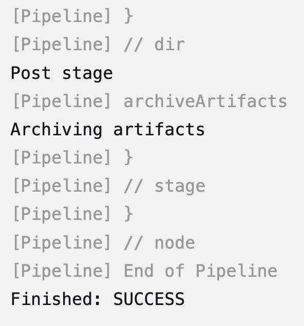

Logi jako artefakty:
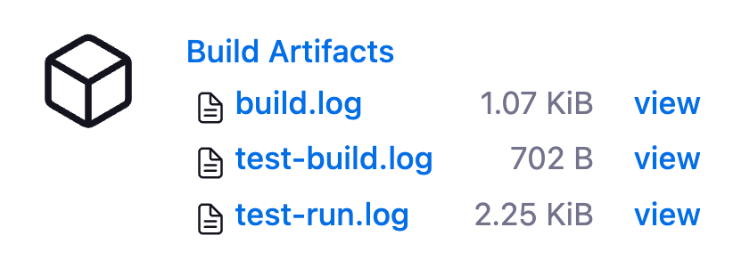

Widoki logów:
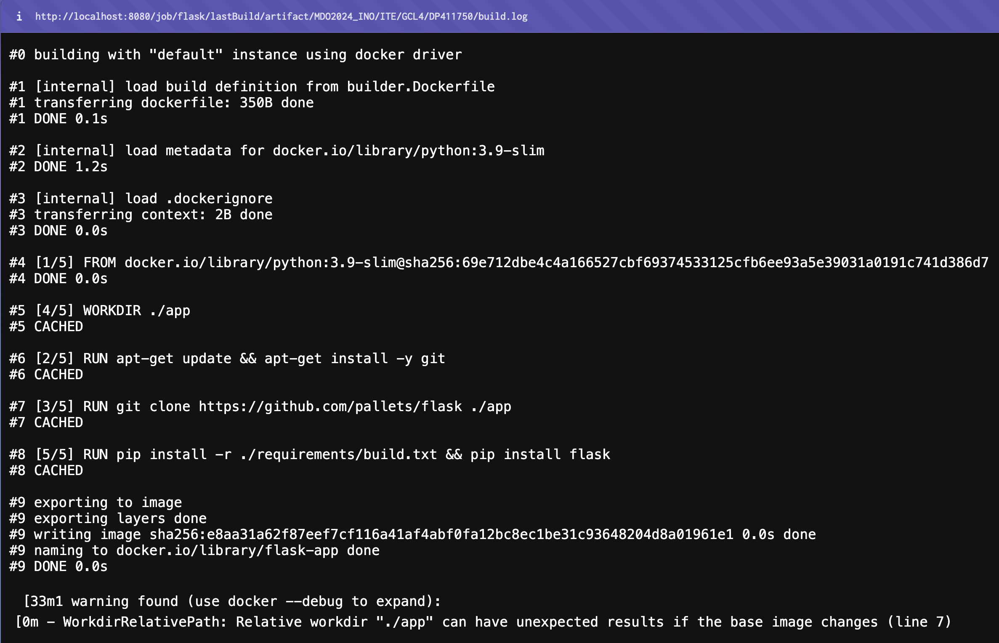
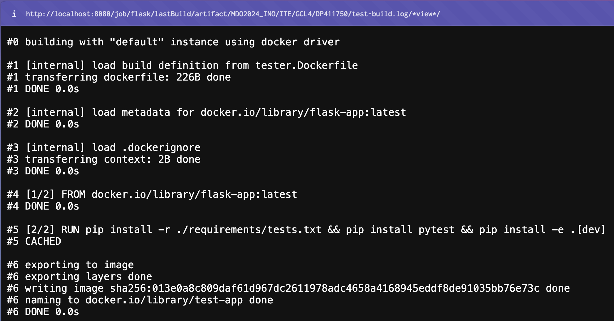
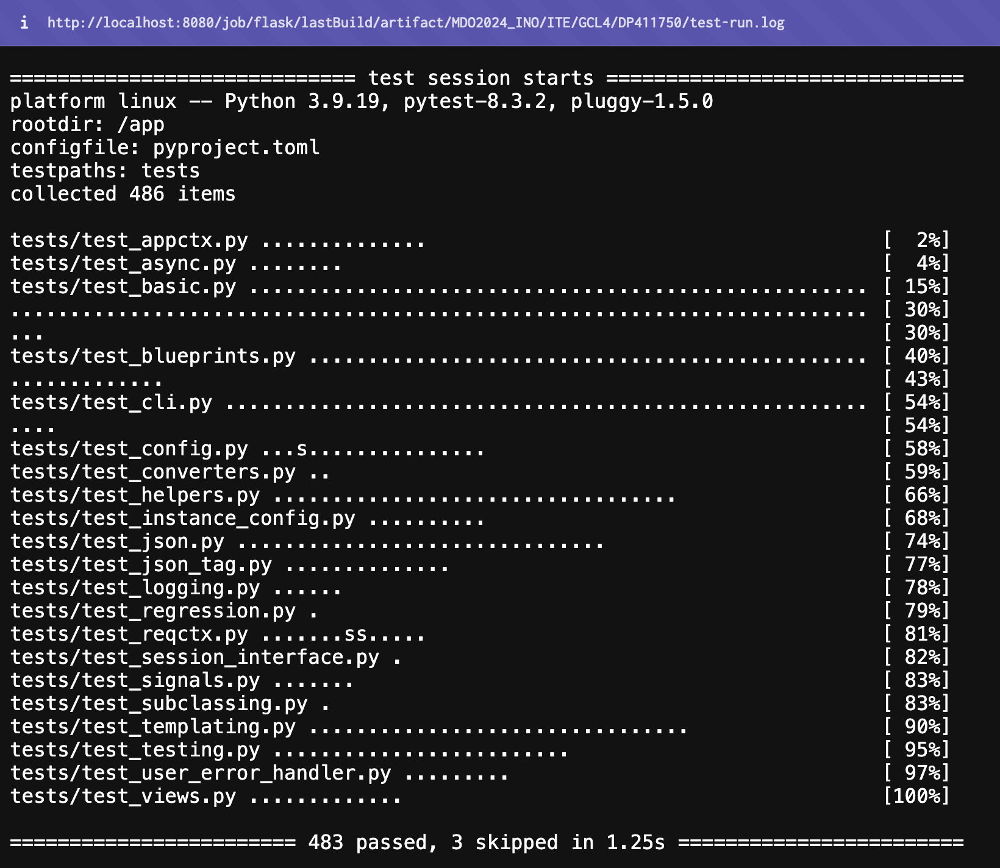

## Deploy 

Wybrana aplikacja została wdrożona w postaci obrazu Dockera ze względu na ilość zbędnych elementów na etapie dystrybucji (takich jak repozytorium, czy niepotrzebne podczas deploya zależności). 

W tym celu zmodyfikowano plik `builder.Dockerfile`:

```Dockerfile
FROM python:3.9-slim

RUN apt-get update && apt-get install -y git

RUN git clone https://github.com/InzynieriaOprogramowaniaAGH/MDO2024_INO.git

RUN cd MDO2024_INO && git checkout DP411750

WORKDIR MDO2024_INO/ITE/GCL4/DP411750

RUN pip install --upgrade pip && pip install -r requirements.txt   
```

A następnie dodano plik `deployer.Dockerfile`:

```Dockerfile
FROM python:3.9-slim

# Kopiowanie tylko niezbędnego do działania aplikacji pliku app.py
COPY --from=flask-build /MDO2024_INO/ITE/GCL4/DP411750/app.py app.py

RUN pip install flask

EXPOSE 5001

CMD ["python", "app.py"]
```

Obrazem bazowym jest `python:3.9-slim`, ponieważ wersja „slim” jest znacznie mniejsza niż pełna wersja, co przekłada się na szybsze wdrożenie i mniejszy rozmiar kontenera. Jest to kluczowe, aby uniknąć „puchnięcia” obrazu, jak wspomniano w założeniach projektu.

Do skryptu pipeline'a dodano deploy'owy `stage` :

``` Groovy
stage('Deploy') {
            steps {
                sh 'docker stop flask-app || true'
                sh 'docker rm flask-app || true'
                dir("MDO2024_INO/ITE/GCL4/DP411750"){
                    sh 'docker build -t flask-app -f deployer.Dockerfile . 2>&1 | tee deploy-build.log'
                    sh 'docker run -d -p 5001:5001 flask-app 2>&1 | tee deploy-run.log'
                }    
            }
            post {
                always {
                    archiveArtifacts artifacts: 'MDO2024_INO/ITE/GCL4/DP411750/deploy-*.log', allowEmptyArchive: true                }
            }
        }
```

Efekt uruchomienia pipeline'a:
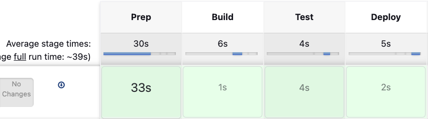

## Publish 

Aby opublikować obraz deploy'a na Docker Hubie należało dodać kilka parametrów na początku kodu pipeline'a:

```Groovy
parameters {
        booleanParam(
            name: "PROMOTE",
            defaultValue: false,
            description: "Wypromować artefakt?"
        )
        string(
            name: "VERSION",
            defaultValue: "",
            description: "Podaj numer wersji"
        )
        string(
            name: "PASSWORD",
            defaultValue: "",
            description: "Podaj hasło"
        )
    }
```
Gdzie paramter `PROMOTE` wprowadza możliwość dodania nowej wersji obrazu, co pozwala na uruchamianie pipeline'a bez **konieczności** dodawania zbędnych obrazów, na przykład podczas testowania całego pipeline'a kilkukrotnie bez zmian w obrazie deploy'owym. Parametr `VERSION` umożliwia wybranie numeru wersji obrazu, która zostanie dodana do Docker Hub, a `PASSWORD` pozwala na wprowadzenie hasła do konta na tej platformie. 

Następnie dodano `stage` Publish do kodu pipeline'a:

```Groovy
stage("Publish") {
    steps {
        script {
            if(params.PROMOTE) {
                sh "echo '${params.PASSWORD}' | docker login -u dawidpac1a --password-stdin"
                sh "docker tag flask-app:latest dawidpac1a/flask-app:${params.VERSION}"
                sh "docker push dawidpac1a/flask-app:${params.VERSION}"
            } else {
                echo 'No promotion :('
            }
        }
    }
}
```

Po kliknięciu `Build with Parameters`:
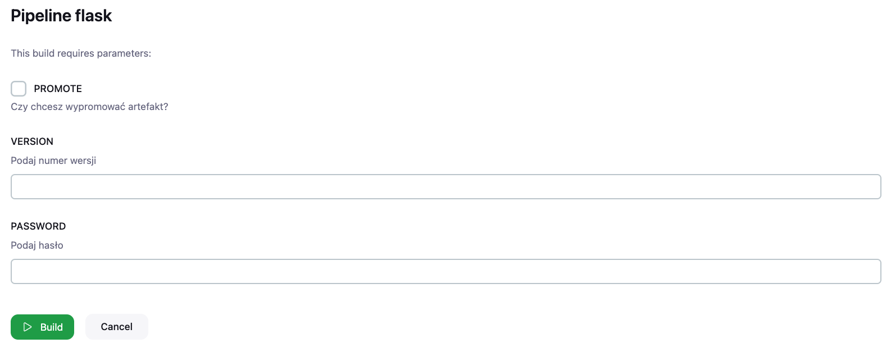

Efekt uruchomienia po zatwierdzeniu dodania nowej wersji, podania jej numeru oraz hasła do Docker Hub:

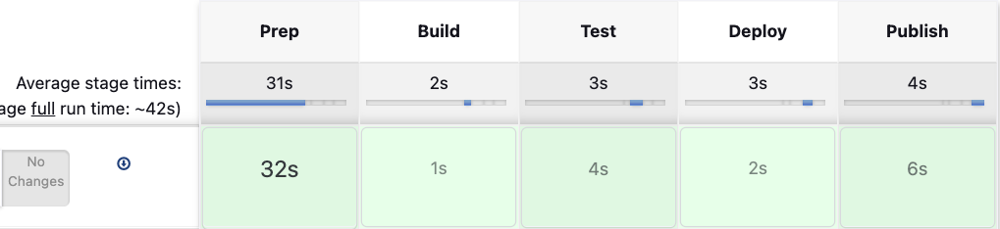

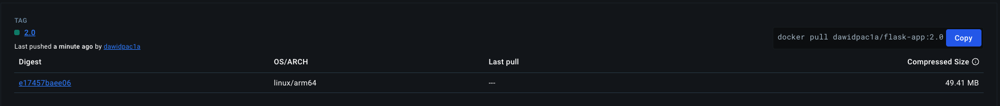

#### Diagramy UML

Diagram aktywności:

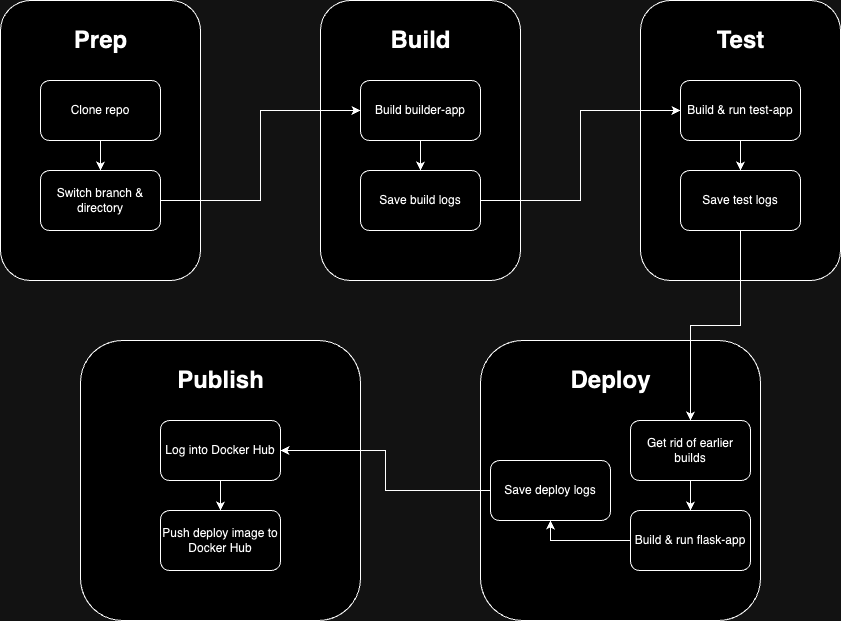

Diagram wdrożenia:

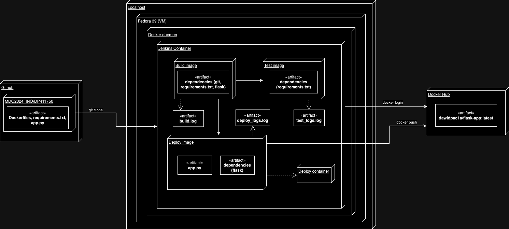

## Staging

Przygotowaną aplikację uruchomiono na "czystym" środowisku (bez żadnych kontenerów):

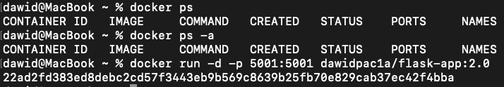

Po uruchomieniu:

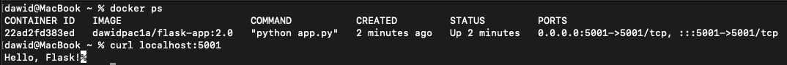

Aplikacja zadziałała bez żadnych problemów, kolejnym etapem było przetestowanie jej w środowisku bez narzędzi deweloperskich oraz wstępnych konfiguracji z wykorzystaniem `playbooka Ansible`. W tym celu stworzono nową maszynę z takim samym systemem operacyjnym, jak maszyna będąca "hostem" Ansible. Następnie na hoście zainstalowano Ansible: 
``` bash
sudo apt update
sudo apt install software-properties-common
sudo add-apt-repository --yes --update ppa:ansible/ansible
sudo apt install ansible
```
Na maszynie będącej "targetem" zainstalowano natomiast OpenSSH:
```bash
sudo apt install openssh-server
```

W celu wymiany kluczy ssh pomiędzy maszynami:
```bash
ssh-keygen
ssh-copy-id -i ~./ssh/id_rsa.pub [user]@[ip]
```

Następnie na hoście stworzono plik `playbook.yaml` o następującej treści:
```yaml
- name: Test Docker image on a fresh machine
  hosts: all
  become: yes
  tasks:
    - name: Ensure Docker is installed
      package:
        name: docker
        state: present

    - name: Ensure Docker service is running
      service:
        name: docker
        state: started
        enabled: yes

    - name: Pull Docker image from Docker Hub
      docker_image:
        name: dawidpac1a/flask-app:2.0  
        source: pull

    - name: Run Docker container
      docker_container:
        name: test_container
        image: dawidpac1a/flask-app:2.0  
        state: started
        detach: yes
        published_ports: 5001:5001

    - name: Check app
      command: curl localhost:5001
      register: curl_output

    - name: Print curl status
      debug:
        msg: "{{ curl_output.stdout }}"
```

Gdzie kolejno:
* `Ensure Docker is installed` sprawdza czy target posiada Dockera, który jest jedynym niezbędnym narzędziem do uruchomienia aplikacji
* `Ensure Docker service is running` sprawdza czy Docker Daemon jest uruchomiony i działa poprawnie
* `Pull Docker image from Docker Hub` pobiera obraz aplikacji z Docker Huba
* `Run Docker container` uruchamia kontener na podstawie uprzednio pobranego obrazu
* `Check app` oraz `Print curl status` sprawdzają czy kontener działa poprawnie oraz informują o tym użytkownika

Następnie dodano nazwę DNS 'targeta' w pliku `/etc/hosts` tak, aby maszyna nie musiała komunikować się po adresie IP. Kolejno utworzono plik `inventory.yaml`, w którym dodano 'targeta' do sekcji `Endpoints` pod nazwą `test`: 

``` yaml
all:
  children:
    Endpoints:
      hosts:
        test:
          ansible_host: target
          ansible_user: ansible
```

Kolejnym krokiem było uruchomienie playbooka za pomocą komendy:
`ansible-playbook -i inventory.yaml playbook.yaml --ask-become-pass`

Flaga `--ask-become-pass` powoduje zapytanie o hasło użytkownika 'targeta' na wypadek potrzeby wykorzystania instrukcji z `sudo`. 

Efekty uruchomienia `playbooka`:
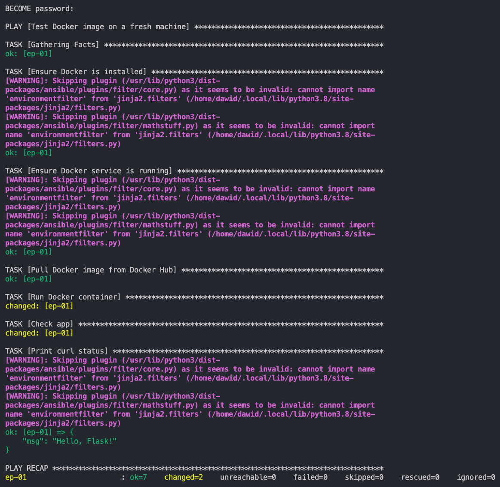

Widok uruchomionej aplikacji na 'targecie':
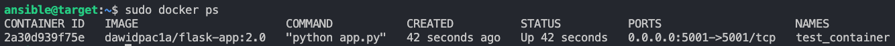