# Sprawozdanie z laboratorium 1 i 2

## Bartosz Kępczyński

### Cel ćwiczeń:

Celem wykonanych ćwiczeń jest zapoznanie się z podstawową obsługą gałęzi, repozytorium git i dockerem.

## Zajęcia 1:

### Przebieg ćwiczeń:

Początkowo sklonowano repozytorium na wirtualną maszynę. Odbyło się to na dwa sposoby, za pomocą protokołu HTTPS, oraz SSH.
- W przypadku protokołu HTTPS potrzebne jest jedynie URL repozytorium.

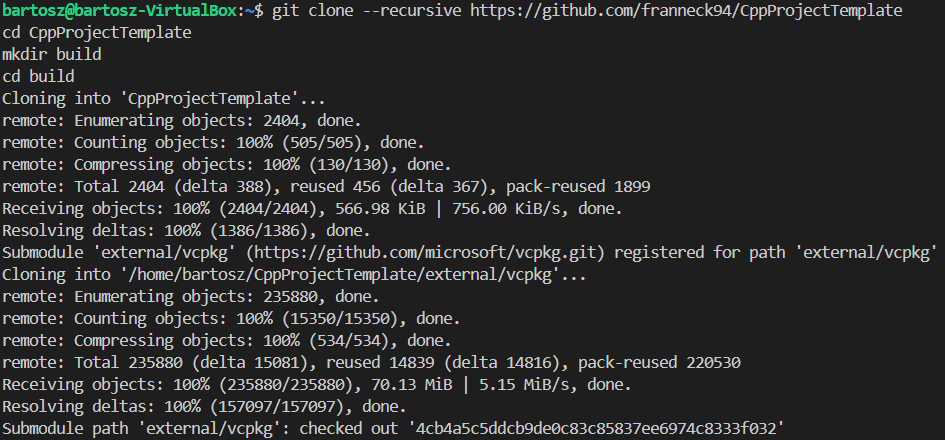

- Podczas klonowania poprzez SSH, potrzebny jest jednak klucz. Takich kluczy wykonano dwa, w tym jeden zabezpieczony hasłem, a następnie dodano je do konta na githubie.


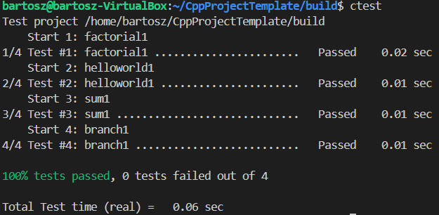
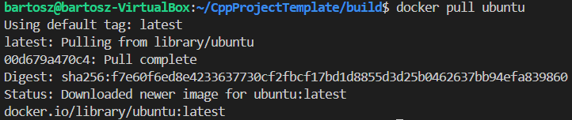


Zaletą protokołu HTTPS jest prostota, lecz to SSH posiada bardziej rozbudowany interfejs dostępu, co pozwala na lepszą kontrolę.

Następnie w celu stworzenia własnego miejsca pracy utworzono własną gałąź, o nazwie imicjały i numer albumu, odchodzącą od gałęzi grupy. Pozwala to na wygodne uporządkowanie projektu, dając każdemu własną przestrzeń pracy.


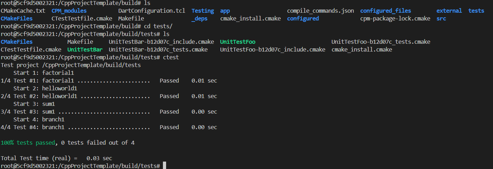

Pracując na własnej gałęzi utworzono własny katalog, o takiej samej nazwie, co nazwa gałęzi, jest to katalog, do którego należy umieścić materiały z laboratoriów.

Napisano prostego githooka, o treści:

```bash
#!/bin/bash

commit_msg=$(cat "$1")

initials_index="BK411778"

if [[ ! $commit_msg =~ ^"$initials_index".* ]]; then
    echo "Blad: Wiadomosc commita musi zaczynac sie od \"$initials_index\"."
    exit 1
fi
```

Ten skrypt weryfikuje, czy każdy commit message użytkownika zaczyna się od jego imicjałów i numeru indeksu, w tym przypadku BK411778, ma to na celu upewnienie się, że struktura git zostanie zachowana.


Następnie wypchnięto lokalną gałąź BK411778 do repozytorium za pomocą klucza SSH, podczas wykonywania tego kroku konieczne było skonfigurowanie tożsamości (imię i adres email) w gicie.


Wypchnięcie gałęzi z gotowym sprawozdaniem.

## Zajęcia 2:

### Przebieg ćwiczeń:

Na maszynie wirtualnej zainstalowano dockera.

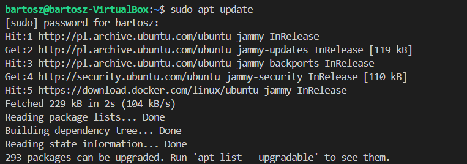
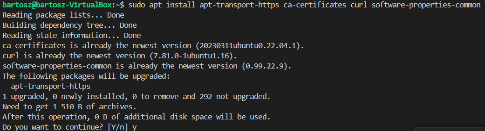
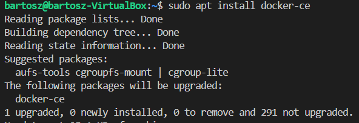

Następnie zarejestrowano się w Docker Hub i pobrano obrazy hello-world, busybox i ubuntu. Podczas wykonywania tego kroku pojawił się problem z dostępem do gniazda Dockera, jednak został rozwiązany dodając użytkownikowi odpowiednie uprawnienia:

    sudo chmod 666 /var/run/docker.sock

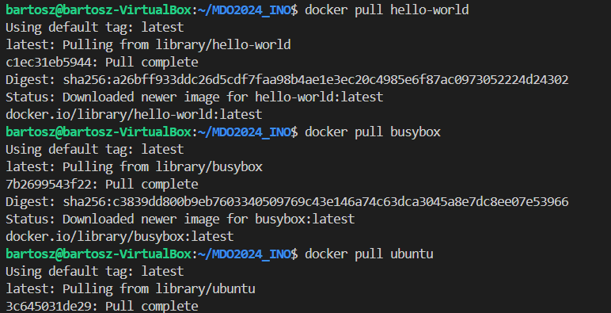

Uruchomiono interaktywnie kontener z obrazu busybox i wywołano numer wersji.

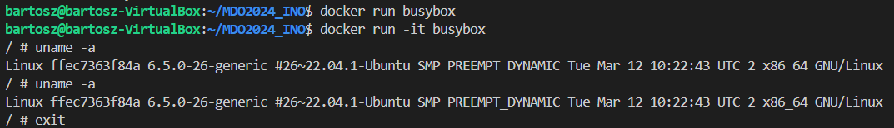

Uruchomiono kontener z obrazu ubuntu, następnie po sprawdzeniu PID1 w kontenerze i procesy dockera na hoście można zauważyć, że obraz uznaje się za pierwszy proces, lecz z perspektywy dockera jest podrzędny.

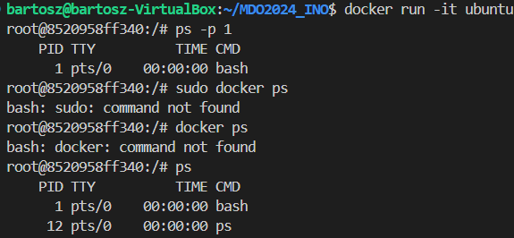
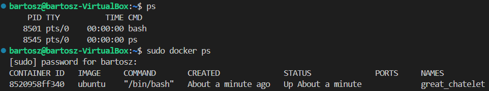

Następnie stworzono plik Dockerfile, na podstawie którego stworzono obraz.

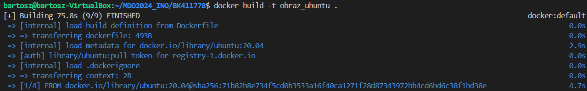
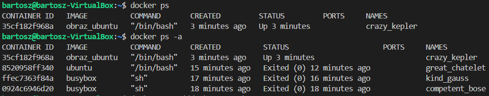

Na koniec wyczyszczono obrazy.

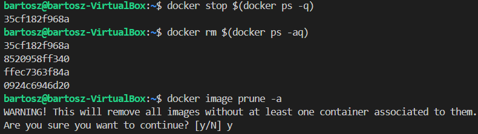