# Sprawozdanie z laboratorium 3 i 4

## Bartosz Kępczyński

### Cel ćwiczeń:

Celem wykonanych ćwiczeń jest zapoznanie się z Dockerfiles, oraz kontenerem jako definicją etapu.

## Zajęcia 3:

### Przebieg ćwiczeń:

Początkowo znaleziono repozytorium dysponujące otwartą licencją, oraz co ważne zawierające narzędzia Makefile, przez co możliwe jest wykonanie make build oraz make test.

Repozytorium skolonowano, przeprowadzono build programu, oraz uruchomiono testy jednostkowe. Podczas wykonywania tego kroku niezbędne okazało się zainstalowanie narzędzi Cmake.


Ponieważ repozytorium posiada aplikację C wybrano kontener ubuntu do wykonania kroków build i test.

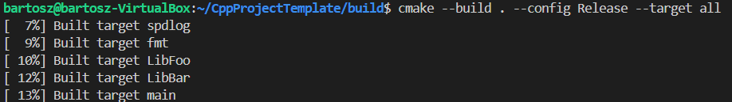


Uruchomiono kontener, następnie podłączono do niego TTY, w celu interaktywnej pracy, później sklonowano repozytorium i uruchomiono build oraz test. Potrzebne było również zainstalowanie cmake w kontenerze.


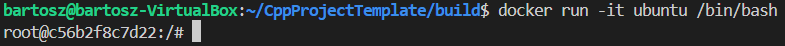
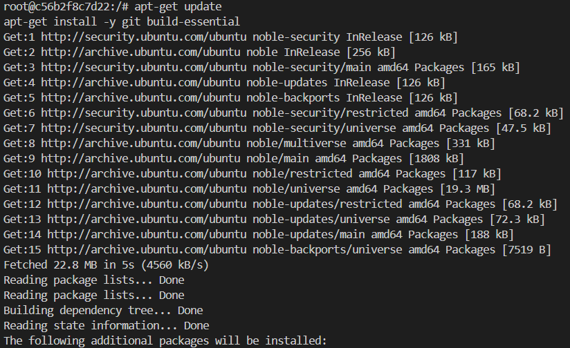
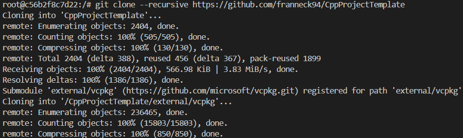
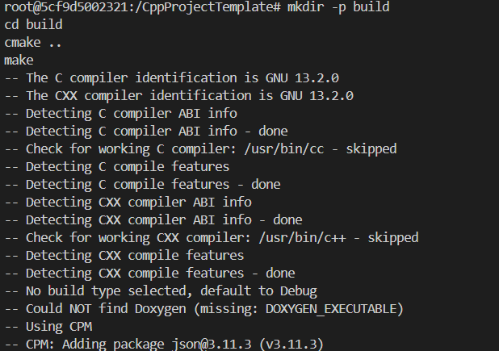


Stworzono dwa pliki Dockerfile, z których pierwszy przeprowadza wszystko aż do build, a drugi bazując na pierwszym przeprowadza testy.

```bash
# Dockerfile.build

# Używamy obrazu Ubuntu jako bazowego
FROM ubuntu:latest

# Instalujemy wymagane narzędzia
RUN apt-get update && apt-get install -y \
    cmake \
    make \
    g++ \
    git

# Klonujemy repozytorium
RUN git clone https://github.com/franneck94/CppProjectTemplate /CppProjectTemplate

# Ustawiamy katalog roboczy
WORKDIR /CppProjectTemplate

# Tworzymy katalog build i konfigurujemy projekt
RUN mkdir -p build && cd build && cmake ..

# Budujemy projekt
RUN cd build && make

# Ustawiamy katalog roboczy na katalog build
WORKDIR /CppProjectTemplate/build
```

```bash
# Dockerfile.test

# Używamy obrazu z pierwszego etapu budowania
FROM build_stage:latest

# Ustawiamy katalog roboczy na katalog build
WORKDIR /CppProjectTemplate/build

# Uruchamiamy testy
CMD ["./tests/UnitTestBar"]
CMD ["./tests/UnitTestFoo"]
```

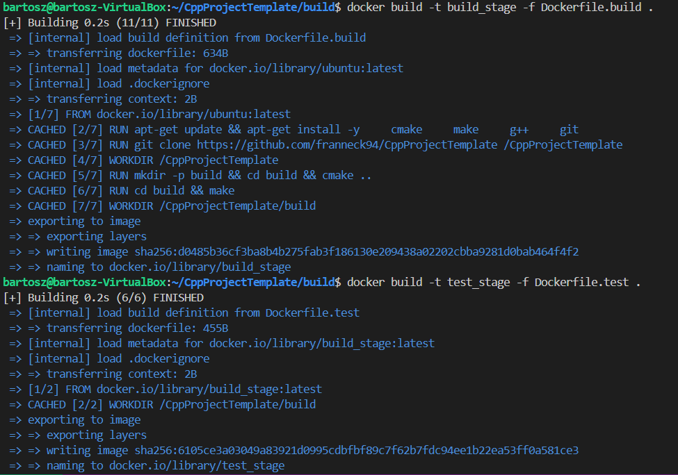
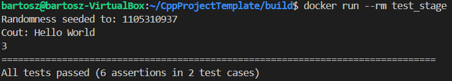

## Zajęcia 4:

### Przebieg ćwiczeń:

Przygotowano woluminy wejściowy i wyjściowy, a następnie podłączono je do kontenera bazowego z poprzednich zajęć.

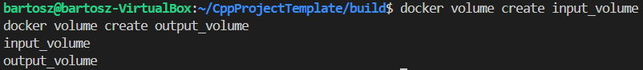
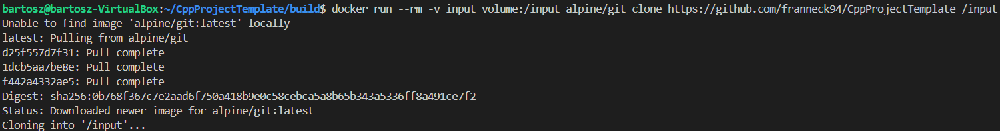

Uruchomiono kontener bez gita, następnie sklonowano repozytorium na wolumin wejściowy, tak aby znalazły się w kontenerze.

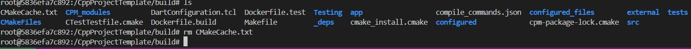

Zapisano powstałe pliki na woluminie wyjściowym, w celu zachowania ich po wyłączeniu kontenera. W przypadku 

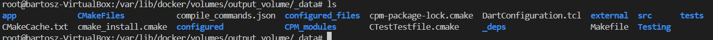

Klonowanie na wolumin wejściowy przeprowadzono ponownie, wewnątrz kontenera.

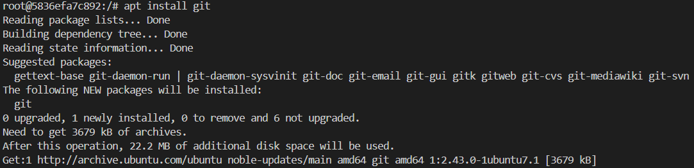
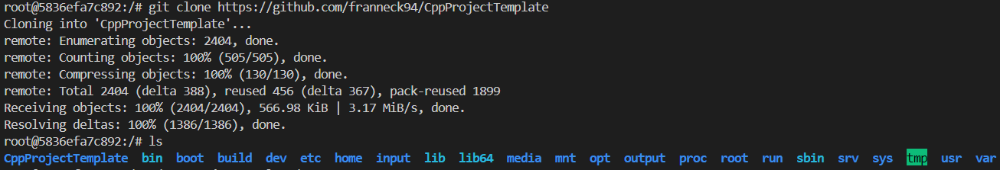
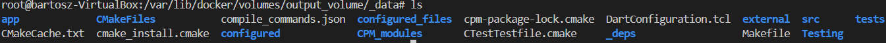

Wewnątrz kontenera uruchomiono serwer iperf, następnie połączono się z nim z drugiego kontenera i zbadano ruch.

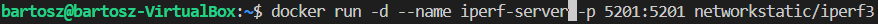
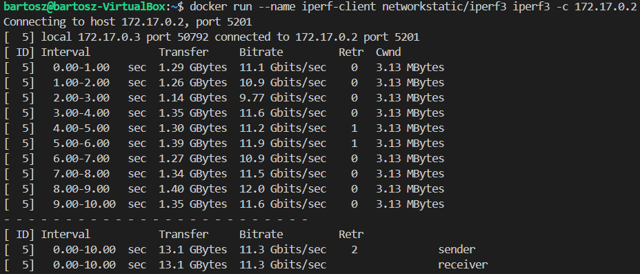

Zbadano ruch ponownie, lecz wykorzystując własną sieć mostkową.

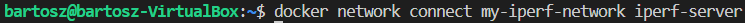
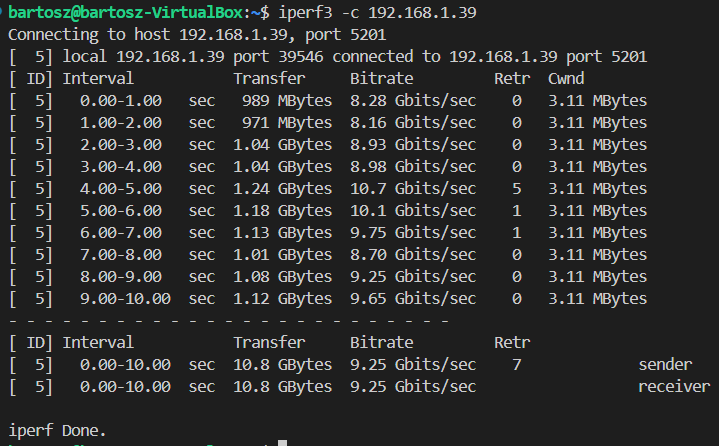